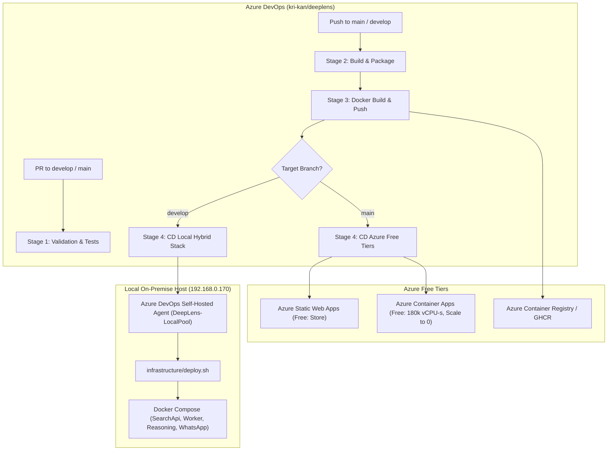

# DeepLens Azure DevOps Migration Architecture & CI/CD Specification

## 1. Executive Summary & Migration Topology
This document details the migration of DeepLens builds and deployments into **Azure DevOps** (`org: kri-kan`, `project: deeplens`) leveraging a **Hybrid Cloud Architecture**:
- **Cloud Free Tiers (Azure Static Web Apps & Azure Container Apps)** for frontends and scale-to-zero public APIs.
- **Self-Hosted Local Runner (192.168.0.170 / local Linux host)** for heavy worker pipelines, AI vector search dependencies (Qdrant, Ollama, Kafka, PostgreSQL), and on-premise service hosting.



---

## 2. Agent Strategy: Microsoft-Hosted vs. Self-Hosted Linux Agent

| Dimension | Microsoft-Hosted Agents (`ubuntu-latest`) | Self-Hosted Linux Agent (`DeepLens-LocalPool`) |
| :--- | :--- | :--- |
| **Free Tier Quota** | **1,800 free minutes/month** (1 parallel job for private projects) | **1 parallel job FREE, UNLIMITED minutes** |
| **Execution Environment** | Ephemeral, clean Ubuntu VM provisioned per job | Persistent Linux host (access to local disk & GPU) |
| **Dependency Caching** | Requires Azure DevOps Pipeline Cache task (`Cache@2`) | Native local filesystem caching (`~/.nuget`, `~/.npm`, `pip`, Docker layer cache) |
| **Local Stack Access** | No direct access to internal 192.168.0.170 network | **Direct access to Docker daemon, `/data/hosting/`, Qdrant, Kafka, PostgreSQL** |
| **Build Latency** | ~2–4 min (VM provisioning + image restore) | ~15–30 sec (warm cache & incremental compilation) |
| **Recommended Use** | **PR Quality Gate, Unit Tests, Static Linting, Cloud Deployments** | **Full Integration Builds, Docker Layer Builds, Local CD Deployments** |

### Recommended Hybrid Agent Topology
1. **Pull Request Validation & Main Cloud CI**: Use Microsoft-Hosted `ubuntu-latest` agents to preserve local resources and test cleanly.
2. **Local CD & Background Services**: Use a Self-Hosted Linux Agent running as a background systemd service on the server machine, registered in pool `DeepLens-LocalPool`.

---

## 3. Container Image Build & Registry Comparison

| Registry Option | Cost / Free Tier Limits | Advantages | Disadvantages | DeepLens Verdict |
| :--- | :--- | :--- | :--- | :--- |
| **Azure Container Registry (ACR)** | Basic tier: ~$5/month ($0.167/day), 10GB storage, 2 webhooks | Native Azure RBAC, Managed Identity integration with ACA, direct Azure DevOps service connection | Small monthly cost ($5/mo) if Basic is used | **Recommended for Azure Container Apps (ACA) integration** |
| **GitHub Container Registry (ghcr.io)** | **100% Free for public repos**, 500MB free storage for private repos | High performance, no Docker Hub pull limits, standard OIDC/PAT token | Requires GitHub personal access token or OIDC setup | **Best Free Tier Choice for Cloud Containers** |
| **Docker Hub** | Free: 1 private repo, 200 pulls / 6 hours | Universal recognition, simple credentials | Severe pull rate limits (200/6h), only 1 private repo | Not recommended for multi-service microservices |
| **Local Docker Daemon / Registry** | **100% Free, zero network egress** | Instant local deploy, no registry upload/download latency | Available only to on-premise local environment | **Default for Local Hybrid Deployment** |

---

## 4. Pipeline Architecture & Directory Structure

All pipeline files are modularized under [`.azuredevops/`](file:///home/krikan/productivity/deeplens/.azuredevops/):

```
/home/krikan/productivity/deeplens/
├── azure-pipelines.yml                       # Master Orchestrator Pipeline
├── .azuredevops/
│   ├── MIGRATION_ARCHITECTURE.md             # Complete Architecture & Migration Blueprint
│   └── pipelines/
│       ├── azure-pipelines-ci.yml           # Fast PR & Branch Validation Pipeline
│       ├── azure-pipelines-cd-hybrid.yml    # On-Premise Local Stack CD Pipeline
│       ├── azure-pipelines-cd-azure.yml     # Azure Free Tiers (SWA + ACA) CD Pipeline
│       └── templates/
│           └── jobs/
│               ├── job-build-test-dotnet.yml     # .NET 9.0 Solution Build, Unit Test & Coverage
│               ├── job-build-test-python.yml     # Python 3.11 Lint (Flake8) & Test (Pytest)
│               ├── job-build-test-frontend.yml   # Store (Vite 8) & WhatsApp Processor Build
│               ├── job-validate-mobile.yml       # Vayyari (React Native/Expo 54) Validation
│               └── job-docker-build-push.yml     # Docker Multi-Service Matrix Build & Push
```

---

## 5. Build & Test Specification by Stack

### 1. .NET 9.0 Services & Tests
- **Target Solution**: `src/DeepLens.Service/DeepLens.sln`
- **Projects**: `DeepLens.SearchApi`, `DeepLens.WorkerService`
- **Testing**: NUnit 4 + FluentAssertions + Coverlet (`XPlat Code Coverage`)
- **Published Artifacts**: `.trx` test report and `coverage.cobertura.xml` published directly to Azure DevOps Test & Coverage dashboards.

### 2. Python AI Services
- **Reasoning Service** (`src/DeepLens.ReasoningService`): Python 3.11, FastAPI, LiteLLM client.
- **Scraper Workers** (`src/competitor-scraper-workers`): Worker scripts.
- **Reporting**: Pytest JUnit XML test results published to Azure DevOps.

### 3. Frontends & Mobile
- **DeepLens Store** (`src/store`): Node 22, React 19, Vite 8, Playwright visual tests, oxlint.
- **Vayyari Mobile App** (`src/vayyari`): Expo 54, React Native 0.81, TypeScript compiler check.
- **WhatsApp Processor** (`src/whatsapp-processor`): Node 22, TypeScript compilation.

---

## 6. Azure DevOps Service Connections & Secrets Setup

### 1. Service Connections Required in Azure DevOps (`Project Settings > Service connections`)
1. **`DeepLens-Azure-Subscription`**: Azure Resource Manager (ARM) connection using Workload Identity Federation (recommended) or Service Principal for deploying Azure Container Apps and Azure Static Web Apps.
2. **`DeepLens-ContainerRegistry`**: Docker Registry Service Connection pointing to Azure Container Registry (`deeplensregistry.azurecr.io`) or GitHub Packages (`ghcr.io`).

### 2. Variable Groups (`Pipelines > Library`)
Create Variable Group **`DeepLens-Azure-Secrets`**:
- `AZURE_STATIC_WEB_APPS_API_TOKEN_STORE`: Deployment token from Azure Static Web App (Store).
- `ACR_PASSWORD`: ACR Admin / Service Principal password (if using ACR).

Create Variable Group **`DeepLens-Global-Vars`**:
- `DOTNET_VERSION`: `9.0.x`
- `PYTHON_VERSION`: `3.11`
- `NODE_VERSION`: `22.x`

---

## 7. Step-by-Step Migration & Installation Plan

### Step 1: Install Self-Hosted Linux Agent on Local Host (192.168.0.170)
Run the following commands on the Linux server host to connect it to Azure DevOps:
```bash
# 1. Create agent workspace directory
mkdir -p ~/azagent && cd ~/azagent

# 2. Download Azure DevOps Linux Agent package
wget https://vstsagentpackage.azureedge.net/agent/3.248.0/vsts-agent-linux-x64-3.248.0.tar.gz
tar zxvf vsts-agent-linux-x64-3.248.0.tar.gz

# 3. Configure Agent with Azure DevOps PAT
# Replace <PAT_TOKEN> with Azure DevOps Personal Access Token (Agent Pools: Read & Manage scope)
./config.sh \
  --unattended \
  --url "https://dev.azure.com/kri-kan" \
  --auth pat \
  --token "<PAT_TOKEN>" \
  --pool "DeepLens-LocalPool" \
  --agent "deeplens-local-agent-01" \
  --work "_work" \
  --runAsService

# 4. Install and start as systemd service
sudo ./svc.sh install
sudo ./svc.sh start
sudo ./svc.sh status
```

### Step 2: Provision Azure Free Tier Resources
1. **Azure Static Web Apps (Free)**:
   ```bash
   az staticwebapp create \
     --name deeplens-store \
     --resource-group rg-deeplens-prod \
     --location eastus2 \
     --sku Free
   ```
2. **Azure Container Apps Environment (Free Tier Usage)**:
   ```bash
   az containerapp env create \
     --name cae-deeplens \
     --resource-group rg-deeplens-prod \
     --location eastus2
   ```

### Step 3: Register Pipelines in Azure DevOps
1. In Azure DevOps (`https://dev.azure.com/kri-kan/deeplens`), navigate to **Pipelines > Create Pipeline**.
2. Select **Azure Repos Git** > repository `deeplens`.
3. Choose **Existing Azure Pipelines YAML file** and select `/azure-pipelines.yml`.
4. Save and run the pipeline.

### Step 4: Configure Branch Policies
1. In Azure DevOps, go to **Repos > Branches**.
2. Under `develop` and `main` branches, click `...` > **Branch policies**.
3. Under **Build Validation**, add a build policy selecting the `DeepLens CI/CD Master Orchestrator Pipeline`.
4. Require minimum 1 reviewer approval before merging.
