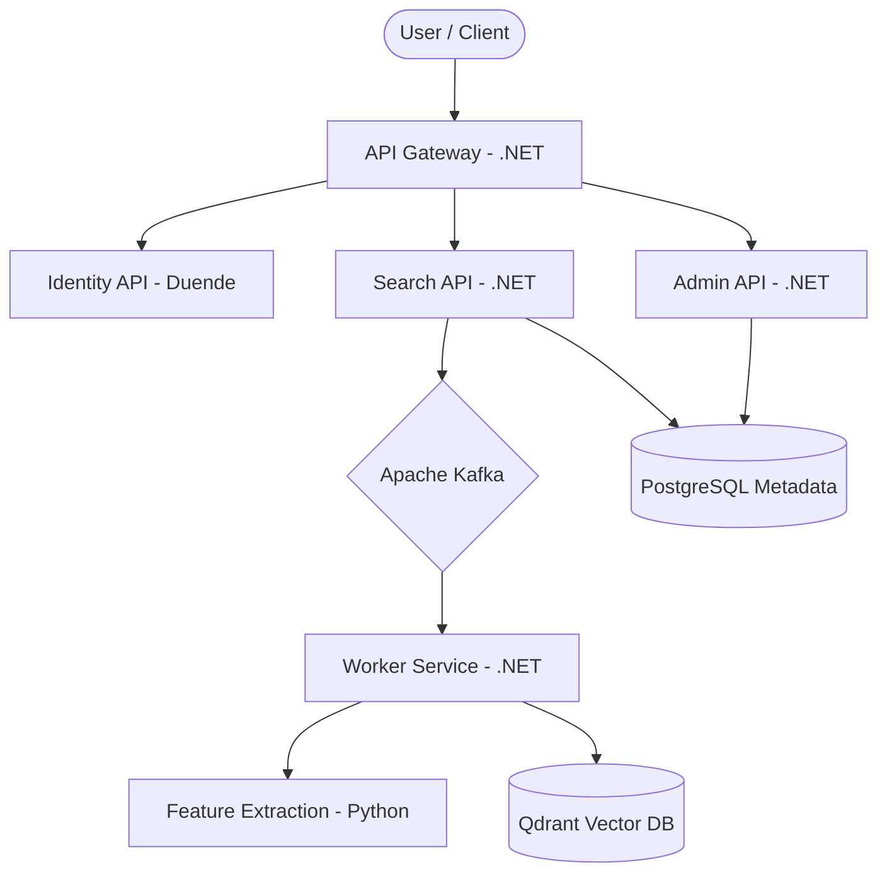

# DeepLens Architecture Guide

**Comprehensive reference for system design, data models, and architectural decisions.**

Last Updated: December 20, 2025

---

## 🏗️ System Overview

DeepLens is a high-performance, multi-tenant image similarity search engine built using a **hybrid .NET + Python microservices architecture**. It balances enterprise-grade orchestration with state-of-the-art AI/ML capabilities.

### Core Design Principles
- **Unified .NET Backend**: Centralized orchestration, API gateway, and tenant management.
- **Stateless AI Services**: Python-based services for feature extraction and vector operations.
- **Event-Driven Pipeline**: Asynchronous image processing via Apache Kafka.
- **Multi-Tenant Isolation**: Complete data separation at the database and storage layers.
- **ByOS (Bring Your Own Storage)**: Support for enterprise cloud storage and local NFS.
- **Observable by Design**: Integrated OpenTelemetry, Prometheus, and Jaeger.

---

## 📐 Architecture Diagrams

### High-Level System Flow

---

## 💾 Data & Storage Architecture

### Multi-Tenant Model
DeepLens provides strict isolation between tenants using a partitioned resource model:

1.  **Platform Metadata (PostgreSQL)**: Shared database with row-level or schema-based separation for global configurations.
2.  **Tenant Metadata (PostgreSQL)**: Isolated databases provisioned per tenant for image metadata and local settings.
3.  **Vector Storage (Qdrant)**: Isolated collections (or separate instances) per tenant ensuring no cross-tenant similarity leakage.
4.  **Object Storage (MinIO/S3/Azure)**: Dedicated buckets or account-level isolation for raw image files.

### Database Schema (Identity & Platform)
Refers to the core tables in the `nextgen_identity` and `deeplens_platform` databases.

| Table             | Purpose                                                 |
| :---------------- | :------------------------------------------------------ |
| `tenants`         | Organization configs, resource limits, and infra ports. |
| `users`           | User accounts, roles, and authentication state.         |
| `refresh_tokens`  | OAuth 2.0 rotation tokens.                              |
| `tenant_api_keys` | M2M authentication for programmatic access.             |

---

## 🧠 Architectural Decisions (ADR)

### ADR-001: Hybrid .NET + Python Microservices
- **Decision**: Use .NET 9 for APIs and orchestration; Python (FastAPI) for ML inference.
- **Rationale**: .NET provides superior enterprise features and performance for web APIs, while Python has the richest ecosystem for AI/ML (PyTorch, ONNX).

### ADR-002: API Service Separation
- **Decision**: Three main services + Gateway + Worker.
- **Search API**: User-facing search and ingestion.
- **Admin API**: System and tenant management.
- **Identity API**: Authentication and authorization.
- **Worker Service**: Background Kafka consumption.

### ADR-003: Asynchronous Image Processing
- **Decision**: Return a `202 Accepted` on upload; process features via Kafka.
- **Rationale**: Feature extraction takes ~100-300ms. Async processing prevents blocking the API and allows horizontal scaling of workers.

### ADR-004: Data Access Strategy
- **Decision**: Hybrid EF Core + Dapper.
- **Rationale**: EF Core for complex domain models and migrations; Dapper for high-frequency search metadata queries.

---

## 📊 Observability Strategy

DeepLens implements a full **OpenTelemetry** stack:
- **Metrics**: Exported to Prometheus.
- **Logs**: Structured JSON logs sent to Loki.
- **Traces**: Distributed tracing via Jaeger (correlating API Gateway → Worker → Python AI).

---

## 📁 Related Documents
- [**DEVELOPMENT.md**](DEVELOPMENT.md) - Setup, Workflow, and Credentials
- [**infrastructure/TENANT-GUIDE.md**](infrastructure/TENANT-GUIDE.md) - Provisioning & Storage
- [**docs/SECURITY.md**](docs/SECURITY.md) - RBAC & Token Lifecycle
- [**docs/SERVICES.md**](docs/SERVICES.md) - Detailed Service Specifications
