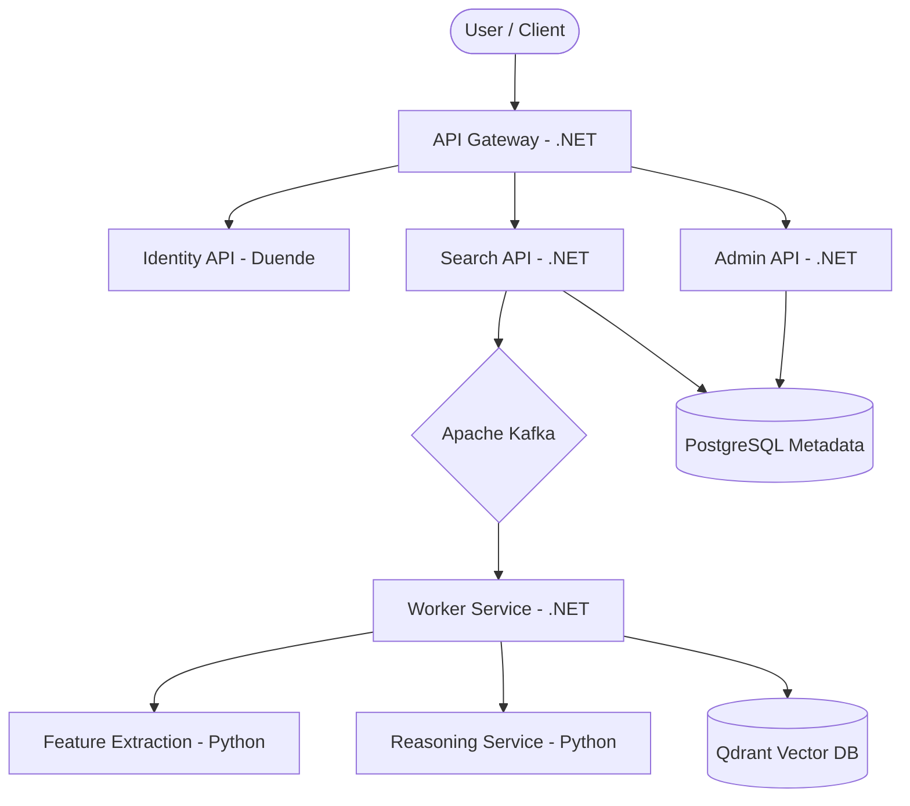

# DeepLens Architecture Guide

**Comprehensive reference for system design, data models, and architectural decisions.**

Last Updated: December 20, 2025

---

## 🏗️ System Overview

DeepLens is a high-performance, multi-tenant **visual search engine** built using a **hybrid .NET + Python microservices architecture**. It supports both **image and video assets** with AI-powered similarity search, feature extraction, and intelligent cataloging.

### Core Design Principles
- **Unified .NET Backend**: Centralized orchestration, API gateway, and tenant management.
- **Stateless AI Services**: Python-based services for feature extraction and vector operations.
- **Event-Driven Pipeline**: Asynchronous image processing via Apache Kafka.
- **External Infrastructure**: Core databases (PostgreSQL), message brokers (Kafka), and storage (MinIO) are managed at `192.168.0.170`.
- **Observable by Design**: Integrated OpenTelemetry, Prometheus, and Jaeger.

---

## 📐 Architecture Diagrams

### High-Level System Flow

```mermaid
graph TD
    User([User / Client]) --> Gateway[API Gateway - .NET]
    Gateway --> Identity[Identity API - Duende]
    Gateway --> Search[Search API - .NET]
    Gateway --> Admin[Admin API - .NET]
    
    Search --> Kafka{Apache Kafka}
    Kafka --> Worker[Worker Service - .NET]
    Worker --> FeatureEx[Feature Extraction - Python]
    Worker --> ReasoningEx[Reasoning Service - Python]
    Worker --> VectorDB[(Qdrant Vector DB)]
    
    Admin --> Metadata[(PostgreSQL Metadata)]
    Search --> Metadata
```

---

## 💾 Data & Storage Architecture

### Multi-Tenant Model
DeepLens provides strict isolation between tenants using a partitioned resource model:

1.  **Platform Metadata (PostgreSQL)**: Shared database with row-level or schema-based separation for global configurations.
2.  **Tenant Metadata (PostgreSQL)**: Isolated databases provisioned per tenant for image metadata and local settings.
3.  **Vector Storage (Qdrant)**: Isolated collections (or separate instances) per tenant ensuring no cross-tenant similarity leakage.
4.  **Object Storage (MinIO/S3/Azure)**: Logical isolation via dedicated buckets within a shared master instance (default) or account-level isolation for high-scale tenants.

### Database Schema (Identity & Platform)
Refers to the core tables in the `nextgen_identity` and `deeplens_platform` databases.

| Table                | Purpose                                                 |
| :------------------- | :------------------------------------------------------ |
| `tenants`            | Organization configs, resource limits, and infra ports. |
| `users`              | User accounts, roles, and authentication state.         |
| `refresh_tokens`     | OAuth 2.0 rotation tokens.                              |
| `tenant_api_keys`    | M2M authentication for programmatic access.             |
| `infisical_projects` | Registry for secret management integration.             |

### Catalog & Ingestion Architecture (Tenant-Specific)
DeepLens uses a normalized catalog structure within each tenant's dedicated database to support multi-vendor e-commerce:

1.  **Categories**: Broad product classifications (e.g., Sarees, Lehangas).
2.  **Products**: Represent master SKUs with common titles and a **Union of Tags** consolidated from all sources.
3.  **Product Variants**: Represent sub-SKUs (e.g., by Color, Fabric, or Stitch Type).
4.  **Images**: Managed assets with PHash for deduplication and quality scores for curation. Supports a **Reliable Deletion Queue** for asynchronous storage cleanup.
5.  **Sellers**: Master registry of vendors (e.g., WhatsApp groups, Marketplaces).
6.  **Seller Listings**: Competitive offers for a variant, capturing live price, descriptions, and **Shipping Metadata** (Free/Plus).
7.  **Price History**: Temporal audit trail of every price change per seller listing, enabling long-term performance analysis.

### AI-Driven Ingestion Pipeline
- **Enrichment**: An LLM-based `ReasoningService` (utilizing models like Phi-3) scans unstructured seller descriptions to extract structured metadata (Fabric, Color, Occasion).
- **Parallel Processing**: Bulk ingestion supports high-throughput parallel uploads with concurrency semaphores.
- **SKU Merging**: Intelligent merging of products allows consolidating multiple vendors under one SKU while preserving unique images and all historical pricing data.
- **Reliable Cleanup**: Deduplicated or deleted images are queued for asynchronous cleanup from MinIO and Qdrant via Kafka-driven background workers.

### System Bootstrapping
DeepLens leverages a centralized infrastructure with local application services:
1.  **Infrastructure Connectivity**: Ensure network visibility to `192.168.0.170` (Postgres, Kafka, MinIO).
2.  **App Services (Docker)**: Core AI and worker services are started using `setupscripts/application/docker-compose.yaml`.
3.  **Platform DB Init**: SQL scripts initialize system schemas and roles on the remote PostgreSQL.
4.  **Backend APIs**: Identity and Search APIs are started via `dotnet run`.

---

## 🧠 Architectural Decisions (ADR)

### ADR-001: Hybrid .NET + Python Microservices
- **Decision**: Use .NET 9 for APIs and orchestration; Python (FastAPI) for ML inference.
- **Rationale**: .NET provides superior enterprise features and performance for web APIs, while Python has the richest ecosystem for AI/ML (PyTorch, ONNX).

### ADR-002: API Service Separation
- **Decision**: Three main services + Gateway + Worker.
- **Search API**: User-facing search and ingestion.
- **Admin API**: System and tenant management.
- **Identity API**: Authentication and authorization.
- **Worker Service**: Background Kafka consumption.

### ADR-003: Asynchronous Image Processing
- **Decision**: Return a `202 Accepted` on upload; process features via Kafka.
- **Rationale**: Feature extraction takes ~100-300ms. Async processing prevents blocking the API and allows horizontal scaling of workers.

### ADR-004: Data Access Strategy
- **Decision**: Hybrid EF Core + Dapper.
- **Rationale**: EF Core for complex domain models and migrations; Dapper for high-frequency search metadata queries.

### ADR-005: Intranet-Ready CORS Strategy
- **Decision**: Implement a dynamic CORS predicate for intranet IP ranges (RFC1918) driven by a configuration toggle.
- **Rationale**: Avoids the "whack-a-mole" process of manually adding developer/test IP addresses to the configuration, while maintaining security outside the local network.

---

## 📊 Observability Strategy

DeepLens implements a full **OpenTelemetry** stack:
- **Metrics**: Exported to Prometheus.
- **Logs**: Structured JSON logs sent to Loki.
### 3. Tracing (Jaeger / OpenTelemetry)
- **Stack**: OpenTelemetry SDKs for .NET, Node.js, and Python.
- **Context Propagation**: `TraceId` travels across network boundaries (Gateway → Search API → Kafka → Worker → AI Service) and (WhatsApp Processor → PostgreSQL/MinIO).
- **Port**: `16686` (Jaeger UI).

---

## 📁 Related Documents
- [**DEVELOPMENT.md**](DEVELOPMENT.md) - Setup, Workflow, and Credentials
- [**infrastructure/TENANT-GUIDE.md**](infrastructure/TENANT-GUIDE.md) - Provisioning & Storage
- [**docs/SECURITY.md**](docs/SECURITY.md) - RBAC & Token Lifecycle
- [**docs/SERVICES.md**](docs/SERVICES.md) - Detailed Service Specifications
