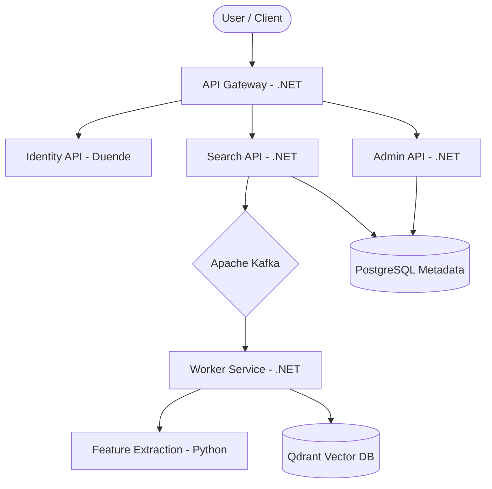

# DeepLens Complete Documentation Guide

**Updated:** 2025-12-20 00:46:02

> **Note:** This is a consolidated version of all repository documentation. Image binary samples and raw code templates are included in the source files.

---


# Documentation: README.md
----------------------------------------

# DeepLens - Image Similarity Search Engine

**DeepLens** is a high-performance, multi-tenant image similarity search engine built with modern .NET and Python technologies. It provides fast, accurate image matching using state-of-the-art vector databases and AI/ML models.

## 🧭 **Documentation Guide**

We have consolidated our documentation into several clear, focused guides:

### 🏁 [Quick Start (DEVELOPMENT.md)](DEVELOPMENT.md)
**The first stop for all developers.**
- Prerequisites & Local Setup.
- Service Credentials & Port Reference.
- Basic Troubleshooting.

### 🏗️ [Architecture & Decisions (ARCHITECTURE.md)](ARCHITECTURE.md)
**How the system is built.**
- Hybrid .NET + Python Microservices.
- Multi-Tenant Isolation Model.
- Architecture Decision Records (ADR).

### 💻 [Codebase & API (CODEBASE.md)](CODEBASE.md)
**Deep dive into the source code.**
- Project structures and responsibilities.
- API Endpoints & Contract Reference.
- Dapper & Data Access standards.

### 🏢 [Infrastructure & Tenants (infrastructure/README.md)](infrastructure/README.md)
**Container management and multi-tenancy.**
- Podman/Docker orchestration.
- [Tenant Provisioning & Management](infrastructure/TENANT-GUIDE.md).
- [DeepLens Troubleshooting Guide](infrastructure/TROUBLESHOOTING.md).

### 🔒 [Security & RBAC (docs/SECURITY.md)](docs/SECURITY.md)
- Authentication flows and Token Lifecycle.
- Role-Based Access Control (RBAC).
- Administrative Impersonation.

### 📊 [Observability & Monitoring (docs/OBSERVABILITY.md)](docs/OBSERVABILITY.md)
- OpenTelemetry instrumentation (Traces, Metrics, Logs).
- Grafana Dashboards & Prometheus Alerts.

---

## 🎯 **Key Features**

- **🔍 Advanced Image Search** - Vector-based similarity matching with multiple AI models.
- **🏢 Multi-Tenant Architecture** - Complete tenant isolation with BYOS (Bring Your Own Storage).
- **âš¡ High Performance** - Optimized for speed with Redis caching and Qdrant vector database.
- **📊 Full Observability** - Complete monitoring with the LGTM stack (Loki, Grafana, Tempo, Mimir).
- **🔒 Enterprise Security** - OAuth 2.0/OpenID Connect with Duende IdentityServer.

---

## 🤝 **Contributing**

1. Read the [DEVELOPMENT.md](DEVELOPMENT.md) and [CODEBASE.md](CODEBASE.md) guides.
2. Fork the repository and create a feature branch.
3. Commit your changes and open a Pull Request.

---

**Made with ❤️ by the DeepLens Team**


---


# Documentation: DEVELOPMENT.md
----------------------------------------

# DeepLens Development Guide

**The ultimate reference for setting up, developing, and troubleshooting the DeepLens ecosystem.**

Last Updated: December 20, 2025

---

## 🚀 Quick Start (15 Minutes)

1.  **Prerequisites**: Install Podman/Docker, .NET 9 SDK, Python 3.11+, and PowerShell 7+.
2.  **Environment**: 
    ```powershell
    cd infrastructure
    cp .env.example .env
    ./setup-infrastructure.ps1 -Start
    ```
3.  **Identity API**:
    ```powershell
    cd src/NextGen.Identity.Api
    $env:ASPNETCORE_ENVIRONMENT="Development"
    dotnet run --urls "http://localhost:5198"
    ```
4.  **Verification**: 
    ```powershell
    podman ps  # Ensure Postgres, Redis, Qdrant are running
    ```

---

## 🔑 Development Credentials

**DEVELOPMENT ONLY - DO NOT USE IN PRODUCTION** (Standard Password: `DeepLens123!`)

| Service            | Username               | Password             | Notes               |
| :----------------- | :--------------------- | :------------------- | :------------------ |
| **PostgreSQL**     | `postgres`             | `DeepLens123!`       | Port 5433           |
| **Identity Admin** | `admin@deeplens.local` | `DeepLens@Admin123!` | Initial Admin       |
| **MinIO Admin**    | `admin`                | `DeepLens123!`       | Port 9001 (Console) |
| **Grafana**        | `admin`                | `DeepLens123!`       | Port 3000           |

---

## 🔌 Port Reference

| Port     | Service      | Description                 |
| :------- | :----------- | :-------------------------- |
| **5433** | PostgreSQL   | Metadata & Identity DB      |
| **6379** | Redis        | Caching & State             |
| **5198** | Identity API | Auth & Tenant Orchestration |
| **5001** | Search API   | Image Upload & Search       |
| **8001** | Feature Ext. | Python AI Microservice      |
| **3000** | Grafana      | Monitoring Dashboards       |
| **6333** | Qdrant       | Vector DB Dashboard         |

---

## 🛠️ Development Workflow

### .NET Development
- **Solution**: Open `src/DeepLens.sln` in VS 2022 or VS Code.
- **Migrations**: Always use `dotnet ef database update` from the project directory.
- **Style**: Follow C# Clean Architecture patterns.

### Python (AI) Development
- **Venv**: Always use a virtual environment.
- **Setup**: 
    ```powershell
    cd src/DeepLens.FeatureExtractionService
    python -m venv venv
    ./venv/Scripts/Activate.ps1
    pip install -r requirements.txt
    ```

---

## 📋 Roadmaps & Plans

### Current Implementation Status
- ✅ **Phase 1**: Core Infrastructure & Podman Setup.
- ✅ **Phase 2**: Multi-Tenant Provisioning & Identity API.
- 🚧 **Phase 3**: Kafka Integration & Async Processing (In Progress).
- ⏳ **Phase 4**: Web UI Full Implementation.

---

## 🆘 Troubleshooting

1.  **Port Conflicts**: Run `Get-Process -Id (Get-NetTCPConnection -LocalPort <Port>).OwningProcess` to find blockers.
2.  **Container Failures**: Check `podman logs <container-name>`.
3.  **Database Errors**: Ensure `.env` in `infrastructure` matches your local config.
4.  **Identity API Not Starting**: Check that PostgreSQL is accessible on port 5433.

---

## 📖 Documentation Index
- [**ARCHITECTURE.md**](ARCHITECTURE.md) - High-level design & ADRs.
- [**infrastructure/README.md**](infrastructure/README.md) - Deep dive into container setup.
- [**infrastructure/TENANT-GUIDE.md**](infrastructure/TENANT-GUIDE.md) - How to provision new clients.
- [**docs/SECURITY.md**](docs/SECURITY.md) - Auth & RBAC details.


---


# Documentation: ARCHITECTURE.md
----------------------------------------

# DeepLens Architecture Guide

**Comprehensive reference for system design, data models, and architectural decisions.**

Last Updated: December 20, 2025

---

## 🏗️ System Overview

DeepLens is a high-performance, multi-tenant image similarity search engine built using a **hybrid .NET + Python microservices architecture**. It balances enterprise-grade orchestration with state-of-the-art AI/ML capabilities.

### Core Design Principles
- **Unified .NET Backend**: Centralized orchestration, API gateway, and tenant management.
- **Stateless AI Services**: Python-based services for feature extraction and vector operations.
- **Event-Driven Pipeline**: Asynchronous image processing via Apache Kafka.
- **Multi-Tenant Isolation**: Complete data separation at the database and storage layers.
- **ByOS (Bring Your Own Storage)**: Support for enterprise cloud storage and local NFS.
- **Observable by Design**: Integrated OpenTelemetry, Prometheus, and Jaeger.

---

## 📐 Architecture Diagrams

### High-Level System Flow


---

## 💾 Data & Storage Architecture

### Multi-Tenant Model
DeepLens provides strict isolation between tenants using a partitioned resource model:

1.  **Platform Metadata (PostgreSQL)**: Shared database with row-level or schema-based separation for global configurations.
2.  **Tenant Metadata (PostgreSQL)**: Isolated databases provisioned per tenant for image metadata and local settings.
3.  **Vector Storage (Qdrant)**: Isolated collections (or separate instances) per tenant ensuring no cross-tenant similarity leakage.
4.  **Object Storage (MinIO/S3/Azure)**: Dedicated buckets or account-level isolation for raw image files.

### Database Schema (Identity & Platform)
Refers to the core tables in the `nextgen_identity` and `deeplens_platform` databases.

| Table             | Purpose                                                 |
| :---------------- | :------------------------------------------------------ |
| `tenants`         | Organization configs, resource limits, and infra ports. |
| `users`           | User accounts, roles, and authentication state.         |
| `refresh_tokens`  | OAuth 2.0 rotation tokens.                              |
| `tenant_api_keys` | M2M authentication for programmatic access.             |

---

## 🧠 Architectural Decisions (ADR)

### ADR-001: Hybrid .NET + Python Microservices
- **Decision**: Use .NET 9 for APIs and orchestration; Python (FastAPI) for ML inference.
- **Rationale**: .NET provides superior enterprise features and performance for web APIs, while Python has the richest ecosystem for AI/ML (PyTorch, ONNX).

### ADR-002: API Service Separation
- **Decision**: Three main services + Gateway + Worker.
- **Search API**: User-facing search and ingestion.
- **Admin API**: System and tenant management.
- **Identity API**: Authentication and authorization.
- **Worker Service**: Background Kafka consumption.

### ADR-003: Asynchronous Image Processing
- **Decision**: Return a `202 Accepted` on upload; process features via Kafka.
- **Rationale**: Feature extraction takes ~100-300ms. Async processing prevents blocking the API and allows horizontal scaling of workers.

### ADR-004: Data Access Strategy
- **Decision**: Hybrid EF Core + Dapper.
- **Rationale**: EF Core for complex domain models and migrations; Dapper for high-frequency search metadata queries.

---

## 📊 Observability Strategy

DeepLens implements a full **OpenTelemetry** stack:
- **Metrics**: Exported to Prometheus.
- **Logs**: Structured JSON logs sent to Loki.
- **Traces**: Distributed tracing via Jaeger (correlating API Gateway → Worker → Python AI).

---

## 📁 Related Documents
- [**DEVELOPMENT.md**](DEVELOPMENT.md) - Setup, Workflow, and Credentials
- [**infrastructure/TENANT-GUIDE.md**](infrastructure/TENANT-GUIDE.md) - Provisioning & Storage
- [**docs/SECURITY.md**](docs/SECURITY.md) - RBAC & Token Lifecycle
- [**docs/SERVICES.md**](docs/SERVICES.md) - Detailed Service Specifications


---


# Documentation: CODEBASE.md
----------------------------------------

# DeepLens Codebase & API Guide

**Technical reference for the DeepLens source code, project structure, and service endpoints.**

Last Updated: December 20, 2025

---

## 📂 Project Structure

### .NET Microservices (`src/`)
DeepLens is built using a clean architecture pattern across multiple services:

- **NextGen.Identity**: Centralized authentication and tenant management.
  - `.Core`: Domain models (Tenant, User, Token).
  - `.Data`: Dapper-based repositories and PostgreSQL migrations.
  - `.Api`: REST endpoints for login and registration.
- **DeepLens (Platform)**:
  - `.SearchApi`: High-traffic semantic search and image ingestion.
  - `.AdminApi`: Resource management and analytics.
  - `.WorkerService`: Background Kafka consumers for feature extraction and indexing.
  - `.Infrastructure`: Multi-tenant drivers for Qdrant, MinIO, and Kafka.
- **Shared Libraries**:
  - `.Shared.Common`: Cross-cutting utilities.
  - `.Shared.Messaging`: Kafka producers and abstract event handlers.
  - `.Shared.Telemetry`: Standardized OpenTelemetry configuration.

### Python AI Services (`src/`)
- **DeepLens.FeatureExtractionService**: FastAPI service using ResNet50/CLIP for vectorizing images.

### Frontend (`src/`)
- **DeepLens.WebUI**: React/TypeScript dashboard for administrators and tenants.

---

## 🔌 API Reference Summary

### Identity Service (Port 5198)
| Endpoint          | Method   | Purpose                               |
| :---------------- | :------- | :------------------------------------ |
| `/api/auth/login` | POST     | Authenticate and get JWT.             |
| `/api/tenants`    | GET/POST | List and provision new organizations. |

### Search Service (Port 5001)
| Endpoint             | Method | Purpose                                 |
| :------------------- | :----- | :-------------------------------------- |
| `/api/images/upload` | POST   | Upload and trigger processing pipeline. |
| `/api/images/search` | POST   | Semantic image-to-image search.         |

### Feature Extraction (Port 8001)
| Endpoint   | Method | Purpose                             |
| :--------- | :----- | :---------------------------------- |
| `/health`  | GET    | Check model status.                 |
| `/extract` | POST   | Raw image-to-vector transformation. |

---

## 🛠️ Implementation Details

### Data Access (Dapper)
We use pure Dapper with raw SQL for the Identity service to ensure maximum performance. 
Example Repository pattern:
```csharp
public async Task<User?> GetByEmailAsync(string email) {
    const string sql = "SELECT * FROM users WHERE email = @Email";
    return await connection.QuerySingleOrDefaultAsync<User>(sql, new { Email = email });
}
```

### Telemetry (OpenTelemetry)
Every critical operation is wrapped in an `Activity`. Traces flow from the `ApiGateway` into the `SearchApi`, through `Kafka`, and finally into the `Worker` and `AI Service`.

---

## 📋 Roadmap
- [x] Identity API & Tenant Provisioning.
- [ ] Kafka Core Integration.
- [ ] Multi-Modal Search (Text-to-Image).
- [ ] Real-time WebSocket notifications.


---


# Documentation: docs/SECURITY.md
----------------------------------------

# DeepLens Security Guide

**Reference for Authentication, Authorization, and Protection Mechanisms.**

Last Updated: December 20, 2025

---

## 🔐 Authentication & Identity

DeepLens uses **NextGen.Identity** (based on Duende IdentityServer) as its centralized Identity Provider (IdP).

### Token Lifecycle
- **Access Tokens**: Short-lived JWTs (typically 1 hour).
- **Refresh Tokens**: Long-lived tokens for seamless session extension.
- **Grant Types**: 
  - `authorization_code` (with PKCE) for Web UI.
  - `client_credentials` for machine-to-machine (M2M) communication.
  - `password` (Development only) for quick testing.

### Token Claims
Every JWT issued by DeepLens contains:
- `sub`: Unique User ID.
- `tenant_id`: The ID of the primary tenant.
- `role`: The user's role (Admin, TenantOwner, User).
- `permissions`: Scoped permissions (e.g., `images:read`, `tenants:manage`).

---

## 🛡️ Role-Based Access Control (RBAC)

DeepLens implements a hierarchical RBAC model:

| Role             | Scope           | Permissions                                                    |
| :--------------- | :-------------- | :------------------------------------------------------------- |
| **Global Admin** | System-wide     | Manage all tenants, system-wide metrics, impersonate users.    |
| **Tenant Owner** | Tenant-specific | Manage tenant users, view tenant analytics, configure storage. |
| **User**         | Tenant-specific | Search images, upload images, manage own profile.              |

### Administrative Impersonation
System Admins can impersonate users for troubleshooting. 
- **Mechanism**: The backend generates a temporary context using the target user's ID but flags the request as `impersonated`.
- **Audit**: Every impersonated action is logged with both the Admin's ID and the target User's ID.

---

## 🚦 Rate Limiting & Protection

DeepLens protects its services via a multi-layered rate limiting strategy:

1.  **Global Limits (Gateway)**: Protects against DDoS and general service abuse based on IP.
2.  **Tenant-Based Limits**: Defined in the `tenants` table (e.g., `MaxApiCallsPerDay`).
3.  **Endpoint-Specific Limits**: Hardcoded or configured limits for expensive operations like `Search` or `Feature Extraction`.

### Tenant Tiers
- **Free**: 1,000 API calls/day, 1GB storage.
- **Professional**: 50,000 API calls/day, 100GB storage.
- **Enterprise**: Custom limits, dedicated infrastructure support.

---

## 📝 Security Best Practices

1.  **Transport Security**: All production traffic must use TLS 1.3.
2.  **Secret Management**: Developers should use Infisical or Azure Key Vault for secrets; Never commit `.env` files.
3.  **Data Isolation**: SQL queries must always include a `TenantId` filter to ensure data leakage does not occur.
4.  **Audit Logs**: All security-sensitive actions (login, deletions, RBAC changes) are captured in the platform audit log.


---


# Documentation: docs/SERVICES.md
----------------------------------------

# DeepLens Service Specifications

**Deep dive into microservice implementations and specialized components.**

Last Updated: December 20, 2025

---

## 🔄 Event Streaming (Apache Kafka)

Kafka acts as the backbone for the DeepLens image processing pipeline.

### Core Topics
- `images.uploaded`: Triggered when Search API receives a new file.
- `images.processing.requested`: Commands for the Feature Extraction service.
- `images.processing.completed`: Contains the generated 2048-d vector.
- `images.index.updated`: Emitted when the vector is pushed to Qdrant.

### Pipeline Flow
1. **Producer**: Search API (Upload).
2. **Consumer**: Worker Service (Coordinates extraction).
3. **Consumer**: Vector Indexer (Pushes to Qdrant).

---

## 🖼️ Image & Thumbnail Handling

DeepLens manages large volumes of image data across multiple storage providers.

### Processing
- **Format**: All images are standardized to JPEG/PNG for feature extraction.
- **Thumbnails**:
  - Generated on-the-fly or background-cached.
  - Sizes: `Small (128x128)`, `Medium (512x512)`.
  - Storage: Stored in a dedicated `thumbnails` folder within the tenant's bucket.

---

## ☁️ Object Storage (MinIO / S3)

DeepLens uses a **Bucket-per-Tenant** strategy for object storage.

### Multi-Tenancy Strategy
- **Shared Instance**: Typically one MinIO instance serves many tenants for development.
- **Isolation**: Each tenant is restricted to their bucket via IAM policies.
- **BYOS**: Support for external endpoints (Azure Blob, AWS S3) allows enterprise tenants to keep their data in their own subscription.

---

## 🧪 OAuth 2.0 Testing Guide

To test authentication manually:

### 1. Client Credentials (M2M)
```bash
curl -X POST http://localhost:5198/connect/token \
  -d "grant_type=client_credentials" \
  -d "client_id=deeplens-m2m" \
  -d "client_secret=m2m-secret"
```

### 2. Authorization Code (Web UI)
Use the [OIDC Debugger](https://oidcdebugger.com/) or the built-in Swagger UI at `http://localhost:5198/swagger`.

### Common Scopes
- `openid`, `profile`, `deeplens.api.read`, `deeplens.api.write`.


---


# Documentation: docs/OBSERVABILITY.md
----------------------------------------

# DeepLens Observability Guide

**Monitoring, Logging, and Tracing across the DeepLens ecosystem.**

Last Updated: December 20, 2025

---

## 📊 Monitoring Architecture

DeepLens uses the LGTM stack (Loki, Grafana, Tempo/Jaeger, Mimir/Prometheus) for complete visibility.

### 1. Metrics (Prometheus)
- **Service Metrics**: .NET runtime metrics, request counts, latencies.
- **Business Metrics**: Image processing counts, tenant usage, vector database capacity.
- **Port**: `9090` (Prometheus UI).

### 2. Logging (Loki & Serilog)
- **Format**: Structured JSON via Serilog (`Serilog.Sinks.OpenTelemetry`).
- **Correlation**: `TraceId` and `SpanId` are attached to every log message, allowing seamless jumping from logs to traces in Grafana.

### 3. Tracing (Jaeger / OpenTelemetry)
- **Stack**: OpenTelemetry SDKs for both .NET and Python.
- **Context Propagation**: `TraceId` travels across network boundaries (Gateway → Search API → Kafka → Worker → AI Service).
- **Port**: `16686` (Jaeger UI).

---

## 🛠️ OpenTelemetry Implementation Status

| Component                     | Tracing | Metrics | Logs  |
| :---------------------------- | :-----: | :-----: | :---: |
| **API Gateway**               |    ✅    |    ✅    |   ✅   |
| **Search API**                |    ✅    |    ✅    |   ✅   |
| **Identity API**              |    ✅    |    ✅    |   ✅   |
| **Worker Service**            |    ✅    |    ✅    |   ✅   |
| **AI Services (Python)**      |    ✅    |    🚧    |   ✅   |
| **Infrastructure (DB/Kafka)** |    ✅    |    ✅    |   ✅   |

---

## 📈 Pre-built Dashboards

DeepLens comes with several Grafana dashboards:
- **System Overview**: Node health, CPU/Memory usage.
- **Tenant Health**: Per-tenant API request volume and error rates.
- **ML Pipeline**: Feature extraction latency and Qdrant ingestion speed.

---

## 🚨 Alerts

Alerts are managed via **Prometheus AlertManager**:
- **Critical**: Service Down, High Error Rate (>5%), Qdrant Disk Low (<10%).
- **Warning**: High Response Latency (>2s), Redis Memory Usage (>80%).


---


# Documentation: infrastructure/README.md
----------------------------------------

# DeepLens Infrastructure Setup

**Complete guide for setting up DeepLens with Podman on Windows**

Last Updated: December 20, 2025

---

## 📋 Table of Contents

- [Quick Start](#-quick-start-15-minutes)
- [Prerequisites](#-prerequisites)
- [Core Infrastructure](#-core-infrastructure-setup)
- [Identity API](#-identity-api-setup)
- [Tenant Provisioning](#-tenant-provisioning)
- [Troubleshooting](#-troubleshooting)
- [Advanced Topics](#-advanced-topics)

---

## 🚀 Quick Start (15 Minutes)

### 1. Install Prerequisites

1. **[Podman Desktop](https://podman.io/)** - Container runtime
2. **[PowerShell 7+](https://github.com/PowerShell/PowerShell)** - Shell
3. **[.NET 9 SDK](https://dotnet.microsoft.com/download/dotnet/9.0)** - For Identity API

```powershell
# Configure PowerShell (one-time)
Set-ExecutionPolicy -ExecutionPolicy RemoteSigned -Scope CurrentUser
```

### 2. Start Core Infrastructure

```powershell
cd C:\productivity\deeplens\infrastructure

# Create network
podman network create deeplens-network

# Start PostgreSQL
podman run -d --name deeplens-postgres --network deeplens-network `
  -e POSTGRES_USER=postgres -e POSTGRES_PASSWORD=DeepLens123! `
  -e POSTGRES_DB=nextgen_identity -p 5433:5432 `
  -v deeplens-postgres-data:/var/lib/postgresql/data postgres:16-alpine

# Start Redis
podman run -d --name deeplens-redis --network deeplens-network `
  -p 6379:6379 redis:7-alpine

# Verify
podman ps
```

### 3. Start Identity API

```powershell
cd C:\productivity\deeplens\src\NextGen.Identity.Api
$env:ASPNETCORE_ENVIRONMENT='Development'
dotnet run --urls=http://localhost:5198
```

**Keep this terminal open!**

### 4. Provision First Tenant

In a new terminal:

```powershell
cd C:\productivity\deeplens\infrastructure
.\provision-tenant.ps1 -TenantName "demo" -StorageType "DeepLens"
```

**Done!** You now have:
- ✅ Core infrastructure (PostgreSQL, Redis)
- ✅ Identity API (authentication)
- ✅ First tenant with isolated Qdrant and MinIO

---

## 📋 Prerequisites

### Required Software

| Software       | Version | Purpose           |
| -------------- | ------- | ----------------- |
| Podman Desktop | Latest  | Container runtime |
| PowerShell     | 7+      | Scripting         |
| .NET SDK       | 9.0     | Identity API      |

### System Requirements

**Minimum (Development):**
- CPU: 4 cores
- RAM: 8 GB
- Disk: 50 GB free

**Recommended (Multi-Tenant):**
- CPU: 8 cores
- RAM: 16 GB
- Disk: 100 GB SSD

### PowerShell Configuration

```powershell
# Allow script execution
Set-ExecutionPolicy -ExecutionPolicy RemoteSigned -Scope CurrentUser

# Verify
Get-ExecutionPolicy -List
```

---

## 🏗️ Core Infrastructure Setup

### Architecture

```
┌─────────────────────────────────────────┐
│         Shared Infrastructure           │
├─────────────────────────────────────────┤
│  PostgreSQL (5433) - All tenant DBs     │
│  Redis (6379)      - Shared cache       │
│  deeplens-network  - Container network  │
└─────────────────────────────────────────┘
         │
         ├── Tenant 1
         │   ├── Qdrant (6333/6334)
         │   ├── MinIO (9000/9001)
         │   └── Backup Container
         │
         ├── Tenant 2
         │   ├── Qdrant (6335/6336)
         │   ├── MinIO (9002/9003)
         │   └── Backup Container
         │
         └── Tenant N...
```

### Network Setup

```powershell
# Create network (required for tenant isolation)
podman network create deeplens-network

# Verify
podman network ls
```

### PostgreSQL Setup

```powershell
podman run -d `
  --name deeplens-postgres `
  --network deeplens-network `
  -e POSTGRES_USER=postgres `
  -e POSTGRES_PASSWORD=DeepLens123! `
  -e POSTGRES_DB=nextgen_identity `
  -p 5433:5432 `
  -v deeplens-postgres-data:/var/lib/postgresql/data `
  postgres:16-alpine

# Test connection
podman exec deeplens-postgres pg_isready -U postgres
```

### Redis Setup

```powershell
podman run -d `
  --name deeplens-redis `
  --network deeplens-network `
  -p 6379:6379 `
  redis:7-alpine

# Test connection
podman exec deeplens-redis redis-cli ping
```

### Verify Infrastructure

```powershell
# Check all containers
podman ps --format "table {{.Names}}\t{{.Status}}\t{{.Ports}}"

# Expected output:
# NAMES              STATUS        PORTS
# deeplens-postgres  Up X seconds  0.0.0.0:5433->5432/tcp
# deeplens-redis     Up X seconds  0.0.0.0:6379->6379/tcp
```

---

## 🔐 Identity API Setup

### Start the API

```powershell
cd C:\productivity\deeplens\src\NextGen.Identity.Api

# Set environment (REQUIRED!)
$env:ASPNETCORE_ENVIRONMENT='Development'

# Start API
dotnet run --urls=http://localhost:5198
```

### Verify API is Running

```powershell
# Test OpenID configuration
Invoke-RestMethod http://localhost:5198/.well-known/openid-configuration

# Should return JSON with endpoints
```

### Default Admin Credentials

- **Email:** `admin@deeplens.local`
- **Password:** `DeepLens@Admin123!`
- ⚠️ **Change after first login!**

---

## 🏢 Tenant Provisioning

### Provision a Tenant

```powershell
cd C:\productivity\deeplens\infrastructure

# Interactive (prompts for storage type)
.\provision-tenant.ps1 -TenantName "your-tenant"

# With DeepLens-managed storage
.\provision-tenant.ps1 -TenantName "your-tenant" -StorageType "DeepLens"

# With BYOS (Bring Your Own Storage)
.\provision-tenant.ps1 -TenantName "your-tenant" -StorageType "BYOS"
```

### What Gets Created

**For Every Tenant:**
- ✅ Database: `tenant_{name}_metadata`
- ✅ Qdrant: Dedicated vector database (auto-assigned ports)
- ✅ Backup: Automated daily backups
- ✅ Admin User: `admin@{name}.local`

**For DeepLens Storage:**
- ✅ MinIO: Dedicated object storage (auto-assigned ports)
- ✅ Credentials: Saved to tenant directory

### Storage Options

| Option       | What's Provisioned        | Use Case                      |
| ------------ | ------------------------- | ----------------------------- |
| **BYOS**     | Database + Qdrant         | Enterprise with Azure/AWS/GCS |
| **DeepLens** | Database + Qdrant + MinIO | Development, testing          |
| **None**     | Database + Qdrant         | Configure storage later       |

### Verify Tenant

```powershell
# Check tenant containers
podman ps --filter "label=tenant=your-tenant"

# Check database
podman exec deeplens-postgres psql -U postgres -c "\l" | Select-String "tenant_"

# View credentials
Get-Content "C:\productivity\deeplensData\tenants\your-tenant\admin-credentials.txt"
```

### Remove a Tenant

```powershell
.\provision-tenant.ps1 -TenantName "old-tenant" -Remove
```

---

## 🐛 Troubleshooting

### "dotnet: command not found"

```powershell
# Use full path
& "C:\Program Files\dotnet\dotnet.exe" run --urls=http://localhost:5198

# Or add to PATH
$env:Path += ";C:\Program Files\dotnet"
```

### "Scripts are disabled on this system"

```powershell
Set-ExecutionPolicy -ExecutionPolicy RemoteSigned -Scope CurrentUser
```

### "Production signing credential not configured"

```powershell
# Ensure environment variable is set
$env:ASPNETCORE_ENVIRONMENT='Development'
```

### Containers fail to start

```powershell
# Check if network exists
podman network ls | Select-String "deeplens-network"

# Create if missing
podman network create deeplens-network
```

### Port already in use

```powershell
# Find what's using the port
netstat -ano | findstr :5433

# Kill the process
taskkill /PID <PID> /F
```

### Tenant containers in "Created" state

```powershell
# Check for port conflicts
podman ps -a | Select-String "demo"

# Stop core infrastructure if using multi-tenant
podman stop deeplens-qdrant deeplens-minio

# Start tenant containers
podman start deeplens-qdrant-demo deeplens-minio-demo
```

### View Container Logs

```powershell
# Identity API logs (if running in background)
podman logs deeplens-identity-api

# Tenant Qdrant logs
podman logs deeplens-qdrant-demo

# Tenant MinIO logs
podman logs deeplens-minio-demo

# PostgreSQL logs
podman logs deeplens-postgres
```

---

## 🔧 Advanced Topics

### Stop All Services

```powershell
# Stop Identity API (Ctrl+C in its terminal)

# Stop all containers
podman stop $(podman ps -aq)

# Or stop specific services
podman stop deeplens-postgres deeplens-redis
```

### Backup Database

```powershell
# Backup all databases
podman exec deeplens-postgres pg_dumpall -U postgres > deeplens-backup.sql

# Backup specific tenant database
podman exec deeplens-postgres pg_dump -U postgres tenant_demo_metadata > demo-backup.sql
```

### Restore Database

```powershell
# Restore all databases
Get-Content deeplens-backup.sql | podman exec -i deeplens-postgres psql -U postgres

# Restore specific database
Get-Content demo-backup.sql | podman exec -i deeplens-postgres psql -U postgres -d tenant_demo_metadata
```

### Clean Up Everything

```powershell
# Stop and remove all containers
podman stop $(podman ps -aq)
podman rm $(podman ps -aq)

# Remove all volumes (⚠️ DELETES ALL DATA)
podman volume rm $(podman volume ls -q)

# Remove network
podman network rm deeplens-network
```

### Check Resource Usage

```powershell
# Container stats
podman stats

# Disk usage
podman system df

# Volume usage
podman volume ls
```

### Migration & Portable Storage

**Core Databases (Named Volumes):**
On Windows, core databases use named volumes. To migrate:
```powershell
# Export
podman volume export deeplens-postgres-data > postgres.tar
# Import on new machine
Get-Content postgres.tar | podman volume import deeplens-postgres-data
```

**Tenant Data (Bind Mounts):**
Tenant data is in `C:\productivity\deeplensData\tenants`. Simply copy the directory to migrate.

### Service Endpoints

| Service         | Port | URL                             | Credentials             |
| --------------- | ---- | ------------------------------- | ----------------------- |
| PostgreSQL      | 5433 | -                               | postgres / DeepLens123! |
| Redis           | 6379 | -                               | (no password)           |
| Identity API    | 5198 | http://localhost:5198           | -                       |
| Qdrant (tenant) | 6333 | http://localhost:6333/dashboard | -                       |
| MinIO (tenant)  | 9001 | http://localhost:9001           | See credentials file    |

---

## 📚 Additional Documentation

For more detailed information, see:

- **[TENANT-GUIDE.md](TENANT-GUIDE.md)** - Architecture & provisioning
- **[TROUBLESHOOTING.md](TROUBLESHOOTING.md)** - Solutions for common issues

---

## 💡 Tips

1. **Keep terminals organized:**
   - Terminal 1: Identity API (must stay running)
   - Terminal 2: Provisioning and management

2. **Check status regularly:**
   ```powershell
   podman ps --format "table {{.Names}}\t{{.Status}}\t{{.Ports}}"
   ```

3. **Monitor logs:**
   ```powershell
   podman logs -f <container-name>
   ```

4. **Use labels for filtering:**
   ```powershell
   podman ps --filter "label=tenant=demo"
   ```

---

**Setup Time:** ~15 minutes  
**Difficulty:** Beginner-friendly  
**Platform:** Windows with Podman


---


# Documentation: infrastructure/TENANT-GUIDE.md
----------------------------------------

# DeepLens Tenant Management Guide

**Complete reference for multi-tenant architecture, provisioning, and maintenance.**

Last Updated: December 20, 2025

---

## 🏗️ Architecture Overview

DeepLens uses a "Shared Infrastructure, Isolated Data" approach. While core services like PostgreSQL and Redis are shared, each tenant gets isolated storage and vector database resources.

### Data Separation Strategy

| Component      | Shared | Per-Tenant          | Purpose                      |
| -------------- | ------ | ------------------- | ---------------------------- |
| **PostgreSQL** | ✅      | Database per tenant | Metadata, users, collections |
| **Redis**      | ✅      | ❌                   | Shared cache & sessions      |
| **Qdrant**     | ❌      | Dedicated Instance  | Vector search isolation      |
| **MinIO**      | ❌      | Dedicated Instance  | Object storage isolation     |
| **Backups**    | ❌      | Dedicated Container | Automated tenant backups     |

### Storage Models

1. **BYOS (Bring Your Own Storage)** ⭐ *Enterprise*
   - Tenant provides their own cloud storage (Azure/AWS/GCS).
   - Custom credentials configured in Admin Portal.
   - DeepLens only provisions Database + Qdrant.

2. **DeepLens-Provisioned Storage** 🔒 *Isolated*
   - Dedicated MinIO container per tenant.
   - Automated setup with unique ports and credentials.
   - DeepLens provisions: Database + Qdrant + MinIO.

---

## 🚀 Provisioning Tenants

### Prerequisites

1. ✅ **Core infrastructure running** (PostgreSQL, Redis)
2. ✅ **`deeplens-network` created**
3. ✅ **Identity API running** at `http://localhost:5198`
4. ✅ **Core Qdrant/MinIO stopped** (to avoid port conflicts)

### Provisioning Commands

```powershell
cd C:\productivity\deeplens\infrastructure

# 1. Interactive Mode (Recommended)
.\provision-tenant.ps1 -TenantName "acme"

# 2. BYOS Mode
.\provision-tenant.ps1 -TenantName "enterprise" -StorageType "BYOS"

# 3. DeepLens Storage Mode
.\provision-tenant.ps1 -TenantName "startup" -StorageType "DeepLens"

# 4. Remove a Tenant
.\provision-tenant.ps1 -TenantName "old-tenant" -Remove
```

### Port Assignments (Auto-managed)

Ports are automatically assigned to avoid conflicts:

| Service       | Starting Port | Pattern               |
| ------------- | ------------- | --------------------- |
| Qdrant HTTP   | 6333          | 6333, 6335, 6337, ... |
| Qdrant gRPC   | 6334          | 6334, 6336, 6338, ... |
| MinIO API     | 9000          | 9000, 9002, 9004, ... |
| MinIO Console | 9001          | 9001, 9003, 9005, ... |

---

## 💾 Backup & Disaster Recovery

Each tenant has a dedicated backup container that handles daily backups at 2 AM.

### Manual Backup

```powershell
# PostgreSQL Backup
podman exec deeplens-postgres pg_dump -U postgres -d tenant_acme_metadata -F c -f /tmp/acme.dump
podman cp deeplens-postgres:/tmp/acme.dump ./acme.dump

# Qdrant Snapshot
Invoke-RestMethod -Uri "http://localhost:6333/snapshots" -Method Post
```

### Restore Procedure

```powershell
# Restore PostgreSQL
podman exec -i deeplens-postgres pg_restore -U postgres -d tenant_acme_metadata -c ./acme.dump

# Restore Qdrant
Invoke-RestMethod -Uri "http://localhost:6333/snapshots/recover" -Method Put `
  -ContentType "application/json" -Body '{"location": "/qdrant/snapshots/restore.snapshot"}'
```

---

## 🔍 Verification & Maintenance

### Verify Tenant Health

```powershell
# Check containers
podman ps --filter "label=tenant=acme"

# List databases
podman exec deeplens-postgres psql -U postgres -c "\l"

# Check credentials
# Location: C:\productivity\deeplensData\tenants\{tenant}\admin-credentials.txt
```

### Common Issues

- **Port Conflict:** Ensure core Qdrant/MinIO are stopped or use specific ports.
- **Identity API:** Ensure API is running and accessible at `http://localhost:5198`.
- **Network:** Ensure `deeplens-network` exists.

---

## 📚 Related Files

- `provision-tenant.ps1`: Core provisioning script.
- `init-scripts/02-tenant-provisioning.sql`: SQL logic for tenant DBs.
- `powershell/DeepLensTenantManager.psm1`: Tenant management module.


---


# Documentation: infrastructure/TROUBLESHOOTING.md
----------------------------------------

# DeepLens Troubleshooting Guide

**Solutions for common issues found during development and deployment.**

Last Updated: December 20, 2025

---

## 📋 Table of Contents
- [.NET & PowerShell Issues](#-net--powershell-issues)
- [Podman & Container Issues](#-podman--container-issues)
- [Service-Specific Issues](#-service-specific-issues)
- [Tenant & Multi-Tenant Issues](#-tenant--multi-tenant-issues)

---

## 🛠️ .NET & PowerShell Issues

### .NET SDK Not Found
**Symptoms:** `dotnet : The term 'dotnet' is not recognized...`

**Solution:**
```powershell
# Option 1: Use full path
& "C:\Program Files\dotnet\dotnet.exe" run --urls=http://localhost:5198

# Option 2: Add to PATH (permanent)
$env:Path += ";C:\Program Files\dotnet"
[Environment]::SetEnvironmentVariable("Path", $env:Path, [System.EnvironmentVariableTarget]::User)
```

### PowerShell Script Execution Blocked
**Symptoms:** `File cannot be loaded because running scripts is disabled on this system`

**Solution:**
```powershell
Set-ExecutionPolicy -ExecutionPolicy RemoteSigned -Scope CurrentUser
```

### Identity API - "Production signing credential not configured"
**Solution:** Ensure `ASPNETCORE_ENVIRONMENT` is set to `Development`.
```powershell
$env:ASPNETCORE_ENVIRONMENT='Development'
dotnet run --urls=http://localhost:5198
```

---

## 🐳 Podman & Container Issues

### Podman Machine Won't Start
**Solution:** Reset the machine:
```powershell
podman machine stop podman-machine-default
podman machine rm podman-machine-default
podman machine init
podman machine start
```

### Port Already in Use
**Symptoms:** Container fails to start with "port in use" error.

**Solution:** Find and kill the process:
```powershell
# Example: Check port 5433
netstat -ano | findstr :5433
taskkill /PID <PID> /F
```

### Container Stuck in "Created" State
**Solution:** This usually indicates a config file mount error or port conflict on Windows. Check logs:
```powershell
podman logs <container-name>
```
**Pro Tip:** Use **Named Volumes** instead of bind mounts for persistence on Windows.

---

## 🐘 Service-Specific Issues

### PostgreSQL Authentication Failure
**Symptoms:** "password authentication failed for user postgres"

**Solution:** If you changed passwords, the old volume might still have the old data.
```powershell
podman stop deeplens-postgres && podman rm deeplens-postgres
podman volume rm deeplens-postgres-data
# Then start the container again
```

### Identity API Can't Connect to Database
**Check connection status:**
```powershell
podman exec deeplens-postgres psql -U postgres -d nextgen_identity -c "SELECT 1;"
```
**Common Checks:**
- Port: Ensure it's **5433** (not 5432).
- Password: **DeepLens123!**
- Network: Ensure API and DB are reachable.

---

## 🏢 Tenant & Multi-Tenant Issues

### Missing `deeplens-network`
**Symptoms:** `provision-tenant.ps1` fails during container creation.

**Solution:**
```powershell
podman network create deeplens-network
```

### Tenant Port Conflicts
**Symptoms:** Tenant Qdrant/MinIO containers won't start.

**Solution:** The script handles auto-assignment, but if you have core services running on the same ports, they must be stopped:
```powershell
podman stop deeplens-qdrant deeplens-minio
```

### Accessing Tenant Logs
```powershell
podman logs deeplens-qdrant-<tenant_name>
podman logs deeplens-minio-<tenant_name>
```

---

## 💡 Best Practices for Troubleshooting
1. **Always check logs first:** `podman logs <container-name>`
2. **Clean starts:** Use `podman rm -f <name>` and repeat provisioning.
3. **Wait for Health:** Wait 5-10 seconds after starting containers for services to fully initialize.
4. **Environment Check:** Ensure your environment variables are set correctly (`$env:ASPNETCORE_ENVIRONMENT`).


---


# Documentation: src/DeepLens.FeatureExtractionService/README.md
----------------------------------------

# Feature Extraction Service Guide

**AI/ML specialized service for image vectorization and metadata extraction.**

Last Updated: December 20, 2025

---

## 🎯 Overview

The Feature Extraction service is a FastAPI-based Python microservice that transforms raw images into high-dimensional (2048-d) vectors using a **ResNet50** model in ONNX format.

### Key Capabilities
- **Inference**: High-speed vector generation via ONNX Runtime.
- **Image Preprocessing**: Auto-scaling and normalization of input files.
- **Health Monitoring**: Real-time status of model availability.

---

## 🚀 Quick Start

1. **Setup Environment**:
   ```bash
   python -m venv venv
   ./venv/Scripts/Activate.ps1
   pip install -r requirements.txt
   ```
2. **Download Model**:
   ```powershell
   ./download-model.ps1
   ```
3. **Run Service**:
   ```bash
   uvicorn main:app --port 8001 --reload
   ```

---

## 🧪 Testing & Validation

### Running Tests
```bash
pytest tests/ -v
```

### Testing Strategy
- **Unit Tests**: Validate image preprocessing and model loading.
- **Integration Tests**: Verify the `/extract-features` endpoint with real image samples.
- **Performance**: Validated to process ~8-10 images per second on standard developer hardware.

---

## 📊 API Reference

### `POST /extract-features`
**Request**: Multipart form-data with `file`.
**Response**:
```json
{
  "image_id": "optional-id",
  "features": [0.123, 0.456, ...],
  "feature_dimension": 2048,
  "model_name": "resnet50"
}
```

### `GET /health`
Returns `{"status": "healthy", "model_loaded": true}`.

---

## 📐 Roadmap
- [x] ResNet50 Implementation.
- [ ] CLIP Model Integration (Multi-modal).
- [ ] Batch processing API.
- [ ] OpenTelemetry Metrics integration.


---


# Documentation: src/DeepLens.WebUI/README.md
----------------------------------------

# DeepLens Web UI Guide

**Modern React-based administrative and tenant management interface.**

Last Updated: December 20, 2025

---

## 🎯 Overview

The Web UI is a React application built with **Vite**, **TypeScript**, and **Material UI (MUI)**. It serves as the primary gateway for both system admins (managing tenants) and tenant users (managing their images).

---

## 🎨 Design & Responsiveness

DeepLens Web UI utilizes a **Dynamic Grid System** ensuring cross-device compatibility:
- **Desktop**: Full sidebar navigation and detailed data tables.
- **Tablet**: Collapsible sidebar and optimized card layouts.
- **Mobile**: Bottom navigation and touch-friendly interaction models.

### CSS Strategy
- Uses **Emotion** (MUI's default engine) for theme-based component styling.
- Global styles defined in `src/styles/README.md` and `theme.ts`.

---

## 🚀 Getting Started

1. **Install Dependencies**:
   ```bash
   cd src/DeepLens.WebUI
   npm install
   ```
2. **Environment Config**:
   Copy `.env.example` to `.env` and set `VITE_API_BASE_URL` to your Identity API address.
3. **Run Dev Server**:
   ```bash
   npm run dev
   ```

---

## 🔑 Authentication Flow

1. **Login**: User enters credentials.
2. **Token Storage**: JWT Access and Refresh tokens stored in `localStorage`.
3. **Interceptors**: Axios interceptor automatically attaches the `Authorization` header and handles token refresh on `401` errors.

---

## 🏗️ Project Structure
- `/src/components`: Atomic UI pieces (Buttons, Cards).
- `/src/pages`: Feature-level containers (Dashboard, Tenants, Settings).
- `/src/services`: API client definitions.
- `/src/contexts`: Application state (Auth, Theme).

---

## 📋 Feature Roadmap
- ✅ Tenant Listing & Creation.
- ✅ OAuth 2.0 Integration.
- 🚧 Image Search & Dashboard Analytics (In Progress).
- ⏳ Advanced RBAC User Management.


---

