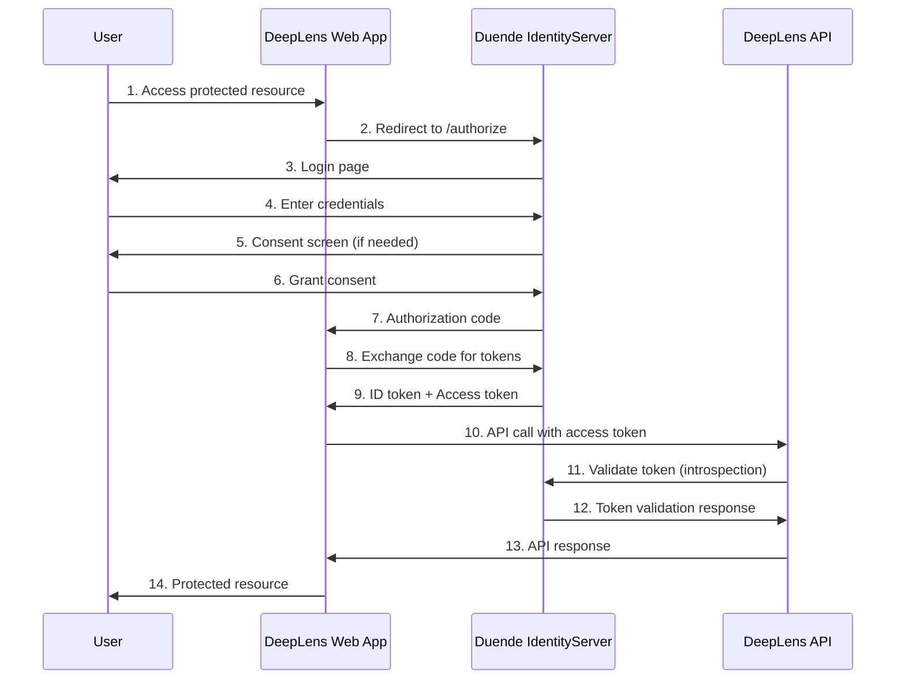

# DeepLens - Image Similarity Search Engine

📋 **See also:**

- [Architecture Overview](docs/ARCHITECTURE_OVERVIEW.md)
- [RBAC Plan](docs/RBAC_PLAN.md)
- [Admin & Impersonation Features](docs/ADMIN_IMPERSONATION_PLAN.md)
- [Storage Architecture](docs/STORAGE_ARCHITECTURE.md)

## Project Overview

**Vision**: Build a comprehensive image similarity search engine that can find visually similar images across multiple storage locations (network shares, cloud storage, blob storage) and help optimize storage by identifying duplicates.

**Core Functionality**:

- Accept an image input (API/user upload)
- Find similar/duplicate images from indexed storage locations
- Return ranked similarity results with image IDs/locations
- Enable storage optimization through duplicate detection and management
  For storage and database architecture details, see [STORAGE_ARCHITECTURE.md](docs/STORAGE_ARCHITECTURE.md).

## Architecture Overview

For a detailed architecture overview, see [ARCHITECTURE_OVERVIEW.md](docs/ARCHITECTURE_OVERVIEW.md).
│ │ Metrics │ │ Logging │ │
│ │ • Prometheus│ │ • ELK/EFK Stack │ │
│ │ • Grafana │ │ • Fluentd │ │
│ │ • Custom │ │ • Loki │ │
│ └─────────────┘ └─────────────────┘ │
│ │
│ ┌─────────────────────────────────┐ │
│ │ Tracing & APM │ │
│ │ • Jaeger / Zipkin │ │
│ │ • OpenTelemetry │ │
│ │ • Application Insights │ │
│ └─────────────────────────────────┘ │
└─────────────────────────────────────────┘

````

## 🔄 Event-Driven Architecture with Apache Kafka

### Kafka-Powered Processing Pipeline

DeepLens uses **Apache Kafka 7.5.0** as the backbone for asynchronous, event-driven image processing. This architecture ensures scalability, fault tolerance, and loose coupling between services.

```mermaid
graph TD
    A[Image Upload API] -->|images.uploaded| B[Validation Service]
    B -->|images.validated| C[Feature Extraction Service]
    B -->|images.failed| F[Error Handler]
    C -->|images.processed| D[Vector Indexing Service]
    C -->|images.processed| E[Duplicate Detection Service]
    D -->|images.indexed| G[Search API Ready]
    E -->|duplicates.found| H[Duplicate Management]
    F -->|Dead Letter Queue| I[Manual Review]
    G -->|tenant.usage| J[Analytics & Billing]
````

### Core Kafka Topics

```yaml
# Image Processing Pipeline Topics
Topics:
  images.uploaded: # New image uploaded and stored
    partitions: 3
    retention: 7d
    consumers: ["validation-service", "analytics-service"]

  images.validated: # Image passed validation checks
    partitions: 3
    retention: 7d
    consumers: ["feature-extraction-service"]

  images.processed: # Features extracted, vectors generated
    partitions: 3
    retention: 7d
    consumers: ["vector-indexing-service", "duplicate-detection-service"]

  images.indexed: # Image indexed in vector database
    partitions: 3
    retention: 7d
    consumers: ["search-service", "analytics-service"]

  # Specialized Processing Topics
  duplicates.found: # Potential duplicate images detected
    partitions: 1
    retention: 30d
    consumers: ["duplicate-management-service"]

  tenant.usage: # Usage analytics and metrics per tenant
    partitions: 6 # Partition by tenant_id for parallel processing
    retention: 90d
    consumers: ["analytics-service", "billing-service"]

  images.failed: # Processing failures and errors
    partitions: 1
    retention: 30d
    consumers: ["error-handler-service", "monitoring-service"]
```

### Event-Driven Benefits

✅ **Scalability**: Process thousands of images concurrently across multiple workers
✅ **Fault Tolerance**: Failed messages retry automatically, no data loss
✅ **Loose Coupling**: Services are independent, can be developed and scaled separately
✅ **Real-time Processing**: Event-driven architecture enables real-time image processing
✅ **Multi-Tenant**: Partition topics by tenant for isolated processing
✅ **Observability**: Full audit trail of every image processing step

### Simplified Service Architecture

```
┌─────────────────────────────────────────────────────────────────┐
│                     DeepLens Core Service (.NET)                │
├─────────────────────────────────────────────────────────────────┤
│                                                                 │
│  ┌─────────────────┐    ┌─────────────────┐    ┌─────────────┐  │
│  │   API Layer     │    │  Orchestration  │    │ Background  │  │
│  │                 │    │     Layer       │    │  Services   │  │
│  │ • Search API    │    │ • Workflow Mgmt │    │ • Indexer   │  │
│  │ • Upload API    │    │ • Job Queue     │    │ • Scanner   │  │
│  │ • Admin API     │    │ • Event Router  │    │ • Processor │  │
│  │ • Health API    │    │ • Storage Mgmt  │    │ • Cleanup   │  │
│  │ • SignalR Hubs  │    │ • Task Scheduler│    │ • Monitor   │  │
│  └─────────────────┘    └─────────────────┘    └─────────────┘  │
│                                                                 │
├─────────────────────────────────────────────────────────────────┤
│  ┌─────────────────┐    ┌─────────────────┐    ┌─────────────┐  │
│  │   Data Layer    │    │  Cross-Cutting  │    │Integration  │  │
│  │                 │    │    Services     │    │   Layer     │  │
│  │ • EF Core       │    │ • Logging       │    │ • Cloud SDK │  │
│  │ • Caching       │    │ • Monitoring    │    │ • Message   │  │
│  │ • Vector Store  │    │ • Config Mgmt   │    │   Queue     │  │
│  │ • File Storage  │    │ • Health Checks │    │ • AI/ML     │  │
│  │ • Metadata DB   │    │ • Metrics       │    │   Client    │  │
│  └─────────────────┘    └─────────────────┘    └─────────────┘  │
└─────────────────────────────────────────────────────────────────┘
                                   │
                                   ▼
                         ┌─────────────────┐
                         │    Python AI/ML │
                         │    Services     │
                         │                 │
                         │ • Feature       │
                         │   Extraction    │
                         │ • Model         │
                         │   Inference     │
                         │ • Vector Ops    │
                         └─────────────────┘
```

## Technical Stack Recommendations

For technical stack details, see:

- [Architecture Overview](docs/ARCHITECTURE_OVERVIEW.md)
- [Storage Architecture](docs/STORAGE_ARCHITECTURE.md)
- [RBAC Plan](docs/RBAC_PLAN.md)
- **Real-time Updates**: SignalR for WebSocket communications
- **Optional Load Balancing**: NGINX/HAProxy for multi-instance deployments
- **Service Discovery**: Simple DNS-based discovery or Kubernetes services

**📊 Observability & Telemetry (Built-in)**

- **Distributed Tracing**: OpenTelemetry with Jaeger/Zipkin backend
- **Metrics Collection**: OpenTelemetry metrics with Prometheus export
- **Structured Logging**: Serilog (.NET) → OpenTelemetry → OTLP/Elasticsearch
- **Log Correlation**: Automatic trace-log correlation via OpenTelemetry
- **APM**: Application Insights, New Relic, or Datadog via OTLP
- **Health Checks**: Built-in health endpoints with OpenTelemetry metrics
- **Unified Export**: Single OTLP endpoint for all telemetry data

## Authentication & Authorization Strategy

For authentication, authorization, and user management details, see:

- [RBAC Plan](docs/RBAC_PLAN.md)
- [Admin & Impersonation Features](docs/ADMIN_IMPERSONATION_PLAN.md)

#### Authentication Options

| **Provider**              | **Use Case**       | **Implementation**        | **Benefits**                   |
| ------------------------- | ------------------ | ------------------------- | ------------------------------ |
| **Azure AD**              | Enterprise SSO     | Built-in .NET support     | Seamless Microsoft integration |
| **Google Identity**       | Consumer apps      | Google.Apis.Auth library  | Wide user adoption             |
| **GitHub OAuth**          | Developer tools    | Custom implementation     | Developer-friendly             |
| **AWS Cognito**           | AWS deployments    | AWSSDK.Extensions.NETCore | Native AWS integration         |
| **Duende IdentityServer** | Self-hosted        | Full control              | Complete customization         |
| **API Keys**              | Service-to-service | Custom middleware         | Simple B2B integration         |

#### Security Features

📋 **Implementation Details:** See [JWT Token Validation & Custom Authorization](CODE_EXAMPLES.md#jwt-token-validation--custom-authorization) for complete security implementation.

#### Role-Based Access Control (RBAC)

📋 **Implementation Details:** See [Role-Based Access Control (RBAC)](CODE_EXAMPLES.md#role-based-access-control-rbac) for complete role and scope definitions.

#### Admin Access, Impersonation, and Tenant Context Switching

📋 **Implementation Details:** See [Admin & Impersonation Features](docs/ADMIN_IMPERSONATION_PLAN.md) for the complete design and implementation of global admin access, impersonation, tenant context switching, and audit trail features.

#### Duende IdentityServer Deployment

📋 **Implementation Details:** See [Docker Compose Configuration](CODE_EXAMPLES.md#docker-compose-configuration) for complete Duende IdentityServer deployment configuration and API authentication examples.

#### Authentication Flow with Duende IdentityServer



#### User Management Features

📋 **Implementation Details:** See [Custom User Store & Profile Service](CODE_EXAMPLES.md#custom-user-store--profile-service) for complete user management implementation.

## Comprehensive Instrumentation & Telemetry Strategy

For observability, telemetry, and monitoring details, see [OBSERVABILITY_PLAN.md](docs/OBSERVABILITY_PLAN.md).

## 🏗️ System Architecture Diagrams

For system architecture diagrams and technical stack details, see [ARCHITECTURE_OVERVIEW.md](docs/ARCHITECTURE_OVERVIEW.md).

## Technical Stack Recommendations

### Unified .NET + Python Technology Stack

#### Service Layer Distribution

**🔵 DeepLens Core Service (.NET) - Unified APIs & Orchestration**

- **API Gateway**: ASP.NET Core with YARP (Yet Another Reverse Proxy)
- **Core APIs**: Minimal APIs for search, upload, admin, health endpoints
- **Authentication**: Multiple OAuth 2.0/OpenID Connect providers with JWT tokens
  - **Self-Hosted**: Duende IdentityServer for complete control
  - **Cloud Providers**: Azure AD, AWS Cognito, Google Identity
  - **Social Login**: GitHub, Microsoft, Google OAuth flows
  - **API Security**: JWT Bearer tokens with scope-based authorization
- **Data Access**: Entity Framework Core with PostgreSQL/SQL Server
- **Caching**: StackExchange.Redis for distributed caching and session state
- **HTTP Client**: HttpClientFactory with Polly for resilience
- **Image Processing**: ImageSharp for basic operations, OpenCvSharp for advanced
- **ONNX Integration**: Microsoft.ML.OnnxRuntime for model inference

**� Additional Unified Service Features**

- **Framework**: ASP.NET Core with Minimal APIs and Worker Services
- **Workflow Engine**: Elsa Workflows or Hangfire for job orchestration
- **File Processing**: ImageSharp for image manipulation, custom upload handlers
- **Event Streaming**: MassTransit with RabbitMQ/Azure Service Bus integration
- **Task Scheduling**: Hangfire, Quartz.NET, or NCrontab for background jobs
- **Storage Connectors**: Azure SDK, AWS SDK for .NET, Google Cloud SDK
- **Real-time Communication**: SignalR for WebSocket connections and real-time updates
- **Background Services**: IHostedService and BackgroundService for long-running tasks
- **Process Management**: Built-in Kestrel server with IIS/Docker deployment

**🔴 Python Services (AI/ML Specialized)**

- **Framework**: FastAPI for APIs, Ray for distributed computing
- **Computer Vision**: OpenCV, PIL/Pillow, scikit-image
- **Deep Learning**: PyTorch, TensorFlow, Hugging Face Transformers
- **Vector Operations**: NumPy, SciPy, Faiss for similarity search
- **Model Serving**: TorchServe, TensorFlow Serving, Triton Inference Server
- **Feature Extraction**: CLIP, ResNet, EfficientNet, custom CNN models
- **Vector Databases**: Qdrant Python client, Weaviate client
- **Async Processing**: Celery with Redis/RabbitMQ, asyncio

#### Cross-Service Communication

**🔀 Simplified Communication Architecture**

- **Internal**: Direct method calls within .NET service (no network overhead)
- **External Python AI/ML**: HTTP/REST APIs with OpenAPI/Swagger documentation
- **Async Processing**: MassTransit with RabbitMQ/Azure Service Bus for background tasks
- **Real-time Updates**: SignalR for WebSocket communications
- **Optional Load Balancing**: NGINX/HAProxy for multi-instance deployments
- **Service Discovery**: Simple DNS-based discovery or Kubernetes services

**📊 Observability & Telemetry (Built-in)**

- **Distributed Tracing**: OpenTelemetry with Jaeger/Zipkin backend
- **Metrics Collection**: OpenTelemetry metrics with Prometheus export
- **Structured Logging**: Serilog (.NET) → OpenTelemetry → OTLP/Elasticsearch
- **Log Correlation**: Automatic trace-log correlation via OpenTelemetry
- **APM**: Application Insights, New Relic, or Datadog via OTLP
- **Health Checks**: Built-in health endpoints with OpenTelemetry metrics
- **Unified Export**: Single OTLP endpoint for all telemetry data

## Authentication & Authorization Strategy

### Self-Hosted Authentication with Duende IdentityServer

DeepLens uses Duende IdentityServer as the primary authentication and user management service, providing complete control over user identity, security policies, and integration patterns.

#### Duende IdentityServer Implementation

📋 **Implementation Details:** See [Authentication & Security Examples](CODE_EXAMPLES.md#-authentication--security-examples) for complete Duende IdentityServer integration code.

#### Authentication Options

| **Provider**              | **Use Case**       | **Implementation**        | **Benefits**                   |
| ------------------------- | ------------------ | ------------------------- | ------------------------------ |
| **Azure AD**              | Enterprise SSO     | Built-in .NET support     | Seamless Microsoft integration |
| **Google Identity**       | Consumer apps      | Google.Apis.Auth library  | Wide user adoption             |
| **GitHub OAuth**          | Developer tools    | Custom implementation     | Developer-friendly             |
| **AWS Cognito**           | AWS deployments    | AWSSDK.Extensions.NETCore | Native AWS integration         |
| **Duende IdentityServer** | Self-hosted        | Full control              | Complete customization         |
| **API Keys**              | Service-to-service | Custom middleware         | Simple B2B integration         |

#### Security Features

📋 **Implementation Details:** See [JWT Token Validation & Custom Authorization](CODE_EXAMPLES.md#jwt-token-validation--custom-authorization) for complete security implementation.

#### Role-Based Access Control (RBAC)

For RBAC details, see [RBAC_PLAN.md](docs/RBAC_PLAN.md).
For admin and impersonation features, see [ADMIN_IMPERSONATION_PLAN.md](docs/ADMIN_IMPERSONATION_PLAN.md).

#### Duende IdentityServer Deployment

📋 **Implementation Details:** See [Docker Compose Configuration](CODE_EXAMPLES.md#docker-compose-configuration) for complete Duende IdentityServer deployment configuration and API authentication examples.

#### Authentication Flow with Duende IdentityServer


#### User Management Features

📋 **Implementation Details:** See [Custom User Store & Profile Service](CODE_EXAMPLES.md#custom-user-store--profile-service) for complete user management implementation.

## Comprehensive Instrumentation & Telemetry Strategy

### Observable Architecture Design

```
┌─────────────────────────────────────────────────────────────────────────────┐
│                          TELEMETRY COLLECTION LAYER                         │
├─────────────────────────────────────────────────────────────────────────────┤
│                                                                             │
│  ┌─────────────┐    ┌─────────────┐    ┌──────────────┐    ┌─────────────┐  │
│  │ .NET Core   │    │ Python AI   │    │Infrastructure│    │ External    │  │
│  │ Service     │    │ Services    │    │ Components   │    │ Services    │  │
│  │ • Serilog→  │    │ • structlog │    │ • Prometheus │    │ • Load Bal. │  │
│  │   OpenTel   │    │ • OpenTel   │    │ • OpenTel    │    │ • Node Exp  │  │
│  │ • OTel      │    │ • FastAPI   │    │ • OTLP       │    │ • cAdvisor  │  │
│  └─────────────┘    └─────────────┘    └──────────────┘    └─────────────┘  │
│           │                 │                 │                 │           │
└───────────┼─────────────────┼─────────────────┼─────────────────┼───────────┘
            │                 │                 │                 │
            ▼                 ▼                 ▼                 ▼
┌─────────────────────────────────────────────────────────────────────────────┐
│                         TELEMETRY AGGREGATION                               │
├─────────────────────────────────────────────────────────────────────────────┤
│                                                                             │
│ ┌─────────────────┐  ┌─────────────────┐  ┌─────────────────────────────┐   │
│ │    METRICS      │  │    LOGGING      │  │        TRACING              │   │
│ │                 │  │                 │  │                             │   │
│ │ • Prometheus    │  │ • Elasticsearch │  │ • Jaeger                    │   │
│ │ • Victoria      │  │ • Loki          │  │ • Zipkin                    │   │
│ │   Metrics       │  │ • Fluentd       │  │ • OpenTelemetry Collector   │   │
│ │ • Custom        │  │ • Vector        │  │ • Tempo                     │   │
│ │   Dashboards    │  │ • Logstash      │  │ • AWS X-Ray                 │   │
│ └─────────────────┘  └─────────────────┘  └─────────────────────────────┘   │
└─────────────────────────────────────────────────────────────────────────────┘
            │                 │                               │
            ▼                 ▼                               ▼
┌─────────────────────────────────────────────────────────────────────────────┐
│                      VISUALIZATION & ALERTING                               │
├─────────────────────────────────────────────────────────────────────────────┤
│                                                                             │
│ ┌─────────────────┐  ┌─────────────────┐  ┌─────────────────────────────┐   │
│ │    DASHBOARDS   │  │     ALERTS      │  │         ANALYSIS            │   │
│ │                 │  │                 │  │                             │   │
│ │ • Grafana       │  │ • AlertManager  │  │ • Kibana                    │   │
│ │ • Custom UI     │  │ • PagerDuty     │  │ • Jaeger UI                 │   │
│ │ • DataDog       │  │ • Slack/Teams   │  │ • Custom Analytics          │   │
│ │ • New Relic     │  │ • Email/SMS     │  │ • Business Intelligence     │   │
│ └─────────────────┘  └─────────────────┘  └─────────────────────────────┘   │
└─────────────────────────────────────────────────────────────────────────────┘
```

## 🏗️ System Architecture Diagrams

### Updated DeepLens Architecture with OpenTelemetry

```
                           ┌─────────────────────────────────────────┐
                           │         Load Balancer + WAF             │
                           │    (HAProxy/NGINX/Cloud LB/Traefik)     │
                           └──────────────────┬──────────────────────┘
                                              │
                           ┌─────────────────────────────────────────┐
                           │         API Gateway (.NET Core)         │
                           │  • Authentication & Authorization       │
                           │  • Rate Limiting & Circuit Breakers     │
                           │  • Request Routing & Load Balancing     │
                           │  • OpenTelemetry Integration           │
                           └──────────────────┬──────────────────────┘
                                              │
        ┌─────────────────────────────────────┼─────────────────────────────────────┐
        │                                     │                                     │
        ▼                                     ▼                                     ▼
┌──────────────────┐                ┌─────────────────┐                ┌─────────────────┐
│   .NET Core APIs │                │    .NET Core    │                │    Python AI/ML │
│                  │                │   Orchestration │                │    Services     │
│ • Search API     │◄──────────────►│                 │◄──────────────►│                 │
│ • Admin API      │                │ • Workflow Mgmt │                │ • Feature       │
│ • Upload API     │                │ • Event Routing │                │   Extraction    │
│ • Health API     │                │ • Task Queue    │                │ • Model         │
│ • Metadata API   │                │ • Job Scheduler │                │   Inference     │
│                  │                │ • File Watcher  │                │ • Training      │
└──────────────────┘                │ • Storage Mgmt  │                │ • Vector Ops    │
        │                           └─────────────────┘                └─────────────────┘
        │                                     │                                     │
        └─────────────────────────────────────┼─────────────────────────────────────┘
                                              │
                                   ┌─────────────────┐
                                   │   Message Bus   │
                                   │                 │
                                   │ • RabbitMQ      │
                                   │ • Apache Kafka  │
                                   │ • Azure Service │
                                   │   Bus/AWS SQS   │
                                   └─────────────────┘
```

### Simplified Service Architecture

```
┌─────────────────────────────────────────────────────────────────┐
│                     DeepLens Core Service (.NET)                │
├─────────────────────────────────────────────────────────────────┤
│                                                                 │
│  ┌─────────────────┐    ┌─────────────────┐    ┌─────────────┐  │
│  │   API Layer     │    │  Orchestration  │    │ Background  │  │
│  │                 │    │     Layer       │    │  Services   │  │
│  │ • Search API    │    │ • Workflow Mgmt │    │ • Indexer   │  │
│  │ • Upload API    │    │ • Job Queue     │    │ • Scanner   │  │
│  │ • Admin API     │    │ • Event Router  │    │ • Processor │  │
│  │ • Health API    │    │ • Storage Mgmt  │    │ • Cleanup   │  │
│  │ • SignalR Hubs  │    │ • Task Scheduler│    │ • Monitor   │  │
│  └─────────────────┘    └─────────────────┘    └─────────────┘  │
│                                                                 │
├─────────────────────────────────────────────────────────────────┤
│  ┌─────────────────┐    ┌─────────────────┐    ┌─────────────┐  │
│  │   Data Layer    │    │  Cross-Cutting  │    │Integration  │  │
│  │                 │    │    Services     │    │   Layer     │  │
│  │ • EF Core       │    │ • Logging       │    │ • Cloud SDK │  │
│  │ • Caching       │    │ • Monitoring    │    │ • Message   │  │
│  │ • Vector Store  │    │ • Config Mgmt   │    │   Queue     │  │
│  │ • File Storage  │    │ • Health Checks │    │ • AI/ML     │  │
│  │ • Metadata DB   │    │ • Metrics       │    │   Client    │  │
│  └─────────────────┘    └─────────────────┘    └─────────────┘  │
└─────────────────────────────────────────────────────────────────┘
                                   │
                                   ▼
                         ┌─────────────────┐
                         │    Python AI/ML │
                         │    Services     │
                         │                 │
                         │ • Feature       │
                         │   Extraction    │
                         │ • Model         │
                         │   Inference     │
                         │ • Vector Ops    │
                         └─────────────────┘
```

## Technical Stack Recommendations

### Unified .NET + Python Technology Stack

#### Service Layer Distribution

**🔵 DeepLens Core Service (.NET) - Unified APIs & Orchestration**

- **API Gateway**: ASP.NET Core with YARP (Yet Another Reverse Proxy)
- **Core APIs**: Minimal APIs for search, upload, admin, health endpoints
- **Authentication**: Multiple OAuth 2.0/OpenID Connect providers with JWT tokens
  - **Self-Hosted**: Duende IdentityServer for complete control
  - **Cloud Providers**: Azure AD, AWS Cognito, Google Identity
  - **Social Login**: GitHub, Microsoft, Google OAuth flows
  - **API Security**: JWT Bearer tokens with scope-based authorization
- **Data Access**: Entity Framework Core with PostgreSQL/SQL Server
- **Caching**: StackExchange.Redis for distributed caching and session state
- **HTTP Client**: HttpClientFactory with Polly for resilience
- **Image Processing**: ImageSharp for basic operations, OpenCvSharp for advanced
- **ONNX Integration**: Microsoft.ML.OnnxRuntime for model inference

**� Additional Unified Service Features**

- **Framework**: ASP.NET Core with Minimal APIs and Worker Services
- **Workflow Engine**: Elsa Workflows or Hangfire for job orchestration
- **File Processing**: ImageSharp for image manipulation, custom upload handlers
- **Event Streaming**: MassTransit with RabbitMQ/Azure Service Bus integration
- **Task Scheduling**: Hangfire, Quartz.NET, or NCrontab for background jobs
- **Storage Connectors**: Azure SDK, AWS SDK for .NET, Google Cloud SDK
- **Real-time Communication**: SignalR for WebSocket connections and real-time updates
- **Background Services**: IHostedService and BackgroundService for long-running tasks
- **Process Management**: Built-in Kestrel server with IIS/Docker deployment

**🔴 Python Services (AI/ML Specialized)**

- **Framework**: FastAPI for APIs, Ray for distributed computing
- **Computer Vision**: OpenCV, PIL/Pillow, scikit-image
- **Deep Learning**: PyTorch, TensorFlow, Hugging Face Transformers
- **Vector Operations**: NumPy, SciPy, Faiss for similarity search
- **Model Serving**: TorchServe, TensorFlow Serving, Triton Inference Server
- **Feature Extraction**: CLIP, ResNet, EfficientNet, custom CNN models
- **Vector Databases**: Qdrant Python client, Weaviate client
- **Async Processing**: Celery with Redis/RabbitMQ, asyncio

#### Cross-Service Communication

**🔀 Simplified Communication Architecture**

- **Internal**: Direct method calls within .NET service (no network overhead)
- **External Python AI/ML**: HTTP/REST APIs with OpenAPI/Swagger documentation
- **Async Processing**: MassTransit with RabbitMQ/Azure Service Bus for background tasks
- **Real-time Updates**: SignalR for WebSocket communications
- **Optional Load Balancing**: NGINX/HAProxy for multi-instance deployments
- **Service Discovery**: Simple DNS-based discovery or Kubernetes services

**📊 Observability & Telemetry (Built-in)**

- **Distributed Tracing**: OpenTelemetry with Jaeger/Zipkin backend
- **Metrics Collection**: OpenTelemetry metrics with Prometheus export
- **Structured Logging**: Serilog (.NET) → OpenTelemetry → OTLP/Elasticsearch
- **Log Correlation**: Automatic trace-log correlation via OpenTelemetry
- **APM**: Application Insights, New Relic, or Datadog via OTLP
- **Health Checks**: Built-in health endpoints with OpenTelemetry metrics
- **Unified Export**: Single OTLP endpoint for all telemetry data

## Authentication & Authorization Strategy

### Self-Hosted Authentication with Duende IdentityServer

DeepLens uses Duende IdentityServer as the primary authentication and user management service, providing complete control over user identity, security policies, and integration patterns.

#### Duende IdentityServer Implementation

📋 **Implementation Details:** See [Authentication & Security Examples](CODE_EXAMPLES.md#-authentication--security-examples) for complete Duende IdentityServer integration code.

#### Authentication Options

| **Provider**              | **Use Case**       | **Implementation**        | **Benefits**                   |
| ------------------------- | ------------------ | ------------------------- | ------------------------------ |
| **Azure AD**              | Enterprise SSO     | Built-in .NET support     | Seamless Microsoft integration |
| **Google Identity**       | Consumer apps      | Google.Apis.Auth library  | Wide user adoption             |
| **GitHub OAuth**          | Developer tools    | Custom implementation     | Developer-friendly             |
| **AWS Cognito**           | AWS deployments    | AWSSDK.Extensions.NETCore | Native AWS integration         |
| **Duende IdentityServer** | Self-hosted        | Full control              | Complete customization         |
| **API Keys**              | Service-to-service | Custom middleware         | Simple B2B integration         |

#### Security Features

📋 **Implementation Details:** See [JWT Token Validation & Custom Authorization](CODE_EXAMPLES.md#jwt-token-validation--custom-authorization) for complete security implementation.

#### Role-Based Access Control (RBAC)

📋 **Implementation Details:** See [Role-Based Access Control (RBAC)](CODE_EXAMPLES.md#role-based-access-control-rbac) for complete role and scope definitions.

#### Admin Access, Impersonation, and Tenant Context Switching

- **Global Admins**: Can access and manage any tenant, including viewing tenant-specific interfaces and resources. Bypass resource-level assignments for universal access, with all actions logged for audit.
- **Tenant Admins**: Restricted to their own tenant’s resources and interface.
- **Impersonation**: Product admins can impersonate any user for debugging and support. Impersonation sets a runtime context (user id, name, roles, permissions, tenant) but does not change actual assignments. All impersonation actions are logged and clearly indicated in the UI.
- **Tenant Context Switching**: Global admins can select and view any tenant’s interface using a tenant selector. The backend and frontend use this context to filter and display data accordingly.
- **Audit Trail**: All admin and impersonation actions are logged for compliance and troubleshooting.

#### Duende IdentityServer Deployment

📋 **Implementation Details:** See [Docker Compose Configuration](CODE_EXAMPLES.md#docker-compose-configuration) for complete Duende IdentityServer deployment configuration and API authentication examples.

#### Authentication Flow with Duende IdentityServer


#### User Management Features

📋 **Implementation Details:** See [Custom User Store & Profile Service](CODE_EXAMPLES.md#custom-user-store--profile-service) for complete user management implementation.

## Comprehensive Instrumentation & Telemetry Strategy

### Observable Architecture Design

```
┌─────────────────────────────────────────────────────────────────────────────┐
│                          TELEMETRY COLLECTION LAYER                         │
├─────────────────────────────────────────────────────────────────────────────┤
│                                                                             │
│  ┌─────────────┐    ┌─────────────┐    ┌──────────────┐    ┌─────────────┐  │
│  │ .NET Core   │    │ Python AI   │    │Infrastructure│    │ External    │  │
│  │ Service     │    │ Services    │    │ Components   │    │ Services    │  │
│  │ • Serilog→  │    │ • structlog │    │ • Prometheus │    │ • Load Bal. │  │
│  │   OpenTel   │    │ • OpenTel   │    │ • OpenTel    │    │ • Node Exp  │  │
│  │ • OTel      │    │ • FastAPI   │    │ • OTLP       │    │ • cAdvisor  │  │
│  └─────────────┘    └─────────────┘    └──────────────┘    └─────────────┘  │
│           │                 │                 │                 │           │
└───────────┼─────────────────┼─────────────────┼─────────────────┼───────────┘
            │                 │                 │                 │
            ▼                 ▼                 ▼                 ▼
┌─────────────────────────────────────────────────────────────────────────────┐
│                         TELEMETRY AGGREGATION                               │
├─────────────────────────────────────────────────────────────────────────────┤
│                                                                             │
│ ┌─────────────────┐  ┌─────────────────┐  ┌─────────────────────────────┐   │
│ │    METRICS      │  │    LOGGING      │  │        TRACING              │   │
│ │                 │  │                 │  │                             │   │
│ │ • Prometheus    │  │ • Elasticsearch │  │ • Jaeger                    │   │
│ │ • Victoria      │  │ • Loki          │  │ • Zipkin                    │   │
│ │   Metrics       │  │ • Fluentd       │  │ • OpenTelemetry Collector   │   │
│ │ • Custom        │  │ • Vector        │  │ • Tempo                     │   │
│ │   Dashboards    │  │ • Logstash      │  │ • AWS X-Ray                 │   │
│ └─────────────────┘  └─────────────────┘  └─────────────────────────────┘   │
└─────────────────────────────────────────────────────────────────────────────┘
            │                 │                               │
            ▼                 ▼                               ▼
┌─────────────────────────────────────────────────────────────────────────────┐
│                      VISUALIZATION & ALERTING                               │
├─────────────────────────────────────────────────────────────────────────────┤
│                                                                             │
│ ┌─────────────────┐  ┌─────────────────┐  ┌─────────────────────────────┐   │
│ │    DASHBOARDS   │  │     ALERTS      │  │         ANALYSIS            │   │
│ │                 │  │                 │  │                             │   │
│ │ • Grafana       │  │ • AlertManager  │  │ • Kibana                    │   │
│ │ • Custom UI     │  │ • PagerDuty     │  │ • Jaeger UI                 │   │
│ │ • DataDog       │  │ • Slack/Teams   │  │ • Custom Analytics          │   │
│ │ • New Relic     │  │ • Email/SMS     │  │ • Business Intelligence     │   │
│ └─────────────────┘  └─────────────────┘  └─────────────────────────────┘   │
└─────────────────────────────────────────────────────────────────────────────┘
```

## 🏗️ System Architecture Diagrams

### Updated DeepLens Architecture with OpenTelemetry

```
                           ┌─────────────────────────────────────────┐
                           │         Load Balancer + WAF             │
                           │    (HAProxy/NGINX/Cloud LB/Traefik)     │
                           └──────────────────┬──────────────────────┘
                                              │
                           ┌─────────────────────────────────────────┐
                           │         API Gateway (.NET Core)         │
                           │  • Authentication & Authorization       │
                           │  • Rate Limiting & Circuit Breakers     │
                           │  • Request Routing & Load Balancing     │
                           │  • OpenTelemetry Integration           │
                           └──────────────────┬──────────────────────┘
                                              │
        ┌─────────────────────────────────────┼─────────────────────────────────────┐
        │                                     │                                     │
        ▼                                     ▼                                     ▼
┌──────────────────┐                ┌─────────────────┐                ┌─────────────────┐
│   .NET Core APIs │                │    .NET Core    │                │    Python AI/ML │
│                  │                │   Orchestration │                │    Services     │
│ • Search API     │◄──────────────►│                 │◄──────────────►│                 │
│ • Admin API      │                │ • Workflow Mgmt │                │ • Feature       │
│ • Upload API     │                │ • Event Routing │                │   Extraction    │
│ • Health API     │                │ • Task Queue    │                │ • Model         │
│ • Metadata API   │                │ • Job Scheduler │                │   Inference     │
│                  │                │ • File Watcher  │                │ • Training      │
└──────────────────┘                │ • Storage Mgmt  │                │ • Vector Ops    │
        │                           └─────────────────┘                └─────────────────┘
        │                                     │                                     │
        └─────────────────────────────────────┼─────────────────────────────────────┘
                                              │
                                   ┌─────────────────┐
                                   │   Message Bus   │
                                   │                 │
                                   │ • RabbitMQ      │
                                   │ • Apache Kafka  │
                                   │ • Azure Service │
                                   │   Bus/AWS SQS   │
                                   └─────────────────┘
```

### Simplified Service Architecture

```
┌─────────────────────────────────────────────────────────────────┐
│                     DeepLens Core Service (.NET)                │
├─────────────────────────────────────────────────────────────────┤
│                                                                 │
│  ┌─────────────────┐    ┌─────────────────┐    ┌─────────────┐  │
│  │   API Layer     │    │  Orchestration  │    │ Background  │  │
│  │                 │    │     Layer       │    │  Services   │  │
│  │ • Search API    │    │ • Workflow Mgmt │    │ • Indexer   │  │
│  │ • Upload API    │    │ • Job Queue     │    │ • Scanner   │  │
│  │ • Admin API     │    │ • Event Router  │    │ • Processor │  │
│  │ • Health API    │    │ • Storage Mgmt  │    │ • Cleanup   │  │
│  │ • SignalR Hubs  │    │ • Task Scheduler│    │ • Monitor   │  │
│  └─────────────────┘    └─────────────────┘    └─────────────┘  │
│                                                                 │
├─────────────────────────────────────────────────────────────────┤
│  ┌─────────────────┐    ┌─────────────────┐    ┌─────────────┐  │
│  │   Data Layer    │    │  Cross-Cutting  │    │Integration  │  │
│  │                 │    │    Services     │    │   Layer     │  │
│  │ • EF Core       │    │ • Logging       │    │ • Cloud SDK │  │
│  │ • Caching       │    │ • Monitoring    │    │ • Message   │  │
│  │ • Vector Store  │    │ • Config Mgmt   │    │   Queue     │  │
│  │ • File Storage  │    │ • Health Checks │    │ • AI/ML     │  │
│  │ • Metadata DB   │    │ • Metrics       │    │   Client    │  │
│  └─────────────────┘    └─────────────────┘    └─────────────┘  │
└─────────────────────────────────────────────────────────────────┘
                                   │
                                   ▼
                         ┌─────────────────┐
                         │    Python AI/ML │
                         │    Services     │
                         │                 │
                         │ • Feature       │
                         │   Extraction    │
                         │ • Model         │
                         │   Inference     │
                         │ • Vector Ops    │
                         └─────────────────┘
```

## Technical Stack Recommendations

### Unified .NET + Python Technology Stack

#### Service Layer Distribution

**🔵 DeepLens Core Service (.NET) - Unified APIs & Orchestration**

- **API Gateway**: ASP.NET Core with YARP (Yet Another Reverse Proxy)
- **Core APIs**: Minimal APIs for search, upload, admin, health endpoints
- **Authentication**: Multiple OAuth 2.0/OpenID Connect providers with JWT tokens
  - **Self-Hosted**: Duende IdentityServer for complete control
  - **Cloud Providers**: Azure AD, AWS Cognito, Google Identity
  - **Social Login**: GitHub, Microsoft, Google OAuth flows
  - **API Security**: JWT Bearer tokens with scope-based authorization
- **Data Access**: Entity Framework Core with PostgreSQL/SQL Server
- **Caching**: StackExchange.Redis for distributed caching and session state
- **HTTP Client**: HttpClientFactory with Polly for resilience
- **Image Processing**: ImageSharp for basic operations, OpenCvSharp for advanced
- **ONNX Integration**: Microsoft.ML.OnnxRuntime for model inference

**� Additional Unified Service Features**

- **Framework**: ASP.NET Core with Minimal APIs and Worker Services
- **Workflow Engine**: Elsa Workflows or Hangfire for job orchestration
- **File Processing**: ImageSharp for image manipulation, custom upload handlers
- **Event Streaming**: MassTransit with RabbitMQ/Azure Service Bus integration
- **Task Scheduling**: Hangfire, Quartz.NET, or NCrontab for background jobs
- **Storage Connectors**: Azure SDK, AWS SDK for .NET, Google Cloud SDK
- **Real-time Communication**: SignalR for WebSocket connections and real-time updates
- **Background Services**: IHostedService and BackgroundService for long-running tasks
- **Process Management**: Built-in Kestrel server with IIS/Docker deployment

**🔴 Python Services (AI/ML Specialized)**

- **Framework**: FastAPI for APIs, Ray for distributed computing
- **Computer Vision**: OpenCV, PIL/Pillow, scikit-image
- **Deep Learning**: PyTorch, TensorFlow, Hugging Face Transformers
- **Vector Operations**: NumPy, SciPy, Faiss for similarity search
- **Model Serving**: TorchServe, TensorFlow Serving, Triton Inference Server
- **Feature Extraction**: CLIP, ResNet, EfficientNet, custom CNN models
- **Vector Databases**: Qdrant Python client, Weaviate client
- **Async Processing**: Celery with Redis/RabbitMQ, asyncio

#### Cross-Service Communication

**🔀 Simplified Communication Architecture**

- **Internal**: Direct method calls within .NET service (no network overhead)
- **External Python AI/ML**: HTTP/REST APIs with OpenAPI/Swagger documentation
- **Async Processing**: MassTransit with RabbitMQ/Azure Service Bus for background tasks
- **Real-time Updates**: SignalR for WebSocket communications
- **Optional Load Balancing**: NGINX/HAProxy for multi-instance deployments
- **Service Discovery**: Simple DNS-based discovery or Kubernetes services

**📊 Observability & Telemetry (Built-in)**

- **Distributed Tracing**: OpenTelemetry with Jaeger/Zipkin backend
- **Metrics Collection**: OpenTelemetry metrics with Prometheus export
- **Structured Logging**: Serilog (.NET) → OpenTelemetry → OTLP/Elasticsearch
- **Log Correlation**: Automatic trace-log correlation via OpenTelemetry
- **APM**: Application Insights, New Relic, or Datadog via OTLP
- **Health Checks**: Built-in health endpoints with OpenTelemetry metrics
- **Unified Export**: Single OTLP endpoint for all telemetry data

## Authentication & Authorization Strategy

### Self-Hosted Authentication with Duende IdentityServer

DeepLens uses Duende IdentityServer as the primary authentication and user management service, providing complete control over user identity, security policies, and integration patterns.

#### Duende IdentityServer Implementation

📋 **Implementation Details:** See [Authentication & Security Examples](CODE_EXAMPLES.md#-authentication--security-examples) for complete Duende IdentityServer integration code.

#### Authentication Options

| **Provider**              | **Use Case**       | **Implementation**        | **Benefits**                   |
| ------------------------- | ------------------ | ------------------------- | ------------------------------ |
| **Azure AD**              | Enterprise SSO     | Built-in .NET support     | Seamless Microsoft integration |
| **Google Identity**       | Consumer apps      | Google.Apis.Auth library  | Wide user adoption             |
| **GitHub OAuth**          | Developer tools    | Custom implementation     | Developer-friendly             |
| **AWS Cognito**           | AWS deployments    | AWSSDK.Extensions.NETCore | Native AWS integration         |
| **Duende IdentityServer** | Self-hosted        | Full control              | Complete customization         |
| **API Keys**              | Service-to-service | Custom middleware         | Simple B2B integration         |

#### Security Features

📋 **Implementation Details:** See [JWT Token Validation & Custom Authorization](CODE_EXAMPLES.md#jwt-token-validation--custom-authorization) for complete security implementation.

#### Role-Based Access Control (RBAC)

📋 **Implementation Details:** See [Role-Based Access Control (RBAC)](CODE_EXAMPLES.md#role-based-access-control-rbac) for complete role and scope definitions.

#### Admin Access, Impersonation, and Tenant Context Switching

- **Global Admins**: Can access and manage any tenant, including viewing tenant-specific interfaces and resources. Bypass resource-level assignments for universal access, with all actions logged for audit.
- **Tenant Admins**: Restricted to their own tenant’s resources and interface.
- **Impersonation**: Product admins can impersonate any user for debugging and support. Impersonation sets a runtime context (user id, name, roles, permissions, tenant) but does not change actual assignments. All impersonation actions are logged and clearly indicated in the UI.
- **Tenant Context Switching**: Global admins can select and view any tenant’s interface using a tenant selector. The backend and frontend use this context to filter and display data accordingly.
- **Audit Trail**: All admin and impersonation actions are logged for compliance and troubleshooting.

#### Duende IdentityServer Deployment

📋 **Implementation Details:** See [Docker Compose Configuration](CODE_EXAMPLES.md#docker-compose-configuration) for complete Duende IdentityServer deployment configuration and API authentication examples.

#### Authentication Flow with Duende IdentityServer


#### User Management Features

📋 **Implementation Details:** See [Custom User Store & Profile Service](CODE_EXAMPLES.md#custom-user-store--profile-service) for complete user management implementation.

## Comprehensive Instrumentation & Telemetry Strategy

### Observable Architecture Design

```
┌─────────────────────────────────────────────────────────────────────────────┐
│                          TELEMETRY COLLECTION LAYER                         │
├─────────────────────────────────────────────────────────────────────────────┤
│                                                                             │
│  ┌─────────────┐    ┌─────────────┐    ┌──────────────┐    ┌─────────────┐  │
│  │ .NET Core   │    │ Python AI   │    │Infrastructure│    │ External    │  │
│  │ Service     │    │ Services    │    │ Components   │    │ Services    │  │
│  │ • Serilog→  │    │ • structlog │    │ • Prometheus │    │ • Load Bal. │  │
│  │   OpenTel   │    │ • OpenTel   │    │ • OpenTel    │    │ • Node Exp  │  │
│  │ • OTel      │    │ • FastAPI   │    │ • OTLP       │    │ • cAdvisor  │  │
│  └─────────────┘    └─────────────┘    └──────────────┘    └─────────────┘  │
│           │                 │                 │                 │           │
└───────────┼─────────────────┼─────────────────┼─────────────────┼───────────┘
            │                 │                 │                 │
            ▼                 ▼                 ▼                 ▼
┌─────────────────────────────────────────────────────────────────────────────┐
│                         TELEMETRY AGGREGATION                               │
├─────────────────────────────────────────────────────────────────────────────┤
│                                                                             │
│ ┌─────────────────┐  ┌─────────────────┐  ┌─────────────────────────────┐   │
│ │    METRICS      │  │    LOGGING      │  │        TRACING              │   │
│ │                 │  │                 │  │                             │   │
│ │ • Prometheus    │  │ • Elasticsearch │  │ • Jaeger                    │   │
│ │ • Victoria      │  │ • Loki          │  │ • Zipkin                    │   │
│ │   Metrics       │  │ • Fluentd       │  │ • OpenTelemetry Collector   │   │
│ │ • Custom        │  │ • Vector        │  │ • Tempo                     │   │
│ │   Dashboards    │  │ • Logstash      │  │ • AWS X-Ray                 │   │
│ └─────────────────┘  └─────────────────┘  └─────────────────────────────┘   │
└─────────────────────────────────────────────────────────────────────────────┘
            │                 │                               │
            ▼                 ▼                               ▼
┌─────────────────────────────────────────────────────────────────────────────┐
│                      VISUALIZATION & ALERTING                               │
├─────────────────────────────────────────────────────────────────────────────┤
│                                                                             │
│ ┌─────────────────┐  ┌─────────────────┐  ┌─────────────────────────────┐   │
│ │    DASHBOARDS   │  │     ALERTS      │  │         ANALYSIS            │   │
│ │                 │  │                 │  │                             │   │
│ │ • Grafana       │  │ • AlertManager  │  │ • Kibana                    │   │
│ │ • Custom UI     │  │ • PagerDuty     │  │ • Jaeger UI                 │   │
│ │ • DataDog       │  │ • Slack/Teams   │  │ • Custom Analytics          │   │
│ │ • New Relic     │  │ • Email/SMS     │  │ • Business Intelligence     │   │
│ └─────────────────┘  └─────────────────┘  └─────────────────────────────┘   │
└─────────────────────────────────────────────────────────────────────────────┘
```

## 🏗️ System Architecture Diagrams

### Updated DeepLens Architecture with OpenTelemetry

```
                           ┌─────────────────────────────────────────┐
                           │         Load Balancer + WAF             │
                           │    (HAProxy/NGINX/Cloud LB/Traefik)     │
                           └──────────────────┬──────────────────────┘
                                              │
                           ┌─────────────────────────────────────────┐
                           │         API Gateway (.NET Core)         │
                           │  • Authentication & Authorization       │
                           │  • Rate Limiting & Circuit Breakers     │
                           │  • Request Routing & Load Balancing     │
                           │  • OpenTelemetry Integration           │
                           └──────────────────┬──────────────────────┘
                                              │
        ┌─────────────────────────────────────┼─────────────────────────────────────┐
        │                                     │                                     │
        ▼                                     ▼                                     ▼
┌──────────────────┐                ┌─────────────────┐                ┌─────────────────┐
│   .NET Core APIs │                │    .NET Core    │                │    Python AI/ML │
│                  │                │   Orchestration │                │    Services     │
│ • Search API     │◄──────────────►│                 │◄──────────────►│                 │
│ • Admin API      │                │ • Workflow Mgmt │                │ • Feature       │
│ • Upload API     │                │ • Event Routing │                │   Extraction    │
│ • Health API     │                │ • Task Queue    │                │ • Model         │
│ • Metadata API   │                │ • Job Scheduler │                │   Inference     │
│                  │                │ • File Watcher  │                │ • Training      │
└──────────────────┘                │ • Storage Mgmt  │                │ • Vector Ops    │
        │                           └─────────────────┘                └─────────────────┘
        │                                     │                                     │
        └─────────────────────────────────────┼─────────────────────────────────────┘
                                              │
                                   ┌─────────────────┐
                                   │   Message Bus   │
                                   │                 │
                                   │ • RabbitMQ      │
 │ • Apache Kafka  │
                                   │ • Azure Service │
                                   │   Bus/AWS SQS   │
                                   └─────────────────┘
```

### Simplified Service Architecture

```
┌─────────────────────────────────────────────────────────────────┐
│                     DeepLens Core Service (.NET)                │
├─────────────────────────────────────────────────────────────────┤
│                                                                 │
│  ┌─────────────────┐    ┌─────────────────┐    ┌─────────────┐  │
│  │   API Layer     │    │  Orchestration  │    │ Background  │  │
│  │                 │    │     Layer       │    │  Services   │  │
│  │ • Search API    │    │ • Workflow Mgmt │    │ • Indexer   │  │
│  │ • Upload API    │    │ • Job Queue     │    │ • Scanner   │  │
│  │ • Admin API     │    │ • Event Router  │    │ • Processor │  │
│  │ • Health API    │    │ • Storage Mgmt  │    │ • Cleanup   │  │
│  │ • SignalR Hubs  │    │ • Task Scheduler│    │ • Monitor   │  │
│  └─────────────────┘    └─────────────────┘    └─────────────┘  │
│                                                                 │
├─────────────────────────────────────────────────────────────────┤
│  ┌─────────────────┐    ┌─────────────────┐    ┌─────────────┐  │
│  │   Data Layer    │    │  Cross-Cutting  │    │Integration  │  │
│  │                 │    │    Services     │    │   Layer     │  │
│  │ • EF Core       │    │ • Logging       │    │ • Cloud SDK │  │
│  │ • Caching       │    │ • Monitoring    │    │ • Message   │  │
│  │ • Vector Store  │    │ • Config Mgmt   │    │   Queue     │  │
│  │ • File Storage  │    │ • Health Checks │    │ • AI/ML     │  │
│  │ • Metadata DB   │    │ • Metrics       │    │   Client    │  │
│  └─────────────────┘    └─────────────────┘    └─────────────┘  │
└─────────────────────────────────────────────────────────────────┘
                                   │
                                   ▼
                         ┌─────────────────┐
                         │    Python AI/ML │
                         │    Services     │
                         │                 │
                         │ • Feature       │
                         │   Extraction    │
                         │ • Model         │
                         │   Inference     │
                         │ • Vector Ops    │
                         └─────────────────┘
```

## Technical Stack Recommendations

### Unified .NET + Python Technology Stack

#### Service Layer Distribution

**🔵 DeepLens Core Service (.NET) - Unified APIs & Orchestration**

- **API Gateway**: ASP.NET Core with YARP (Yet Another Reverse Proxy)
- **Core APIs**: Minimal APIs for search, upload, admin, health endpoints
- **Authentication**: Multiple OAuth 2.0/OpenID Connect providers with JWT tokens
  - **Self-Hosted**: Duende IdentityServer for complete control
  - **Cloud Providers**: Azure AD, AWS Cognito, Google Identity
  - **Social Login**: GitHub, Microsoft, Google OAuth flows
  - **API Security**: JWT Bearer tokens with scope-based authorization
- **Data Access**: Entity Framework Core with PostgreSQL/SQL Server
- **Caching**: StackExchange.Redis for distributed caching and session state
- **HTTP Client**: HttpClientFactory with Polly for resilience
- **Image Processing**: ImageSharp for basic operations, OpenCvSharp for advanced
- **ONNX Integration**: Microsoft.ML.OnnxRuntime for model inference

**� Additional Unified Service Features**

- **Framework**: ASP.NET Core with Minimal APIs and Worker Services
- **Workflow Engine**: Elsa Workflows or Hangfire for job orchestration
- **File Processing**: ImageSharp for image manipulation, custom upload handlers
- **Event Streaming**: MassTransit with RabbitMQ/Azure Service Bus integration
- **Task Scheduling**: Hangfire, Quartz.NET, or NCrontab for background jobs
- **Storage Connectors**: Azure SDK, AWS SDK for .NET, Google Cloud SDK
- **Real-time Communication**: SignalR for WebSocket connections and real-time updates
- **Background Services**: IHostedService and BackgroundService for long-running tasks
- **Process Management**: Built-in Kestrel server with IIS/Docker deployment

**🔴 Python Services (AI/ML Specialized)**

- **Framework**: FastAPI for APIs, Ray for distributed computing
- **Computer Vision**: OpenCV, PIL/Pillow, scikit-image
- **Deep Learning**: PyTorch, TensorFlow, Hugging Face Transformers
- **Vector Operations**: NumPy, SciPy, Faiss for similarity search
- **Model Serving**: TorchServe, TensorFlow Serving, Triton Inference Server
- **Feature Extraction**: CLIP, ResNet, EfficientNet, custom CNN models
- **Vector Databases**: Qdrant Python client, Weaviate client
- **Async Processing**: Celery with Redis/RabbitMQ, asyncio

#### Cross-Service Communication

**🔀 Simplified Communication Architecture**

- **Internal**: Direct method calls within .NET service (no network overhead)
- **External Python AI/ML**: HTTP/REST APIs with OpenAPI/Swagger documentation
- **Async Processing**: MassTransit with RabbitMQ/Azure Service Bus for background tasks
- **Real-time Updates**: SignalR for WebSocket communications
- **Optional Load Balancing**: NGINX/HAProxy for multi-instance deployments
- **Service Discovery**: Simple DNS-based discovery or Kubernetes services

**📊 Observability & Telemetry (Built-in)**

- **Distributed Tracing**: OpenTelemetry with Jaeger/Zipkin backend
- **Metrics Collection**: OpenTelemetry metrics with Prometheus export
- **Structured Logging**: Serilog (.NET) → OpenTelemetry → OTLP/Elasticsearch
- **Log Correlation**: Automatic trace-log correlation via OpenTelemetry
- **APM**: Application Insights, New Relic, or Datadog via OTLP
- **Health Checks**: Built-in health endpoints with OpenTelemetry metrics
- **Unified Export**: Single OTLP endpoint for all telemetry data

## Authentication & Authorization Strategy

### Self-Hosted Authentication with Duende IdentityServer

DeepLens uses Duende IdentityServer as the primary authentication and user management service, providing complete control over user identity, security policies, and integration patterns.

#### Duende IdentityServer Implementation

📋 **Implementation Details:** See [Authentication & Security Examples](CODE_EXAMPLES.md#-authentication--security-examples) for complete Duende IdentityServer integration code.

#### Authentication Options

| **Provider**              | **Use Case**       | **Implementation**        | **Benefits**                   |
| ------------------------- | ------------------ | ------------------------- | ------------------------------ |
| **Azure AD**              | Enterprise SSO     | Built-in .NET support     | Seamless Microsoft integration |
| **Google Identity**       | Consumer apps      | Google.Apis.Auth library  | Wide user adoption             |
| **GitHub OAuth**          | Developer tools    | Custom implementation     | Developer-friendly             |
| **AWS Cognito**           | AWS deployments    | AWSSDK.Extensions.NETCore | Native AWS integration         |
| **Duende IdentityServer** | Self-hosted        | Full control              | Complete customization         |
| **API Keys**              | Service-to-service | Custom middleware         | Simple B2B integration         |

#### Security Features

📋 **Implementation Details:** See [JWT Token Validation & Custom Authorization](CODE_EXAMPLES.md#jwt-token-validation--custom-authorization) for complete security implementation.

#### Role-Based Access Control (RBAC)

📋 **Implementation Details:** See [Role-Based Access Control (RBAC)](CODE_EXAMPLES.md#role-based-access-control-rbac) for complete role and scope definitions.

#### Admin Access, Impersonation, and Tenant Context Switching

- **Global Admins**: Can access and manage any tenant, including viewing tenant-specific interfaces and resources. Bypass resource-level assignments for universal access, with all actions logged for audit.
- **Tenant Admins**: Restricted to their own tenant’s resources and interface.
- **Impersonation**: Product admins can impersonate any user for debugging and support. Impersonation sets a runtime context (user id, name, roles, permissions, tenant) but does not change actual assignments. All impersonation actions are logged and clearly indicated in the UI.
- **Tenant Context Switching**: Global admins can select and view any tenant’s interface using a tenant selector. The backend and frontend use this context to filter and display data accordingly.
- **Audit Trail**: All admin and impersonation actions are logged for compliance and troubleshooting.

#### Duende IdentityServer Deployment

📋 **Implementation Details:** See [Docker Compose Configuration](CODE_EXAMPLES.md#docker-compose-configuration) for complete Duende IdentityServer deployment configuration and API authentication examples.

#### Authentication Flow with Duende IdentityServer


#### User Management Features

📋 **Implementation Details:** See [Custom User Store & Profile Service](CODE_EXAMPLES.md#custom-user-store--profile-service) for complete user management implementation.

## Comprehensive Instrumentation & Telemetry Strategy

### Observable Architecture Design

```
┌─────────────────────────────────────────────────────────────────────────────┐
│                          TELEMETRY COLLECTION LAYER                         │
├─────────────────────────────────────────────────────────────────────────────┤
│                                                                             │
│  ┌─────────────┐    ┌─────────────┐    ┌──────────────┐    ┌─────────────┐  │
│  │ .NET Core   │    │ Python AI   │    │Infrastructure│    │ External    │  │
│  │ Service     │    │ Services    │    │ Components   │    │ Services    │  │
│  │ • Serilog→  │    │ • structlog │    │ • Prometheus │    │ • Load Bal. │  │
│  │   OpenTel   │    │ • OpenTel   │    │ • OpenTel    │    │ • Node Exp  │  │
│  │ • OTel      │    │ • FastAPI   │    │ • OTLP       │    │ • cAdvisor  │  │
│  └─────────────┘    └─────────────┘    └──────────────┘    └─────────────┘  │
│           │                 │                 │                 │           │
└───────────┼─────────────────┼─────────────────┼─────────────────┼───────────┘
            │                 │                 │                 │
            ▼                 ▼                 ▼                 ▼
┌─────────────────────────────────────────────────────────────────────────────┐
│                         TELEMETRY AGGREGATION                               │
├─────────────────────────────────────────────────────────────────────────────┤
│                                                                             │
│ ┌─────────────────┐  ┌─────────────────┐  ┌─────────────────────────────┐   │
│ │    METRICS      │  │    LOGGING      │  │        TRACING              │   │
│ │                 │  │                 │  │                             │   │
│ │ • Prometheus    │  │ • Elasticsearch │  │ • Jaeger                    │   │
│ │ • Victoria      │  │ • Loki          │  │ • Zipkin                    │   │
│ │   Metrics       │  │ • Fluentd       │  │ • OpenTelemetry Collector   │   │
│ │ • Custom        │  │ • Vector        │  │ • Tempo                     │   │
│ │   Dashboards    │  │ • Logstash      │  │ • AWS X-Ray                 │   │
│ └─────────────────┘  └─────────────────┘  └─────────────────────────────┘   │
└─────────────────────────────────────────────────────────────────────────────┘
            │                 │                               │
            ▼                 ▼                               ▼
┌─────────────────────────────────────────────────────────────────────────────┐
│                      VISUALIZATION & ALERTING                               │
├─────────────────────────────────────────────────────────────────────────────┤
│                                                                             │
│ ┌─────────────────┐  ┌─────────────────┐  ┌─────────────────────────────┐   │
│ │    DASHBOARDS   │  │     ALERTS      │  │         ANALYSIS            │   │
│ │                 │  │                 │  │                             │   │
│ │ • Grafana       │  │ • AlertManager  │  │ • Kibana                    │   │
│ │ • Custom UI     │  │ • PagerDuty     │  │ • Jaeger UI                 │   │
│ │ • DataDog       │  │ • Slack/Teams   │  │ • Custom Analytics          │   │
│ │ • New Relic     │  │ • Email/SMS     │  │ • Business Intelligence     │   │
│ └─────────────────┘  └─────────────────┘  └─────────────────────────────┘   │
└─────────────────────────────────────────────────────────────────────────────┘
```

## 🏗️ System Architecture Diagrams

### Updated DeepLens Architecture with OpenTelemetry

```
                           ┌─────────────────────────────────────────┐
                           │         Load Balancer + WAF             │
                           │    (HAProxy/NGINX/Cloud LB/Traefik)     │
                           └──────────────────┬──────────────────────┘
                                              │
                           ┌─────────────────────────────────────────┐
                           │         API Gateway (.NET Core)         │
                           │  • Authentication & Authorization       │
                           │  • Rate Limiting & Circuit Breakers     │
                           │  • Request Routing & Load Balancing     │
                           │  • OpenTelemetry Integration           │
                           └──────────────────┬──────────────────────┘
                                              │
        ┌─────────────────────────────────────┼─────────────────────────────────────┐
        │                                     │                                     │
        ▼                                     ▼                                     ▼
┌──────────────────┐                ┌─────────────────┐                ┌─────────────────┐
│   .NET Core APIs │                │    .NET Core    │                │    Python AI/ML │
│                  │                │   Orchestration │                │    Services     │
│ • Search API     │◄──────────────►│                 │◄──────────────►│                 │
│ • Admin API      │                │ • Workflow Mgmt │                │ • Feature       │
│ • Upload API     │                │ • Event Routing │                │   Extraction    │
│ • Health API     │                │ • Task Queue    │                │ • Model         │
│ • Metadata API   │                │ • Job Scheduler │                │   Inference     │
│                  │                │ • File Watcher  │                │ • Training      │
└──────────────────┘                │ • Storage Mgmt  │                │ • Vector Ops    │
        │                           └─────────────────┘                └─────────────────┘
        │                                     │                                     │
        └─────────────────────────────────────┼─────────────────────────────────────┘
                                              │
                                   ┌─────────────────┐
                                   │   Message Bus   │
                                   │                 │
                                   │ • RabbitMQ      │
                                   │ • Apache Kafka  │
                                   │ • Azure Service │
                                   │   Bus/AWS SQS   │
                                   └─────────────────┘
```

### Simplified Service Architecture

```
┌─────────────────────────────────────────────────────────────────┐
│                     DeepLens Core Service (.NET)                │
├─────────────────────────────────────────────────────────────────┤
│                                                                 │
│  ┌─────────────────┐    ┌─────────────────┐    ┌─────────────┐  │
│  │   API Layer     │    │  Orchestration  │    │ Background  │  │
│  │                 │    │     Layer       │    │  Services   │  │
│  │ • Search API    │    │ • Workflow Mgmt │    │ • Indexer   │  │
│  │ • Upload API    │    │ • Job Queue     │    │ • Scanner   │  │
│  │ • Admin API     │    │ • Event Router  │    │ • Processor │  │
│  │ • Health API    │    │ • Storage Mgmt  │    │ • Cleanup   │  │
│  │ • SignalR Hubs  │    │ • Task Scheduler│    │ • Monitor   │  │
│  └─────────────────┘    └─────────────────┘    └─────────────┘  │
│                                                                 │
├─────────────────────────────────────────────────────────────────┤
│  ┌─────────────────┐    ┌─────────────────┐    ┌─────────────┐  │
│  │   Data Layer    │    │  Cross-Cutting  │    │Integration  │  │
│  │                 │    │    Services     │    │   Layer     │  │
│  │ • EF Core       │    │ • Logging       │    │ • Cloud SDK │  │
│  │ • Caching       │    │ • Monitoring    │    │ • Message   │  │
│  │ • Vector Store  │    │ • Config Mgmt   │    │   Queue     │  │
│  │ • File Storage  │    │ • Health Checks │    │ • AI/ML     │  │
│  │ • Metadata DB   │    │ • Metrics       │    │   Client    │  │
│  └─────────────────┘    └─────────────────┘    └─────────────┘  │
└─────────────────────────────────────────────────────────────────┘
                                   │
                                   ▼
                         ┌─────────────────┐
                         │    Python AI/ML │
                         │    Services     │
                         │                 │
                         │ • Feature       │
                         │   Extraction    │
                         │ • Model         │
                         │   Inference     │
                         │ • Vector Ops    │
                         └─────────────────┘
```

## Technical Stack Recommendations

### Unified .NET + Python Technology Stack

#### Service Layer Distribution

**🔵 DeepLens Core Service (.NET) - Unified APIs & Orchestration**

- **API Gateway**: ASP.NET Core with YARP (Yet Another Reverse Proxy)
- **Core APIs**: Minimal APIs for search, upload, admin, health endpoints
- **Authentication**: Multiple OAuth 2.0/OpenID Connect providers with JWT tokens
  - **Self-Hosted**: Duende IdentityServer for complete control
  - **Cloud Providers**: Azure AD, AWS Cognito, Google Identity
  - **Social Login**: GitHub, Microsoft, Google OAuth flows
  - **API Security**: JWT Bearer tokens with scope-based authorization
- **Data Access**: Entity Framework Core with PostgreSQL/SQL Server
- **Caching**: StackExchange.Redis for distributed caching and session state
- **HTTP Client**: HttpClientFactory with Polly for resilience
- **Image Processing**: ImageSharp for basic operations, OpenCvSharp for advanced
- **ONNX Integration**: Microsoft.ML.OnnxRuntime for model inference

**� Additional Unified Service Features**

- **Framework**: ASP.NET Core with Minimal APIs and Worker Services
- **Workflow Engine**: Elsa Workflows or Hangfire for job orchestration
- **File Processing**: ImageSharp for image manipulation, custom upload handlers
- **Event Streaming**: MassTransit with RabbitMQ/Azure Service Bus integration
- **Task Scheduling**: Hangfire, Quartz.NET, or NCrontab for background jobs
- **Storage Connectors**: Azure SDK, AWS SDK for .NET, Google Cloud SDK
- **Real-time Communication**: SignalR for WebSocket connections and real-time updates
- **Background Services**: IHostedService and BackgroundService for long-running tasks
- **Process Management**: Built-in Kestrel server with IIS/Docker deployment

**🔴 Python Services (AI/ML Specialized)**

- **Framework**: FastAPI for APIs, Ray for distributed computing
- **Computer Vision**: OpenCV, PIL/Pillow, scikit-image
- **Deep Learning**: PyTorch, TensorFlow, Hugging Face Transformers
- **Vector Operations**: NumPy, SciPy, Faiss for similarity search
- **Model Serving**: TorchServe, TensorFlow Serving, Triton Inference Server
- **Feature Extraction**: CLIP, ResNet, EfficientNet, custom CNN models
- **Vector Databases**: Qdrant Python client, Weaviate client
- **Async Processing**: Celery with Redis/RabbitMQ, asyncio

#### Cross-Service Communication

**🔀 Simplified Communication Architecture**

- **Internal**: Direct method calls within .NET service (no network overhead)
- **External Python AI/ML**: HTTP/REST APIs with OpenAPI/Swagger documentation
- **Async Processing**: MassTransit with RabbitMQ/Azure Service Bus for background tasks
- **Real-time Updates**: SignalR for WebSocket communications
- **Optional Load Balancing**: NGINX/HAProxy for multi-instance deployments
- **Service Discovery**: Simple DNS-based discovery or Kubernetes services

**📊 Observability & Telemetry (Built-in)**

- **Distributed Tracing**: OpenTelemetry with Jaeger/Zipkin backend
- **Metrics Collection**: OpenTelemetry metrics with Prometheus export
- **Structured Logging**: Serilog (.NET) → OpenTelemetry → OTLP/Elasticsearch
- **Log Correlation**: Automatic trace-log correlation via OpenTelemetry
- **APM**: Application Insights, New Relic, or Datadog via OTLP
- **Health Checks**: Built-in health endpoints with OpenTelemetry metrics
- **Unified Export**: Single OTLP endpoint for all telemetry data

## Authentication & Authorization Strategy

### Self-Hosted Authentication with Duende IdentityServer

DeepLens uses Duende IdentityServer as the primary authentication and user management service, providing complete control over user identity, security policies, and integration patterns.

#### Duende IdentityServer Implementation

📋 **Implementation Details:** See [Authentication & Security Examples](CODE_EXAMPLES.md#-authentication--security-examples) for complete Duende IdentityServer integration code.

#### Authentication Options

| **Provider**              | **Use Case**       | **Implementation**        | **Benefits**                   |
| ------------------------- | ------------------ | ------------------------- | ------------------------------ |
| **Azure AD**              | Enterprise SSO     | Built-in .NET support     | Seamless Microsoft integration |
| **Google Identity**       | Consumer apps      | Google.Apis.Auth library  | Wide user adoption             |
| **GitHub OAuth**          | Developer tools    | Custom implementation     | Developer-friendly             |
| **AWS Cognito**           | AWS deployments    | AWSSDK.Extensions.NETCore | Native AWS integration         |
| **Duende IdentityServer** | Self-hosted        | Full control              | Complete customization         |
| **API Keys**              | Service-to-service | Custom middleware         | Simple B2B integration         |

#### Security Features

📋 **Implementation Details:** See [JWT Token Validation & Custom Authorization](CODE_EXAMPLES.md#jwt-token-validation--custom-authorization) for complete security implementation.

#### Role-Based Access Control (RBAC)

📋 **Implementation Details:** See [Role-Based Access Control (RBAC)](CODE_EXAMPLES.md#role-based-access-control-rbac) for complete role and scope definitions.

#### Admin Access, Impersonation, and Tenant Context Switching

- **Global Admins**: Can access and manage any tenant, including viewing tenant-specific interfaces and resources. Bypass resource-level assignments for universal access, with all actions logged for audit.
- **Tenant Admins**: Restricted to their own tenant’s resources and interface.
- **Impersonation**: Product admins can impersonate any user for debugging and support. Impersonation sets a runtime context (user id, name, roles, permissions, tenant) but does not change actual assignments. All impersonation actions are logged and clearly indicated in the UI.
- **Tenant Context Switching**: Global admins can select and view any tenant’s interface using a tenant selector. The backend and frontend use this context to filter and display data accordingly.
- **Audit Trail**: All admin and impersonation actions are logged for compliance and troubleshooting.

#### Duende IdentityServer Deployment

📋 **Implementation Details:** See [Docker Compose Configuration](CODE_EXAMPLES.md#docker-compose-configuration) for complete Duende IdentityServer deployment configuration and API authentication examples.

#### Authentication Flow with Duende IdentityServer


#### User Management Features

📋 **Implementation Details:** See [Custom User Store & Profile Service](CODE_EXAMPLES.md#custom-user-store--profile-service) for complete user management implementation.

## Comprehensive Instrumentation & Telemetry Strategy

### Observable Architecture Design

```
┌─────────────────────────────────────────────────────────────────────────────┐
│                          TELEMETRY COLLECTION LAYER                         │
├─────────────────────────────────────────────────────────────────────────────┤
│                                                                             │
│  ┌─────────────┐    ┌─────────────┐    ┌──────────────┐    ┌─────────────┐  │
│  │ .NET Core   │    │ Python AI   │    │Infrastructure│    │ External    │  │
│  │ Service     │    │ Services    │    │ Components   │    │ Services    │  │
│  │ • Serilog→  │    │ • structlog │    │ • Prometheus │    │ • Load Bal. │  │
│  │   OpenTel   │    │ • OpenTel   │    │ • OpenTel    │    │ • Node Exp  │  │
│  │ • OTel      │    │ • FastAPI   │    │ • OTLP       │    │ • cAdvisor  │  │
│  └─────────────┘    └─────────────┘    └──────────────┘    └─────────────┘  │
│           │                 │                 │                 │           │
└───────────┼─────────────────┼─────────────────┼─────────────────┼───────────┘
            │                 │                 │                 │
            ▼                 ▼                 ▼                 ▼
┌─────────────────────────────────────────────────────────────────────────────┐
│                         TELEMETRY AGGREGATION                               │
├─────────────────────────────────────────────────────────────────────────────┤
│                                                                             │
│ ┌─────────────────┐  ┌─────────────────┐  ┌─────────────────────────────┐   │
│ │    METRICS      │  │    LOGGING      │  │        TRACING              │   │
│ │                 │  │                 │  │                             │   │
│ │ • Prometheus    │  │ • Elasticsearch │  │ • Jaeger                    │   │
│ │ • Victoria      │  │ • Loki          │  │ • Zipkin                    │   │
│ │   Metrics       │  │ • Fluentd       │  │ • OpenTelemetry Collector   │   │
│ │ • Custom        │  │ • Vector        │  │ • Tempo                     │   │
│ │   Dashboards    │  │ • Logstash      │  │ • AWS X-Ray                 │   │
│ └─────────────────┘  └─────────────────┘  └─────────────────────────────┘   │
└─────────────────────────────────────────────────────────────────────────────┘
            │                 │                               │
            ▼                 ▼                               ▼
┌─────────────────────────────────────────────────────────────────────────────┐
│                      VISUALIZATION & ALERTING                               │
├─────────────────────────────────────────────────────────────────────────────┤
│                                                                             │
│ ┌─────────────────┐  ┌─────────────────┐  ┌─────────────────────────────┐   │
│ │    DASHBOARDS   │  │     ALERTS      │  │         ANALYSIS            │   │
│ │                 │  │                 │  │                             │   │
│ │ • Grafana       │  │ • AlertManager  │  │ • Kibana                    │   │
│ │ • Custom UI     │  │ • PagerDuty     │  │ • Jaeger UI                 │   │
│ │ • DataDog       │  │ • Slack/Teams   │  │ • Custom Analytics          │   │
│ │ • New Relic     │  │ • Email/SMS     │  │ • Business Intelligence     │   │
│ └─────────────────┘  └─────────────────┘  └─────────────────────────────┘   │
└─────────────────────────────────────────────────────────────────────────────┘
```

## 🏗️ System Architecture Diagrams

### Updated DeepLens Architecture with OpenTelemetry

```
                           ┌─────────────────────────────────────────┐
                           │         Load Balancer + WAF             │
                           │    (HAProxy/NGINX/Cloud LB/Traefik)     │
                           └──────────────────┬──────────────────────┘
                                              │
                           ┌─────────────────────────────────────────┐
                           │         API Gateway (.NET Core)         │
                           │  • Authentication & Authorization       │
                           │  • Rate Limiting & Circuit Breakers     │
                           │  • Request Routing & Load Balancing     │
                           │  • OpenTelemetry Integration           │
                           └──────────────────┬──────────────────────┘
                                              │
        ┌─────────────────────────────────────┼─────────────────────────────────────┐
        │                                     │                                     │
        ▼                                     ▼                                     ▼
┌──────────────────┐                ┌─────────────────┐                ┌─────────────────┐
│   .NET Core APIs │                │    .NET Core    │                │    Python AI/ML │
│                  │                │   Orchestration │                │    Services     │
│ • Search API     │◄──────────────►│                 │◄──────────────►│                 │
│ • Admin API      │                │ • Workflow Mgmt │                │ • Feature       │
│ • Upload API     │                │ • Event Routing │                │   Extraction    │
│ • Health API     │                │ • Task Queue    │                │ • Model         │
│ • Metadata API   │                │ • Job Scheduler │                │   Inference     │
│                  │                │ • File Watcher  │                │ • Training      │
└──────────────────┘                │ • Storage Mgmt  │                │ • Vector Ops    │
        │                           └─────────────────┘                └─────────────────┘
        │                                     │                                     │
        └─────────────────────────────────────┼─────────────────────────────────────┘
                                              │
                                   ┌─────────────────┐
                                   │   Message Bus   │
                                   │                 │
                                   │ • RabbitMQ      │
                                   │ • Apache Kafka  │
                                   │ • Azure Service │
                                   │   Bus/AWS SQS   │
                                   └─────────────────┘
```

### Simplified Service Architecture

```
┌─────────────────────────────────────────────────────────────────┐
│                     DeepLens Core Service (.NET)                │
├─────────────────────────────────────────────────────────────────┤
│                                                                 │
│  ┌─────────────────┐    ┌─────────────────┐    ┌─────────────┐  │
│  │   API Layer     │    │  Orchestration  │    │ Background  │  │
│  │                 │    │     Layer       │    │  Services   │  │
│  │ • Search API    │    │ • Workflow Mgmt │    │ • Indexer   │  │
│  │ • Upload API    │    │ • Job Queue     │    │ • Scanner   │  │
│  │ • Admin API     │    │ • Event Router  │    │ • Processor │  │
│  │ • Health API    │    │ • Storage Mgmt  │    │ • Cleanup   │  │
│  │ • SignalR Hubs  │    │ • Task Scheduler│    │ • Monitor   │  │
│  └─────────────────┘    └─────────────────┘    └─────────────┘  │
│                                                                 │
├─────────────────────────────────────────────────────────────────┤
│  ┌─────────────────┐    ┌─────────────────┐    ┌─────────────┐  │
│  │   Data Layer    │    │  Cross-Cutting  │    │Integration  │  │
│  │                 │    │    Services     │    │   Layer     │  │
│  │ • EF Core       │    │ • Logging       │    │ • Cloud SDK │  │
│  │ • Caching       │    │ • Monitoring    │    │ • Message   │  │
│  │ • Vector Store  │    │ • Config Mgmt   │    │   Queue     │  │
│  │ • File Storage  │    │ • Health Checks │    │ • AI/ML     │  │
│  │ • Metadata DB   │    │ • Metrics       │    │   Client    │  │
│  └─────────────────┘    └─────────────────┘    └─────────────┘  │
└─────────────────────────────────────────────────────────────────┘
                                   │
                                   ▼
                         ┌─────────────────┐
                         │    Python AI/ML │
                         │    Services     │
                         │                 │
                         │ • Feature       │
                         │   Extraction    │
                         │ • Model         │
                         │   Inference     │
                         │ • Vector Ops    │
                         └─────────────────┘
```

## Technical Stack Recommendations

### Unified .NET + Python Technology Stack

#### Service Layer Distribution

**🔵 DeepLens Core Service (.NET) - Unified APIs & Orchestration**

- **API Gateway**: ASP.NET Core with YARP (Yet Another Reverse Proxy)
- **Core APIs**: Minimal APIs for search, upload, admin, health endpoints
- **Authentication**: Multiple OAuth 2.0/OpenID Connect providers with JWT tokens
  - **Self-Hosted**: Duende IdentityServer for complete control
  - **Cloud Providers**: Azure AD, AWS Cognito, Google Identity
  - **Social Login**: GitHub, Microsoft, Google OAuth flows
  - **API Security**: JWT Bearer tokens with scope-based authorization
- **Data Access**: Entity Framework Core with PostgreSQL/SQL Server
- **Caching**: StackExchange.Redis for distributed caching and session state
- **HTTP Client**: HttpClientFactory with Polly for resilience
- **Image Processing**: ImageSharp for basic operations, OpenCvSharp for advanced
- **ONNX Integration**: Microsoft.ML.OnnxRuntime for model inference

**� Additional Unified Service Features**

- **Framework**: ASP.NET Core with Minimal APIs and Worker Services
- **Workflow Engine**: Elsa Workflows or Hangfire for job orchestration
- **File Processing**: ImageSharp for image manipulation, custom upload handlers
- **Event Streaming**: MassTransit with RabbitMQ/Azure Service Bus integration
- **Task Scheduling**: Hangfire, Quartz.NET, or NCrontab for background jobs
- **Storage Connectors**: Azure SDK, AWS SDK for .NET, Google Cloud SDK
- **Real-time Communication**: SignalR for WebSocket connections and real-time updates
- **Background Services**: IHostedService and BackgroundService for long-running tasks
- **Process Management**: Built-in Kestrel server with IIS/Docker deployment

**🔴 Python Services (AI/ML Specialized)**

- **Framework**: FastAPI for APIs, Ray for distributed computing
- **Computer Vision**: OpenCV, PIL/Pillow, scikit-image
- **Deep Learning**: PyTorch, TensorFlow, Hugging Face Transformers
- **Vector Operations**: NumPy, SciPy, Faiss for similarity search
- **Model Serving**: TorchServe, TensorFlow Serving, Triton Inference Server
- **Feature Extraction**: CLIP, ResNet, EfficientNet, custom CNN models
- **Vector Databases**: Qdrant Python client, Weaviate client
- **Async Processing**: Celery with Redis/RabbitMQ, asyncio

#### Cross-Service Communication

**🔀 Simplified Communication Architecture**

- **Internal**: Direct method calls within .NET service (no network overhead)
- **External Python AI/ML**: HTTP/REST APIs with OpenAPI/Swagger documentation
- **Async Processing**: MassTransit with RabbitMQ/Azure Service Bus for background tasks
- **Real-time Updates**: SignalR for WebSocket communications
- **Optional Load Balancing**: NGINX/HAProxy for multi-instance deployments
- **Service Discovery**: Simple DNS-based discovery or Kubernetes services

**📊 Observability & Telemetry (Built-in)**

- **Distributed Tracing**: OpenTelemetry with Jaeger/Zipkin backend
- **Metrics Collection**: OpenTelemetry metrics with Prometheus export
- **Structured Logging**: Serilog (.NET) → OpenTelemetry → OTLP/Elasticsearch
- **Log Correlation**: Automatic trace-log correlation via OpenTelemetry
- **APM**: Application Insights, New Relic, or Datadog via OTLP
- **Health Checks**: Built-in health endpoints with OpenTelemetry metrics
- **Unified Export**: Single OTLP endpoint for all telemetry data

## Authentication & Authorization Strategy

### Self-Hosted Authentication with Duende IdentityServer

DeepLens uses Duende IdentityServer as the primary authentication and user management service, providing complete control over user identity, security policies, and integration patterns.

#### Duende IdentityServer Implementation

📋 **Implementation Details:** See [Authentication & Security Examples](CODE_EXAMPLES.md#-authentication--security-examples) for complete Duende IdentityServer integration code.

#### Authentication Options

| **Provider**              | **Use Case**       | **Implementation**        | **Benefits**                   |
| ------------------------- | ------------------ | ------------------------- | ------------------------------ |
| **Azure AD**              | Enterprise SSO     | Built-in .NET support     | Seamless Microsoft integration |
| **Google Identity**       | Consumer apps      | Google.Apis.Auth library  | Wide user adoption             |
| **GitHub OAuth**          | Developer tools    | Custom implementation     | Developer-friendly             |
| **AWS Cognito**           | AWS deployments    | AWSSDK.Extensions.NETCore | Native AWS integration         |
| **Duende IdentityServer** | Self-hosted        | Full control              | Complete customization         |
| **API Keys**              | Service-to-service | Custom middleware         | Simple B2B integration         |

#### Security Features

📋 **Implementation Details:** See [JWT Token Validation & Custom Authorization](CODE_EXAMPLES.md#jwt-token-validation--custom-authorization) for complete security implementation.

#### Role-Based Access Control (RBAC)

📋 **Implementation Details:** See [Role-Based Access Control (RBAC)](CODE_EXAMPLES.md#role-based-access-control-rbac) for complete role and scope definitions.

#### Admin Access, Impersonation, and Tenant Context Switching

- **Global Admins**: Can access and manage any tenant, including viewing tenant-specific interfaces and resources. Bypass resource-level assignments for universal access, with all actions logged for audit.
- **Tenant Admins**: Restricted to their own tenant’s resources and interface.
- **Impersonation**: Product admins can impersonate any user for debugging and support. Impersonation sets a runtime context (user id, name, roles, permissions, tenant) but does not change actual assignments. All impersonation actions are logged and clearly indicated in the UI.
- **Tenant Context Switching**: Global admins can select and view any tenant’s interface using a tenant selector. The backend and frontend use this context to filter and display data accordingly.
- **Audit Trail**: All admin and impersonation actions are logged for compliance and troubleshooting.

#### Duende IdentityServer Deployment

📋 **Implementation Details:** See [Docker Compose Configuration](CODE_EXAMPLES.md#docker-compose-configuration) for complete Duende IdentityServer deployment configuration and API authentication examples.

#### Authentication Flow with Duende IdentityServer


#### User Management Features

📋 **Implementation Details:** See [Custom User Store & Profile Service](CODE_EXAMPLES.md#custom-user-store--profile-service) for complete user management implementation.

## Comprehensive Instrumentation & Telemetry Strategy

### Observable Architecture Design

```
┌─────────────────────────────────────────────────────────────────────────────┐
│                          TELEMETRY COLLECTION LAYER                         │
├─────────────────────────────────────────────────────────────────────────────┤
│                                                                             │
│  ┌─────────────┐    ┌─────────────┐    ┌──────────────┐    ┌─────────────┐  │
│  │ .NET Core   │    │ Python AI   │    │Infrastructure│    │ External    │  │
│  │ Service     │    │ Services    │    │ Components   │    │ Services    │  │
│  │ • Serilog→  │    │ • structlog │    │ • Prometheus │    │ • Load Bal. │  │
│  │   OpenTel   │    │ • OpenTel   │    │ • OpenTel    │    │ • Node Exp  │  │
│  │ • OTel      │    │ • FastAPI   │    │ • OTLP       │    │ • cAdvisor  │  │
│  └─────────────┘    └─────────────┘    └──────────────┘    └─────────────┘  │
│           │                 │                 │                 │           │
└───────────┼─────────────────┼─────────────────┼─────────────────┼───────────┘
            │                 │                 │                 │
            ▼                 ▼                 ▼                 ▼
┌─────────────────────────────────────────────────────────────────────────────┐
│                         TELEMETRY AGGREGATION                               │
├─────────────────────────────────────────────────────────────────────────────┤
│                                                                             │
│ ┌─────────────────┐  ┌─────────────────┐  ┌─────────────────────────────┐   │
│ │    METRICS      │  │    LOGGING      │  │        TRACING              │   │
│ │                 │  │                 │  │                             │   │
│ │ • Prometheus    │  │ • Elasticsearch │  │ • Jaeger                    │   │
│ │ • Victoria      │  │ • Loki          │  │ • Zipkin                    │   │
│ │   Metrics       │  │ • Fluentd       │  │ • OpenTelemetry Collector   │   │
│ │ • Custom        │  │ • Vector        │  │ • Tempo                     │   │
│ │   Dashboards    │  │ • Logstash      │  │ • AWS X-Ray                 │   │
│ └─────────────────┘  └─────────────────┘  └─────────────────────────────┘   │
└─────────────────────────────────────────────────────────────────────────────┘
            │                 │                               │
            ▼                 ▼                               ▼
┌─────────────────────────────────────────────────────────────────────────────┐
│                      VISUALIZATION & ALERTING                               │
├─────────────────────────────────────────────────────────────────────────────┤
│                                                                             │
│ ┌─────────────────┐  ┌─────────────────┐  ┌─────────────────────────────┐   │
│ │    DASHBOARDS   │  │     ALERTS      │  │         ANALYSIS            │   │
│ │                 │  │                 │  │                             │   │
│ │ • Grafana       │  │ • AlertManager  │  │ • Kibana                    │   │
│ │ • Custom UI     │  │ • PagerDuty     │  │ • Jaeger UI                 │   │
│ │ • DataDog       │  │ • Slack/Teams   │  │ • Custom Analytics          │   │
│ │ • New Relic     │  │ • Email/SMS     │  │ • Business Intelligence     │   │
│ └─────────────────┘  └─────────────────┘  └─────────────────────────────┘   │
└─────────────────────────────────────────────────────────────────────────────┘
```

## 🏗️ System Architecture Diagrams

### Updated DeepLens Architecture with OpenTelemetry

```
                           ┌─────────────────────────────────────────┐
                           │         Load Balancer + WAF             │
                           │    (HAProxy/NGINX/Cloud LB/Traefik)     │
                           └──────────────────┬──────────────────────┘
                                              │
                           ┌─────────────────────────────────────────┐
                           │         API Gateway (.NET Core)         │
                           │  • Authentication & Authorization       │
                           │  • Rate Limiting & Circuit Breakers     │
                           │  • Request Routing & Load Balancing     │
                           │  • OpenTelemetry Integration           │
                           └──────────────────┬──────────────────────┘
                                              │
        ┌─────────────────────────────────────┼─────────────────────────────────────┐
        │                                     │                                     │
        ▼                                     ▼                                     ▼
┌──────────────────┐                ┌─────────────────┐                ┌─────────────────┐
│   .NET Core APIs │                │    .NET Core    │                │    Python AI/ML │
│                  │                │   Orchestration │                │    Services     │
│ • Search API     │◄──────────────►│                 │◄──────────────►│                 │
│ • Admin API      │                │ • Workflow Mgmt │                │ • Feature       │
│ • Upload API     │                │ • Event Routing │                │   Extraction    │
│ • Health API     │                │ • Task Queue    │                │ • Model         │
│ • Metadata API   │                │ • Job Scheduler │                │   Inference     │
│                  │                │ • File Watcher  │                │ • Training      │
└──────────────────┘                │ • Storage Mgmt  │                │ • Vector Ops    │
        │                           └─────────────────┘                └─────────────────┘
        │                                     │                                     │
        └─────────────────────────────────────┼─────────────────────────────────────┘
                                              │
                                   ┌─────────────────┐
                                   │   Message Bus   │
                                   │                 │
                                   │ • RabbitMQ      │
                                   │ • Apache Kafka  │
                                   │ • Azure Service │
                                   │   Bus/AWS SQS   │
                                   └─────────────────┘
```

### Simplified Service Architecture

```
┌─────────────────────────────────────────────────────────────────┐
│                     DeepLens Core Service (.NET)                │
├─────────────────────────────────────────────────────────────────┤
│                                                                 │
│  ┌─────────────────┐    ┌─────────────────┐    ┌─────────────┐  │
│  │   API Layer     │    │  Orchestration  │    │ Background  │  │
│  │                 │    │     Layer       │    │  Services   │  │
│  │ • Search API    │    │ • Workflow Mgmt │    │ • Indexer   │  │
│  │ • Upload API    │    │ • Job Queue     │    │ • Scanner   │  │
│  │ • Admin API     │    │ • Event Router  │    │ • Processor │  │
│  │ • Health API    │    │ • Storage Mgmt  │    │ • Cleanup   │  │
│  │ • SignalR Hubs  │    │ • Task Scheduler│    │ • Monitor   │  │
│  └─────────────────┘    └─────────────────┘    └─────────────┘  │
│                                                                 │
├─────────────────────────────────────────────────────────────────┤
│  ┌─────────────────┐    ┌─────────────────┐    ┌─────────────┐  │
│  │   Data Layer    │    │  Cross-Cutting  │    │Integration  │  │
│  │                 │    │    Services     │    │   Layer     │  │
│  │ • EF Core       │    │ • Logging       │    │ • Cloud SDK │  │
│  │ • Caching       │    │ • Monitoring    │    │ • Message   │  │
│  │ • Vector Store  │    │ • Config Mgmt   │    │   Queue     │  │
│  │ • File Storage  │    │ • Health Checks │    │ • AI/ML     │  │
│  │ • Metadata DB   │    │ • Metrics       │    │   Client    │  │
│  └─────────────────┘    └─────────────────┘    └─────────────┘  │
└─────────────────────────────────────────────────────────────────┘
                                   │
                                   ▼
                         ┌─────────────────┐
                         │    Python AI/ML │
                         │    Services     │
                         │                 │
                         │ • Feature       │
                         │   Extraction    │
                         │ • Model         │
                         │   Inference     │
                         │ • Vector Ops    │
                         └─────────────────┘
```

## Technical Stack Recommendations

### Unified .NET + Python Technology Stack

#### Service Layer Distribution

**🔵 DeepLens Core Service (.NET) - Unified APIs & Orchestration**

- **API Gateway**: ASP.NET Core with YARP (Yet Another Reverse Proxy)
- **Core APIs**: Minimal APIs for search, upload, admin, health endpoints
- **Authentication**: Multiple OAuth 2.0/OpenID Connect providers with JWT tokens
  - **Self-Hosted**: Duende IdentityServer for complete control
  - **Cloud Providers**: Azure AD, AWS Cognito, Google Identity
  - **Social Login**: GitHub, Microsoft, Google OAuth flows
  - **API Security**: JWT Bearer tokens with scope-based authorization
- **Data Access**: Entity Framework Core with PostgreSQL/SQL Server
- **Caching**: StackExchange.Redis for distributed caching and session state
- **HTTP Client**: HttpClientFactory with Polly for resilience
- **Image Processing**: ImageSharp for basic operations, OpenCvSharp for advanced
- **ONNX Integration**: Microsoft.ML.OnnxRuntime for model inference

**� Additional Unified Service Features**

- **Framework**: ASP.NET Core with Minimal APIs and Worker Services
- **Workflow Engine**: Elsa Workflows or Hangfire for job orchestration
- **File Processing**: ImageSharp for image manipulation, custom upload handlers
- **Event Streaming**: MassTransit with RabbitMQ/Azure Service Bus integration
- **Task Scheduling**: Hangfire, Quartz.NET, or NCrontab for background jobs
- **Storage Connectors**: Azure SDK, AWS SDK for .NET, Google Cloud SDK
- **Real-time Communication**: SignalR for WebSocket connections and real-time updates
- **Background Services**: IHostedService and BackgroundService for long-running tasks
- **Process Management**: Built-in Kestrel server with IIS/Docker deployment

**🔴 Python Services (AI/ML Specialized)**

- **Framework**: FastAPI for APIs, Ray for distributed computing
- **Computer Vision**: OpenCV, PIL/Pillow, scikit-image
- **Deep Learning**: PyTorch, TensorFlow, Hugging Face Transformers
- **Vector Operations**: NumPy, SciPy, Faiss for similarity search
- **Model Serving**: TorchServe, TensorFlow Serving, Triton Inference Server
- **Feature Extraction**: CLIP, ResNet, EfficientNet, custom CNN models
- **Vector Databases**: Qdrant Python client, Weaviate client
- **Async Processing**: Celery with Redis/RabbitMQ, asyncio

#### Cross-Service Communication

**🔀 Simplified Communication Architecture**

- **Internal**: Direct method calls within .NET service (no network overhead)
- **External Python AI/ML**: HTTP/REST APIs with OpenAPI/Swagger documentation
- **Async Processing**: MassTransit with RabbitMQ/Azure Service Bus for background tasks
- **Real-time Updates**: SignalR for WebSocket communications
- **Optional Load Balancing**: NGINX/HAProxy for multi-instance deployments
- **Service Discovery**: Simple DNS-based discovery or Kubernetes services

**📊 Observability & Telemetry (Built-in)**

- **Distributed Tracing**: OpenTelemetry with Jaeger/Zipkin backend
- **Metrics Collection**: OpenTelemetry metrics with Prometheus export
- **Structured Logging**: Serilog (.NET) → OpenTelemetry → OTLP/Elasticsearch
- **Log Correlation**: Automatic trace-log correlation via OpenTelemetry
- **APM**: Application Insights, New Relic, or Datadog via OTLP
- **Health Checks**: Built-in health endpoints with OpenTelemetry metrics
- **Unified Export**: Single OTLP endpoint for all telemetry data

## Authentication & Authorization Strategy

### Self-Hosted Authentication with Duende IdentityServer

DeepLens uses Duende IdentityServer as the primary authentication and user management service, providing complete control over user identity, security policies, and integration patterns.

#### Duende IdentityServer Implementation

📋 **Implementation Details:** See [Authentication & Security Examples](CODE_EXAMPLES.md#-authentication--security-examples) for complete Duende IdentityServer integration code.

#### Authentication Options

| **Provider**              | **Use Case**       | **Implementation**        | **Benefits**                   |
| ------------------------- | ------------------ | ------------------------- | ------------------------------ |
| **Azure AD**              | Enterprise SSO     | Built-in .NET support     | Seamless Microsoft integration |
| **Google Identity**       | Consumer apps      | Google.Apis.Auth library  | Wide user adoption             |
| **GitHub OAuth**          | Developer tools    | Custom implementation     | Developer-friendly             |
| **AWS Cognito**           | AWS deployments    | AWSSDK.Extensions.NETCore | Native AWS integration         |
| **Duende IdentityServer** | Self-hosted        | Full control              | Complete customization         |
| **API Keys**              | Service-to-service | Custom middleware         | Simple B2B integration         |

#### Security Features

📋 **Implementation Details:** See [JWT Token Validation & Custom Authorization](CODE_EXAMPLES.md#jwt-token-validation--custom-authorization) for complete security implementation.

#### Role-Based Access Control (RBAC)

📋 **Implementation Details:** See [Role-Based Access Control (RBAC)](CODE_EXAMPLES.md#role-based-access-control-rbac) for complete role and scope definitions.

#### Admin Access, Impersonation, and Tenant Context Switching

- **Global Admins**: Can access and manage any tenant, including viewing tenant-specific interfaces and resources. Bypass resource-level assignments for universal access, with all actions logged for audit.
- **Tenant Admins**: Restricted to their own tenant’s resources and interface.
- **Impersonation**: Product admins can impersonate any user for debugging and support. Impersonation sets a runtime context (user id, name, roles, permissions, tenant) but does not change actual assignments. All impersonation actions are logged and clearly indicated in the UI.
- **Tenant Context Switching**: Global admins can select and view any tenant’s interface using a tenant selector. The backend and frontend use this context to filter and display data accordingly.
- **Audit Trail**: All admin and impersonation actions are logged for compliance and troubleshooting.

#### Duende IdentityServer Deployment

📋 **Implementation Details:** See [Docker Compose Configuration](CODE_EXAMPLES.md#docker-compose-configuration) for complete Duende IdentityServer deployment configuration and API authentication examples.

#### Authentication Flow with Duende IdentityServer


#### User Management Features

📋 **Implementation Details:** See [Custom User Store & Profile Service](CODE_EXAMPLES.md#custom-user-store--profile-service) for complete user management implementation.

## Comprehensive Instrumentation & Telemetry Strategy

### Observable Architecture Design

```
┌─────────────────────────────────────────────────────────────────────────────┐
│                          TELEMETRY COLLECTION LAYER                         │
├─────────────────────────────────────────────────────────────────────────────┤
│                                                                             │
│  ┌─────────────┐    ┌─────────────┐    ┌──────────────┐    ┌─────────────┐  │
│  │ .NET Core   │    │ Python AI   │    │Infrastructure│    │ External    │  │
│  │ Service     │    │ Services    │    │ Components   │    │ Services    │  │
│  │ • Serilog→  │    │ • structlog │    │ • Prometheus │    │ • Load Bal. │  │
│  │   OpenTel   │    │ • OpenTel   │    │ • OpenTel    │    │ • Node Exp  │  │
│  │ • OTel      │    │ • FastAPI   │    │ • OTLP       │    │ • cAdvisor  │  │
│  └─────────────┘    └─────────────┘    └──────────────┘    └─────────────┘  │
│           │                 │                 │                 │           │
└───────────┼─────────────────┼─────────────────┼─────────────────┼───────────┘
            │                 │                 │                 │
            ▼                 ▼                 ▼                 ▼
┌─────────────────────────────────────────────────────────────────────────────┐
│                         TELEMETRY AGGREGATION                               │
├─────────────────────────────────────────────────────────────────────────────┤
│                                                                             │
│ ┌─────────────────┐  ┌─────────────────┐  ┌─────────────────────────────┐   │
│ │    METRICS      │  │    LOGGING      │  │        TRACING              │   │
│ │                 │  │                 │  │                             │   │
│ │ • Prometheus    │  │ • Elasticsearch │  │ • Jaeger                    │   │
│ │ • Victoria      │  │ • Loki          │  │ • Zipkin                    │   │
│ │   Metrics       │  │ • Fluentd       │  │ • OpenTelemetry Collector   │   │
│ │ • Custom        │  │ • Vector        │  │ • Tempo                     │   │
│ │   Dashboards    │  │ • Logstash      │  │ • AWS X-Ray                 │   │
│ └─────────────────┘  └─────────────────┘  └─────────────────────────────┘   │
└─────────────────────────────────────────────────────────────────────────────┘
            │                 │                               │
            ▼                 ▼                               ▼
┌─────────────────────────────────────────────────────────────────────────────┐
│                      VISUALIZATION & ALERTING                               │
├─────────────────────────────────────────────────────────────────────────────┤
│                                                                             │
│ ┌─────────────────┐  ┌─────────────────┐  ┌─────────────────────────────┐   │
│ │    DASHBOARDS   │  │     ALERTS      │  │         ANALYSIS            │   │
│ │                 │  │                 │  │                             │   │
│ │ • Grafana       │  │ • AlertManager  │  │ • Kibana                    │   │
│ │ • Custom UI     │  │ • PagerDuty     │  │ • Jaeger UI                 │   │
│ │ • DataDog       │  │ • Slack/Teams   │  │ • Custom Analytics          │   │
│ │ • New Relic     │  │ • Email/SMS     │  │ • Business Intelligence     │   │
│ └─────────────────┘  └─────────────────┘  └─────────────────────────────┘   │
└─────────────────────────────────────────────────────────────────────────────┘
```

## 🏗️ System Architecture Diagrams

### Updated DeepLens Architecture with OpenTelemetry

```
                           ┌─────────────────────────────────────────┐
                           │         Load Balancer + WAF             │
                           │    (HAProxy/NGINX/Cloud LB/Traefik)     │
                           └──────────────────┬──────────────────────┘
                                              │
                           ┌─────────────────────────────────────────┐
                           │         API Gateway (.NET Core)         │
                           │  • Authentication & Authorization       │
                           │  • Rate Limiting & Circuit Breakers     │
                           │  • Request Routing & Load Balancing     │
                           │  • OpenTelemetry Integration           │
                           └──────────────────┬──────────────────────┘
                                              │
        ┌─────────────────────────────────────┼─────────────────────────────────────┐
        │                                     │                                     │
        ▼                                     ▼                                     ▼
┌──────────────────┐                ┌─────────────────┐                ┌─────────────────┐
│   .NET Core APIs │                │    .NET Core    │                │    Python AI/ML │
│                  │                │   Orchestration │                │    Services     │
│ • Search API     │◄──────────────►│                 │◄──────────────►│                 │
│ • Admin API      │                │ • Workflow Mgmt │                │ • Feature       │
│ • Upload API     │                │ • Event Routing │                │   Extraction    │
│ • Health API     │                │ • Task Queue    │                │ • Model         │
│ • Metadata API   │                │ • Job Scheduler │                │   Inference     │
│                  │                │ • File Watcher  │                │ • Training      │
└──────────────────┘                │ • Storage Mgmt  │                │ • Vector Ops    │
        │                           └─────────────────┘                └─────────────────┘
        │                                     │                                     │
        └─────────────────────────────────────┼─────────────────────────────────────┘
                                              │
                                   ┌─────────────────┐
                                   │   Message Bus   │
                                   │                 │
                                   │ • RabbitMQ      │
                                   │ • Apache Kafka  │
                                   │ • Azure Service │
                                   │   Bus/AWS SQS   │
                                   └─────────────────┘
```

### Simplified Service Architecture

```
┌─────────────────────────────────────────────────────────────────┐
│                     DeepLens Core Service (.NET)                │
├─────────────────────────────────────────────────────────────────┤
│                                                                 │
│  ┌─────────────────┐    ┌─────────────────┐    ┌─────────────┐  │
│  │   API Layer     │    │  Orchestration  │    │ Background  │  │
│  │                 │    │     Layer       │    │  Services   │  │
│  │ • Search API    │    │ • Workflow Mgmt │    │ • Indexer   │  │
│  │ • Upload API    │    │ • Job Queue     │    │ • Scanner   │  │
│  │ • Admin API     │    │ • Event Router  │    │ • Processor │  │
│  │ • Health API    │    │ • Storage Mgmt  │    │ • Cleanup   │  │
│  │ • SignalR Hubs  │    │ • Task Scheduler│    │ • Monitor   │  │
│  └─────────────────┘    └─────────────────┘    └─────────────┘  │
│                                                                 │
├─────────────────────────────────────────────────────────────────┤
│  ┌─────────────────┐    ┌─────────────────┐    ┌─────────────┐  │
│  │   Data Layer    │    │  Cross-Cutting  │    │Integration  │  │
│  │                 │    │    Services     │    │   Layer     │  │
│  │ • EF Core       │    │ • Logging       │    │ • Cloud SDK │  │
│  │ • Caching       │    │ • Monitoring    │    │ • Message   │  │
│  │ • Vector Store  │    │ • Config Mgmt   │    │   Queue     │  │
│  │ • File Storage  │    │ • Health Checks │    │ • AI/ML     │  │
│  │ • Metadata DB   │    │ • Metrics       │    │   Client    │  │
│  └─────────────────┘    └─────────────────┘    └─────────────┘  │
└─────────────────────────────────────────────────────────────────┘
                                   │
                                   ▼
                         ┌─────────────────┐
                         │    Python AI/ML │
                         │    Services     │
                         │                 │
                         │ • Feature       │
                         │   Extraction    │
                         │ • Model         │
                         │   Inference     │
                         │ • Vector Ops    │
                         └─────────────────┘
```

## Technical Stack Recommendations

### Unified .NET + Python Technology Stack

#### Service Layer Distribution

**🔵 DeepLens Core Service (.NET) - Unified APIs & Orchestration**

- **API Gateway**: ASP.NET Core with YARP (Yet Another Reverse Proxy)
- **Core APIs**: Minimal APIs for search, upload, admin, health endpoints
- **Authentication**: Multiple OAuth 2.0/OpenID Connect providers with JWT tokens
  - **Self-Hosted**: Duende IdentityServer for complete control
  - **Cloud Providers**: Azure AD, AWS Cognito, Google Identity
  - **Social Login**: GitHub, Microsoft, Google OAuth flows
  - **API Security**: JWT Bearer tokens with scope-based authorization
- **Data Access**: Entity Framework Core with PostgreSQL/SQL Server
- **Caching**: StackExchange.Redis for distributed caching and session state
- **HTTP Client**: HttpClientFactory with Polly for resilience
- **Image Processing**: ImageSharp for basic operations, OpenCvSharp for advanced
- **ONNX Integration**: Microsoft.ML.OnnxRuntime for model inference

**� Additional Unified Service Features**

- **Framework**: ASP.NET Core with Minimal APIs and Worker Services
- **Workflow Engine**: Elsa Workflows or Hangfire for job orchestration
- **File Processing**: ImageSharp for image manipulation, custom upload handlers
- **Event Streaming**: MassTransit with RabbitMQ/Azure Service Bus integration
- **Task Scheduling**: Hangfire, Quartz.NET, or NCrontab for background jobs
- **Storage Connectors**: Azure SDK, AWS SDK for .NET, Google Cloud SDK
- **Real-time Communication**: SignalR for WebSocket connections and real-time updates
- **Background Services**: IHostedService and BackgroundService for long-running tasks
- **Process Management**: Built-in Kestrel server with IIS/Docker deployment

**🔴 Python Services (AI/ML Specialized)**

- **Framework**: FastAPI for APIs, Ray for distributed computing
- **Computer Vision**: OpenCV, PIL/Pillow, scikit-image
- **Deep Learning**: PyTorch, TensorFlow, Hugging Face Transformers
- **Vector Operations**: NumPy, SciPy, Faiss for similarity search
- **Model Serving**: TorchServe, TensorFlow Serving, Triton Inference Server
- **Feature Extraction**: CLIP, ResNet, EfficientNet, custom CNN models
- **Vector Databases**: Qdrant Python client, Weaviate client
- **Async Processing**: Celery with Redis/RabbitMQ, asyncio

#### Cross-Service Communication

**🔀 Simplified Communication Architecture**

- **Internal**: Direct method calls within .NET service (no network overhead)
- **External Python AI/ML**: HTTP/REST APIs with OpenAPI/Swagger documentation
- **Async Processing**: MassTransit with RabbitMQ/Azure Service Bus for background tasks
- **Real-time Updates**: SignalR for WebSocket communications
- **Optional Load Balancing**: NGINX/HAProxy for multi-instance deployments
- **Service Discovery**: Simple DNS-based discovery or Kubernetes services

**📊 Observability & Telemetry (Built-in)**

- **Distributed Tracing**: OpenTelemetry with Jaeger/Zipkin backend
- **Metrics Collection**: OpenTelemetry metrics with Prometheus export
- **Structured Logging**: Serilog (.NET) → OpenTelemetry → OTLP/Elasticsearch
- **Log Correlation**: Automatic trace-log correlation via OpenTelemetry
- **APM**: Application Insights, New Relic, or Datadog via OTLP
- **Health Checks**: Built-in health endpoints with OpenTelemetry metrics
- **Unified Export**: Single OTLP endpoint for all telemetry data

## Authentication & Authorization Strategy

### Self-Hosted Authentication with Duende IdentityServer

DeepLens uses Duende IdentityServer as the primary authentication and user management service, providing complete control over user identity, security policies, and integration patterns.

#### Duende IdentityServer Implementation

📋 **Implementation Details:** See [Authentication & Security Examples](CODE_EXAMPLES.md#-authentication--security-examples) for complete Duende IdentityServer integration code.

#### Authentication Options

| **Provider**              | **Use Case**       | **Implementation**        | **Benefits**                   |
| ------------------------- | ------------------ | ------------------------- | ------------------------------ |
| **Azure AD**              | Enterprise SSO     | Built-in .NET support     | Seamless Microsoft integration |
| **Google Identity**       | Consumer apps      | Google.Apis.Auth library  | Wide user adoption             |
| **GitHub OAuth**          | Developer tools    | Custom implementation     | Developer-friendly             |
| **AWS Cognito**           | AWS deployments    | AWSSDK.Extensions.NETCore | Native AWS integration         |
| **Duende IdentityServer** | Self-hosted        | Full control              | Complete customization         |
| **API Keys**              | Service-to-service | Custom middleware         | Simple B2B integration         |

#### Security Features

📋 **Implementation Details:** See [JWT Token Validation & Custom Authorization](CODE_EXAMPLES.md#jwt-token-validation--custom-authorization) for complete security implementation.

#### Role-Based Access Control (RBAC)

📋 **Implementation Details:** See [Role-Based Access Control (RBAC)](CODE_EXAMPLES.md#role-based-access-control-rbac) for complete role and scope definitions.

#### Admin Access, Impersonation, and Tenant Context Switching

- **Global Admins**: Can access and manage any tenant, including viewing tenant-specific interfaces and resources. Bypass resource-level assignments for universal access, with all actions logged for audit.
- **Tenant Admins**: Restricted to their own tenant’s resources and interface.
- **Impersonation**: Product admins can impersonate any user for debugging and support. Impersonation sets a runtime context (user id, name, roles, permissions,
  options.CompressionType = CompressionType.Lz4;
  options.MessageTimeoutMs = 30000;
  });

services.AddSingleton<IKafkaProducer<string, ImageUploadedEvent>, KafkaProducer<string, ImageUploadedEvent>>();

````

**Consumer Configuration (.NET)**

```csharp
// Background Service for Processing
public class ImageProcessingWorker : BackgroundService
{
    private readonly IKafkaConsumer<string, ImageUploadedEvent> _consumer;

    protected override async Task ExecuteAsync(CancellationToken stoppingToken)
    {
        await foreach (var message in _consumer.ConsumeAsync("images.uploaded", stoppingToken))
        {
            var imageEvent = message.Value;

            try
            {
                // Process the image
                await ProcessImageAsync(imageEvent);

                // Publish success event
                await _producer.SendAsync("images.validated", imageEvent);

                // Commit the message
                _consumer.Commit(message);
            }
            catch (Exception ex)
            {
                // Publish failure event
                await _producer.SendAsync("images.failed", new ImageFailedEvent
                {
                    OriginalEvent = imageEvent,
                    ErrorMessage = ex.Message,
                    FailedAt = DateTime.UtcNow
                });
            }
        }
    }
}
````

**Python Consumer for AI/ML Services**

```python
# Feature Extraction Service
from kafka import KafkaConsumer, KafkaProducer
import json

consumer = KafkaConsumer(
    'images.validated',
    bootstrap_servers=['localhost:9092'],
    group_id='feature-extraction-group',
    value_deserializer=lambda m: json.loads(m.decode('utf-8'))
)

producer = KafkaProducer(
    bootstrap_servers=['localhost:9092'],
    value_serializer=lambda v: json.dumps(v).encode('utf-8')
)

for message in consumer:
    image_event = message.value

    try:
        # Extract features using ResNet50/CLIP
        features = await extract_features(image_event['storage_path'])

        # Publish processed event
        processed_event = {
            **image_event,
            'features': features.tolist(),
            'feature_model': 'resnet50',
            'vector_dimension': len(features),
            'processed_at': datetime.utcnow().isoformat()
        }

        producer.send('images.processed', processed_event)

    except Exception as e:
        # Send to failed topic
        failed_event = {
            'original_event': image_event,
            'error_message': str(e),
            'failed_at': datetime.utcnow().isoformat(),
            'service': 'feature-extraction'
        }
        producer.send('images.failed', failed_event)
```

📋 **Implementation Details:** See [Processing Queue Configuration](CODE_EXAMPLES.md#processing-queue-configuration) for complete queue management and worker scaling setup.

### Error Handling & Recovery

**Retry Mechanisms:**

- Failed uploads: 3 retries with exponential backoff
- Network timeouts: Configurable timeout per storage type
- Processing failures: Dead letter queue for manual review
- Partial batch failures: Continue processing remaining items

**Monitoring & Alerting:**

- Track processing times and success rates
- Alert on high failure rates or long queue times
- Monitor storage backend health and capacity
- Track per-tenant usage and quotas

### Security & Privacy

**Access Control:**

- Tenant isolation at storage and database level
- Image access requires valid authentication token
- Role-based permissions (upload, view, delete)
- Audit logging for all image operations

**Data Protection:**

- Encryption at rest for all storage backends
- Encryption in transit (HTTPS/TLS)
- PII detection and masking in metadata
- Configurable data retention policies per tenant

**Compliance Features:**

- GDPR: Right to deletion, data portability
- SOC2: Audit trails, access controls
- HIPAA: Enhanced encryption, access logging (if applicable)

## Performance Considerations

### Optimization Strategies

1. **Indexing Optimization**:

   - Batch processing for large datasets
   - Incremental indexing for new files
   - Parallel processing across multiple workers

2. **Search Optimization**:

   - Vector index optimization (HNSW, IVF)
   - Result caching for common queries
   - Approximate nearest neighbor search

3. **Storage Optimization**:
   - Thumbnail generation and caching
   - Metadata precomputation
   - Connection pooling for storage backends

### Scalability Targets

- Handle 1M+ images in index
- Sub-second search response times
- Support for distributed processing
- Horizontal scaling capabilities

## Horizontal Scaling & Load Balancing Strategy

### Scaling Architecture Patterns

#### 1. Stateless Service Design

```python
# All services designed to be stateless
class StatelessService:
    def __init__(self, config_source, cache_client, db_client):
        self.config = config_source.get_config()
        self.cache = cache_client
        self.db = db_client

    # No instance state, all data from external sources
    def process_request(self, request):
        # Fetch state from cache/DB, process, return result
        pass
```

#### 2. Load Balancing Strategies

**API Layer Load Balancing**:

- **Round Robin**: Equal distribution across healthy instances
- **Least Connections**: Route to instance with fewest active connections
- **Weighted Round Robin**: Different capacities for different instance types
- **IP Hash**: Session affinity when needed
- **Health Check Based**: Automatic failover for unhealthy instances

**Processing Layer Load Balancing**:

- **Task Queue Distribution**: Work distributed via message queues
- **Resource-Aware Routing**: CPU/Memory based task assignment
- **Specialty Routing**: GPU tasks to GPU-enabled nodes
- **Priority Queues**: Critical tasks processed first

#### 3. Auto-Scaling Policies

**Horizontal Pod Autoscaler (HPA) Configuration**:

📋 **Implementation Details:** See [Kubernetes Horizontal Pod Autoscaler](CODE_EXAMPLES.md#kubernetes-horizontal-pod-autoscaler) for complete auto-scaling configuration with CPU, memory, and custom metrics.

**Vertical Pod Autoscaler (VPA)** for resource optimization:

- Automatic CPU/memory limit adjustment
- Right-sizing based on actual usage patterns
- Cost optimization through resource efficiency

#### 4. Data Layer Scaling

**Vector Database Scaling**:

- **Sharding**: Distribute vectors across multiple nodes
- **Replication**: Read replicas for query load distribution
- **Partitioning**: Time-based or feature-based partitioning
- **Federation**: Multiple vector DB clusters for different domains

**Metadata Database Scaling**:

- **Master-Slave Replication**: Read scaling with consistency
- **Sharding**: Horizontal partitioning by image ID ranges
- **Connection Pooling**: Efficient database connection management
- **Query Optimization**: Indexed queries and materialized views

**Cache Layer Scaling**:

📋 **Implementation Details:** See [Redis Cluster Configuration](CODE_EXAMPLES.md#redis-cluster-configuration) for complete cache layer scaling setup.

#### 5. Storage Scaling Strategies

**Object Storage Scaling**:

- **Multi-Region Distribution**: Geo-distributed storage
- **CDN Integration**: Fast global image delivery
- **Tiered Storage**: Hot/warm/cold data lifecycle management
- **Compression**: Reduce storage costs and transfer time

**Processing Pipeline Scaling**:

```python
# Scalable processing pipeline
class ScalableImageProcessor:
    def __init__(self):
        self.worker_pool_size = os.cpu_count() * 2
        self.gpu_workers = self.detect_gpu_workers()
        self.task_queue = self.setup_distributed_queue()

    async def process_batch(self, images):
        # Distribute across available workers
        tasks = [self.process_single(img) for img in images]
        results = await asyncio.gather(*tasks, return_exceptions=True)
        return results
```

### Platform Deployment Patterns

#### 1. Cloud-Native Deployment

📋 **Implementation Details:** See [Cloud-Native Kubernetes Deployment](CODE_EXAMPLES.md#cloud-native-kubernetes-deployment) for complete cloud-agnostic deployment configuration with resource management.

#### 2. Multi-Cloud Strategy

- **Abstraction Layer**: Cloud-agnostic APIs for storage, compute, databases
- **Deployment Templates**: Terraform/Pulumi modules for each cloud provider
- **Migration Support**: Data portability between cloud providers
- **Disaster Recovery**: Cross-cloud backup and failover capabilities

#### 3. Edge Deployment Support

- **Lightweight Containers**: Optimized images for edge devices
- **Local Processing**: On-premises feature extraction capabilities
- **Sync Mechanisms**: Periodic synchronization with central systems
- **Offline Mode**: Continued operation during network outages

### Performance Monitoring & Scaling Metrics

#### Key Performance Indicators (KPIs)

```python
# Metrics collection for scaling decisions
class ScalingMetrics:
    metrics = {
        'api_response_time_p95': 500,  # milliseconds
        'search_throughput_rps': 1000,  # requests per second
        'indexing_rate_ips': 100,      # images per second
        'cpu_utilization_avg': 70,     # percentage
        'memory_utilization_avg': 80,  # percentage
        'queue_depth_max': 1000,       # pending tasks
        'error_rate_max': 0.01,        # 1% error rate
        'availability_min': 99.9       # uptime percentage
    }
```

#### Alerting & Auto-Remediation

- **Prometheus Alerts**: Threshold-based scaling triggers
- **Custom Metrics**: Application-specific performance indicators
- **Automated Scaling**: Scale out/in based on demand patterns
- **Circuit Breakers**: Prevent cascade failures during high load

## 🎯 Development Priority (Updated: December 2025)

**CURRENT PRIORITY: Image Upload & Storage Infrastructure**

The project focus has shifted to prioritize the core image upload and storage capabilities as the foundation. This enables immediate value delivery and provides the infrastructure for all downstream processing.

### Priority Order:

1. **📤 Image Upload & Storage** ← **CURRENT FOCUS**

   - Multi-tenant storage routing (BYOS - Bring Your Own Storage)
   - Support for multiple storage backends (Azure Blob, AWS S3, GCS, MinIO, NFS)
   - **Multi-Storage Configuration**: Each tenant can configure multiple storage backends
     - **Use Cases**:
       - **Hot/Cold Storage Tiering**: MinIO for frequently accessed images, S3 Glacier for archives
       - **Multi-Cloud Strategy**: Primary in Azure, backup in AWS for disaster recovery
       - **Compliance Requirements**: EU data in Azure West Europe, US data in AWS us-east-1
       - **Performance Optimization**: Regional storage backends close to end users
       - **Cost Optimization**: Use cheaper storage for infrequently accessed images
     - **Features**:
       - One storage backend marked as default for new uploads
       - Ability to add/remove storage configurations dynamically
       - Storage migration support (move images between backends)
       - Per-backend usage analytics
   - Secure image upload API with authentication
   - Metadata storage in PostgreSQL
   - Basic validation and file handling

2. **🔐 Identity & Authentication**

   - Duende IdentityServer integration
   - Multi-tenant user management
   - JWT token-based authentication
   - RBAC (Role-Based Access Control)

3. **🔄 Event-Driven Processing Pipeline**

   - Kafka integration for async processing
   - Validation service
   - Event publishing and consumption

4. **🤖 AI/ML Feature Extraction**

   - Python-based feature extraction service
   - ResNet50, CLIP model integration
   - Vector generation

5. **🔍 Search & Similarity**
   - Vector database integration (Qdrant)
   - Similarity search API
   - Duplicate detection

---

## Implementation Phases (Updated for Storage-First Approach)

### Phase 1: Image Upload & Storage Foundation ⭐ **CURRENT PHASE**

**Goal**: Build robust, multi-tenant image upload and storage infrastructure

**🔵 .NET Core Upload API:**

- [ ] **Upload API Endpoints**:

  - [ ] POST /api/v1/images/upload - Single image upload
  - [ ] POST /api/v1/images/batch - Batch image upload
  - [ ] POST /api/v1/images/url - Upload from URL
  - [ ] GET /api/v1/images/{id}/status - Upload status tracking
  - [ ] DELETE /api/v1/images/{id} - Delete uploaded image (soft delete)
  - [ ] POST /api/v1/images/{id}/restore - Restore soft-deleted image
  - [ ] POST /api/v1/images/restore-batch - Restore multiple soft-deleted images
  - [ ] GET /api/v1/images/deleted - List soft-deleted images (with pagination)

- [ ] **Image Retrieval API Endpoints**:

  - [ ] GET /api/v1/images/{id} - Get single image by ID
  - [ ] GET /api/v1/images/{id}/download - Download original image file
  - [ ] GET /api/v1/images/{id}/thumbnail?size={size} - Get thumbnail (size: small/medium/large/custom)
  - [ ] GET /api/v1/images/{id}/metadata - Get image metadata only
  - [ ] GET /api/v1/images - List images with pagination and filtering
  - [ ] POST /api/v1/images/bulk - Bulk retrieve images by IDs
  - [ ] GET /api/v1/images/search - Search images by metadata filters (date, size, format, tags)

- [ ] **Thumbnail Management API Endpoints**:

  - [ ] GET /api/v1/images/{id}/thumbnails - List all available thumbnails for an image
  - [ ] POST /api/v1/images/{id}/thumbnails/generate - Force regenerate thumbnails for an image
  - [ ] DELETE /api/v1/images/{id}/thumbnails/{spec} - Delete specific thumbnail specification
  - [ ] POST /api/v1/images/thumbnails/batch-regenerate - Batch regenerate thumbnails
  - [ ] 📋 **Full API reference**: [Thumbnail Management Guide](docs/THUMBNAIL_MANAGEMENT.md#api-endpoints)

- [ ] **Tenant Thumbnail Configuration API Endpoints**:

  - [ ] GET /api/v1/tenants/{tenantId}/thumbnail-config - Get tenant thumbnail preferences
  - [ ] PUT /api/v1/tenants/{tenantId}/thumbnail-config - Update tenant thumbnail preferences
  - [ ] POST /api/v1/tenants/{tenantId}/thumbnail-config/apply - Apply new config to existing images

- [ ] **Multi-Tenant Storage Routing**:

  - [ ] Storage provider abstraction layer (IStorageProvider)
  - [ ] Azure Blob Storage connector
  - [ ] AWS S3 connector
  - [ ] Google Cloud Storage connector
  - [ ] MinIO connector
  - [ ] NFS/Local file system connector
  - [ ] Tenant configuration storage (PostgreSQL)
  - [ ] Per-tenant storage routing logic
  - [ ] **Multi-Storage Configuration** ⭐ **NEW**:
    - [x] Support for multiple storage backends per tenant (primary + additional)
    - [x] Default storage selection for new uploads
    - [x] Storage configuration with Id, Name, IsDefault flag
    - [ ] API endpoints for managing additional storage configurations:
      - [x] POST /api/v1/tenants/{id}/storage-config - Add additional storage
      - [x] GET /api/v1/tenants/{id}/storage-configs - List all storage configs
      - [x] PUT /api/v1/tenants/{id}/storage-config/{configId}/set-default - Set default
      - [x] DELETE /api/v1/tenants/{id}/storage-config/{configId} - Remove storage config
    - [ ] Storage migration support (move images between storage backends)
    - [ ] Usage analytics per storage backend
  - [ ] **MinIO Lifecycle Rules**:
    - [ ] Auto-delete objects tagged with "deleted=true" after 30 days
    - [ ] Transition old thumbnails to cold storage after 90 days (optional)
    - [ ] Cleanup incomplete multipart uploads after 7 days

- [ ] **File Upload Handling**:

  - [ ] Multipart form-data processing
  - [ ] Streaming uploads for large files (>100MB)
  - [ ] File type validation (JPEG, PNG, WEBP, TIFF, BMP)
  - [ ] File size validation per tenant limits
  - [ ] Checksum/hash calculation (SHA256)
  - [ ] Temporary storage cleanup

- [ ] **Metadata Management**:

  - [ ] PostgreSQL schema for image metadata
  - [ ] Image metadata extraction (dimensions, format, size)
  - [ ] Storage location tracking
  - [ ] Upload timestamp and user tracking
  - [ ] Entity Framework Core models and migrations

- [ ] **Basic Security**:

  - [ ] API key authentication (temporary)
  - [ ] Tenant isolation validation
  - [ ] Storage access permissions
  - [ ] Input sanitization and validation

- [ ] **Observability**:
  - [ ] Upload metrics (count, size, duration)
  - [ ] Storage backend health checks
  - [ ] Structured logging with Serilog
  - [ ] Error tracking and monitoring

**📋 Kafka Event Publishing** (Preparation for Phase 3):

- [ ] Kafka producer setup
- [ ] Publish "images.uploaded" events after successful upload
- [ ] Event schema definition

**🗄️ PostgreSQL Database**:

- [ ] **Tenants table**:
  - [ ] Storage configuration (JSONB with provider, credentials, paths)
  - [ ] Thumbnail configuration (JSONB with specifications array)
  - [ ] Quotas and limits
  - [ ] 📋 **Schema details**: [Database Schema Design](docs/THUMBNAIL_SCHEMA_DESIGN.md)
- [ ] **Images table**:
  - [ ] Metadata and storage paths
  - [ ] Processing status and audit fields
  - [ ] Soft delete support (deleted_at timestamp)
- [ ] EF Core migrations and seed data

**Note**: Thumbnails managed via storage paths + tenant config. See:

- [Thumbnail Management Guide](docs/THUMBNAIL_MANAGEMENT.md)
- [Thumbnail Path Convention](docs/THUMBNAIL_PATH_CONVENTION.md)

**Upload Flow**:

1. User uploads image with optional `StorageConfigurationId` parameter
2. If not specified, use tenant's default storage configuration
3. Store original image at: `{tenant-id}/images/{year}/{month}/{image-id}.{ext}`
4. Read tenant's active `ThumbnailConfiguration.Specifications[]`
5. Generate and store all thumbnails at: `{tenant-id}/thumbnails/{spec-name}/{year}/{month}/{image-id}.{format}`
6. Record `StorageConfigurationId` in `Image` entity for retrieval
7. All thumbnails stored in **same storage backend** as original image

**Retrieval Flow**:

1. API receives request: `GET /api/v1/images/{id}/thumbnail?spec=medium-webp`
2. Query `Image` table to get `StorageConfigurationId`
3. Calculate thumbnail path programmatically from image ID + spec name
4. Fetch from appropriate storage backend
5. Cache in Redis for subsequent requests

**Estimated Time**: 2-3 weeks

---

### Phase 2: Authentication & Authorization

**🔐 Duende IdentityServer Integration:**

**🔵 .NET Core Components:**

- [ ] **API Gateway**: YARP-based gateway with authentication
- [ ] **Search API**: Basic image similarity search endpoints
- [ ] **Core Domain**: Business logic and data models
- [ ] **Infrastructure**: EF Core with PostgreSQL, Redis caching
- [ ] **Basic Telemetry**: Serilog structured logging, health checks

**🔐 Duende IdentityServer Integration:**

- [ ] **IdentityServer Setup**: Duende IdentityServer host application with SQL Server
- [ ] **Client Configuration**: Web app, API, and SPA client configurations
- [ ] **User Store Implementation**: Custom user store with DeepLens-specific claims
- [ ] **JWT Token Validation**: RSA256 signature validation and scope verification
- [ ] **RBAC Implementation**: Role-based permissions with custom scopes
- [ ] **Security Middleware**: Authentication and authorization pipeline integration
- [ ] **User Management**: Registration, profile management, and password reset flows
- [ ] **Admin Interface**: Basic user and client management UI

**🔒 API Security Enhancement:**

- [ ] Replace API key authentication with JWT tokens
- [ ] Implement OAuth 2.0 flows (Authorization Code, Client Credentials)
- [ ] Add refresh token support
- [ ] Implement tenant-scoped authorization
- [ ] Add role-based endpoint protection

**Estimated Time**: 2-3 weeks

---

### Phase 3: Event-Driven Processing Pipeline

**🔄 Kafka Integration:**

- [ ] Kafka consumer infrastructure
- [ ] Image validation service (.NET)
- [ ] **Thumbnail Generation**:
  - [ ] Tenant-configurable thumbnail specifications (format, size, quality)
  - [ ] On-demand generation with storage and Redis caching
  - [ ] Initial generation during upload based on tenant config
  - [ ] Support for JPEG, WebP, PNG, AVIF, JPEG XL formats
  - [ ] Aspect ratio preservation (Google Image Search style)
  - [ ] Background job for configuration change cleanup
  - [ ] 📋 **See detailed documentation**: [Thumbnail Management Guide](docs/THUMBNAIL_MANAGEMENT.md)
- [ ] EXIF metadata extraction
- [ ] Event publishing to downstream services

**📊 Monitoring & Analytics:**

- [ ] Upload analytics and reporting
- [ ] Storage usage tracking per tenant
- [ ] Processing pipeline monitoring

**Estimated Time**: 2-3 weeks

---

### Phase 4: AI/ML Feature Extraction

**🔴 Python Components:**

- [ ] **Feature Extraction Service**: ResNet-50, CLIP model integration
- [ ] **Kafka Consumer**: Consume "images.validated" events
- [ ] **Vector Generation**: Generate embeddings from images
- [ ] **Kafka Producer**: Publish "images.processed" events
- [ ] **GPU Support**: CUDA acceleration for model inference

**Estimated Time**: 3-4 weeks

---

### Phase 5: Search & Similarity Detection

**🔍 Search Components:**

- [ ] **Vector Database**: Qdrant integration
- [ ] **Search API**: Similarity search endpoints
- [ ] **Duplicate Detection**: Perceptual hashing and vector similarity
- [ ] **Result Ranking**: Similarity scoring and filtering

**🔵 .NET Core Search API:**

- [ ] **Feature Extraction**: ResNet-50 with ONNX Runtime
- [ ] **Similarity Service**: Cosine similarity with NumPy
- [ ] **Basic API**: FastAPI with single model endpoint

**Cross-Service Integration:**

- [ ] gRPC contracts and client generation
- [ ] Docker Compose for local development
- [ ] Basic end-to-end image search workflow

**Estimated Time**: 4-5 weeks

### Phase 2: Enhanced AI & Scalability

**🔵 .NET Core Enhancements:**

- [ ] **Admin API**: Storage management and system configuration
- [ ] **Advanced Caching**: Distributed caching strategies
- [ ] **ONNX Integration**: Direct model inference in .NET
- [ ] **Performance Optimization**: Async patterns and connection pooling

**� .NET Core Advanced Features:**

- [ ] **Multi-Cloud Connectors**: AWS SDK, Azure SDK, Google Cloud SDK integration
- [ ] **Advanced Workflows**: Elsa Workflows for complex orchestration processes
- [ ] **Real-time API**: SignalR WebSocket support for live updates
- [ ] **Batch Processing**: Large-scale file processing with BackgroundService

**🔴 Python AI Enhancements:**

- [ ] **Multiple Models**: CLIP, EfficientNet, custom CNNs
- [ ] **Vector Databases**: Qdrant, Weaviate integration
- [ ] **Advanced Algorithms**: Perceptual hashing, ensemble methods
- [ ] **GPU Acceleration**: CUDA support for model inference

**Observability & Monitoring:**

- [ ] **OpenTelemetry**: Distributed tracing across all services
- [ ] **Prometheus Metrics**: Custom metrics from all languages
- [ ] **Grafana Dashboards**: Service health and performance monitoring

**Estimated Time**: 5-7 weeks

### Phase 3: Platform-Agnostic & Scalable Production

- [ ] **Container Orchestration**:
  - [ ] Kubernetes manifests with Helm charts
  - [ ] Multi-architecture Docker images (AMD64/ARM64)
  - [ ] Health checks and readiness probes
- [ ] **Load Balancing & Service Discovery**:
  - [ ] External load balancer configuration
  - [ ] Service mesh implementation (Istio/Linkerd)
  - [ ] Auto-scaling policies (HPA/VPA)
- [ ] **Platform Abstraction**:
  - [ ] Cloud provider adapters (AWS/Azure/GCP)
  - [ ] Storage backend abstraction layer
  - [ ] Configuration management for multi-environment
- [ ] **Monitoring & Observability**:
  - [ ] Prometheus metrics collection
  - [ ] Distributed tracing with Jaeger
  - [ ] Centralized logging with ELK stack
  - [ ] Custom dashboards and alerting
- [ ] **Security & Compliance**:
  - [ ] **OAuth 2.0/OpenID Connect**:
    - [ ] Multiple identity provider support
    - [ ] JWT token validation and refresh
    - [ ] Scope-based API authorization
    - [ ] Admin panel for user/role management
  - [ ] API rate limiting and throttling per user/API key
  - [ ] Network policies and encryption (TLS 1.3)
  - [ ] Audit logging and compliance (SOC 2, GDPR)

**Estimated Time**: 5-6 weeks

### Phase 4: Advanced Scaling & Distribution

- [ ] **Multi-Region Deployment**:
  - [ ] Geo-distributed deployments
  - [ ] Cross-region data replication
  - [ ] Regional failover capabilities
  - [ ] CDN integration for global access
- [ ] **Advanced Auto-Scaling**:
  - [ ] Predictive scaling based on usage patterns
  - [ ] Cost-optimized scaling strategies
  - [ ] Multi-cloud deployment support
  - [ ] Edge computing integration
- [ ] **Performance Optimization**:
  - [ ] Advanced caching strategies
  - [ ] Query optimization and indexing
  - [ ] Batch processing optimization
  - [ ] Resource usage analytics

**Estimated Time**: 4-5 weeks

### Phase 5: Advanced AI Features

- [ ] **Enhanced AI Capabilities**:
  - [ ] Text-to-image search (CLIP integration)
  - [ ] Custom model training pipeline
  - [ ] Model performance monitoring and validation
  - [ ] Continuous learning and model updates
- [ ] **Analytics & Intelligence**:
  - [ ] Usage analytics and reporting
  - [ ] Storage optimization recommendations
  - [ ] Automated duplicate cleanup workflows
  - [ ] Business intelligence dashboards
- [ ] **Enterprise Features**:
  - [ ] Multi-tenancy support
  - [ ] Role-based access control
  - [ ] Data governance and lineage
  - [ ] Compliance reporting

**Estimated Time**: 4-6 weeks

## Development Environment Setup

### Prerequisites

#### .NET Core Development Environment

```powershell
# .NET 8 SDK (latest LTS)
winget install Microsoft.DotNet.SDK.8

# Verify installation
dotnet --version

# Global tools
dotnet tool install -g dotnet-ef          # Entity Framework CLI
dotnet tool install -g dotnet-outdated    # Package update checker
```

#### Node.js Development Environment (for AI services)

```powershell
# Node.js 20 LTS
winget install OpenJS.NodeJS.LTS

# Package managers
npm install -g pnpm                       # Fast package manager
npm install -g @nestjs/cli                # If using NestJS
```

#### System Dependencies

```powershell
# Windows (using vcpkg for C++ libraries)
vcpkg install opencv:x64-windows          # OpenCV for advanced image processing

# Docker Desktop (for containerization)
winget install Docker.DockerDesktop

# Optional: GPU support for ML workloads
# NVIDIA CUDA Toolkit (if using GPU acceleration)
# https://developer.nvidia.com/cuda-downloads
```

#### IDE/Editor Setup

```powershell
# Visual Studio 2022 (recommended for .NET)
winget install Microsoft.VisualStudio.2022.Professional

# OR Visual Studio Code with extensions
winget install Microsoft.VisualStudioCode
# Install C# Dev Kit, REST Client, Docker extensions
```

#### Cloud CLI Tools (choose your platform)

```powershell
# Azure CLI
winget install Microsoft.AzureCLI

# AWS CLI
winget install Amazon.AWSCLI

# Google Cloud CLI
winget install Google.CloudSDK
```

### Multi-Solution Project Structure (Actual Implementation)

> **Note:** The actual implementation follows **Clean Architecture** with Domain-Driven Design (DDD) principles,
> providing better separation of concerns than initially planned. See [ARCHITECTURE_DECISIONS.md](ARCHITECTURE_DECISIONS.md)
> and [src/README.md](src/README.md) for detailed architectural decisions.

```
deeplens/
├── src/                                 # Unified Source Code (All .NET Projects)
│   │
│   │ # 🔐 NextGen Identity Service Projects
│   ├── NextGen.Identity.Api/           # Duende IdentityServer Authentication Service
│   │   ├── Configuration/
│   │   │   ├── Config.cs               # Clients, scopes, resources configuration
│   │   │   └── SeedData.cs             # Initial data seeding
│   │   ├── Data/
│   │   │   ├── ApplicationDbContext.cs
│   │   │   └── Migrations/
│   │   ├── Models/
│   │   │   ├── DeepLensUser.cs         # Custom user model
│   │   │   └── UserViewModels.cs       # UI view models
│   │   ├── Services/
│   │   │   ├── ProfileService.cs       # Custom claims provider
│   │   │   └── UserStore.cs            # Custom user store
│   │   ├── Controllers/
│   │   │   ├── AccountController.cs    # Login/logout/register
│   │   │   └── AdminController.cs      # User management
│   │   ├── Views/                      # Razor views for UI
│   │   ├── Program.cs
│   │   ├── Dockerfile
│   │   └── NextGen.Identity.Api.csproj
│   │
│   ├── NextGen.Identity.Core/          # Identity Core Business Logic
│   │   ├── Models/
│   │   │   ├── UserModels.cs           # User DTOs and contracts
│   │   │   └── ClaimTypes.cs           # Custom claim definitions
│   │   ├── Services/
│   │   │   └── IUserService.cs         # User service contracts
│   │   └── NextGen.Identity.Core.csproj
│   │
│   ├── NextGen.Identity.Data/          # Identity Data Access Layer
│   │   ├── Entities/
│   │   ├── Repositories/
│   │   ├── DbContext/
│   │   └── NextGen.Identity.Data.csproj
│   │
│   │
│   │ # 🔵 DeepLens API Service Projects (Clean Architecture)
│   ├── DeepLens.ApiGateway/            # YARP-based API Gateway
│   │   ├── Configuration/
│   │   │   ├── routes.json           # Route configuration
│   │   │   └── clusters.json         # Backend clusters
│   │   ├── Middleware/
│   │   │   ├── AuthenticationMiddleware.cs
│   │   │   ├── RateLimitingMiddleware.cs
│   │   │   ├── DynamicRateLimitPolicy.cs
│   │   │   ├── CorrelationIdMiddleware.cs
│   │   │   └── TelemetryMiddleware.cs
│   │   ├── Program.cs
│   │   └── DeepLens.ApiGateway.csproj
│   │
│   ├── DeepLens.SearchApi/             # Search & Ingestion Service
│   │   ├── Controllers/
│   │   │   ├── SearchController.cs   # Image similarity search
│   │   │   ├── ImageController.cs    # Image upload/ingestion
│   │   │   ├── MetadataController.cs # Image metadata queries
│   │   │   └── HealthController.cs   # Health checks
│   │   ├── Services/
│   │   │   ├── SearchService.cs      # Main search orchestration
│   │   │   ├── VectorSearchService.cs # Vector similarity search
│   │   │   ├── ImageIngestionService.cs # Image processing pipeline
│   │   │   └── DuplicateDetectionService.cs # Duplicate detection
│   │   ├── Program.cs
│   │   ├── Dockerfile
│   │   └── DeepLens.SearchApi.csproj
│   │
│   ├── DeepLens.AdminApi/              # Administration Service
│   │   ├── Controllers/
│   │   │   ├── TenantController.cs   # Multi-tenant management
│   │   │   ├── TenantRateLimitController.cs # Rate limit management
│   │   │   ├── IndexingController.cs # Manage indexing
│   │   │   ├── StorageController.cs  # Storage management
│   │   │   └── MetricsController.cs  # System metrics
│   │   ├── Services/
│   │   │   ├── TenantManagementService.cs
│   │   │   └── StorageConfigurationService.cs
│   │   ├── Program.cs
│   │   ├── Dockerfile
│   │   └── DeepLens.AdminApi.csproj
│   │
│   ├── DeepLens.OrchestrationService/  # Background Worker Service
│   │   ├── Workers/
│   │   │   ├── KafkaConsumerWorker.cs
│   │   │   ├── ImageProcessingWorker.cs
│   │   │   ├── IndexingWorker.cs
│   │   │   └── StorageScanWorker.cs
│   │   ├── Services/
│   │   │   ├── WorkflowService.cs
│   │   │   └── JobSchedulerService.cs
│   │   ├── Program.cs
│   │   ├── Worker.cs
│   │   ├── Dockerfile
│   │   └── DeepLens.OrchestrationService.csproj
│   │
│   │ # 🎯 Core Layer (Clean Architecture / DDD)
│   ├── DeepLens.Domain/                # Domain Layer (No dependencies)
│   │   ├── Entities/
│   │   │   ├── Image.cs
│   │   │   ├── ImageMetadata.cs
│   │   │   ├── SearchResult.cs
│   │   │   ├── TenantRateLimitConfig.cs
│   │   │   ├── RateLimitTier.cs
│   │   │   └── Tenant.cs
│   │   ├── ValueObjects/
│   │   │   ├── ImageHash.cs
│   │   │   ├── SimilarityScore.cs
│   │   │   └── Vector.cs
│   │   ├── Enums/
│   │   │   ├── ImageStatus.cs
│   │   │   ├── TierType.cs
│   │   │   └── StorageProvider.cs
│   │   ├── Events/
│   │   │   ├── ImageUploadedEvent.cs
│   │   │   └── DuplicateFoundEvent.cs
│   │   └── DeepLens.Domain.csproj
│   │
│   ├── DeepLens.Application/           # Application Layer (Business Logic)
│   │   ├── Interfaces/
│   │   │   ├── IImageSearchService.cs
│   │   │   ├── ITenantRateLimitService.cs
│   │   │   ├── IVectorStoreService.cs
│   │   │   ├── IStorageService.cs
│   │   │   └── IFeatureExtractionClient.cs
│   │   ├── Services/
│   │   │   ├── ImageProcessingService.cs
│   │   │   ├── MetadataService.cs
│   │   │   └── DeduplicationService.cs
│   │   ├── UseCases/
│   │   │   ├── UploadImageUseCase.cs
│   │   │   ├── SearchSimilarImagesUseCase.cs
│   │   │   └── FindDuplicatesUseCase.cs
│   │   ├── DTOs/
│   │   │   └── Internal transfer objects
│   │   └── DeepLens.Application.csproj
│   │
│   ├── DeepLens.Contracts/             # API Contracts & DTOs
│   │   ├── Requests/
│   │   │   ├── SearchRequest.cs
│   │   │   ├── UploadImageRequest.cs
│   │   │   ├── UpdateRateLimitsRequest.cs
│   │   │   └── BulkSearchRequest.cs
│   │   ├── Responses/
│   │   │   ├── SearchResponse.cs
│   │   │   ├── ImageMetadataResponse.cs
│   │   │   └── RateLimitConfigResponse.cs
│   │   ├── Events/
│   │   │   ├── ImageUploadedEvent.cs
│   │   │   └── ImageProcessedEvent.cs
│   │   └── DeepLens.Contracts.csproj
│   │
│   │ # 🏗️ Infrastructure Layer
│   ├── DeepLens.Infrastructure/        # Infrastructure implementations
│   │   ├── Data/
│   │   │   ├── Repositories/         # Repository implementations
│   │   │   ├── Entities/             # EF Core entities
│   │   │   └── DeepLensDbContext.cs
│   │   ├── Services/
│   │   │   ├── TenantRateLimitService.cs
│   │   │   ├── ImageSearchService.cs
│   │   │   └── VectorStoreService.cs
│   │   ├── Storage/
│   │   │   ├── Connectors/           # Storage connectors
│   │   │   │   ├── AzureBlobConnector.cs
│   │   │   │   ├── S3Connector.cs
│   │   │   │   └── MinIOConnector.cs
│   │   │   └── Adapters/             # Cloud provider adapters
│   │   ├── AI/
│   │   │   ├── OnnxModelRunner.cs    # ONNX Runtime integration
│   │   │   └── FeatureExtractionClient.cs # AI service client
│   │   ├── Messaging/
│   │   │   ├── KafkaProducer.cs
│   │   │   ├── KafkaConsumer.cs
│   │   │   └── MessageSerializer.cs
│   │   ├── Caching/
│   │   │   ├── RedisCacheService.cs
│   │   │   └── DistributedCacheProvider.cs
│   │   ├── Telemetry/
│   │   │   ├── MetricsCollector.cs
│   │   │   ├── TracingService.cs
│   │   │   └── HealthCheckExtensions.cs
│   │   └── DeepLens.Infrastructure.csproj
│   │
│   │ # 📦 Shared Libraries (Cross-Cutting Concerns)
│   ├── DeepLens.Shared.Telemetry/      # OpenTelemetry integration
│   │   ├── Configuration/
│   │   │   └── TelemetryConfiguration.cs
│   │   ├── Extensions/
│   │   │   └── TelemetryServiceExtensions.cs
│   │   ├── Metrics/
│   │   │   └── MetricsDefinitions.cs
│   │   └── DeepLens.Shared.Telemetry.csproj
│   │
│   ├── DeepLens.Shared.Messaging/      # Kafka abstractions
│   │   ├── Interfaces/
│   │   │   ├── IMessageProducer.cs
│   │   │   └── IMessageConsumer.cs
│   │   ├── Configuration/
│   │   │   └── KafkaConfiguration.cs
│   │   └── DeepLens.Shared.Messaging.csproj
│   │
│   ├── DeepLens.Shared.Common/         # Common utilities
│   │   ├── Extensions/
│   │   │   ├── StringExtensions.cs
│   │   │   └── DateTimeExtensions.cs
│   │   ├── Helpers/
│   │   │   └── ValidationHelper.cs
│   │   ├── Constants/
│   │   │   └── ApplicationConstants.cs
│   │   └── DeepLens.Shared.Common.csproj
│   │
│   │ # 🧪 Tests (To be added)
│   ├── tests/
│   │   ├── DeepLens.Domain.Tests/       # Domain unit tests
│   │   ├── DeepLens.Application.Tests/  # Application unit tests
│   │   ├── DeepLens.SearchApi.Tests/    # API unit tests
│   │   ├── DeepLens.Integration.Tests/  # Integration tests
│   │   └── DeepLens.Performance.Tests/  # Load tests
│   │
│   │ # 📄 Solution Files
│   ├── DeepLens.sln                     # Main DeepLens solution
│   ├── NextGen.Identity.sln             # Identity service solution
│   ├── Directory.Build.props            # MSBuild global properties (To be added)
│   ├── global.json                      # .NET SDK version (To be added)
│   ├── nuget.config                     # NuGet package sources (To be added)
│   ├── docker-compose.yml               # Local development (To be added)
│   └── README.md                        # Solution documentation
│
├── � python-services/                  # Python AI/ML Services (Separate)
│   ├── src/
│   │   ├── DeepLens.Orchestration.Api/   # Workflow & Orchestration API
│   │   │   ├── Controllers/
│   │   │   │   ├── WorkflowController.cs
│   │   │   │   └── JobController.cs
│   │   │   ├── Services/
│   │   │   │   ├── IWorkflowService.cs
│   │   │   │   ├── WorkflowService.cs
│   │   │   │   ├── IJobQueueService.cs
│   │   │   │   └── HangfireJobService.cs
│   │   │   ├── BackgroundServices/
│   │   │   │   ├── ImageIngestionService.cs
│   │   │   │   └── StorageScannerService.cs
│   │   │   │   ├── middleware/
│   │   │   │   │   ├── correlation-id.middleware.ts
│   │   │   │   │   ├── logging.middleware.ts
│   │   │   │   │   └── metrics.middleware.ts
│   │   │   │   ├── app.module.ts
│   │   │   │   └── main.ts
│   │   │   ├── package.json
│   │   │   ├── tsconfig.json
│   │   │   ├── Dockerfile
│   │   │   └── .env.example
│   │
│   │   └── DeepLens.Workers/             # Background Workers & Jobs
│   │       ├── Services/
│   │       │   ├── ImageProcessingWorker.cs
│   │       │   ├── IndexingWorker.cs
│   │       │   └── StorageScanWorker.cs
│   │       ├── Program.cs
│   │       ├── Dockerfile
│   │       └── DeepLens.Workers.csproj
│   │
│   ├── tests/
│   │   ├── DeepLens.Orchestration.Tests/
│   │   └── DeepLens.Workers.Tests/
│   │
│   ├── DeepLens.Orchestration.sln    # Orchestration solution
│   ├── Directory.Build.props
│   ├── global.json
│   ├── docker-compose.yml
│   └── README.md
│
├── 🔴 python-services/                  # Python AI/ML Services
│   ├── feature-extraction-service/       # Deep Learning Feature Extraction
│   │   ├── src/
│   │   │   ├── api/
│   │   │   │   ├── endpoints/
│   │   │   │   │   ├── features.py
│   │   │   │   │   ├── models.py
│   │   │   │   │   └── health.py
│   │   │   │   └── main.py              # FastAPI app
│   │   │   ├── models/
│   │   │   │   ├── feature_extractors/
│   │   │   │   │   ├── resnet_extractor.py
│   │   │   │   │   ├── clip_extractor.py
│   │   │   │   │   ├── efficientnet_extractor.py
│   │   │   │   │   └── custom_cnn_extractor.py
│   │   │   │   ├── model_manager.py
│   │   │   │   └── onnx_runner.py
│   │   │   ├── services/
│   │   │   │   ├── image_processor.py
│   │   │   │   ├── feature_service.py
│   │   │   │   └── batch_processor.py
│   │   │   ├── utils/
│   │   │   │   ├── image_utils.py
│   │   │   │   ├── tensor_utils.py
│   │   │   │   └── validation.py
│   │   │   └── telemetry/
│   │   │       ├── metrics.py
│   │   │       ├── tracing.py
│   │   │       └── logging_config.py
│   │   ├── models/                      # Pre-trained models
│   │   │   ├── resnet50.onnx
│   │   │   ├── clip-vit-base.onnx
│   │   │   └── efficientnet-b0.onnx
│   │   ├── requirements.txt
│   │   ├── Dockerfile
│   │   └── pyproject.toml
│   │
│   ├── vector-similarity-service/        # Vector Operations & Similarity
│   │   ├── src/
│   │   │   ├── api/
│   │   │   │   ├── endpoints/
│   │   │   │   │   ├── similarity.py
│   │   │   │   │   ├── vectors.py
│   │   │   │   │   └── deduplication.py
│   │   │   │   └── main.py
│   │   │   ├── services/
│   │   │   │   ├── similarity_service.py
│   │   │   │   ├── vector_store_service.py
│   │   │   │   ├── deduplication_service.py
│   │   │   │   └── indexing_service.py
│   │   │   ├── algorithms/
│   │   │   │   ├── cosine_similarity.py
│   │   │   │   ├── hamming_distance.py
│   │   │   │   ├── perceptual_hash.py
│   │   │   │   └── ensemble_matching.py
│   │   │   └── vector_stores/
│   │   │       ├── qdrant_client.py
│   │   │       ├── weaviate_client.py
│   │   │       └── pinecone_client.py
│   │   ├── requirements.txt
│   │   └── Dockerfile
│   │
│   ├── model-training-service/           # Custom Model Training (Optional)
│   │   ├── src/
│   │   │   ├── training/
│   │   │   │   ├── trainers/
│   │   │   │   ├── datasets/
│   │   │   │   └── experiments/
│   │   │   ├── evaluation/
│   │   │   └── deployment/
│   │   ├── notebooks/                   # Jupyter notebooks for experimentation
│   │   ├── requirements.txt
│   │   └── Dockerfile.gpu              # GPU-enabled container
│   │
│   └── shared/                          # Shared Python utilities
│       ├── telemetry/
│       │   ├── __init__.py
│       │   ├── metrics.py
│       │   ├── tracing.py
│       │   └── logging_config.py
│       ├── grpc_services/
│       │   ├── __init__.py
│       │   ├── feature_service_pb2.py
│       │   └── similarity_service_pb2.py
│       └── utils/
│           ├── __init__.py
│           ├── image_processing.py
│           └── validation.py
│
├── deployment/                          # Deployment configurations
│   ├── kubernetes/
│   │   ├── base/
│   │   │   ├── api-deployment.yaml
│   │   │   ├── worker-deployment.yaml
│   │   │   ├── configmap.yaml
│   │   │   └── service.yaml
│   │   ├── overlays/
│   │   │   ├── development/
│   │   │   ├── staging/
│   │   │   └── production/
│   │   └── helm/
│   │       ├── Chart.yaml
│   │       ├── values.yaml
│   │       └── templates/
│   ├── docker/
│   │   ├── api.Dockerfile
│   │   ├── worker.Dockerfile
│   │   └── docker-compose.yml
│   ├── terraform/
│   │   ├── modules/
│   │   │   ├── azure/
│   │   │   ├── aws/
│   │   │   └── gcp/
│   │   └── environments/
│   └── github-actions/
│       ├── build-and-test.yml
│       ├── deploy-staging.yml
│       └── deploy-production.yml
│
├── docs/                                # Documentation
│   ├── api/                             # OpenAPI/Swagger docs
│   ├── architecture/                    # Architecture diagrams
│   ├── deployment/                      # Deployment guides
│   └── development/                     # Development setup
│
├── scripts/                             # Utility scripts
│   ├── build/
│   │   ├── build.ps1                    # PowerShell build script
│   │   └── build.sh                     # Bash build script
│   ├── deploy/
│   └── migration/
│       └── database-migrations/
│
├── monitoring/                          # Monitoring configurations
│   ├── prometheus/
│   ├── grafana/
│   └── alerts/
│
├── .gitignore
├── .editorconfig
├── Directory.Build.props                # MSBuild properties for all projects
├── DeepLens.sln                        # Visual Studio solution file
├── global.json                         # .NET SDK version
├── nuget.config                        # NuGet package sources
├── docker-compose.yml                  # Local development
├── docker-compose.override.yml         # Development overrides
└── README.md
```

### Key Architectural Improvements (Actual vs. Original Plan)

The implemented solution structure improves upon the initial plan:

**1. Clean Architecture with DDD** - Replaces single `DeepLens.Core` with:

- `DeepLens.Domain` - Pure domain logic (zero dependencies)
- `DeepLens.Application` - Business logic and interfaces
- `DeepLens.Contracts` - API contracts and DTOs

**2. Modular Shared Libraries** - Replaces single `DeepLens.Shared` with:

- `DeepLens.Shared.Telemetry` - OpenTelemetry integration
- `DeepLens.Shared.Messaging` - Kafka abstractions
- `DeepLens.Shared.Common` - Utilities

**3. Integrated Orchestration** - `DeepLens.OrchestrationService` integrated in main solution (simpler deployment)

**4. Consistent Naming** - API suffix for clarity:

- `DeepLens.SearchApi` (was `DeepLens.Search`)
- `DeepLens.AdminApi` (was `DeepLens.Admin`)

**5. Combined Search + Ingestion** - Per ADR-003, image upload is in SearchApi (related operations)

**References:**

- [ARCHITECTURE_DECISIONS.md](ARCHITECTURE_DECISIONS.md) - Complete ADR records
- [src/README.md](src/README.md) - Detailed solution documentation
- [docs/RATE_LIMITING_IMPLEMENTATION.md](docs/RATE_LIMITING_IMPLEMENTATION.md) - Rate limiting guide

---

### Alternative: Node.js/TypeScript Structure

```
deeplens/
├── apps/                               # Monorepo structure with Nx/Lerna
│   ├── api/                            # Express.js/Fastify API
│   │   ├── src/
│   │   │   ├── controllers/
│   │   │   ├── services/
│   │   │   ├── middleware/
│   │   │   └── app.ts
│   │   ├── package.json
│   │   └── tsconfig.json
│   ├── worker/                         # Background processing
│   │   ├── src/
│   │   │   ├── processors/
│   │   │   └── worker.ts
│   │   └── package.json
│   └── ai-service/                     # TensorFlow.js/ONNX.js
│       ├── src/
│       │   ├── models/
│       │   └── inference.ts
│       └── package.json
├── libs/                               # Shared libraries
│   ├── core/
│   ├── storage/
│   └── ai/
├── tools/
├── deployment/
├── package.json                        # Root package.json
└── nx.json                            # Nx configuration
```

│ │ ├── crypto/ # Cryptographic functions
│ │ └── validation/ # Input validation
│ └── config/ # Configuration management
│ ├── environments/ # Environment-specific configs
│ ├── providers/ # Cloud provider configurations
│ └── settings.py # Global settings
├── deployment/ # Deployment configurations
│ ├── kubernetes/ # K8s manifests
│ │ ├── base/ # Base configurations
│ │ ├── overlays/ # Environment overlays
│ │ │ ├── development/
│ │ │ ├── staging/
│ │ │ └── production/
│ │ └── helm/ # Helm charts
│ ├── docker/ # Docker configurations
│ │ ├── api/ # API service Dockerfile
│ │ ├── worker/ # Worker service Dockerfile
│ │ └── docker-compose/ # Local development
│ ├── terraform/ # Infrastructure as Code
│ │ ├── modules/ # Reusable modules
│ │ ├── environments/ # Environment-specific
│ │ └── providers/ # Cloud provider configs
│ └── ansible/ # Configuration management
├── tests/ # Test suites
│ ├── unit/ # Unit tests
│ ├── integration/ # Integration tests
│ ├── performance/ # Load testing
│ └── e2e/ # End-to-end tests
├── docs/ # Documentation
│ ├── api/ # API documentation
│ ├── architecture/ # Architecture diagrams
│ ├── deployment/ # Deployment guides
│ └── user/ # User guides
├── scripts/ # Utility scripts
│ ├── build/ # Build scripts
│ ├── deploy/ # Deployment scripts
│ ├── migration/ # Database migration scripts
│ └── monitoring/ # Monitoring setup scripts
├── monitoring/ # Monitoring configurations
│ ├── prometheus/ # Prometheus configs
│ ├── grafana/ # Grafana dashboards
│ └── alerts/ # Alert rules
├── .github/ # GitHub workflows
│ └── workflows/ # CI/CD pipelines
├── requirements/ # Python dependencies
│ ├── base.txt # Base requirements
│ ├── development.txt # Development dependencies
│ ├── production.txt # Production requirements
│ └── testing.txt # Testing dependencies
├── Dockerfile.api # API service container
├── Dockerfile.worker # Worker service container
├── docker-compose.yml # Local development setup
├── pyproject.toml # Python project configuration
└── README.md # Project documentation

```

## Risk Assessment & Mitigation

### Technical Risks

1. **Scalability Challenges**

   - _Risk_: Performance degradation with large datasets
   - _Mitigation_: Implement efficient indexing and caching strategies

2. **Storage Connectivity Issues**

   - _Risk_: Network failures, authentication issues
   - _Mitigation_: Robust error handling, retry mechanisms, health checks

3. **Model Accuracy**
   - _Risk_: False positives/negatives in similarity matching
   - _Mitigation_: Multiple model ensemble, tunable thresholds

### Operational Risks

1. **Resource Consumption**

   - _Risk_: High CPU/memory usage during indexing
   - _Mitigation_: Resource monitoring, throttling, distributed processing

2. **Data Privacy**
   - _Risk_: Sensitive images in corporate environments
   - _Mitigation_: Encryption, access controls, audit logging

## Success Metrics

### Performance Metrics

- Search latency: < 500ms for 95th percentile
- Indexing throughput: > 1000 images/minute
- Accuracy: > 90% for duplicate detection
- System uptime: > 99.5%

### Business Metrics

- Storage space optimization: 10-30% reduction through deduplication
- User satisfaction: Search relevance score > 4.0/5.0
- API adoption: Growing usage patterns

## Next Steps

1. **Environment Setup**: Set up development environment and project structure
2. **Proof of Concept**: Build basic image similarity search with local files
3. **MVP Development**: Implement core components from Phase 1
4. **Testing & Validation**: Create comprehensive test suites
5. **Documentation**: API documentation and user guides
6. **Deployment**: Containerization and deployment strategies

---

**Last Updated**: November 18, 2025
**Version**: 3.1 - Unified .NET Architecture with Specialized Python AI/ML
**Status**: Planning Phase - Optimized for Single-Service .NET Architecture

### 🎯 Key Enhancements in v3.0:

- 🚀 **Simplified Architecture**: Single .NET Core service + Python AI/ML (reduced complexity)
- 🔍 **Full Observability**: OpenTelemetry, Prometheus, Grafana, Jaeger
- 📊 **Built-in Telemetry**: Structured logging, metrics, tracing from day one
- ⚡ **Unified Performance**: .NET Core for all backend services with consistent patterns
- 🔧 **Developer Experience**: Focus on your .NET expertise with consistent tooling
- 🐍 **AI/ML Excellence**: Python services for specialized ML capabilities only
- 🏗️ **Production Ready**: Enterprise-grade monitoring and instrumentation
- 🌐 **Platform Agnostic**: Deploy anywhere with simplified container orchestration
- 📈 **Auto-Scaling**: Intelligent scaling based on custom metrics
- 🔄 **Service Mesh**: Advanced traffic management and security

### 📋 Simplified Technology Stack Summary:

| **Layer** | **Technology** | **Purpose** | **Benefits** |
|-----------|----------------|-------------|--------------|
| **Backend** | .NET Core (Single Service) | APIs + Orchestration + Real-time | Unified, consistent, high-performance |
| **Background** | Hangfire + SignalR | Jobs + Real-time updates | Built-in .NET tooling, dashboard |
| **AI/ML Layer** | Python + FastAPI | Feature Extraction & ML Models | Specialized for ML workloads only |
| **Observability** | OpenTelemetry + Prometheus | Full-stack monitoring | Built-in from start |

### 🔄 **Architectural Decision: Single Service vs Microservices**

**Why we chose a unified .NET service:**
- ✅ **Simpler Development**: One codebase, one deployment, one configuration
- ✅ **Better Performance**: Direct method calls instead of HTTP/gRPC overhead
- ✅ **Easier Debugging**: All backend logic in one place with unified logging
- ✅ **Cost Effective**: Fewer resources, simpler infrastructure
- ✅ **Rapid Iteration**: Faster development cycles and testing
- ✅ **Consistent Patterns**: Single set of libraries, patterns, and practices

**When to consider splitting later:**
- High load requiring independent scaling of different components
- Team growth requiring separate ownership of different domains
- Performance bottlenecks in specific areas needing specialized optimization
```
