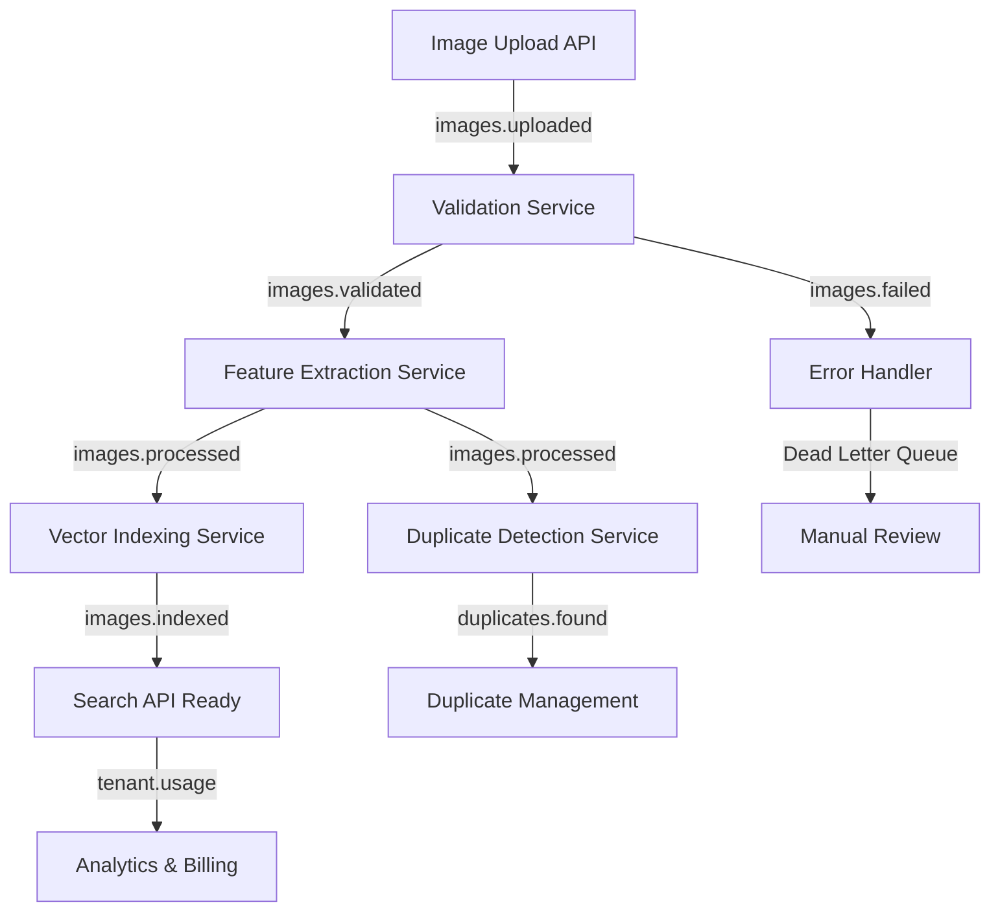

# DeepLens - Image Similarity Search Engine

## Project Overview

**Vision**: Build a comprehensive image similarity search engine that can find visually similar images across multiple storage locations (network shares, cloud storage, blob storage) and help optimize storage by identifying duplicates.

**Core Functionality**:

- Accept an image input (API/user upload)
- Find similar/duplicate images from indexed storage locations
- Return ranked similarity results with image IDs/locations
- Enable storage optimization through duplicate detection and management

## Architecture Overview

### Design Principles

- **Unified .NET Backend**: .NET Core for all backend services (APIs & orchestration) with Python for specialized AI/ML tasks
- **Platform Agnostic**: Deploy on any cloud provider, on-premises, or hybrid environments
- **Horizontal Scaling**: Add more nodes to handle increased load
- **Load Balancing**: Distribute workload across multiple instances
- **Fault Tolerance**: System continues operating despite component failures
- **Service Decoupling**: Independent services communicating via APIs and message queues
- **Observable by Design**: Built-in telemetry, metrics, logging, and tracing
- **Cloud-Native**: Microservices architecture with container orchestration

### Event-Driven Architecture with Kafka

```
                           ┌─────────────────────────────────────────┐
                           │         Load Balancer + WAF             │
                           │    (HAProxy/NGINX/Cloud LB/Traefik)     │
                           └──────────────────┬──────────────────────┘
                                              │
                           ┌─────────────────────────────────────────┐
                           │         API Gateway (.NET Core)         │
                           │  • Authentication & Authorization       │
                           │  • Rate Limiting & Circuit Breakers     │
                           │  • Request Routing & Load Balancing     │
                           │  • Telemetry Collection & Correlation   │
                           └──────────────────┬──────────────────────┘
                                              │
        ┌─────────────────────────────────────┼─────────────────────────────────────┐
        │                                     │                                     │
        ▼                                     ▼                                     ▼
┌──────────────────┐                ┌─────────────────┐                ┌─────────────────┐
│   .NET Core APIs │                │    .NET Core    │                │    Python AI/ML │
│                  │                │   Orchestration │                │    Services     │
│ • Search API     │◄──────────────►│                 │◄──────────────►│                 │
│ • Admin API      │                │ • Workflow Mgmt │                │ • Feature       │
│ • Upload API     │                │ • Event Routing │                │   Extraction    │
│ • Health API     │                │ • Task Queue    │                │ • Model         │
│ • Metadata API   │                │ • Job Scheduler │                │   Inference     │
│                  │                │ • File Watcher  │                │ • Training      │
└──────────────────┘                │ • Storage Mgmt  │                │ • Vector Ops    │
        │                           └─────────────────┘                └─────────────────┘
        │                                     │                                     │
        └─────────────────────────────────────┼─────────────────────────────────────┘
                                              │
                           ┌─────────────────────────────────────────┐
                           │        Apache Kafka Event Bus           │
                           │                                         │
                           │  📋 Topics:                             │
                           │  • images.uploaded    → Processing      │
                           │  • images.validated   → Feature Extract │
                           │  • images.processed   → Vector Index    │
                           │  • images.indexed     → Search Ready    │
                           │  • duplicates.found   → Duplicate Mgmt  │
                           │  • tenant.usage       → Analytics       │
                           │  • images.failed      → Error Handling  │
                           └─────────────────────────────────────────┘
                                              │
                           ┌─────────────────────────────────────────┐
                           │         Data & Storage Layer            │
                           │                                         │
                           │  ┌─────────────┐   ┌─────────────────┐  │
                           │  │ Vector DBs  │   │ Metadata Store  │  │
                           │  │ • Qdrant    │   │ • PostgreSQL    │  │
                           │  │ • Weaviate  │   │ • MongoDB       │  │
                           │  │ • Pinecone  │   │ • Redis Cache   │  │
                           │  └─────────────┘   └─────────────────┘  │
                           │                                         │
                           │  ┌─────────────────────────────────┐    │
                           │  │        Object Storage           │    │
                           │  │ • AWS S3 / Azure Blob / GCS     │    │
                           │  │ • MinIO (on-premises)           │    │
                           │  │ • Local/Network File Systems    │    │
                           │  └─────────────────────────────────┘    │
                           └─────────────────────────────────────────┘
                                              │
                           ┌─────────────────────────────────────────┐
                           │      Observability & Telemetry          │
                           │                                         │
                           │  ┌─────────────┐   ┌─────────────────┐  │
                           │  │   Metrics   │   │     Logging     │  │
                           │  │ • Prometheus│   │ • ELK/EFK Stack │  │
                           │  │ • Grafana   │   │ • Fluentd       │  │
                           │  │ • Custom    │   │ • Loki          │  │
                           │  └─────────────┘   └─────────────────┘  │
                           │                                         │
                           │  ┌─────────────────────────────────┐    │
                           │  │        Tracing & APM            │    │
                           │  │ • Jaeger / Zipkin               │    │
                           │  │ • OpenTelemetry                 │    │
                           │  │ • Application Insights          │    │
                           │  └─────────────────────────────────┘    │
                           └─────────────────────────────────────────┘
```

## 🔄 Event-Driven Architecture with Apache Kafka

### Kafka-Powered Processing Pipeline

DeepLens uses **Apache Kafka 7.5.0** as the backbone for asynchronous, event-driven image processing. This architecture ensures scalability, fault tolerance, and loose coupling between services.



### Core Kafka Topics

```yaml
# Image Processing Pipeline Topics
Topics:
  images.uploaded: # New image uploaded and stored
    partitions: 3
    retention: 7d
    consumers: ["validation-service", "analytics-service"]

  images.validated: # Image passed validation checks
    partitions: 3
    retention: 7d
    consumers: ["feature-extraction-service"]

  images.processed: # Features extracted, vectors generated
    partitions: 3
    retention: 7d
    consumers: ["vector-indexing-service", "duplicate-detection-service"]

  images.indexed: # Image indexed in vector database
    partitions: 3
    retention: 7d
    consumers: ["search-service", "analytics-service"]

  # Specialized Processing Topics
  duplicates.found: # Potential duplicate images detected
    partitions: 1
    retention: 30d
    consumers: ["duplicate-management-service"]

  tenant.usage: # Usage analytics and metrics per tenant
    partitions: 6 # Partition by tenant_id for parallel processing
    retention: 90d
    consumers: ["analytics-service", "billing-service"]

  images.failed: # Processing failures and errors
    partitions: 1
    retention: 30d
    consumers: ["error-handler-service", "monitoring-service"]
```

### Event-Driven Benefits

✅ **Scalability**: Process thousands of images concurrently across multiple workers
✅ **Fault Tolerance**: Failed messages retry automatically, no data loss
✅ **Loose Coupling**: Services are independent, can be developed and scaled separately
✅ **Real-time Processing**: Event-driven architecture enables real-time image processing
✅ **Multi-Tenant**: Partition topics by tenant for isolated processing
✅ **Observability**: Full audit trail of every image processing step

### Simplified Service Architecture

```
┌─────────────────────────────────────────────────────────────────┐
│                     DeepLens Core Service (.NET)                │
├─────────────────────────────────────────────────────────────────┤
│                                                                 │
│  ┌─────────────────┐    ┌─────────────────┐    ┌─────────────┐  │
│  │   API Layer     │    │  Orchestration  │    │ Background  │  │
│  │                 │    │     Layer       │    │  Services   │  │
│  │ • Search API    │    │ • Workflow Mgmt │    │ • Indexer   │  │
│  │ • Upload API    │    │ • Job Queue     │    │ • Scanner   │  │
│  │ • Admin API     │    │ • Event Router  │    │ • Processor │  │
│  │ • Health API    │    │ • Storage Mgmt  │    │ • Cleanup   │  │
│  │ • SignalR Hubs  │    │ • Task Scheduler│    │ • Monitor   │  │
│  └─────────────────┘    └─────────────────┘    └─────────────┘  │
│                                                                 │
├─────────────────────────────────────────────────────────────────┤
│  ┌─────────────────┐    ┌─────────────────┐    ┌─────────────┐  │
│  │   Data Layer    │    │  Cross-Cutting  │    │Integration  │  │
│  │                 │    │    Services     │    │   Layer     │  │
│  │ • EF Core       │    │ • Logging       │    │ • Cloud SDK │  │
│  │ • Caching       │    │ • Monitoring    │    │ • Message   │  │
│  │ • Vector Store  │    │ • Config Mgmt   │    │   Queue     │  │
│  │ • File Storage  │    │ • Health Checks │    │ • AI/ML     │  │
│  │ • Metadata DB   │    │ • Metrics       │    │   Client    │  │
│  └─────────────────┘    └─────────────────┘    └─────────────┘  │
└─────────────────────────────────────────────────────────────────┘
                                   │
                                   ▼
                         ┌─────────────────┐
                         │    Python AI/ML │
                         │    Services     │
                         │                 │
                         │ • Feature       │
                         │   Extraction    │
                         │ • Model         │
                         │   Inference     │
                         │ • Vector Ops    │
                         └─────────────────┘
```

## Technical Stack Recommendations

### Unified .NET + Python Technology Stack

#### Service Layer Distribution

**🔵 DeepLens Core Service (.NET) - Unified APIs & Orchestration**

- **API Gateway**: ASP.NET Core with YARP (Yet Another Reverse Proxy)
- **Core APIs**: Minimal APIs for search, upload, admin, health endpoints
- **Authentication**: Multiple OAuth 2.0/OpenID Connect providers with JWT tokens
  - **Self-Hosted**: Duende IdentityServer for complete control
  - **Cloud Providers**: Azure AD, AWS Cognito, Google Identity
  - **Social Login**: GitHub, Microsoft, Google OAuth flows
  - **API Security**: JWT Bearer tokens with scope-based authorization
- **Data Access**: Entity Framework Core with PostgreSQL/SQL Server
- **Caching**: StackExchange.Redis for distributed caching and session state
- **HTTP Client**: HttpClientFactory with Polly for resilience
- **Image Processing**: ImageSharp for basic operations, OpenCvSharp for advanced
- **ONNX Integration**: Microsoft.ML.OnnxRuntime for model inference

**� Additional Unified Service Features**

- **Framework**: ASP.NET Core with Minimal APIs and Worker Services
- **Workflow Engine**: Elsa Workflows or Hangfire for job orchestration
- **File Processing**: ImageSharp for image manipulation, custom upload handlers
- **Event Streaming**: MassTransit with RabbitMQ/Azure Service Bus integration
- **Task Scheduling**: Hangfire, Quartz.NET, or NCrontab for background jobs
- **Storage Connectors**: Azure SDK, AWS SDK for .NET, Google Cloud SDK
- **Real-time Communication**: SignalR for WebSocket connections and real-time updates
- **Background Services**: IHostedService and BackgroundService for long-running tasks
- **Process Management**: Built-in Kestrel server with IIS/Docker deployment

**🔴 Python Services (AI/ML Specialized)**

- **Framework**: FastAPI for APIs, Ray for distributed computing
- **Computer Vision**: OpenCV, PIL/Pillow, scikit-image
- **Deep Learning**: PyTorch, TensorFlow, Hugging Face Transformers
- **Vector Operations**: NumPy, SciPy, Faiss for similarity search
- **Model Serving**: TorchServe, TensorFlow Serving, Triton Inference Server
- **Feature Extraction**: CLIP, ResNet, EfficientNet, custom CNN models
- **Vector Databases**: Qdrant Python client, Weaviate client
- **Async Processing**: Celery with Redis/RabbitMQ, asyncio

#### Cross-Service Communication

**🔀 Simplified Communication Architecture**

- **Internal**: Direct method calls within .NET service (no network overhead)
- **External Python AI/ML**: HTTP/REST APIs with OpenAPI/Swagger documentation
- **Async Processing**: MassTransit with RabbitMQ/Azure Service Bus for background tasks
- **Real-time Updates**: SignalR for WebSocket communications
- **Optional Load Balancing**: NGINX/HAProxy for multi-instance deployments
- **Service Discovery**: Simple DNS-based discovery or Kubernetes services

**📊 Observability & Telemetry (Built-in)**

- **Distributed Tracing**: OpenTelemetry with Jaeger/Zipkin backend
- **Metrics Collection**: OpenTelemetry metrics with Prometheus export
- **Structured Logging**: Serilog (.NET) → OpenTelemetry → OTLP/Elasticsearch
- **Log Correlation**: Automatic trace-log correlation via OpenTelemetry
- **APM**: Application Insights, New Relic, or Datadog via OTLP
- **Health Checks**: Built-in health endpoints with OpenTelemetry metrics
- **Unified Export**: Single OTLP endpoint for all telemetry data

## Authentication & Authorization Strategy

### Self-Hosted Authentication with Duende IdentityServer

DeepLens uses Duende IdentityServer as the primary authentication and user management service, providing complete control over user identity, security policies, and integration patterns.

#### Duende IdentityServer Implementation

📋 **Implementation Details:** See [Authentication & Security Examples](CODE_EXAMPLES.md#-authentication--security-examples) for complete Duende IdentityServer integration code.

#### Authentication Options

| **Provider**              | **Use Case**       | **Implementation**        | **Benefits**                   |
| ------------------------- | ------------------ | ------------------------- | ------------------------------ |
| **Azure AD**              | Enterprise SSO     | Built-in .NET support     | Seamless Microsoft integration |
| **Google Identity**       | Consumer apps      | Google.Apis.Auth library  | Wide user adoption             |
| **GitHub OAuth**          | Developer tools    | Custom implementation     | Developer-friendly             |
| **AWS Cognito**           | AWS deployments    | AWSSDK.Extensions.NETCore | Native AWS integration         |
| **Duende IdentityServer** | Self-hosted        | Full control              | Complete customization         |
| **API Keys**              | Service-to-service | Custom middleware         | Simple B2B integration         |

#### Security Features

📋 **Implementation Details:** See [JWT Token Validation & Custom Authorization](CODE_EXAMPLES.md#jwt-token-validation--custom-authorization) for complete security implementation.

#### Role-Based Access Control (RBAC)

📋 **Implementation Details:** See [Role-Based Access Control (RBAC)](CODE_EXAMPLES.md#role-based-access-control-rbac) for complete role and scope definitions.

#### Duende IdentityServer Deployment

📋 **Implementation Details:** See [Docker Compose Configuration](CODE_EXAMPLES.md#docker-compose-configuration) for complete Duende IdentityServer deployment configuration and API authentication examples.

#### Authentication Flow with Duende IdentityServer


#### User Management Features

📋 **Implementation Details:** See [Custom User Store & Profile Service](CODE_EXAMPLES.md#custom-user-store--profile-service) for complete user management implementation.

## Comprehensive Instrumentation & Telemetry Strategy

### Observable Architecture Design

```
┌─────────────────────────────────────────────────────────────────────────────┐
│                          TELEMETRY COLLECTION LAYER                         │
├─────────────────────────────────────────────────────────────────────────────┤
│                                                                             │
│  ┌─────────────┐    ┌─────────────┐    ┌──────────────┐    ┌─────────────┐  │
│  │ .NET Core   │    │ Python AI   │    │Infrastructure│    │ External    │  │
│  │ Service     │    │ Services    │    │ Components   │    │ Services    │  │
│  │ • Serilog→  │    │ • structlog │    │ • Prometheus │    │ • Load Bal. │  │
│  │   OpenTel   │    │ • OpenTel   │    │ • OpenTel    │    │ • Node Exp  │  │
│  │ • OTel      │    │ • FastAPI   │    │ • OTLP       │    │ • cAdvisor  │  │
│  └─────────────┘    └─────────────┘    └──────────────┘    └─────────────┘  │
│           │                 │                 │                 │           │
└───────────┼─────────────────┼─────────────────┼─────────────────┼───────────┘
            │                 │                 │                 │
            ▼                 ▼                 ▼                 ▼
┌─────────────────────────────────────────────────────────────────────────────┐
│                         TELEMETRY AGGREGATION                               │
├─────────────────────────────────────────────────────────────────────────────┤
│                                                                             │
│ ┌─────────────────┐  ┌─────────────────┐  ┌─────────────────────────────┐   │
│ │    METRICS      │  │    LOGGING      │  │        TRACING              │   │
│ │                 │  │                 │  │                             │   │
│ │ • Prometheus    │  │ • Elasticsearch │  │ • Jaeger                    │   │
│ │ • Victoria      │  │ • Loki          │  │ • Zipkin                    │   │
│ │   Metrics       │  │ • Fluentd       │  │ • OpenTelemetry Collector   │   │
│ │ • Custom        │  │ • Vector        │  │ • Tempo                     │   │
│ │   Dashboards    │  │ • Logstash      │  │ • AWS X-Ray                 │   │
│ └─────────────────┘  └─────────────────┘  └─────────────────────────────┘   │
└─────────────────────────────────────────────────────────────────────────────┘
            │                 │                               │
            ▼                 ▼                               ▼
┌─────────────────────────────────────────────────────────────────────────────┐
│                      VISUALIZATION & ALERTING                               │
├─────────────────────────────────────────────────────────────────────────────┤
│                                                                             │
│ ┌─────────────────┐  ┌─────────────────┐  ┌─────────────────────────────┐   │
│ │    DASHBOARDS   │  │     ALERTS      │  │         ANALYSIS            │   │
│ │                 │  │                 │  │                             │   │
│ │ • Grafana       │  │ • AlertManager  │  │ • Kibana                    │   │
│ │ • Custom UI     │  │ • PagerDuty     │  │ • Jaeger UI                 │   │
│ │ • DataDog       │  │ • Slack/Teams   │  │ • Custom Analytics          │   │
│ │ • New Relic     │  │ • Email/SMS     │  │ • Business Intelligence     │   │
│ └─────────────────┘  └─────────────────┘  └─────────────────────────────┘   │
└─────────────────────────────────────────────────────────────────────────────┘
```

## 🏗️ System Architecture Diagrams

### Updated DeepLens Architecture with OpenTelemetry

```
                           ┌─────────────────────────────────────────┐
                           │         Load Balancer + WAF             │
                           │    (HAProxy/NGINX/Cloud LB/Traefik)     │
                           └──────────────────┬──────────────────────┘
                                              │
                           ┌─────────────────────────────────────────┐
                           │         API Gateway (.NET Core)         │
                           │  • Authentication & Authorization       │
                           │  • Rate Limiting & Circuit Breakers     │
                           │  • Request Routing & Load Balancing     │
                           │  • OpenTelemetry Integration           │
                           └──────────────────┬──────────────────────┘
                                              │
        ┌─────────────────────────────────────┼─────────────────────────────────────┐
        │                                     │                                     │
        ▼                                     ▼                                     ▼
┌──────────────────┐                ┌─────────────────┐                ┌─────────────────┐
│   .NET Core APIs │                │    .NET Core    │                │    Python AI/ML │
│                  │                │   Orchestration │                │    Services     │
│ • Search API     │◄──────────────►│                 │◄──────────────►│                 │
│ • Admin API      │                │ • Workflow Mgmt │                │ • Feature       │
│ • Upload API     │                │ • Event Routing │                │   Extraction    │
│ • Health API     │                │ • Task Queue    │                │ • Model         │
│ • Metadata API   │                │ • Job Scheduler │                │   Inference     │
│                  │                │ • File Watcher  │                │ • Training      │
└──────────────────┘                │ • Storage Mgmt  │                │ • Vector Ops    │
        │                           └─────────────────┘                └─────────────────┘
        │                                     │                                     │
        └─────────────────────────────────────┼─────────────────────────────────────┘
                                              │
                                   ┌─────────────────┐
                                   │   Message Bus   │
                                   │                 │
                                   │ • RabbitMQ      │
                                   │ • Apache Kafka  │
                                   │ • Azure Service │
                                   │   Bus/AWS SQS   │
                                   └─────────────────┘
```

### Simplified Service Architecture

```
┌─────────────────────────────────────────────────────────────────┐
│                     DeepLens Core Service (.NET)                │
├─────────────────────────────────────────────────────────────────┤
│                                                                 │
│  ┌─────────────────┐    ┌─────────────────┐    ┌─────────────┐  │
│  │   API Layer     │    │  Orchestration  │    │ Background  │  │
│  │                 │    │     Layer       │    │  Services   │  │
│  │ • Search API    │    │ • Workflow Mgmt │    │ • Indexer   │  │
│  │ • Upload API    │    │ • Job Queue     │    │ • Scanner   │  │
│  │ • Admin API     │    │ • Event Router  │    │ • Processor │  │
│  │ • Health API    │    │ • Storage Mgmt  │    │ • Cleanup   │  │
│  │ • SignalR Hubs  │    │ • Task Scheduler│    │ • Monitor   │  │
│  └─────────────────┘    └─────────────────┘    └─────────────┘  │
│                                                                 │
├─────────────────────────────────────────────────────────────────┤
│  ┌─────────────────┐    ┌─────────────────┐    ┌─────────────┐  │
│  │   Data Layer    │    │  Cross-Cutting  │    │Integration  │  │
│  │                 │    │    Services     │    │   Layer     │  │
│  │ • EF Core       │    │ • Logging       │    │ • Cloud SDK │  │
│  │ • Caching       │    │ • Monitoring    │    │ • Message   │  │
│  │ • Vector Store  │    │ • Config Mgmt   │    │   Queue     │  │
│  │ • File Storage  │    │ • Health Checks │    │ • AI/ML     │  │
│  │ • Metadata DB   │    │ • Metrics       │    │   Client    │  │
│  └─────────────────┘    └─────────────────┘    └─────────────┘  │
└─────────────────────────────────────────────────────────────────┘
                                   │
                                   ▼
                         ┌─────────────────┐
                         │    Python AI/ML │
                         │    Services     │
                         │                 │
                         │ • Feature       │
                         │   Extraction    │
                         │ • Model         │
                         │   Inference     │
                         │ • Vector Ops    │
                         └─────────────────┘
```

### Observability & Monitoring Architecture

```
┌─────────────────────────────────────────────────────────────────────────────┐
│                        DEEPLENS OBSERVABILITY STACK                         │
├─────────────────────────────────────────────────────────────────────────────┤
│                                                                             │
│  ┌─────────────┐    ┌─────────────┐    ┌──────────────┐    ┌─────────────┐  │
│  │ .NET Core   │    │ Python AI   │    │Infrastructure│    │ Container   │  │
│  │ Services    │    │ Services    │    │ Components   │    │ Metrics     │  │
│  │             │    │             │    │              │    │             │  │
│  │ • Serilog   │    │ • structlog │    │ • Prometheus │    │ • cAdvisor  │  │
│  │ • OpenTel   │    │ • OpenTel   │    │ • Node Exp   │    │ • Redis Exp │  │
│  │ • Custom    │    │ • FastAPI   │    │ • DB Export  │    │ • PG Export │  │
│  │   Metrics   │    │ • Uvicorn   │    │ • OTLP       │    │ • System    │  │
│  └─────────────┘    └─────────────┘    └──────────────┘    └─────────────┘  │
│           │                 │                 │                 │           │
└───────────┼─────────────────┼─────────────────┼─────────────────┼───────────┘
            │                 │                 │                 │
            └─────────────────┐│┌────────────────┘                 │
                              │││                                  │
            ┌─────────────────┘││└──────────────────────────────────┘
            │                 ││
            ▼                 ▼▼
┌─────────────────────────────────────────────────────────────────────────────┐
│                      OPENTELEMETRY COLLECTOR                                │
│  • Receives telemetry from all sources (OTLP gRPC/HTTP)                    │
│  • Processes, filters, and enriches data                                   │
│  • Routes to appropriate storage backends                                  │
│  • Provides unified telemetry pipeline                                     │
└─────────────────────────────┬───────────────────────────────────────────────┘
                              │
        ┌─────────────────────┼─────────────────────┐
        │                     │                     │
        ▼                     ▼                     ▼
┌──────────────────┐ ┌─────────────────┐ ┌─────────────────┐
│   Prometheus     │ │     Jaeger      │ │      Loki       │
│   (Metrics)      │ │   (Tracing)     │ │   (Logging)     │
│                  │ │                 │ │                 │
│ • 30-day retain  │ │ • Distributed   │ │ • Log aggreg.   │
│ • Alert rules    │ │   tracing       │ │ • Structured    │
│ • Multi-targets  │ │ • OTLP support  │ │   logs          │
│ • Exporters      │ │ • Span analysis │ │ • Query logs    │
└──────────────────┘ └─────────────────┘ └─────────────────┘
        │                     │                     │
        └─────────────────────┼─────────────────────┘
                              │
                              ▼
┌─────────────────────────────────────────────────────────────────────────────┐
│                         VISUALIZATION LAYER                                 │
├─────────────────────────────────────────────────────────────────────────────┤
│  ┌─────────────────┐  ┌─────────────────┐  ┌─────────────────────────────┐  │
│  │    Grafana      │  │  AlertManager   │  │         Portainer           │  │
│  │ (Dashboards)    │  │   (Alerts)      │  │      (Management)           │  │
│  │                 │  │                 │  │                             │  │
│  │ • Multi-source  │  │ • Route alerts  │  │ • Container mgmt            │  │
│  │   dashboards    │  │ • Slack/Email   │  │ • Resource monitoring       │  │
│  │ • Real-time     │  │ • Escalation    │  │ • Docker management         │  │
│  │   monitoring    │  │ • Grouping      │  │ • Volume management         │  │
│  └─────────────────┘  └─────────────────┘  └─────────────────────────────┘  │
└─────────────────────────────────────────────────────────────────────────────┘
```

### Telemetry Data Flow

```
┌─ APPLICATION LAYER ─────────────────────────────────────────────────────────┐
│                                                                             │
│  .NET Core APIs          Python AI Services         Infrastructure         │
│  ┌─────────────┐         ┌─────────────┐            ┌─────────────┐         │
│  │ • HTTP APIs │ OTLP    │ • FastAPI   │ OTLP       │ • PostgreSQL│ /metrics│
│  │ • Serilog   │ ────┐   │ • structlog │ ────┐      │ • Redis     │ ────┐   │
│  │ • Custom    │     │   │ • OpenTel   │     │      │ • Containers│     │   │
│  │   Metrics   │     │   │ • Uvicorn   │     │      │ • System    │     │   │
│  └─────────────┘     │   └─────────────┘     │      └─────────────┘     │   │
│                      │                       │                          │   │
└──────────────────────┼───────────────────────┼──────────────────────────┼───┘
                       │                       │                          │
                       ▼                       ▼                          ▼
┌─ COLLECTION LAYER ──────────────────────────────────────────────────────────┐
│                                                                             │
│               OpenTelemetry Collector (Port 4317/4318)                     │
│  ┌─────────────────────────────────────────────────────────────────────┐   │
│  │                      RECEIVERS                                      │   │
│  │  • OTLP (gRPC/HTTP)  • Prometheus  • Filelog  • Jaeger             │   │
│  └─────────────────────────────────────────────────────────────────────┘   │
│                                    │                                       │
│  ┌─────────────────────────────────────────────────────────────────────┐   │
│  │                     PROCESSORS                                      │   │
│  │  • Batch  • Filter  • Transform  • Enrich  • Sample               │   │
│  └─────────────────────────────────────────────────────────────────────┘   │
│                                    │                                       │
│  ┌─────────────────────────────────────────────────────────────────────┐   │
│  │                      EXPORTERS                                      │   │
│  │  • Prometheus  • Jaeger  • Loki  • OTLP  • Logging                 │   │
│  └─────────────────────────────────────────────────────────────────────┘   │
└─────────────────────────────────────────────────────────────────────────────┘
                       │               │               │
                       ▼               ▼               ▼
┌─ STORAGE LAYER ─────────────────────────────────────────────────────────────┐
│                                                                             │
│  ┌─────────────┐    ┌─────────────┐    ┌─────────────┐                     │
│  │ Prometheus  │    │   Jaeger    │    │    Loki     │                     │
│  │             │    │             │    │             │                     │
│  │ • Metrics   │    │ • Traces    │    │ • Logs      │                     │
│  │ • 30d retain│    │ • Spans     │    │ • Structured│                     │
│  │ • PromQL    │    │ • Dependencies    │ • LogQL     │                     │
│  │ • Alerts    │    │ • Performance│    │ • Retention │                     │
│  └─────────────┘    └─────────────┘    └─────────────┘                     │
└─────────────────────────────────────────────────────────────────────────────┘
                                    │
                                    ▼
┌─ VISUALIZATION LAYER ──────────────────────────────────────────────────────┐
│                                                                             │
│  ┌─────────────────────────────────────────────────────────────────────┐   │
│  │                           Grafana                                   │   │
│  │  • Unified dashboards from all data sources                        │   │
│  │  • Real-time monitoring and alerting                               │   │
│  │  • Custom business metrics visualization                           │   │
│  │  • SLA/SLO tracking and reporting                                  │   │
│  │  └─────────────────────────────────────────────────────────────────────┘   │
└─────────────────────────────────────────────────────────────────────────────┘
```

### Service-Specific Telemetry Implementation

#### .NET Core Services Instrumentation

```csharp
// Program.cs - Comprehensive telemetry setup
var builder = WebApplication.CreateBuilder(args);

// OpenTelemetry configuration
builder.Services.AddOpenTelemetry()
    .WithTracing(tracing => tracing
        .AddAspNetCoreInstrumentation()
        .AddHttpClientInstrumentation()
        .AddEntityFrameworkCoreInstrumentation()
        .AddRedisInstrumentation()
        .AddJaegerExporter())
    .WithMetrics(metrics => metrics
        .AddAspNetCoreInstrumentation()
        .AddHttpClientInstrumentation()
        .AddRuntimeInstrumentation()
        .AddPrometheusExporter());

// Modern observability: Serilog + OpenTelemetry integration
builder.Host.UseSerilog((context, configuration) =>
    configuration
        .ReadFrom.Configuration(context.Configuration)
        .Enrich.FromLogContext()
        .Enrich.WithCorrelationId()
        .Enrich.WithEnvironmentName()
        .WriteTo.Console(new JsonFormatter())
        .WriteTo.OpenTelemetry(options =>  // ← Serilog sends to OpenTelemetry
        {
            options.Endpoint = "http://otel-collector:4317";
            options.Protocol = OtlpProtocol.Grpc;
            options.ResourceAttributes.Add("service.name", "deeplens-core");
        }));

// Health checks
builder.Services.AddHealthChecks()
    .AddDbContext<DeepLensDbContext>()
    .AddRedis(builder.Configuration.GetConnectionString("Redis"))
    .AddRabbitMQ(builder.Configuration.GetConnectionString("RabbitMQ"))
    .AddCheck<FeatureExtractionHealthCheck>("feature-extraction")
    .AddCheck<VectorDbHealthCheck>("vector-database");

// Custom metrics
builder.Services.AddSingleton<IMetrics, CustomMetrics>();

var app = builder.Build();

// Correlation ID middleware
app.UseCorrelationId();

// Request/response logging
app.UseSerilogRequestLogging(options =>
{
    options.EnrichDiagnosticContext = (diagnosticContext, httpContext) =>
    {
        diagnosticContext.Set("UserId", httpContext.User.FindFirst("sub")?.Value);
        diagnosticContext.Set("UserAgent", httpContext.Request.Headers["User-Agent"]);
        diagnosticContext.Set("RequestId", httpContext.TraceIdentifier);
    };
});

// Health check endpoints
app.MapHealthChecks("/health", new HealthCheckOptions
{
    ResponseWriter = UIResponseWriter.WriteHealthCheckUIResponse
});
```

#### Node.js Service Instrumentation

```typescript
// app.ts - NestJS with comprehensive telemetry
import { NestFactory } from "@nestjs/core";
import { Logger } from "nestjs-pino";
import { trace, metrics } from "@opentelemetry/api";
import { NodeSDK } from "@opentelemetry/auto-instrumentations-node";
import { PrometheusExporter } from "@opentelemetry/exporter-prometheus";
import { JaegerExporter } from "@opentelemetry/exporter-jaeger";

// Initialize OpenTelemetry
const sdk = new NodeSDK({
  traceExporter: new JaegerExporter({
    endpoint: process.env.JAEGER_ENDPOINT || "http://jaeger:14268/api/traces",
  }),
  metricExporter: new PrometheusExporter({
    port: 9090,
  }),
  instrumentations: [
    getNodeAutoInstrumentations({
      "@opentelemetry/instrumentation-fs": { enabled: false },
    }),
  ],
});

sdk.start();

async function bootstrap() {
  const app = await NestFactory.create(AppModule, {
    logger: false, // Use Pino instead
  });

  // Structured logging
  app.useLogger(app.get(Logger));

  // Correlation ID middleware
  app.use((req: Request, res: Response, next: NextFunction) => {
    const correlationId = req.headers["x-correlation-id"] || uuidv4();
    req.correlationId = correlationId;
    res.setHeader("x-correlation-id", correlationId);
    next();
  });

  // Custom metrics middleware
  app.use(metricsMiddleware);

  // Health checks
  app.use("/health", healthCheckRouter);

  await app.listen(3000);
}

// Custom metrics collection
class CustomMetrics {
  private readonly httpRequestsTotal = metrics.createCounter(
    "http_requests_total",
    {
      description: "Total number of HTTP requests",
    }
  );

  private readonly imageProcessingDuration = metrics.createHistogram(
    "image_processing_duration_seconds",
    {
      description: "Duration of image processing operations",
    }
  );

  recordHttpRequest(method: string, route: string, statusCode: number) {
    this.httpRequestsTotal.add(1, {
      method,
      route,
      status_code: statusCode.toString(),
    });
  }

  recordImageProcessing(duration: number, operation: string) {
    this.imageProcessingDuration.record(duration, { operation });
  }
}
```

#### Python AI Service Instrumentation

```python
# main.py - FastAPI with comprehensive telemetry
from fastapi import FastAPI, Request
from opentelemetry import trace, metrics
from opentelemetry.instrumentation.fastapi import FastAPIInstrumentator
from opentelemetry.instrumentation.requests import RequestsInstrumentator
from opentelemetry.exporter.jaeger.thrift import JaegerExporter
from opentelemetry.exporter.prometheus import PrometheusMetricExporter
from opentelemetry.sdk.trace import TracerProvider
from opentelemetry.sdk.metrics import MeterProvider
import structlog
import uvicorn
import time
import uuid

# Configure structured logging
structlog.configure(
    processors=[
        structlog.stdlib.filter_by_level,
        structlog.stdlib.add_logger_name,
        structlog.stdlib.add_log_level,
        structlog.stdlib.PositionalArgumentsFormatter(),
        structlog.processors.TimeStamper(fmt="iso"),
        structlog.processors.StackInfoRenderer(),
        structlog.processors.format_exc_info,
        structlog.processors.UnicodeDecoder(),
        structlog.processors.JSONRenderer()
    ],
    context_class=dict,
    logger_factory=structlog.stdlib.LoggerFactory(),
    wrapper_class=structlog.stdlib.BoundLogger,
    cache_logger_on_first_use=True,
)

logger = structlog.get_logger()

# OpenTelemetry setup
trace.set_tracer_provider(TracerProvider())
tracer = trace.get_tracer(__name__)

jaeger_exporter = JaegerExporter(
    agent_host_name="jaeger",
    agent_port=6831,
)

# Metrics setup
metrics.set_meter_provider(MeterProvider())
meter = metrics.get_meter(__name__)

# Custom metrics
feature_extraction_counter = meter.create_counter(
    "feature_extraction_total",
    description="Total number of feature extractions"
)

model_inference_histogram = meter.create_histogram(
    "model_inference_duration_seconds",
    description="Duration of model inference operations"
)

app = FastAPI(title="DeepLens AI Service")

# Instrument FastAPI
FastAPIInstrumentator.instrument_app(app)
RequestsInstrumentator().instrument()

@app.middleware("http")
async def correlation_middleware(request: Request, call_next):
    correlation_id = request.headers.get("x-correlation-id", str(uuid.uuid4()))

    # Add to structured log context
    structlog.contextvars.clear_contextvars()
    structlog.contextvars.bind_contextvars(
        correlation_id=correlation_id,
        request_path=request.url.path,
        request_method=request.method
    )

    start_time = time.time()
    response = await call_next(request)
    duration = time.time() - start_time

    # Log request completion
    logger.info(
        "Request completed",
        status_code=response.status_code,
        duration=duration
    )

    response.headers["x-correlation-id"] = correlation_id
    return response

@app.post("/extract-features")
async def extract_features(image_data: bytes):
    with tracer.start_as_current_span("extract_features") as span:
        start_time = time.time()

        try:
            # Feature extraction logic here
            features = await perform_feature_extraction(image_data)

            # Record metrics
            feature_extraction_counter.add(1, {"status": "success"})
            model_inference_histogram.record(
                time.time() - start_time,
                {"model": "resnet50", "status": "success"}
            )

            span.set_attribute("features.count", len(features))
            span.set_attribute("image.size", len(image_data))

            logger.info("Feature extraction completed", features_count=len(features))

            return {"features": features}

        except Exception as e:
            feature_extraction_counter.add(1, {"status": "error"})
            span.record_exception(e)
            logger.error("Feature extraction failed", error=str(e))
            raise

@app.get("/health")
async def health_check():
    return {
        "status": "healthy",
        "service": "ai-service",
        "version": "1.0.0",
        "timestamp": time.time()
    }
```

### Monitoring & Alerting Configuration

#### Prometheus Configuration

📋 **Implementation Details:** See [Prometheus Configuration](CODE_EXAMPLES.md#prometheus-configuration) for complete monitoring setup with 30-day retention and multi-service scraping.

- job_name: "redis-exporter"
  static_configs:

  - targets: ["redis-exporter:9121"]
    scrape_interval: 15s

- job_name: "influxdb"
  static_configs:
  - targets: ["influxdb:8086"]
    metrics_path: "/metrics"
    scrape_interval: 30s

# Kubernetes Metrics (when deployed)

- job_name: "kubernetes-apiservers"
  kubernetes_sd_configs:
  - role: endpoints
    scheme: https
    tls_config:
    ca_file: /var/run/secrets/kubernetes.io/serviceaccount/ca.crt
    bearer_token_file: /var/run/secrets/kubernetes.io/serviceaccount/token

# Remote write to InfluxDB for long-term storage

remote_write:

- url: "http://influxdb:8086/api/v1/prom/write?db=prometheus_metrics"
  queue_config:
  max_samples_per_send: 1000
  max_shards: 200
  capacity: 2500

alerting:
alertmanagers: - static_configs: - targets: - alertmanager:9093

````

#### Alert Rules

📋 **Implementation Details:** See [Alert Rules Configuration](CODE_EXAMPLES.md#alert-rules-configuration) for complete Prometheus alerting rules covering error rates, response times, and system health.

#### Technical Capabilities Comparison

| Capability               | .NET Core                               | Node.js/TypeScript               | Python                               | Advantage                                                    |
| ------------------------ | --------------------------------------- | -------------------------------- | ------------------------------------ | ------------------------------------------------------------ |
| **API Performance**      | ✅ Excellent (AOT, minimal APIs)        | ✅ Very Good (V8 engine)         | ⚠️ Good (async frameworks)           | **.NET Core** - Superior throughput and memory efficiency    |
| **Image Processing**     | ✅ ImageSharp, OpenCvSharp              | ✅ Sharp, Jimp, Canvas           | ✅ PIL, OpenCV, scikit-image         | **Equal** - All have excellent libraries                     |
| **ML Model Integration** | ✅ ML.NET, ONNX Runtime, TensorFlow.NET | ✅ TensorFlow.js, ONNX.js        | ✅ Native PyTorch/TF                 | **Python** slight edge for training, **Equal** for inference |
| **Vector Operations**    | ✅ System.Numerics.Tensors, ML.NET      | ✅ ml-matrix, TensorFlow.js      | ✅ NumPy, SciPy                      | **Equal** - All support efficient vector ops                 |
| **Concurrency/Scaling**  | ✅ Async/await, channels, TPL           | ✅ Event loop, workers, clusters | ⚠️ Async/await, threading challenges | **.NET/Node.js** - Better concurrent performance             |
| **Container Size**       | ✅ Minimal (50-100MB with AOT)          | ✅ Small (100-200MB Alpine)      | ⚠️ Larger (200-500MB)                | **.NET/Node.js** - Smaller containers                        |
| **Cold Start**           | ✅ Fast (especially AOT)                | ✅ Very Fast                     | ⚠️ Slower                            | **.NET/Node.js** - Faster serverless starts                  |
| **Memory Usage**         | ✅ Efficient GC, AOT options            | ✅ V8 optimization               | ⚠️ Higher memory usage               | **.NET/Node.js** - More memory efficient                     |
| **Development Speed**    | ✅ Strong typing, IntelliSense          | ✅ TypeScript, great tooling     | ✅ Dynamic, REPL                     | **Equal** - All have excellent DX                            |
| **Ecosystem Maturity**   | ✅ Enterprise-ready                     | ✅ Vast NPM ecosystem            | ✅ Rich ML/AI ecosystem              | **Context-dependent**                                        |
| **Cross-Platform**       | ✅ True cross-platform                  | ✅ True cross-platform           | ✅ True cross-platform               | **Equal**                                                    |
| **Cloud Integration**    | ✅ Native Azure, good AWS/GCP           | ✅ Excellent all clouds          | ✅ Excellent all clouds              | **Equal**                                                    |

#### Recommended Architecture Decision

**For your .NET/JS background: .NET Core Primary with Node.js AI Services**

```csharp
// Example: High-performance .NET API with AI service integration
[ApiController]
[Route("api/v1/[controller]")]
public class SearchController : ControllerBase
{
    private readonly IFeatureExtractionService _featureService;
    private readonly ISimilarityMatcher _similarityMatcher;

    [HttpPost("similarity")]
    public async Task<ActionResult<SimilarityResponse>> SearchSimilar(
        [FromForm] IFormFile image,
        [FromQuery] SimilarityRequest request)
    {
        // Use ML.NET for basic image processing
        var processedImage = await _imageProcessor.ProcessAsync(image);

        // Extract features using ONNX Runtime
        var features = await _featureService.ExtractFeaturesAsync(processedImage);

        // Find similar images using vector search
        var results = await _similarityMatcher.FindSimilarAsync(features, request.Threshold);

        return Ok(new SimilarityResponse { Results = results });
    }
}
````

**AI Microservice in Node.js/TypeScript**:

```typescript
// Specialized AI service for complex ML operations
import * as tf from "@tensorflow/tfjs-node";
import { createCanvas, loadImage } from "canvas";

class FeatureExtractionService {
  private model: tf.LayersModel;

  async extractFeatures(imageBuffer: Buffer): Promise<number[]> {
    const image = await loadImage(imageBuffer);
    const canvas = createCanvas(224, 224);
    const ctx = canvas.getContext("2d");
    ctx.drawImage(image, 0, 0, 224, 224);

    const tensor = tf.browser
      .fromPixels(canvas)
      .expandDims(0)
      .cast("float32")
      .div(255.0);

    const features = (await this.model.predict(tensor)) as tf.Tensor;
    return Array.from(await features.data());
  }
}
```

### Storage & Database Architecture ✅ DECIDED

#### Multi-Tenant Database Architecture ✅ REDESIGNED

**🏢 Platform-Wide (Shared) Databases:**

- **`nextgen_identity`**: **PostgreSQL 16** - User accounts, authentication, authorization, JWT tokens
- **`deeplens_platform`**: **PostgreSQL 16** - Tenant registry, storage configurations, billing, API usage tracking
- **`tenant_metadata_template`**: **PostgreSQL 16** - Template database cloned for each new tenant
- **Time-Series Analytics**: **InfluxDB** - Business metrics, tenant usage analytics, billing data, long-term storage
- **Infrastructure Metrics**: **Prometheus** - Real-time monitoring, alerting, short-term retention (30 days)
- **Message Queue**: **Apache Kafka** - Cross-tenant event streaming and async processing
- **Platform Cache**: **Redis** - Session state, authentication tokens, platform configurations
- **Secret Management**: **Infisical** - Platform secrets, tenant storage credentials

**🏠 Tenant-Specific (Isolated) Databases:**

- **Tenant Metadata**: **PostgreSQL 16** - Per-tenant databases (e.g., `tenant_acme_metadata`) cloned from template
- **Tenant Vectors**: **Qdrant Collections** - Isolated vector spaces per tenant with access control
- **Tenant Cache**: **Redis Databases** - Tenant-specific caching (DB 0-15 per tenant)

> **💡 Provisioning Model**: Each new tenant gets their own PostgreSQL database cloned from `tenant_metadata_template`, ensuring complete data isolation while maintaining shared platform services for cost efficiency.

**🗄️ Tenant-Owned Storage (BYOS):**

- **Azure Blob Storage** - Tenant-provided containers with managed access
- **AWS S3 Buckets** - Tenant-owned buckets with cross-account IAM roles
- **Google Cloud Storage** - Tenant GCS buckets with service account delegation
- **NFS/SMB Shares** - On-premises network storage with tenant credentials
- **MinIO/S3-Compatible** - Self-hosted object storage with tenant buckets

**🏗️ Kubernetes Infrastructure Metadata (PostgreSQL):**

- **`k8s_clusters`** - Multi-cluster registry with connection endpoints and health status
- **`k8s_nodes`** - Node inventory, capacity tracking, and resource availability
- **`k8s_namespaces`** - Namespace organization and tenant isolation boundaries
- **`k8s_workloads`** - Deployments, StatefulSets, DaemonSets, and Jobs tracking
- **`k8s_pods`** - Pod lifecycle, placement decisions, and resource consumption
- **`k8s_services`** - Service discovery, load balancing, and network configuration
- **`k8s_resource_metrics`** - Real-time CPU, memory, disk, and network usage metrics
- **`k8s_events`** - Cluster events, troubleshooting data, and operational insights

**Why PostgreSQL for Kubernetes Metadata?**

- **Complex Relationships**: K8s objects have rich relationships (Pod → Node, Service → Endpoints, Deployment → ReplicaSet → Pods)
- **ACID Transactions**: Ensures data consistency when updating related objects
- **Complex Queries**: JOIN operations across clusters, nodes, namespaces, workloads
- **JSON Support**: Native JSONB for storing K8s manifests and configurations
- **Indexing**: Advanced indexing on labels, annotations, resource types
- **Schema Evolution**: Easy to add new K8s resource types and fields

**Example Kubernetes Metadata Queries:**

```sql
-- Find all pods for a tenant across clusters
SELECT p.name, p.namespace, n.name as node, c.name as cluster
FROM k8s_pods p
JOIN k8s_nodes n ON p.node_id = n.id
JOIN k8s_clusters c ON n.cluster_id = c.id
WHERE p.labels ->> 'tenant' = 'acme-corp';

-- Capacity planning: nodes with high resource utilization
SELECT c.name as cluster, n.name as node,
       n.cpu_capacity, n.memory_capacity,
       COUNT(p.id) as pod_count
FROM k8s_nodes n
JOIN k8s_clusters c ON n.cluster_id = c.id
LEFT JOIN k8s_pods p ON p.node_id = n.id
WHERE n.cpu_utilization > 0.8
GROUP BY c.id, n.id;
```

#### Time-Series Database Strategy ✅ DUAL APPROACH

**🔥 Prometheus (Infrastructure Monitoring)**

- **Purpose**: Real-time infrastructure metrics, alerting, operational monitoring
- **Retention**: 30 days (configurable)
- **Data Sources**: Application metrics, container metrics, Kubernetes metrics, system metrics
- **Query Language**: PromQL for real-time queries and alerting
- **Integration**: Native Grafana integration, AlertManager for notifications
- **Scraping Model**: Pull-based metrics collection from /metrics endpoints
- **Data Input**: Automatic scraping from `/metrics` endpoints

**📊 InfluxDB (Business Analytics)**

- **Purpose**: Long-term business metrics, tenant analytics, billing data, compliance reporting
- **Retention**: Configurable (months to years)
- **Data Sources**: Tenant usage patterns, API call metrics, storage utilization, custom business events
- **Query Language**: InfluxQL and Flux for complex analytics and data processing
- **Integration**: Grafana dashboards, custom analytics applications, reporting tools
- **Data Model**: Optimized for high-cardinality tenant data and time-based aggregations
- **Data Input**: Both Prometheus remote write + custom application code

**🔄 Data Flow Architecture**

```
┌─────────────────────────────────────────────────────────────────┐
│                    DATA SOURCES                                 │
├─────────────────────────────────────────────────────────────────┤
│                                                                 │
│  Application Metrics    Infrastructure Metrics                  │
│  (Custom Business Data) (System/Container Data)                 │
│         │                       │                               │
│         ▼                       ▼                               │
│  ┌─────────────┐         ┌─────────────┐                        │
│  │ Custom Code │         │ Prometheus  │                        │
│  │ (.NET/Python│         │ (30 days)   │                        │
│  │  Services)  │         │             │                        │
│  └─────────────┘         └─────────────┘                        │
│         │                       │                               │
│         │                       │ (remote_write)                │
│         ▼                       ▼                               │
│  ┌─────────────────────────────────────────────────────────────┐ │
│  │              InfluxDB (Long-term Storage)                   │ │
│  │  • Prometheus metrics (infrastructure)                     │ │
│  │  • Business analytics (custom)                             │ │
│  │  │  - Tenant usage patterns                               │ │
│  │  │  - API call metrics                                    │ │
│  │  │  - Storage utilization                                 │ │
│  │  │  - Search operation metrics                            │ │
│  │  │  - Billing data                                        │ │
│  └─────────────────────────────────────────────────────────────┘ │
│                              │                                   │
│                              ▼                                   │
│  ┌─────────────────────────────────────────────────────────────┐ │
│  │               Grafana Visualization                         │ │
│  │  • Infrastructure dashboards (Prometheus data)             │ │
│  │  • Business analytics dashboards (InfluxDB data)           │ │
│  │  • Unified multi-tenant monitoring                         │ │
│  └─────────────────────────────────────────────────────────────┘ │
└─────────────────────────────────────────────────────────────────┘
```

**Integration Pattern**:

- **Prometheus**: Scrapes `/metrics` endpoints, stores in TSDB, triggers alerts
- **InfluxDB**: Receives business events via HTTP API, stores tenant-specific metrics
- **Grafana**: Queries both sources, combines infrastructure + business views
- **Data Retention**: Prometheus → InfluxDB for long-term storage of critical metrics

**Custom Application Code → InfluxDB Examples:**

```csharp
// .NET Service writing business metrics to InfluxDB
public class BusinessMetricsService
{
    private readonly IInfluxDBClient _influxClient;

    public async Task RecordTenantUsage(string tenantId, int apiCalls, long storageUsed)
    {
        var point = PointData
            .Measurement("tenant_usage")
            .Tag("tenant_id", tenantId)
            .Field("api_calls", apiCalls)
            .Field("storage_bytes", storageUsed)
            .Timestamp(DateTime.UtcNow);

        await _influxClient.GetWriteApiAsync().WritePointAsync(point);
    }

    public async Task RecordSearchOperation(string tenantId, TimeSpan duration, int resultsCount)
    {
        var point = PointData
            .Measurement("search_operations")
            .Tag("tenant_id", tenantId)
            .Field("duration_ms", (int)duration.TotalMilliseconds)
            .Field("results_count", resultsCount)
            .Timestamp(DateTime.UtcNow);

        await _influxClient.GetWriteApiAsync().WritePointAsync(point);
    }

    public async Task RecordImageProcessing(string tenantId, string operation, TimeSpan duration, bool success)
    {
        var point = PointData
            .Measurement("image_processing")
            .Tag("tenant_id", tenantId)
            .Tag("operation", operation)
            .Tag("status", success ? "success" : "error")
            .Field("duration_ms", (int)duration.TotalMilliseconds)
            .Timestamp(DateTime.UtcNow);

        await _influxClient.GetWriteApiAsync().WritePointAsync(point);
    }
}
```

**Why Dual Database Strategy?**

1. **Different Data Models**: PostgreSQL excels at relational data with complex joins, while InfluxDB is optimized for time-series data with high write throughput
2. **Performance Optimization**: Using PostgreSQL for complex metadata queries and InfluxDB for time-series analytics prevents performance interference
3. **Data Retention**: InfluxDB can efficiently handle long-term retention policies and data compression for historical analytics
4. **Query Patterns**: Business intelligence queries on time-series data are fundamentally different from transactional metadata operations
5. **Specialized Tools**: Each database is optimized for its specific use case, providing better performance and easier maintenance

**Data Input Sources Summary:**

- **PostgreSQL**: Application code via Entity Framework Core, direct SQL operations
- **Prometheus**: Automatic scraping from `/metrics` endpoints (applications, infrastructure)
- **InfluxDB**: Both Prometheus remote write (infrastructure metrics) + custom application code (business analytics)
- **Result**: Unified monitoring with specialized storage for each data type

#### Container Strategy

- **All databases containerized** with Docker
- **Persistent volumes** for data storage
- **Docker Compose** for local development
- **Kubernetes StatefulSets** for production deployment

#### Storage Architecture

```

#### Multi-Tenant Data Architecture

```

┌─────────────────────────────────────────────────────────────────────────────┐
│ 🏢 PLATFORM DATABASES (Shared) │
├─────────────────────────────────────────────────────────────────────────────┤
│ │
│ ┌─────────────────┐ ┌─────────────────┐ ┌─────────────────┐ │
│ │ nextgen*identity│ │ deeplens* │ │ tenant*metadata*│ │
│ │ (PostgreSQL) │ │ platform │ │ template │ │
│ │ │ │ (PostgreSQL) │ │ (PostgreSQL) │ │
│ │ • Users │ │ • Tenant Registry│ │ • Schema Template│ │
│ │ • Roles │ │ • Storage Configs│ │ • Table Structure│ │
│ │ • Permissions │ │ • API Usage Logs│ │ • Indexes & RLS │ │
│ │ • JWT Tokens │ │ • Platform Config│ │ • Cloned per Tenant│ │
│ └─────────────────┘ └─────────────────┘ └─────────────────┘ │
│ │
│ ┌─────────────────┐ ┌─────────────────┐ ┌─────────────────┐ │
│ │ InfluxDB │ │ Prometheus │ │ Kafka │ │
│ │ (Business │ │ (Infrastructure │ │ (Messaging) │ │
│ │ Analytics) │ │ Monitoring) │ │ │ │
│ │ • Tenant Usage │ │ • Real-time │ │ • System Events │ │
│ │ • Billing Data │ │ • Alerting │ │ • Notifications │ │
│ │ • Long-term │ │ • 30-day Retention│ │ • Job Queue │ │
│ └─────────────────┘ └─────────────────┘ └─────────────────┘ │
│ │
│ ┌─────────────────┐ ┌─────────────────┐ │
│ │ Infisical │ │ Grafana │ │
│ │ (Secrets) │ │ (Visualization) │ │
│ │ │ │ │ │
│ │ • DB Credentials│ │ • Dashboards │ │
│ │ • Storage Keys │ │ • Both Sources │ │
│ │ • API Secrets │ │ • Multi-tenant │ │
│ └─────────────────┘ └─────────────────┘ │
│ │
│ ┌─────────────────────────────────────────────────────────────┐ │
│ │ Kubernetes Infrastructure Metadata (deeplens_platform) │ │
│ │ • Cluster Registry & Multi-Cluster Management │ │
│ │ • Node Inventory & Capacity Planning │ │
│ │ • Workload Tracking & Resource Optimization │ │
│ │ • Real-time Metrics & Performance Monitoring │ │
│ │ • Event Logging & Troubleshooting Data │ │
│ └─────────────────────────────────────────────────────────────┘ │
└─────────────────────────────────────────────────────────────────────────────┘
│
┌─────────────────────────────────────────────────────────────────────────────┐
│ 🏠 TENANT-SPECIFIC DATABASES (Isolated) │
├─────────────────────────────────────────────────────────────────────────────┤
│ │
│ ┌─────────────────┐ ┌─────────────────┐ ┌─────────────────┐ │
│ │ tenant*acme* │ │ tenant*corp* │ │ tenant*startup* │ │
│ │ metadata │ │ metadata │ │ metadata │ │
│ │ (PostgreSQL) │ │ (PostgreSQL) │ │ (PostgreSQL) │ │
│ │ • Images │ │ • Images │ │ • Images │ │
│ │ • Collections │ │ • Collections │ │ • Collections │ │
│ │ • Search Sessions│ │ • Search Sessions│ │ • Search Sessions│ │
│ │ • User Prefs │ │ • User Prefs │ │ • User Prefs │ │
│ └─────────────────┘ └─────────────────┘ └─────────────────┘ │
│ │
│ ┌─────────────────┐ ┌─────────────────┐ ┌─────────────────┐ │
│ │ Qdrant │ │ Redis Cache │ │ Storage Factory │ │
│ │ Collections │ │ Databases │ │ Pattern │ │
│ │ │ │ │ │ │ │
│ │ • acme_vectors │ │ • DB 0: acme │ │ • BYOS Configs │ │
│ │ • corp_vectors │ │ • DB 1: corp │ │ • Provider APIs │ │
│ │ • startup_vectors│ │ • DB 2: startup │ │ • Access Tokens │ │
│ └─────────────────┘ └─────────────────┘ └─────────────────┘ │
└─────────────────────────────────────────────────────────────────────────────┘
│
┌─────────────────────────────────────────────────────────────────────────────┐
│ 🗄️ TENANT-OWNED STORAGE (BYOS - External) │
├─────────────────────────────────────────────────────────────────────────────┤
│ │
│ ┌─────────────────┐ ┌─────────────────┐ ┌─────────────────┐ │
│ │ Tenant A │ │ Tenant B │ │ Tenant C │ │
│ │ Azure Blob │ │ AWS S3 │ │ GCS Bucket │ │
│ │ │ │ │ │ │ │
│ │ • Images │ │ • Images │ │ • Images │ │
│ │ • Thumbnails │ │ • Thumbnails │ │ • Thumbnails │ │
│ │ • Originals │ │ • Originals │ │ • Originals │ │
│ │ • Backups │ │ • Backups │ │ • Backups │ │
│ └─────────────────┘ └─────────────────┘ └─────────────────┘ │
│ │
│ ┌─────────────────┐ ┌─────────────────┐ ┌─────────────────┐ │
│ │ Alternative │ │ Alternative │ │ Alternative │ │
│ │ NFS/SMB Share │ │ MinIO Instance │ │ Local Storage │ │
│ │ │ │ │ │ │ │
│ │ • Mount Points │ │ • S3 Compatible │ │ • File Shares │ │
│ │ • Credentials │ │ • Self-hosted │ │ • Network Paths │ │
│ │ • Access Rules │ │ • Full Control │ │ • Direct Access │ │
│ └─────────────────┘ └─────────────────┘ └─────────────────┘ │
└─────────────────────────────────────────────────────────────────────────────┘

```

#### Monitoring & Visualization Stack ✅ ADDED

**Container Health & Metrics:**

- **Prometheus**: Metrics collection and alerting
- **Grafana**: Visualization dashboards and monitoring
- **cAdvisor**: Container resource metrics
- **Node Exporter**: System-level metrics
- **AlertManager**: Alert routing and notifications

**Container Management:**

- **Portainer**: Web-based container management UI
- **Jaeger**: Distributed tracing and performance monitoring

**Monitoring Architecture:**

```

┌─────────────────┐ ┌─────────────────┐ ┌─────────────────┐
│ Prometheus │ │ Grafana │ │ Portainer │
│ (Metrics) │ │ (Visualization) │ │ (Management) │
│ │ │ │ │ │
│ Port: 9090 │ │ Port: 3000 │ │ Port: 9443 │
│ │ │ admin/pass │ │ Web UI │
└─────────────────┘ └─────────────────┘ └─────────────────┘

┌─────────────────┐ ┌─────────────────┐ ┌─────────────────┐
│ cAdvisor │ │ Node Exporter │ │ Jaeger │
│ (Container │ │ (System Metrics)│ │ (Distributed │
│ Metrics) │ │ │ │ Tracing) │
│ Port: 8081 │ │ Port: 9100 │ │ Port: 16686 │
└─────────────────┘ └─────────────────┘ └─────────────────┘

````

**Key Features:**

- **Real-time Monitoring**: Live container health, resource usage, performance metrics
- **Custom Dashboards**: Pre-configured dashboards for DeepLens infrastructure
- **Alerting**: Automated alerts for service failures, resource exhaustion
- **Container Management**: Start/stop/restart containers, view logs, inspect configurations
- **Distributed Tracing**: Track requests across microservices
- **Multi-Platform**: Support for both Docker and Podman with Kubernetes
- **Kubernetes Integration**: Cluster metadata storage, multi-cluster management
- **Infrastructure Analytics**: Node capacity planning, workload optimization
- **Cross-Platform Deployment**: Unified monitoring across container platforms

### Platform-Agnostic Infrastructure

#### Container & Orchestration

- **Containerization**: Docker with multi-arch support (AMD64, ARM64)
  - **.NET Images**: Use official Microsoft .NET runtime images (mcr.microsoft.com/dotnet/aspnet)
  - **Node.js Images**: Use official Node.js Alpine images for smaller footprint
- **Container Registry**: Support for any registry (Docker Hub, AWS ECR, Azure ACR, Harbor)
- **Orchestration Options**:
  - **Kubernetes**: Primary choice for cloud-native deployments
  - **Docker Swarm**: Lightweight alternative for smaller deployments
  - **Cloud Native**:
    - **Azure**: Container Apps, AKS, App Service for Containers
    - **AWS**: ECS, EKS, Lambda (with container support)
    - **GCP**: Cloud Run, GKE, App Engine flexible
  - **Bare Metal**: Docker Compose for simple deployments

#### Load Balancing & Service Discovery

- **External Load Balancers**:
  - Cloud: AWS ALB, Azure Load Balancer, GCP Load Balancer
  - On-premises: HAProxy, NGINX, Traefik
- **Internal Load Balancing**: Kubernetes Services, Consul Connect
- **Service Discovery**: Kubernetes DNS, Consul, etcd
- **API Gateway**: Kong, Ambassador, Istio Gateway

#### Message Queue & Event Streaming

- **Message Brokers**:
  - RabbitMQ (AMQP protocol)
  - Apache Kafka (high-throughput streaming)
  - Redis Streams (lightweight option)
  - Cloud options: AWS SQS, Azure Service Bus, Google Pub/Sub
- **Event Processing**: Apache Pulsar, NATS

#### Storage Abstraction

- **Object Storage**: S3-compatible APIs (AWS S3, MinIO, Azure Blob, GCS)
- **Block Storage**: Kubernetes Persistent Volumes with CSI drivers
- **Database Options**:
  - Vector DB: Qdrant, Weaviate, Pinecone (cloud), Milvus
  - Metadata: PostgreSQL, MongoDB, CockroachDB (distributed)
  - Cache: Redis Cluster, KeyDB, Hazelcast

#### Monitoring & Observability

- **Metrics**: Prometheus + Grafana (standard), OpenTelemetry
- **Logging**: ELK Stack, Fluentd, Loki, or cloud-native solutions
- **Tracing**: Jaeger, Zipkin, AWS X-Ray, Azure Application Insights
- **Health Checks**: Kubernetes probes, custom health endpoints
- **Infrastructure Metadata**: Kubernetes cluster state stored in PostgreSQL for analytics and capacity planning

#### Configuration Management & Secret Vault

**Self-Hosted Secret Management with Infisical:**

- **Secret Storage**: Database passwords, API keys, encryption keys, JWT secrets
- **Environment Separation**: Development, staging, production secret isolation
- **Access Control**: Role-based access to secrets, audit logging
- **Secret Rotation**: Automated rotation of sensitive credentials
- **Integration**: Native .NET SDK, REST API, CLI tools

**Configuration Sources:**

- **Infisical Vault**: Secrets and sensitive configuration
- **Environment Variables**: Non-sensitive runtime configuration
- **ConfigMaps/Files**: Static configuration files
- **Feature Flags**: LaunchDarkly, Flagr, or custom implementation

**Infisical Integration Example:**

```csharp
// .NET Integration with Infisical
services.AddInfisical(options =>
{
    options.ClientId = Environment.GetEnvironmentVariable("INFISICAL_CLIENT_ID");
    options.ClientSecret = Environment.GetEnvironmentVariable("INFISICAL_CLIENT_SECRET");
    options.ProjectId = "deeplens-production";
    options.Environment = "prod";
});

// Retrieve secrets at runtime
var dbConnectionString = await _infisical.GetSecretAsync("DATABASE_CONNECTION_STRING");
var jwtSecret = await _infisical.GetSecretAsync("JWT_SECRET_KEY");
````

**Secret Categories:**

- **Database Credentials**: PostgreSQL, Redis, InfluxDB connection strings
- **Authentication**: JWT signing keys, OAuth client secrets
- **Storage**: Cloud storage access keys, encryption keys
- **External APIs**: Third-party service API keys
- **Certificates**: TLS certificates, signing certificates

**Deployment Architecture:**

```
┌─────────────────┐    ┌─────────────────┐    ┌─────────────────┐
│   NextGen       │───▶│    Infisical    │───▶│   PostgreSQL    │
│   Identity      │    │   Secret Vault  │    │   (Secrets DB)  │
│                 │    │                 │    │                 │
└─────────────────┘    └─────────────────┘    └─────────────────┘
         │                       │                       │
         │              ┌─────────────────┐              │
         └─────────────▶│  DeepLens API   │◀─────────────┘
                        │   Services      │
                        └─────────────────┘
```

- **Service Mesh**: Istio, Linkerd for advanced traffic management and mTLS

## Multi-Tenant Architecture & BYOS Implementation

### Tenant Data Isolation Strategy

**Database Isolation Patterns:**

1. **Schema-per-Tenant**: Each tenant gets isolated PostgreSQL schema
2. **Database-per-Tenant**: Separate PostgreSQL databases for large tenants
3. **Collection-per-Tenant**: Qdrant collections with access control
4. **Redis DB Separation**: Dedicated Redis database numbers (0-15)

```csharp
// Tenant Context Service
public class TenantContext : ITenantContext
{
    public string TenantId { get; set; }
    public string DatabaseName => $"tenant_{TenantId}_metadata";
    public string QdrantCollection => $"tenant_{TenantId}_vectors";
    public int RedisDatabase => GetTenantRedisDb(TenantId);
    public StorageConfiguration Storage { get; set; }
}

// Multi-tenant DbContext
public class TenantDbContext : DbContext
{
    private readonly ITenantContext _tenantContext;

    protected override void OnConfiguring(DbContextOptionsBuilder optionsBuilder)
    {
        var connectionString = $"Host=localhost;Database={_tenantContext.DatabaseName};Username=tenant_user;Password=***";
        optionsBuilder.UseNpgsql(connectionString);
    }

    protected override void OnModelCreating(ModelBuilder modelBuilder)
    {
        // Add tenant ID as global query filter
        modelBuilder.Entity<Image>().HasQueryFilter(e => e.TenantId == _tenantContext.TenantId);
        modelBuilder.Entity<Collection>().HasQueryFilter(e => e.TenantId == _tenantContext.TenantId);
    }
}
```

### Bring Your Own Storage (BYOS) Implementation

**Supported Storage Providers:**

```csharp
public enum StorageProvider
{
    AzureBlob,
    AmazonS3,
    GoogleCloudStorage,
    MinIO,
    NFS,
    SMB,
    LocalFileSystem
}

public class StorageConfiguration
{
    public string TenantId { get; set; }
    public StorageProvider Provider { get; set; }
    public Dictionary<string, string> Settings { get; set; }
    public StorageCredentials Credentials { get; set; }
    public string BasePath { get; set; }
    public bool IsActive { get; set; }
    public DateTime ConfiguredAt { get; set; }
}

// Azure Blob Storage Configuration
public class AzureBlobStorageConfig : StorageConfiguration
{
    public string ConnectionString { get; set; }
    public string ContainerName { get; set; }
    public string AccountName { get; set; }
    public bool UseManagedIdentity { get; set; }
}

// AWS S3 Configuration
public class S3StorageConfig : StorageConfiguration
{
    public string BucketName { get; set; }
    public string Region { get; set; }
    public string AccessKeyId { get; set; }
    public string SecretAccessKey { get; set; }
    public string RoleArn { get; set; } // For cross-account access
}

// Google Cloud Storage Configuration
public class GcsStorageConfig : StorageConfiguration
{
    public string BucketName { get; set; }
    public string ProjectId { get; set; }
    public string ServiceAccountJson { get; set; }
}

// NFS/SMB Configuration
public class NetworkStorageConfig : StorageConfiguration
{
    public string ServerAddress { get; set; }
    public string SharePath { get; set; }
    public string Username { get; set; }
    public string Password { get; set; }
    public string Domain { get; set; }
}
```

### Storage Factory Pattern

```csharp
public interface IStorageService
{
    Task<string> UploadImageAsync(string tenantId, Stream imageStream, string fileName);
    Task<Stream> DownloadImageAsync(string tenantId, string imagePath);
    Task<bool> DeleteImageAsync(string tenantId, string imagePath);
    Task<StorageMetadata> GetMetadataAsync(string tenantId, string imagePath);
}

public class StorageServiceFactory : IStorageServiceFactory
{
    private readonly ITenantStorageConfigService _configService;
    private readonly IServiceProvider _serviceProvider;

    public async Task<IStorageService> CreateStorageServiceAsync(string tenantId)
    {
        var config = await _configService.GetStorageConfigAsync(tenantId);

        return config.Provider switch
        {
            StorageProvider.AzureBlob => new AzureBlobStorageService(config),
            StorageProvider.AmazonS3 => new S3StorageService(config),
            StorageProvider.GoogleCloudStorage => new GcsStorageService(config),
            StorageProvider.MinIO => new MinIOStorageService(config),
            StorageProvider.NFS => new NfsStorageService(config),
            _ => throw new NotSupportedException($"Storage provider {config.Provider} not supported")
        };
    }
}

// Azure Blob Implementation
public class AzureBlobStorageService : IStorageService
{
    private readonly BlobServiceClient _blobServiceClient;
    private readonly AzureBlobStorageConfig _config;

    public async Task<string> UploadImageAsync(string tenantId, Stream imageStream, string fileName)
    {
        var containerClient = _blobServiceClient.GetBlobContainerClient(_config.ContainerName);
        var blobPath = $"{_config.BasePath}/{tenantId}/{DateTime.UtcNow:yyyy/MM/dd}/{fileName}";

        var blobClient = containerClient.GetBlobClient(blobPath);

        var uploadOptions = new BlobUploadOptions
        {
            Metadata = new Dictionary<string, string>
            {
                ["tenant_id"] = tenantId,
                ["uploaded_at"] = DateTime.UtcNow.ToString("O"),
                ["original_filename"] = fileName
            }
        };

        await blobClient.UploadAsync(imageStream, uploadOptions);
        return blobPath;
    }
}
```

### Tenant Management API

```csharp
[ApiController]
[Route("api/v1/admin/tenants")]
[Authorize(Policy = "SystemAdmin")]
public class TenantManagementController : ControllerBase
{
    [HttpPost]
    public async Task<ActionResult<TenantResponse>> CreateTenant(CreateTenantRequest request)
    {
        var tenant = new Tenant
        {
            Id = Guid.NewGuid().ToString(),
            Name = request.Name,
            Domain = request.Domain,
            PlanType = request.PlanType,
            CreatedAt = DateTime.UtcNow,
            IsActive = true
        };

        // Create tenant-specific database
        await _tenantService.CreateTenantDatabaseAsync(tenant.Id);

        // Create Qdrant collection
        await _vectorService.CreateTenantCollectionAsync(tenant.Id);

        // Setup Redis database
        await _cacheService.InitializeTenantCacheAsync(tenant.Id);

        return Ok(new TenantResponse { Tenant = tenant });
    }

    [HttpPost("{tenantId}/storage")]
    public async Task<ActionResult> ConfigureStorage(string tenantId, StorageConfigurationRequest request)
    {
        // Validate tenant access
        if (!await _tenantService.CanManageTenant(tenantId, User))
            return Forbid();

        // Test storage connection
        var testResult = await _storageValidator.ValidateConfigurationAsync(request.Configuration);
        if (!testResult.IsValid)
            return BadRequest(testResult.Errors);

        // Store encrypted configuration
        await _storageConfigService.SaveConfigurationAsync(tenantId, request.Configuration);

        // Initialize storage structure
        var storageService = await _storageFactory.CreateStorageServiceAsync(tenantId);
        await storageService.InitializeTenantStorageAsync(tenantId);

        return Ok();
    }

    [HttpGet("{tenantId}/storage/test")]
    public async Task<ActionResult<StorageTestResult>> TestStorageConfiguration(string tenantId)
    {
        var config = await _storageConfigService.GetConfigurationAsync(tenantId);
        var testResult = await _storageValidator.TestConnectionAsync(config);

        return Ok(testResult);
    }
}
```

### Tenant Storage Admin Interface

```typescript
// React Admin Interface for Storage Configuration
interface StorageConfigFormProps {
  tenantId: string;
  onSave: (config: StorageConfiguration) => Promise<void>;
}

const StorageConfigForm: React.FC<StorageConfigFormProps> = ({
  tenantId,
  onSave,
}) => {
  const [provider, setProvider] = useState<StorageProvider>(
    StorageProvider.AzureBlob
  );
  const [config, setConfig] = useState<Partial<StorageConfiguration>>({});
  const [testing, setTesting] = useState(false);

  const handleTest = async () => {
    setTesting(true);
    try {
      const result = await api.testStorageConfig(tenantId, config);
      if (result.success) {
        notification.success({ message: "Storage connection successful!" });
      } else {
        notification.error({ message: `Connection failed: ${result.error}` });
      }
    } finally {
      setTesting(false);
    }
  };

  return (
    <Form layout="vertical" onFinish={onSave}>
      <Form.Item label="Storage Provider">
        <Select value={provider} onChange={setProvider}>
          <Option value={StorageProvider.AzureBlob}>Azure Blob Storage</Option>
          <Option value={StorageProvider.AmazonS3}>Amazon S3</Option>
          <Option value={StorageProvider.GoogleCloudStorage}>
            Google Cloud Storage
          </Option>
          <Option value={StorageProvider.MinIO}>MinIO</Option>
          <Option value={StorageProvider.NFS}>NFS Share</Option>
        </Select>
      </Form.Item>

      {provider === StorageProvider.AzureBlob && (
        <>
          <Form.Item label="Connection String" required>
            <Input.Password
              placeholder="DefaultEndpointsProtocol=https;AccountName=..."
              onChange={(e) =>
                setConfig({ ...config, connectionString: e.target.value })
              }
            />
          </Form.Item>
          <Form.Item label="Container Name" required>
            <Input
              placeholder="images"
              onChange={(e) =>
                setConfig({ ...config, containerName: e.target.value })
              }
            />
          </Form.Item>
        </>
      )}

      {provider === StorageProvider.AmazonS3 && (
        <>
          <Form.Item label="Bucket Name" required>
            <Input
              placeholder="my-tenant-images"
              onChange={(e) =>
                setConfig({ ...config, bucketName: e.target.value })
              }
            />
          </Form.Item>
          <Form.Item label="Region" required>
            <Input
              placeholder="us-east-1"
              onChange={(e) => setConfig({ ...config, region: e.target.value })}
            />
          </Form.Item>
          <Form.Item label="Access Key ID">
            <Input
              placeholder="AKIA..."
              onChange={(e) =>
                setConfig({ ...config, accessKeyId: e.target.value })
              }
            />
          </Form.Item>
          <Form.Item label="Secret Access Key">
            <Input.Password
              placeholder="..."
              onChange={(e) =>
                setConfig({ ...config, secretAccessKey: e.target.value })
              }
            />
          </Form.Item>
          <Alert
            message="IAM Role Recommended"
            description="For production, use IAM roles instead of access keys for better security."
            type="info"
            showIcon
          />
        </>
      )}

      <Space>
        <Button onClick={handleTest} loading={testing}>
          Test Connection
        </Button>
        <Button type="primary" htmlType="submit">
          Save Configuration
        </Button>
      </Space>
    </Form>
  );
};
```

### Data Migration & Tenant Onboarding

```csharp
public class TenantOnboardingService : ITenantOnboardingService
{
    public async Task<OnboardingResult> OnboardTenantAsync(TenantOnboardingRequest request)
    {
        var onboardingId = Guid.NewGuid();

        try
        {
            // Step 1: Create tenant record
            var tenant = await CreateTenantAsync(request);

            // Step 2: Provision database resources
            await ProvisionTenantDatabaseAsync(tenant.Id);

            // Step 3: Setup storage configuration
            if (request.StorageConfiguration != null)
            {
                await ConfigureTenantStorageAsync(tenant.Id, request.StorageConfiguration);
            }

            // Step 4: Create default collections and settings
            await InitializeTenantDefaultsAsync(tenant.Id);

            // Step 5: Import existing data (if provided)
            if (request.ExistingDataLocation != null)
            {
                await ImportExistingDataAsync(tenant.Id, request.ExistingDataLocation);
            }

            // Step 6: Send welcome email and setup instructions
            await SendWelcomeEmailAsync(tenant, request.AdminEmail);

            return new OnboardingResult
            {
                Success = true,
                TenantId = tenant.Id,
                ApiEndpoint = $"https://api.deeplens.com/{tenant.Id}",
                AdminPanelUrl = $"https://admin.deeplens.com/tenants/{tenant.Id}"
            };
        }
        catch (Exception ex)
        {
            // Cleanup on failure
            await CleanupFailedOnboardingAsync(onboardingId);
            throw;
        }
    }
}
```

This multi-tenant architecture provides:

1. **🔒 Complete Data Isolation**: Each tenant's data is completely separated
2. **🗄️ BYOS Flexibility**: Tenants can use their own storage (Azure, AWS, GCS, NFS, etc.)
3. **🛡️ Security**: Encrypted credentials, access controls, audit logging
4. **⚡ Performance**: Tenant-specific caching and database optimization
5. **📊 Admin Control**: Comprehensive tenant management interface
6. **🔧 Easy Onboarding**: Automated tenant provisioning and data migration

## Core Engine Components

### 1. Image Ingestion Pipeline

```python
# Pseudo-code structure
class ImageIngestionPipeline:
    - scan_storage_locations()
    - validate_image_files()
    - extract_metadata()
    - generate_thumbnails()
    - queue_for_processing()
```

**Features**:

- Multi-threaded scanning of storage locations
- Image format validation and conversion
- Metadata extraction (EXIF, file info)
- Thumbnail generation for quick preview
- Progress tracking and error handling

### 2. Feature Extraction Engine

```python
class FeatureExtractor:
    - load_models() # Multiple model support
    - preprocess_image()
    - extract_visual_features()
    - extract_semantic_features()
    - normalize_features()
```

**Models to Implement**:

- **Perceptual Hash**: For exact/near-duplicate detection
- **Deep Features**: CNN-based features for semantic similarity
- **Color Histograms**: For color-based matching
- **Edge Features**: For structural similarity
- **CLIP Features**: For text-to-image and semantic search

### 3. Similarity Matching Engine

```python
class SimilarityMatcher:
    - compute_similarity_scores()
    - rank_results()
    - apply_filters()
    - deduplicate_results()
```

**Similarity Metrics**:

- Cosine similarity for deep features
- Hamming distance for perceptual hashes
- Euclidean distance for color features
- Weighted combination of multiple metrics

### 4. Storage Connectors

```python
class StorageConnector:
    - list_files()
    - read_file()
    - get_metadata()
    - check_accessibility()
```

**Supported Storage Types**:

- Local file systems
- Network file shares (SMB/CIFS)
- Cloud storage (AWS S3, Azure Blob, Google Cloud)
- FTP/SFTP servers
- Database BLOBs

## Database Schema Design

### Vector Storage

```sql
-- Vector embeddings table
CREATE TABLE image_vectors (
    id UUID PRIMARY KEY,
    image_id UUID REFERENCES images(id),
    model_name VARCHAR(50),
    vector_data VECTOR(512), -- Depends on model output size
    created_at TIMESTAMP
);
```

### Metadata Storage

```sql
-- Main images table
CREATE TABLE images (
    id UUID PRIMARY KEY,
    file_path TEXT,
    storage_location VARCHAR(100),
    storage_type VARCHAR(20),
    file_size BIGINT,
    width INTEGER,
    height INTEGER,
    format VARCHAR(10),
    hash_md5 VARCHAR(32),
    hash_perceptual VARCHAR(64),
    created_at TIMESTAMP,
    updated_at TIMESTAMP,
    indexed_at TIMESTAMP
);

-- Similarity results cache
CREATE TABLE similarity_cache (
    query_hash VARCHAR(64) PRIMARY KEY,
    results JSONB,
    created_at TIMESTAMP,
    expires_at TIMESTAMP
);
```

## API Design

### REST Endpoints

```yaml
POST /api/v1/search/similarity
- Upload image or provide image URL
- Returns ranked similar images

POST /api/v1/search/duplicates
- Find exact or near-duplicate images
- Returns grouped duplicates with confidence scores

GET /api/v1/images/{id}
- Get image metadata and thumbnail

POST /api/v1/index/scan
- Trigger scanning of storage locations
- Returns job ID for progress tracking

GET /api/v1/index/status/{job_id}
- Get indexing job status and progress

POST /api/v1/storage/add
- Add new storage location for indexing

GET /api/v1/stats/overview
- Get system statistics and health metrics

# Image Ingestion & Index API
POST /api/v1/ingest/upload
- Upload and index single image
- Supports multipart file upload
- Auto-detects storage configuration per tenant

POST /api/v1/ingest/batch
- Upload and index multiple images in batch
- Returns job ID for tracking progress

POST /api/v1/ingest/url
- Ingest image from URL
- Downloads and processes image

GET /api/v1/ingest/status/{job_id}
- Get ingestion job status and progress

DELETE /api/v1/ingest/{image_id}
- Remove image from index and optionally from storage

# Tenant Storage Configuration API
POST /api/v1/tenants/{tenant_id}/storage/configure
- Configure storage backend for tenant (NFS, Blob, S3, etc.)

GET /api/v1/tenants/{tenant_id}/storage/config
- Get current storage configuration for tenant

PUT /api/v1/tenants/{tenant_id}/storage/config
- Update storage configuration for tenant
```

### Request/Response Examples

```json
// Similarity Search Request
{
  "image": "base64_encoded_image_data",
  "similarity_threshold": 0.8,
  "max_results": 50,
  "include_metadata": true,
  "storage_locations": ["location1", "location2"]
}

// Response
{
  "query_id": "uuid",
  "results": [
    {
      "image_id": "uuid",
      "similarity_score": 0.95,
      "file_path": "/path/to/image.jpg",
      "storage_location": "aws-s3-bucket",
      "metadata": {
        "width": 1920,
        "height": 1080,
        "file_size": 2048576,
        "format": "JPEG"
      },
      "thumbnail_url": "/api/v1/thumbnails/uuid"
    }
  ],
  "total_results": 25,
  "processing_time_ms": 150
}

// Image Ingestion - Single Upload Request
{
  "tenant_id": "tenant-uuid",
  "collection_id": "collection-uuid",
  "metadata": {
    "tags": ["product", "catalog"],
    "description": "Product image for catalog",
    "category": "electronics"
  },
  "processing_options": {
    "generate_thumbnails": true,
    "extract_features": true,
    "duplicate_check": true
  }
}

// Image Ingestion - Single Upload Response
{
  "image_id": "img-uuid",
  "status": "processing",
  "job_id": "job-uuid",
  "storage_path": "tenant-uuid/collection-uuid/img-uuid.jpg",
  "estimated_processing_time_ms": 2000,
  "created_at": "2025-11-19T01:00:00Z"
}

// Batch Upload Request
{
  "tenant_id": "tenant-uuid",
  "collection_id": "collection-uuid",
  "images": [
    {
      "filename": "image1.jpg",
      "metadata": {"tags": ["tag1"]},
      "content_type": "image/jpeg"
    },
    {
      "filename": "image2.png",
      "metadata": {"tags": ["tag2"]},
      "content_type": "image/png"
    }
  ],
  "processing_options": {
    "parallel_processing": true,
    "batch_size": 10
  }
}

// Batch Upload Response
{
  "batch_id": "batch-uuid",
  "job_id": "job-uuid",
  "total_images": 2,
  "estimated_completion": "2025-11-19T01:05:00Z",
  "status": "queued",
  "images": [
    {
      "filename": "image1.jpg",
      "image_id": "img1-uuid",
      "status": "queued"
    },
    {
      "filename": "image2.png",
      "image_id": "img2-uuid",
      "status": "queued"
    }
  ]
}

// URL Ingestion Request
{
  "tenant_id": "tenant-uuid",
  "collection_id": "collection-uuid",
  "image_url": "https://example.com/image.jpg",
  "metadata": {
    "source": "web_scraping",
    "original_url": "https://example.com/page"
  },
  "processing_options": {
    "validate_url": true,
    "timeout_ms": 30000
  }
}

// Tenant Storage Configuration Request
{
  "storage_type": "azure_blob",
  "configuration": {
    "connection_string": "DefaultEndpointsProtocol=https;AccountName=...",
    "container_name": "images",
    "base_path": "tenant/{tenant_id}",
    "redundancy": "geo_redundant"
  },
  "settings": {
    "auto_create_containers": true,
    "enable_cdn": true,
    "compression": "gzip",
    "encryption": "aes256"
  }
}

// Alternative NFS Configuration
{
  "storage_type": "nfs",
  "configuration": {
    "mount_point": "/mnt/tenant-storage",
    "server": "nfs.example.com",
    "export_path": "/exports/images",
    "base_path": "tenant/{tenant_id}"
  },
  "settings": {
    "auto_create_directories": true,
    "permissions": "0755",
    "backup_enabled": true
  }
}

// Job Status Response (Ingestion Progress)
{
  "job_id": "job-uuid",
  "status": "processing",
  "progress": {
    "total_images": 100,
    "processed": 45,
    "failed": 2,
    "remaining": 53,
    "percentage": 45.0
  },
  "timing": {
    "started_at": "2025-11-19T01:00:00Z",
    "estimated_completion": "2025-11-19T01:10:00Z",
    "average_processing_time_ms": 1500
  },
  "results": {
    "successful_uploads": 43,
    "duplicates_found": 5,
    "errors": [
      {
        "image_id": "img-failed-uuid",
        "error": "Invalid image format",
        "details": "Unsupported format: WEBP"
      }
    ]
  }
}
```

## Image Ingestion Pipeline Architecture

### Multi-Tenant Storage Strategy

```
┌─────────────────────────────────────────────────────────────────┐
│                    Image Ingestion API                         │
│  ┌───────────────┐  ┌────────────────┐  ┌───────────────────┐  │
│  │ Upload        │  │ Validation &   │  │ Metadata          │  │
│  │ Endpoint      │─→│ Processing     │─→│ Extraction        │  │
│  │               │  │                │  │                   │  │
│  └───────────────┘  └────────────────┘  └───────────────────┘  │
└─────────────────────────────────┬───────────────────────────────┘
                                  │
                ┌─────────────────────────────────────────┐
                │         Tenant Router                   │
                │   • Determines storage backend          │
                │   • Applies tenant-specific settings    │
                │   • Routes to appropriate storage       │
                └─────────────────┬───────────────────────┘
                                  │
        ┌─────────────────────────┼─────────────────────────┐
        │                         │                         │
        ▼                         ▼                         ▼
┌──────────────┐        ┌──────────────┐        ┌──────────────┐
│   NFS/SMB    │        │  Azure Blob  │        │   AWS S3     │
│   Storage    │        │   Storage    │        │   Storage    │
│              │        │              │        │              │
│ • On-premise │        │ • Cloud blob │        │ • S3 bucket  │
│ • Network    │        │ • CDN ready  │        │ • CloudFront │
│   shares     │        │ • Geo-replic │        │ • Multi-AZ   │
└──────────────┘        └──────────────┘        └──────────────┘
        │                         │                         │
        └─────────────────────────┼─────────────────────────┘
                                  │
                ┌─────────────────────────────────────────┐
                │        Processing Pipeline              │
                │                                         │
                │  ┌──────────────┐  ┌─────────────────┐  │
                │  │ Feature      │  │ Vector          │  │
                │  │ Extraction   │─→│ Generation      │  │
                │  │ (AI/ML)      │  │ & Storage       │  │
                │  └──────────────┘  └─────────────────┘  │
                │           │                 │           │
                │           ▼                 ▼           │
                │  ┌──────────────┐  ┌─────────────────┐  │
                │  │ Thumbnail    │  │ Index Update    │  │
                │  │ Generation   │  │ (Qdrant/Vector │  │
                │  │              │  │ Database)       │  │
                │  └──────────────┘  └─────────────────┘  │
                └─────────────────────────────────────────┘
                                  │
                ┌─────────────────────────────────────────┐
                │         Metadata Storage                │
                │                                         │
                │  ┌──────────────┐  ┌─────────────────┐  │
                │  │ PostgreSQL   │  │ Search Index    │  │
                │  │ • Image meta │  │ • Elasticsearch │  │
                │  │ • Collections│  │ • Text search   │  │
                │  │ • Tenants    │  │ • Faceted       │  │
                │  └──────────────┘  └─────────────────┘  │
                └─────────────────────────────────────────┘
```

### Storage Configuration Per Tenant

The system supports multiple storage backends per tenant, configured through the tenant management API:

**Supported Storage Types:**

- **NFS/SMB**: Network file shares for on-premises deployments
- **Azure Blob Storage**: Cloud storage with CDN integration
- **AWS S3**: S3 buckets with CloudFront distribution
- **Google Cloud Storage**: GCS buckets with Cloud CDN
- **MinIO**: Self-hosted S3-compatible storage
- **Local File System**: For development and small deployments

**Tenant Storage Routing:**

```
Tenant A → Azure Blob Storage (container: tenant-a-images)
Tenant B → AWS S3 (bucket: tenant-b-media)
Tenant C → NFS Mount (path: /mnt/storage/tenant-c/)
Tenant D → Local FS (path: /data/tenants/tenant-d/)
```

### Ingestion Workflow Process

**Step 1: Upload & Validation**

```csharp
1. Receive image upload request
2. Validate authentication & tenant permissions
3. Check file format (JPEG, PNG, WEBP, TIFF, BMP)
4. Validate file size limits (per tenant configuration)
5. Perform virus/malware scanning (optional)
6. Generate unique image ID and job ID
7. 🔥 Publish to Kafka: "images.uploaded" topic
```

**Step 2: Storage Routing & Event Publishing**

```csharp
1. Query tenant storage configuration
2. Determine target storage backend
3. Generate storage path: {tenant_id}/{collection_id}/{image_id}.{ext}
4. Apply storage-specific settings (encryption, compression)
5. Upload to configured storage backend
6. Generate storage metadata (path, size, checksum)
7. 🔥 Kafka Event: ImageUploadedEvent {
     TenantId, ImageId, StoragePath, FileSize, MimeType, UploadedAt
   }
```

**Step 3: Asynchronous Processing Pipeline (Kafka-Driven)**

```csharp
// Validation Service (Consumer: images.uploaded)
1. 🎧 Consume from "images.uploaded" topic
2. Validate image integrity and format
3. Extract EXIF metadata (camera, GPS, timestamp)
4. Generate multiple thumbnail sizes (150x150, 300x300, 600x600)
5. 🔥 Publish to "images.validated" (success) or "images.failed" (error)

// Feature Extraction Service (Consumer: images.validated)
1. 🎧 Consume from "images.validated" topic
2. Extract visual features using AI/ML models:
   - ResNet50 for general features (2048-dim vector)
   - CLIP for multimodal features (768-dim vector)
   - Custom models for domain-specific features
3. 🔥 Publish to "images.processed" topic with feature vectors

// Vector Indexing Service (Consumer: images.processed)
1. 🎧 Consume from "images.processed" topic
2. Store vectors in Qdrant with metadata
3. Update PostgreSQL with image record
4. 🔥 Publish to "images.indexed" topic

// Duplicate Detection Service (Consumer: images.processed)
1. 🎧 Consume from "images.processed" topic (parallel to indexing)
2. Search for similar vectors in Qdrant
3. Calculate similarity scores
4. 🔥 Publish to "duplicates.found" if matches detected
```

**Step 4: Kafka-Driven Duplicate Detection**

```csharp
// Duplicate Detection Service (Consumer: images.processed)
1. 🎧 Consume from "images.processed" topic (parallel to indexing)
2. Calculate perceptual hash (pHash, aHash, dHash)
3. Search existing vectors for similar images in Qdrant
4. If duplicates found (similarity > threshold):
   - Create duplicate relationship records
   - 🔥 Publish to "duplicates.found" topic
   - Optionally notify tenant via WebSocket/email
5. Store duplicate analysis results in PostgreSQL
```

### Kafka Service Integration Examples

**Producer Example (.NET Upload API)**

```csharp
// After successful file upload
var imageUploadedEvent = new ImageUploadedEvent
{
    TenantId = tenantId,
    ImageId = imageId,
    OriginalFileName = fileName,
    StorageProvider = provider,
    StoragePath = path,
    FileSize = size,
    MimeType = mimeType,
    Checksum = checksum,
    UploadedAt = DateTime.UtcNow
};

await _kafkaProducer.SendAsync("images.uploaded", imageUploadedEvent);
```

**Consumer Example (Python Feature Extraction)**

```python
# Feature Extraction Service
from kafka import KafkaConsumer, KafkaProducer
import json

consumer = KafkaConsumer(
    'images.validated',
    bootstrap_servers=['localhost:9092'],
    group_id='feature-extraction-group',
    value_deserializer=lambda m: json.loads(m.decode('utf-8'))
)

for message in consumer:
    image_event = message.value

    # Extract features using ResNet50/CLIP
    features = await extract_features(image_event['storage_path'])

    # Publish processed event
    processed_event = {
        **image_event,
        'features': features.tolist(),
        'feature_model': 'resnet50',
        'processed_at': datetime.utcnow().isoformat()
    }

    producer.send('images.processed', processed_event)
```

### Batch Processing Optimizations

**Parallel Processing Strategy:**

- Process multiple images concurrently using worker threads
- Batch feature extraction for efficiency
- Use streaming uploads for large files
- Implement progressive processing status updates

**Queue Management:**

📋 **Kafka Implementation Details:**

**Producer Configuration (.NET)**

```csharp
// Startup.cs - Kafka Producer Setup
services.Configure<KafkaProducerOptions>(options =>
{
    options.BootstrapServers = "localhost:9092";
    options.Acks = Acks.Leader;
    options.Retries = 3;
    options.EnableIdempotence = true;
    options.CompressionType = CompressionType.Lz4;
    options.MessageTimeoutMs = 30000;
});

services.AddSingleton<IKafkaProducer<string, ImageUploadedEvent>, KafkaProducer<string, ImageUploadedEvent>>();
```

**Consumer Configuration (.NET)**

```csharp
// Background Service for Processing
public class ImageProcessingWorker : BackgroundService
{
    private readonly IKafkaConsumer<string, ImageUploadedEvent> _consumer;

    protected override async Task ExecuteAsync(CancellationToken stoppingToken)
    {
        await foreach (var message in _consumer.ConsumeAsync("images.uploaded", stoppingToken))
        {
            var imageEvent = message.Value;

            try
            {
                // Process the image
                await ProcessImageAsync(imageEvent);

                // Publish success event
                await _producer.SendAsync("images.validated", imageEvent);

                // Commit the message
                _consumer.Commit(message);
            }
            catch (Exception ex)
            {
                // Publish failure event
                await _producer.SendAsync("images.failed", new ImageFailedEvent
                {
                    OriginalEvent = imageEvent,
                    ErrorMessage = ex.Message,
                    FailedAt = DateTime.UtcNow
                });
            }
        }
    }
}
```

**Python Consumer for AI/ML Services**

```python
# Feature Extraction Service
from kafka import KafkaConsumer, KafkaProducer
import json

consumer = KafkaConsumer(
    'images.validated',
    bootstrap_servers=['localhost:9092'],
    group_id='feature-extraction-group',
    value_deserializer=lambda m: json.loads(m.decode('utf-8'))
)

producer = KafkaProducer(
    bootstrap_servers=['localhost:9092'],
    value_serializer=lambda v: json.dumps(v).encode('utf-8')
)

for message in consumer:
    image_event = message.value

    try:
        # Extract features using ResNet50/CLIP
        features = await extract_features(image_event['storage_path'])

        # Publish processed event
        processed_event = {
            **image_event,
            'features': features.tolist(),
            'feature_model': 'resnet50',
            'vector_dimension': len(features),
            'processed_at': datetime.utcnow().isoformat()
        }

        producer.send('images.processed', processed_event)

    except Exception as e:
        # Send to failed topic
        failed_event = {
            'original_event': image_event,
            'error_message': str(e),
            'failed_at': datetime.utcnow().isoformat(),
            'service': 'feature-extraction'
        }
        producer.send('images.failed', failed_event)
```

📋 **Implementation Details:** See [Processing Queue Configuration](CODE_EXAMPLES.md#processing-queue-configuration) for complete queue management and worker scaling setup.

### Error Handling & Recovery

**Retry Mechanisms:**

- Failed uploads: 3 retries with exponential backoff
- Network timeouts: Configurable timeout per storage type
- Processing failures: Dead letter queue for manual review
- Partial batch failures: Continue processing remaining items

**Monitoring & Alerting:**

- Track processing times and success rates
- Alert on high failure rates or long queue times
- Monitor storage backend health and capacity
- Track per-tenant usage and quotas

### Security & Privacy

**Access Control:**

- Tenant isolation at storage and database level
- Image access requires valid authentication token
- Role-based permissions (upload, view, delete)
- Audit logging for all image operations

**Data Protection:**

- Encryption at rest for all storage backends
- Encryption in transit (HTTPS/TLS)
- PII detection and masking in metadata
- Configurable data retention policies per tenant

**Compliance Features:**

- GDPR: Right to deletion, data portability
- SOC2: Audit trails, access controls
- HIPAA: Enhanced encryption, access logging (if applicable)

## Performance Considerations

### Optimization Strategies

1. **Indexing Optimization**:

   - Batch processing for large datasets
   - Incremental indexing for new files
   - Parallel processing across multiple workers

2. **Search Optimization**:

   - Vector index optimization (HNSW, IVF)
   - Result caching for common queries
   - Approximate nearest neighbor search

3. **Storage Optimization**:
   - Thumbnail generation and caching
   - Metadata precomputation
   - Connection pooling for storage backends

### Scalability Targets

- Handle 1M+ images in index
- Sub-second search response times
- Support for distributed processing
- Horizontal scaling capabilities

## Horizontal Scaling & Load Balancing Strategy

### Scaling Architecture Patterns

#### 1. Stateless Service Design

```python
# All services designed to be stateless
class StatelessService:
    def __init__(self, config_source, cache_client, db_client):
        self.config = config_source.get_config()
        self.cache = cache_client
        self.db = db_client

    # No instance state, all data from external sources
    def process_request(self, request):
        # Fetch state from cache/DB, process, return result
        pass
```

#### 2. Load Balancing Strategies

**API Layer Load Balancing**:

- **Round Robin**: Equal distribution across healthy instances
- **Least Connections**: Route to instance with fewest active connections
- **Weighted Round Robin**: Different capacities for different instance types
- **IP Hash**: Session affinity when needed
- **Health Check Based**: Automatic failover for unhealthy instances

**Processing Layer Load Balancing**:

- **Task Queue Distribution**: Work distributed via message queues
- **Resource-Aware Routing**: CPU/Memory based task assignment
- **Specialty Routing**: GPU tasks to GPU-enabled nodes
- **Priority Queues**: Critical tasks processed first

#### 3. Auto-Scaling Policies

**Horizontal Pod Autoscaler (HPA) Configuration**:

📋 **Implementation Details:** See [Kubernetes Horizontal Pod Autoscaler](CODE_EXAMPLES.md#kubernetes-horizontal-pod-autoscaler) for complete auto-scaling configuration with CPU, memory, and custom metrics.

**Vertical Pod Autoscaler (VPA)** for resource optimization:

- Automatic CPU/memory limit adjustment
- Right-sizing based on actual usage patterns
- Cost optimization through resource efficiency

#### 4. Data Layer Scaling

**Vector Database Scaling**:

- **Sharding**: Distribute vectors across multiple nodes
- **Replication**: Read replicas for query load distribution
- **Partitioning**: Time-based or feature-based partitioning
- **Federation**: Multiple vector DB clusters for different domains

**Metadata Database Scaling**:

- **Master-Slave Replication**: Read scaling with consistency
- **Sharding**: Horizontal partitioning by image ID ranges
- **Connection Pooling**: Efficient database connection management
- **Query Optimization**: Indexed queries and materialized views

**Cache Layer Scaling**:

📋 **Implementation Details:** See [Redis Cluster Configuration](CODE_EXAMPLES.md#redis-cluster-configuration) for complete cache layer scaling setup.

#### 5. Storage Scaling Strategies

**Object Storage Scaling**:

- **Multi-Region Distribution**: Geo-distributed storage
- **CDN Integration**: Fast global image delivery
- **Tiered Storage**: Hot/warm/cold data lifecycle management
- **Compression**: Reduce storage costs and transfer time

**Processing Pipeline Scaling**:

```python
# Scalable processing pipeline
class ScalableImageProcessor:
    def __init__(self):
        self.worker_pool_size = os.cpu_count() * 2
        self.gpu_workers = self.detect_gpu_workers()
        self.task_queue = self.setup_distributed_queue()

    async def process_batch(self, images):
        # Distribute across available workers
        tasks = [self.process_single(img) for img in images]
        results = await asyncio.gather(*tasks, return_exceptions=True)
        return results
```

### Platform Deployment Patterns

#### 1. Cloud-Native Deployment

📋 **Implementation Details:** See [Cloud-Native Kubernetes Deployment](CODE_EXAMPLES.md#cloud-native-kubernetes-deployment) for complete cloud-agnostic deployment configuration with resource management.

#### 2. Multi-Cloud Strategy

- **Abstraction Layer**: Cloud-agnostic APIs for storage, compute, databases
- **Deployment Templates**: Terraform/Pulumi modules for each cloud provider
- **Migration Support**: Data portability between cloud providers
- **Disaster Recovery**: Cross-cloud backup and failover capabilities

#### 3. Edge Deployment Support

- **Lightweight Containers**: Optimized images for edge devices
- **Local Processing**: On-premises feature extraction capabilities
- **Sync Mechanisms**: Periodic synchronization with central systems
- **Offline Mode**: Continued operation during network outages

### Performance Monitoring & Scaling Metrics

#### Key Performance Indicators (KPIs)

```python
# Metrics collection for scaling decisions
class ScalingMetrics:
    metrics = {
        'api_response_time_p95': 500,  # milliseconds
        'search_throughput_rps': 1000,  # requests per second
        'indexing_rate_ips': 100,      # images per second
        'cpu_utilization_avg': 70,     # percentage
        'memory_utilization_avg': 80,  # percentage
        'queue_depth_max': 1000,       # pending tasks
        'error_rate_max': 0.01,        # 1% error rate
        'availability_min': 99.9       # uptime percentage
    }
```

#### Alerting & Auto-Remediation

- **Prometheus Alerts**: Threshold-based scaling triggers
- **Custom Metrics**: Application-specific performance indicators
- **Automated Scaling**: Scale out/in based on demand patterns
- **Circuit Breakers**: Prevent cascade failures during high load

## Implementation Phases (Simplified Unified Approach)

### Phase 1: Foundation & MVP (Unified Single-Service)

**🔵 .NET Core Components:**

- [ ] **API Gateway**: YARP-based gateway with authentication
- [ ] **Search API**: Basic image similarity search endpoints
- [ ] **Core Domain**: Business logic and data models
- [ ] **Infrastructure**: EF Core with PostgreSQL, Redis caching
- [ ] **Basic Telemetry**: Serilog structured logging, health checks

**🔐 Authentication & Authorization (Duende IdentityServer):**

- [ ] **IdentityServer Setup**: Duende IdentityServer host application with SQL Server
- [ ] **Client Configuration**: Web app, API, and SPA client configurations
- [ ] **User Store Implementation**: Custom user store with DeepLens-specific claims
- [ ] **JWT Token Validation**: RSA256 signature validation and scope verification
- [ ] **RBAC Implementation**: Role-based permissions with custom scopes
- [ ] **Security Middleware**: Authentication and authorization pipeline integration
- [ ] **User Management**: Registration, profile management, and password reset flows
- [ ] **Admin Interface**: Basic user and client management UI

**🔷 .NET Core Orchestration Components:**

- [ ] **Storage Connector**: Local file system scanner using System.IO
- [ ] **Workflow Service**: Background job processing with Hangfire
- [ ] **File Processing**: Image metadata extraction with ImageSharp

**🔴 Python Components:**

- [ ] **Feature Extraction**: ResNet-50 with ONNX Runtime
- [ ] **Similarity Service**: Cosine similarity with NumPy
- [ ] **Basic API**: FastAPI with single model endpoint

**Cross-Service Integration:**

- [ ] gRPC contracts and client generation
- [ ] Docker Compose for local development
- [ ] Basic end-to-end image search workflow

**Estimated Time**: 4-5 weeks

### Phase 2: Enhanced AI & Scalability

**🔵 .NET Core Enhancements:**

- [ ] **Admin API**: Storage management and system configuration
- [ ] **Advanced Caching**: Distributed caching strategies
- [ ] **ONNX Integration**: Direct model inference in .NET
- [ ] **Performance Optimization**: Async patterns and connection pooling

**� .NET Core Advanced Features:**

- [ ] **Multi-Cloud Connectors**: AWS SDK, Azure SDK, Google Cloud SDK integration
- [ ] **Advanced Workflows**: Elsa Workflows for complex orchestration processes
- [ ] **Real-time API**: SignalR WebSocket support for live updates
- [ ] **Batch Processing**: Large-scale file processing with BackgroundService

**🔴 Python AI Enhancements:**

- [ ] **Multiple Models**: CLIP, EfficientNet, custom CNNs
- [ ] **Vector Databases**: Qdrant, Weaviate integration
- [ ] **Advanced Algorithms**: Perceptual hashing, ensemble methods
- [ ] **GPU Acceleration**: CUDA support for model inference

**Observability & Monitoring:**

- [ ] **OpenTelemetry**: Distributed tracing across all services
- [ ] **Prometheus Metrics**: Custom metrics from all languages
- [ ] **Grafana Dashboards**: Service health and performance monitoring

**Estimated Time**: 5-7 weeks

### Phase 3: Platform-Agnostic & Scalable Production

- [ ] **Container Orchestration**:
  - [ ] Kubernetes manifests with Helm charts
  - [ ] Multi-architecture Docker images (AMD64/ARM64)
  - [ ] Health checks and readiness probes
- [ ] **Load Balancing & Service Discovery**:
  - [ ] External load balancer configuration
  - [ ] Service mesh implementation (Istio/Linkerd)
  - [ ] Auto-scaling policies (HPA/VPA)
- [ ] **Platform Abstraction**:
  - [ ] Cloud provider adapters (AWS/Azure/GCP)
  - [ ] Storage backend abstraction layer
  - [ ] Configuration management for multi-environment
- [ ] **Monitoring & Observability**:
  - [ ] Prometheus metrics collection
  - [ ] Distributed tracing with Jaeger
  - [ ] Centralized logging with ELK stack
  - [ ] Custom dashboards and alerting
- [ ] **Security & Compliance**:
  - [ ] **OAuth 2.0/OpenID Connect**:
    - [ ] Multiple identity provider support
    - [ ] JWT token validation and refresh
    - [ ] Scope-based API authorization
    - [ ] Admin panel for user/role management
  - [ ] API rate limiting and throttling per user/API key
  - [ ] Network policies and encryption (TLS 1.3)
  - [ ] Audit logging and compliance (SOC 2, GDPR)

**Estimated Time**: 5-6 weeks

### Phase 4: Advanced Scaling & Distribution

- [ ] **Multi-Region Deployment**:
  - [ ] Geo-distributed deployments
  - [ ] Cross-region data replication
  - [ ] Regional failover capabilities
  - [ ] CDN integration for global access
- [ ] **Advanced Auto-Scaling**:
  - [ ] Predictive scaling based on usage patterns
  - [ ] Cost-optimized scaling strategies
  - [ ] Multi-cloud deployment support
  - [ ] Edge computing integration
- [ ] **Performance Optimization**:
  - [ ] Advanced caching strategies
  - [ ] Query optimization and indexing
  - [ ] Batch processing optimization
  - [ ] Resource usage analytics

**Estimated Time**: 4-5 weeks

### Phase 5: Advanced AI Features

- [ ] **Enhanced AI Capabilities**:
  - [ ] Text-to-image search (CLIP integration)
  - [ ] Custom model training pipeline
  - [ ] A/B testing for model performance
  - [ ] Continuous learning and model updates
- [ ] **Analytics & Intelligence**:
  - [ ] Usage analytics and reporting
  - [ ] Storage optimization recommendations
  - [ ] Automated duplicate cleanup workflows
  - [ ] Business intelligence dashboards
- [ ] **Enterprise Features**:
  - [ ] Multi-tenancy support
  - [ ] Role-based access control
  - [ ] Data governance and lineage
  - [ ] Compliance reporting

**Estimated Time**: 4-6 weeks

## Development Environment Setup

### Prerequisites

#### .NET Core Development Environment

```powershell
# .NET 8 SDK (latest LTS)
winget install Microsoft.DotNet.SDK.8

# Verify installation
dotnet --version

# Global tools
dotnet tool install -g dotnet-ef          # Entity Framework CLI
dotnet tool install -g dotnet-outdated    # Package update checker
```

#### Node.js Development Environment (for AI services)

```powershell
# Node.js 20 LTS
winget install OpenJS.NodeJS.LTS

# Package managers
npm install -g pnpm                       # Fast package manager
npm install -g @nestjs/cli                # If using NestJS
```

#### System Dependencies

```powershell
# Windows (using vcpkg for C++ libraries)
vcpkg install opencv:x64-windows          # OpenCV for advanced image processing

# Docker Desktop (for containerization)
winget install Docker.DockerDesktop

# Optional: GPU support for ML workloads
# NVIDIA CUDA Toolkit (if using GPU acceleration)
# https://developer.nvidia.com/cuda-downloads
```

#### IDE/Editor Setup

```powershell
# Visual Studio 2022 (recommended for .NET)
winget install Microsoft.VisualStudio.2022.Professional

# OR Visual Studio Code with extensions
winget install Microsoft.VisualStudioCode
# Install C# Dev Kit, REST Client, Docker extensions
```

#### Cloud CLI Tools (choose your platform)

```powershell
# Azure CLI
winget install Microsoft.AzureCLI

# AWS CLI
winget install Amazon.AWSCLI

# Google Cloud CLI
winget install Google.CloudSDK
```

### Multi-Solution Project Structure (Separate NextGen Identity Service)

```
deeplens/
├── src/                                 # Unified Source Code (All .NET Projects)
│   │
│   │ # 🔐 NextGen Identity Service Projects
│   ├── NextGen.Identity.Api/           # Duende IdentityServer Authentication Service
│   │   ├── Configuration/
│   │   │   ├── Config.cs               # Clients, scopes, resources configuration
│   │   │   └── SeedData.cs             # Initial data seeding
│   │   ├── Data/
│   │   │   ├── ApplicationDbContext.cs
│   │   │   └── Migrations/
│   │   ├── Models/
│   │   │   ├── DeepLensUser.cs         # Custom user model
│   │   │   └── UserViewModels.cs       # UI view models
│   │   ├── Services/
│   │   │   ├── ProfileService.cs       # Custom claims provider
│   │   │   └── UserStore.cs            # Custom user store
│   │   ├── Controllers/
│   │   │   ├── AccountController.cs    # Login/logout/register
│   │   │   └── AdminController.cs      # User management
│   │   ├── Views/                      # Razor views for UI
│   │   ├── Program.cs
│   │   ├── Dockerfile
│   │   └── NextGen.Identity.Api.csproj
│   │
│   ├── NextGen.Identity.Core/          # Identity Core Business Logic
│   │   ├── Models/
│   │   │   ├── UserModels.cs           # User DTOs and contracts
│   │   │   └── ClaimTypes.cs           # Custom claim definitions
│   │   ├── Services/
│   │   │   └── IUserService.cs         # User service contracts
│   │   └── NextGen.Identity.Core.csproj
│   │
│   ├── NextGen.Identity.Data/          # Identity Data Access Layer
│   │   ├── Entities/
│   │   ├── Repositories/
│   │   ├── DbContext/
│   │   └── NextGen.Identity.Data.csproj
│   │
│   │
│   │ # 🔵 DeepLens API Service Projects
│   ├── DeepLens.ApiGateway/            # YARP-based API Gateway
│   │   ├── Configuration/
│   │   │   ├── routes.json           # Route configuration
│   │   │   └── clusters.json         # Backend clusters
│   │   ├── Middleware/
│   │   │   ├── AuthenticationMiddleware.cs
│   │   │   ├── RateLimitingMiddleware.cs
│   │   │   ├── CorrelationIdMiddleware.cs
│   │   │   └── TelemetryMiddleware.cs
│   │   ├── Program.cs
│   │   └── DeepLens.ApiGateway.csproj
│   │
│   ├── DeepLens.Search/                # Search & Query Service
│   │   ├── Controllers/
│   │   │   ├── SearchController.cs   # Image similarity search
│   │   │   ├── UploadController.cs   # Image upload
│   │   │   ├── CollectionController.cs # Manage image collections
│   │   │   └── HealthController.cs   # Health checks
│   │   ├── Services/
│   │   │   ├── SearchService.cs      # Main search orchestration
│   │   │   ├── VectorSearchService.cs # Vector similarity search
│   │   │   ├── ImageIngestionService.cs # Image processing pipeline
│   │   │   └── CollectionService.cs  # Collection management
│   │   ├── Program.cs
│   │   ├── Dockerfile
│   │   └── DeepLens.Search.csproj
│   │
│   ├── DeepLens.Admin/                 # Administration Service
│   │   ├── Controllers/
│   │   │   ├── TenantController.cs   # Multi-tenant management
│   │   │   ├── IndexingController.cs # Manage indexing
│   │   │   ├── StorageController.cs  # Storage management
│   │   │   └── MetricsController.cs  # System metrics
│   │   ├── Services/
│   │   │   ├── TenantManagementService.cs
│   │   │   └── StorageConfigurationService.cs
│   │   ├── Program.cs
│   │   ├── Dockerfile
│   │   └── DeepLens.Admin.csproj
│   │
│   ├── DeepLens.Core/                  # Shared business logic (API Services)
│   │   ├── Interfaces/
│   │   │   ├── IImageProcessor.cs
│   │   │   ├── ISimilarityMatcher.cs
│   │   │   ├── IVectorStore.cs
│   │   │   └── IStorageConnector.cs
│   │   ├── Services/
│   │   │   ├── ImageProcessingService.cs
│   │   │   ├── MetadataService.cs
│   │   │   └── DeduplicationService.cs
│   │   ├── Models/
│   │   │   ├── Domain/               # Domain entities
│   │   │   ├── DTOs/                 # Data transfer objects
│   │   │   └── Configuration/        # Configuration models
│   │   └── DeepLens.Core.csproj
│   │
│   ├── DeepLens.Infrastructure/        # Infrastructure layer
│   │   ├── Data/
│   │   │   ├── Repositories/         # Repository implementations
│   │   │   ├── Entities/             # EF Core entities
│   │   │   └── DeepLensDbContext.cs
│   │   ├── Storage/
│   │   │   ├── Connectors/           # Storage connectors
│   │   │   └── Adapters/             # Cloud provider adapters
│   │   ├── AI/
│   │   │   ├── OnnxModelRunner.cs    # ONNX Runtime integration
│   │   │   └── FeatureExtractorClient.cs # AI service client
│   │   ├── Messaging/
│   │   │   ├── RabbitMQClient.cs
│   │   │   └── ServiceBusClient.cs
│   │   ├── Telemetry/
│   │   │   ├── MetricsCollector.cs
│   │   │   ├── TracingService.cs
│   │   │   └── HealthCheckExtensions.cs
│   │   └── DeepLens.Infrastructure.csproj
│   │
│   ├── DeepLens.Shared/                # Shared contracts and DTOs
│   │   ├── Models/
│   │   │   └── UserDto.cs           # User data transfer objects
│   │   ├── Contracts/
│   │   │   └── IAuthenticationService.cs # Auth service contracts
│   │   └── DeepLens.Shared.csproj
│   │
│   ├── tests/
│   │   ├── DeepLens.Tests/              # Unit tests
│   │   ├── DeepLens.Integration.Tests/  # Cross-service integration tests
│   │   └── DeepLens.Performance.Tests/  # Load and performance tests
│   │
│   ├── DeepLens.sln                     # Main solution file
│   ├── Directory.Build.props            # MSBuild global properties
│   ├── global.json                      # .NET SDK version
│   ├── nuget.config                     # NuGet package sources
│   ├── docker-compose.yml               # Local development (APIs + dependencies)
│   └── README.md                        # DeepLens services documentation
│
├── 🟠 deeplens-orchestration/          # .NET Core Orchestration & Workflow Services
│   ├── src/
│   │   ├── DeepLens.Orchestration.Api/   # Workflow & Orchestration API
│   │   │   ├── Controllers/
│   │   │   │   ├── WorkflowController.cs
│   │   │   │   └── JobController.cs
│   │   │   ├── Services/
│   │   │   │   ├── IWorkflowService.cs
│   │   │   │   ├── WorkflowService.cs
│   │   │   │   ├── IJobQueueService.cs
│   │   │   │   └── HangfireJobService.cs
│   │   │   ├── BackgroundServices/
│   │   │   │   ├── ImageIngestionService.cs
│   │   │   │   └── StorageScannerService.cs
│   │   │   │   ├── middleware/
│   │   │   │   │   ├── correlation-id.middleware.ts
│   │   │   │   │   ├── logging.middleware.ts
│   │   │   │   │   └── metrics.middleware.ts
│   │   │   │   ├── app.module.ts
│   │   │   │   └── main.ts
│   │   │   ├── package.json
│   │   │   ├── tsconfig.json
│   │   │   ├── Dockerfile
│   │   │   └── .env.example
│   │
│   │   └── DeepLens.Workers/             # Background Workers & Jobs
│   │       ├── Services/
│   │       │   ├── ImageProcessingWorker.cs
│   │       │   ├── IndexingWorker.cs
│   │       │   └── StorageScanWorker.cs
│   │       ├── Program.cs
│   │       ├── Dockerfile
│   │       └── DeepLens.Workers.csproj
│   │
│   ├── tests/
│   │   ├── DeepLens.Orchestration.Tests/
│   │   └── DeepLens.Workers.Tests/
│   │
│   ├── DeepLens.Orchestration.sln    # Orchestration solution
│   ├── Directory.Build.props
│   ├── global.json
│   ├── docker-compose.yml
│   └── README.md
│
├── 🔴 python-services/                  # Python AI/ML Services
│   ├── feature-extraction-service/       # Deep Learning Feature Extraction
│   │   ├── src/
│   │   │   ├── api/
│   │   │   │   ├── endpoints/
│   │   │   │   │   ├── features.py
│   │   │   │   │   ├── models.py
│   │   │   │   │   └── health.py
│   │   │   │   └── main.py              # FastAPI app
│   │   │   ├── models/
│   │   │   │   ├── feature_extractors/
│   │   │   │   │   ├── resnet_extractor.py
│   │   │   │   │   ├── clip_extractor.py
│   │   │   │   │   ├── efficientnet_extractor.py
│   │   │   │   │   └── custom_cnn_extractor.py
│   │   │   │   ├── model_manager.py
│   │   │   │   └── onnx_runner.py
│   │   │   ├── services/
│   │   │   │   ├── image_processor.py
│   │   │   │   ├── feature_service.py
│   │   │   │   └── batch_processor.py
│   │   │   ├── utils/
│   │   │   │   ├── image_utils.py
│   │   │   │   ├── tensor_utils.py
│   │   │   │   └── validation.py
│   │   │   └── telemetry/
│   │   │       ├── metrics.py
│   │   │       ├── tracing.py
│   │   │       └── logging_config.py
│   │   ├── models/                      # Pre-trained models
│   │   │   ├── resnet50.onnx
│   │   │   ├── clip-vit-base.onnx
│   │   │   └── efficientnet-b0.onnx
│   │   ├── requirements.txt
│   │   ├── Dockerfile
│   │   └── pyproject.toml
│   │
│   ├── vector-similarity-service/        # Vector Operations & Similarity
│   │   ├── src/
│   │   │   ├── api/
│   │   │   │   ├── endpoints/
│   │   │   │   │   ├── similarity.py
│   │   │   │   │   ├── vectors.py
│   │   │   │   │   └── deduplication.py
│   │   │   │   └── main.py
│   │   │   ├── services/
│   │   │   │   ├── similarity_service.py
│   │   │   │   ├── vector_store_service.py
│   │   │   │   ├── deduplication_service.py
│   │   │   │   └── indexing_service.py
│   │   │   ├── algorithms/
│   │   │   │   ├── cosine_similarity.py
│   │   │   │   ├── hamming_distance.py
│   │   │   │   ├── perceptual_hash.py
│   │   │   │   └── ensemble_matching.py
│   │   │   └── vector_stores/
│   │   │       ├── qdrant_client.py
│   │   │       ├── weaviate_client.py
│   │   │       └── pinecone_client.py
│   │   ├── requirements.txt
│   │   └── Dockerfile
│   │
│   ├── model-training-service/           # Custom Model Training (Optional)
│   │   ├── src/
│   │   │   ├── training/
│   │   │   │   ├── trainers/
│   │   │   │   ├── datasets/
│   │   │   │   └── experiments/
│   │   │   ├── evaluation/
│   │   │   └── deployment/
│   │   ├── notebooks/                   # Jupyter notebooks for experimentation
│   │   ├── requirements.txt
│   │   └── Dockerfile.gpu              # GPU-enabled container
│   │
│   └── shared/                          # Shared Python utilities
│       ├── telemetry/
│       │   ├── __init__.py
│       │   ├── metrics.py
│       │   ├── tracing.py
│       │   └── logging_config.py
│       ├── grpc_services/
│       │   ├── __init__.py
│       │   ├── feature_service_pb2.py
│       │   └── similarity_service_pb2.py
│       └── utils/
│           ├── __init__.py
│           ├── image_processing.py
│           └── validation.py
│
├── deployment/                          # Deployment configurations
│   ├── kubernetes/
│   │   ├── base/
│   │   │   ├── api-deployment.yaml
│   │   │   ├── worker-deployment.yaml
│   │   │   ├── configmap.yaml
│   │   │   └── service.yaml
│   │   ├── overlays/
│   │   │   ├── development/
│   │   │   ├── staging/
│   │   │   └── production/
│   │   └── helm/
│   │       ├── Chart.yaml
│   │       ├── values.yaml
│   │       └── templates/
│   ├── docker/
│   │   ├── api.Dockerfile
│   │   ├── worker.Dockerfile
│   │   └── docker-compose.yml
│   ├── terraform/
│   │   ├── modules/
│   │   │   ├── azure/
│   │   │   ├── aws/
│   │   │   └── gcp/
│   │   └── environments/
│   └── github-actions/
│       ├── build-and-test.yml
│       ├── deploy-staging.yml
│       └── deploy-production.yml
│
├── docs/                                # Documentation
│   ├── api/                             # OpenAPI/Swagger docs
│   ├── architecture/                    # Architecture diagrams
│   ├── deployment/                      # Deployment guides
│   └── development/                     # Development setup
│
├── scripts/                             # Utility scripts
│   ├── build/
│   │   ├── build.ps1                    # PowerShell build script
│   │   └── build.sh                     # Bash build script
│   ├── deploy/
│   └── migration/
│       └── database-migrations/
│
├── monitoring/                          # Monitoring configurations
│   ├── prometheus/
│   ├── grafana/
│   └── alerts/
│
├── .gitignore
├── .editorconfig
├── Directory.Build.props                # MSBuild properties for all projects
├── DeepLens.sln                        # Visual Studio solution file
├── global.json                         # .NET SDK version
├── nuget.config                        # NuGet package sources
├── docker-compose.yml                  # Local development
├── docker-compose.override.yml         # Development overrides
└── README.md
```

### Alternative: Node.js/TypeScript Structure

```
deeplens/
├── apps/                               # Monorepo structure with Nx/Lerna
│   ├── api/                            # Express.js/Fastify API
│   │   ├── src/
│   │   │   ├── controllers/
│   │   │   ├── services/
│   │   │   ├── middleware/
│   │   │   └── app.ts
│   │   ├── package.json
│   │   └── tsconfig.json
│   ├── worker/                         # Background processing
│   │   ├── src/
│   │   │   ├── processors/
│   │   │   └── worker.ts
│   │   └── package.json
│   └── ai-service/                     # TensorFlow.js/ONNX.js
│       ├── src/
│       │   ├── models/
│       │   └── inference.ts
│       └── package.json
├── libs/                               # Shared libraries
│   ├── core/
│   ├── storage/
│   └── ai/
├── tools/
├── deployment/
├── package.json                        # Root package.json
└── nx.json                            # Nx configuration
```

│ │ ├── crypto/ # Cryptographic functions
│ │ └── validation/ # Input validation
│ └── config/ # Configuration management
│ ├── environments/ # Environment-specific configs
│ ├── providers/ # Cloud provider configurations
│ └── settings.py # Global settings
├── deployment/ # Deployment configurations
│ ├── kubernetes/ # K8s manifests
│ │ ├── base/ # Base configurations
│ │ ├── overlays/ # Environment overlays
│ │ │ ├── development/
│ │ │ ├── staging/
│ │ │ └── production/
│ │ └── helm/ # Helm charts
│ ├── docker/ # Docker configurations
│ │ ├── api/ # API service Dockerfile
│ │ ├── worker/ # Worker service Dockerfile
│ │ └── docker-compose/ # Local development
│ ├── terraform/ # Infrastructure as Code
│ │ ├── modules/ # Reusable modules
│ │ ├── environments/ # Environment-specific
│ │ └── providers/ # Cloud provider configs
│ └── ansible/ # Configuration management
├── tests/ # Test suites
│ ├── unit/ # Unit tests
│ ├── integration/ # Integration tests
│ ├── performance/ # Load testing
│ └── e2e/ # End-to-end tests
├── docs/ # Documentation
│ ├── api/ # API documentation
│ ├── architecture/ # Architecture diagrams
│ ├── deployment/ # Deployment guides
│ └── user/ # User guides
├── scripts/ # Utility scripts
│ ├── build/ # Build scripts
│ ├── deploy/ # Deployment scripts
│ ├── migration/ # Database migration scripts
│ └── monitoring/ # Monitoring setup scripts
├── monitoring/ # Monitoring configurations
│ ├── prometheus/ # Prometheus configs
│ ├── grafana/ # Grafana dashboards
│ └── alerts/ # Alert rules
├── .github/ # GitHub workflows
│ └── workflows/ # CI/CD pipelines
├── requirements/ # Python dependencies
│ ├── base.txt # Base requirements
│ ├── development.txt # Development dependencies
│ ├── production.txt # Production requirements
│ └── testing.txt # Testing dependencies
├── Dockerfile.api # API service container
├── Dockerfile.worker # Worker service container
├── docker-compose.yml # Local development setup
├── pyproject.toml # Python project configuration
└── README.md # Project documentation

```

## Risk Assessment & Mitigation

### Technical Risks

1. **Scalability Challenges**

   - _Risk_: Performance degradation with large datasets
   - _Mitigation_: Implement efficient indexing and caching strategies

2. **Storage Connectivity Issues**

   - _Risk_: Network failures, authentication issues
   - _Mitigation_: Robust error handling, retry mechanisms, health checks

3. **Model Accuracy**
   - _Risk_: False positives/negatives in similarity matching
   - _Mitigation_: Multiple model ensemble, tunable thresholds

### Operational Risks

1. **Resource Consumption**

   - _Risk_: High CPU/memory usage during indexing
   - _Mitigation_: Resource monitoring, throttling, distributed processing

2. **Data Privacy**
   - _Risk_: Sensitive images in corporate environments
   - _Mitigation_: Encryption, access controls, audit logging

## Success Metrics

### Performance Metrics

- Search latency: < 500ms for 95th percentile
- Indexing throughput: > 1000 images/minute
- Accuracy: > 90% for duplicate detection
- System uptime: > 99.5%

### Business Metrics

- Storage space optimization: 10-30% reduction through deduplication
- User satisfaction: Search relevance score > 4.0/5.0
- API adoption: Growing usage patterns

## Next Steps

1. **Environment Setup**: Set up development environment and project structure
2. **Proof of Concept**: Build basic image similarity search with local files
3. **MVP Development**: Implement core components from Phase 1
4. **Testing & Validation**: Create comprehensive test suites
5. **Documentation**: API documentation and user guides
6. **Deployment**: Containerization and deployment strategies

---

**Last Updated**: November 18, 2025
**Version**: 3.1 - Unified .NET Architecture with Specialized Python AI/ML
**Status**: Planning Phase - Optimized for Single-Service .NET Architecture

### 🎯 Key Enhancements in v3.0:

- 🚀 **Simplified Architecture**: Single .NET Core service + Python AI/ML (reduced complexity)
- 🔍 **Full Observability**: OpenTelemetry, Prometheus, Grafana, Jaeger
- 📊 **Built-in Telemetry**: Structured logging, metrics, tracing from day one
- ⚡ **Unified Performance**: .NET Core for all backend services with consistent patterns
- 🔧 **Developer Experience**: Focus on your .NET expertise with consistent tooling
- 🐍 **AI/ML Excellence**: Python services for specialized ML capabilities only
- 🏗️ **Production Ready**: Enterprise-grade monitoring and instrumentation
- 🌐 **Platform Agnostic**: Deploy anywhere with simplified container orchestration
- 📈 **Auto-Scaling**: Intelligent scaling based on custom metrics
- 🔄 **Service Mesh**: Advanced traffic management and security

### 📋 Simplified Technology Stack Summary:

| **Layer** | **Technology** | **Purpose** | **Benefits** |
|-----------|----------------|-------------|--------------|
| **Backend** | .NET Core (Single Service) | APIs + Orchestration + Real-time | Unified, consistent, high-performance |
| **Background** | Hangfire + SignalR | Jobs + Real-time updates | Built-in .NET tooling, dashboard |
| **AI/ML Layer** | Python + FastAPI | Feature Extraction & ML Models | Specialized for ML workloads only |
| **Observability** | OpenTelemetry + Prometheus | Full-stack monitoring | Built-in from start |

### 🔄 **Architectural Decision: Single Service vs Microservices**

**Why we chose a unified .NET service:**
- ✅ **Simpler Development**: One codebase, one deployment, one configuration
- ✅ **Better Performance**: Direct method calls instead of HTTP/gRPC overhead
- ✅ **Easier Debugging**: All backend logic in one place with unified logging
- ✅ **Cost Effective**: Fewer resources, simpler infrastructure
- ✅ **Rapid Iteration**: Faster development cycles and testing
- ✅ **Consistent Patterns**: Single set of libraries, patterns, and practices

**When to consider splitting later:**
- High load requiring independent scaling of different components
- Team growth requiring separate ownership of different domains
- Performance bottlenecks in specific areas needing specialized optimization
```
