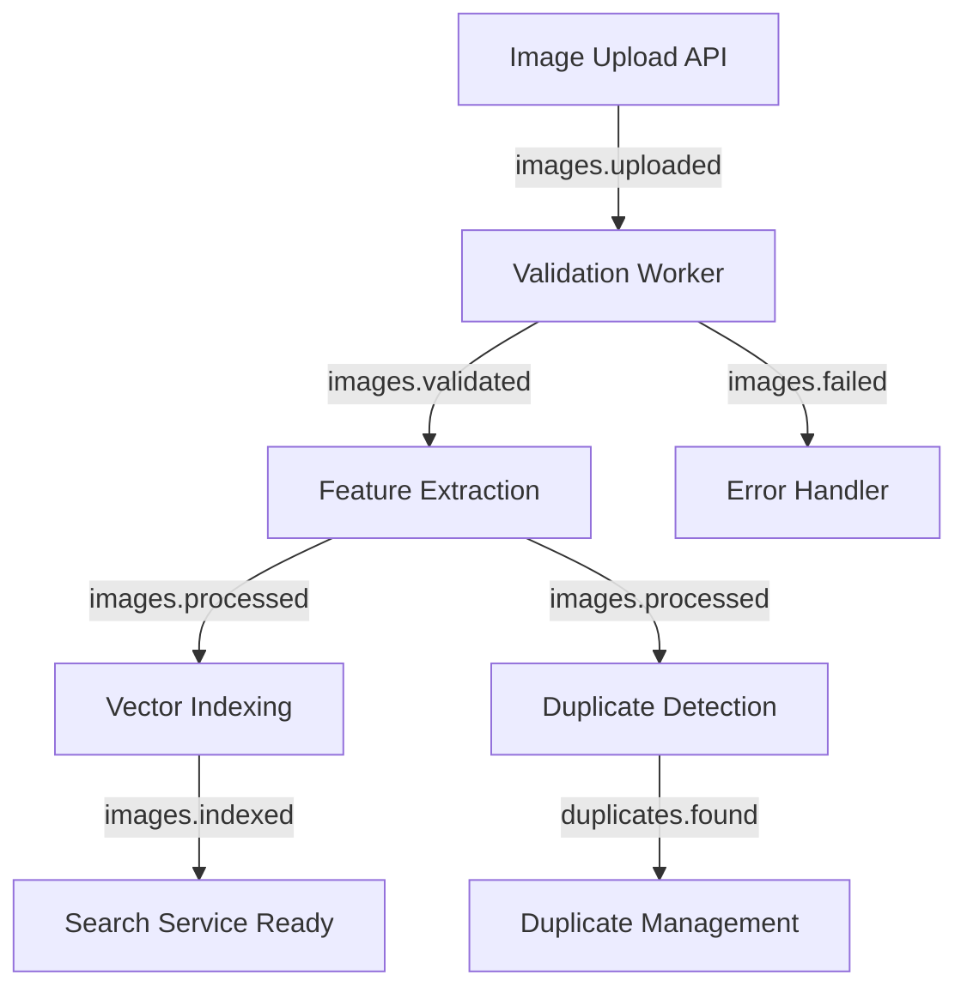

# DeepLens Kafka Usage Plan

## 🎯 **Purpose**

Define exactly how and where Kafka will be used in DeepLens architecture.

## 📋 **Kafka Topics Design**

### **Core Processing Topics**

```yaml
Topics:
  # Image Lifecycle
  images.uploaded: # New image uploaded
    partitions: 3
    retention: 7d
    consumers: ["processing-service", "analytics-service"]

  images.validated: # Image passed validation
    partitions: 3
    retention: 7d
    consumers: ["feature-extraction-service"]

  images.processed: # Features extracted, ready for indexing
    partitions: 3
    retention: 7d
    consumers: ["vector-indexing-service", "duplicate-detection-service"]

  images.indexed: # Image indexed in vector DB
    partitions: 3
    retention: 7d
    consumers: ["search-service", "analytics-service"]

  # Error Handling
  images.failed: # Processing failures
    partitions: 1
    retention: 30d
    consumers: ["error-handler-service", "monitoring-service"]

  # Analytics & Monitoring
  tenant.usage: # Usage analytics per tenant
    partitions: 6
    retention: 90d
    consumers: ["analytics-service", "billing-service"]
```

## 🏗️ **Service Integration**

### **1. Image Ingestion API**

```csharp
// After successful upload
await _kafkaProducer.SendAsync("images.uploaded", new ImageUploadedEvent
{
    TenantId = tenantId,
    ImageId = imageId,
    OriginalFileName = fileName,
    StorageProvider = provider,
    StoragePath = path,
    FileSize = size,
    MimeType = mimeType,
    UploadedAt = DateTime.UtcNow
});
```

### **2. Processing Worker Service**

```csharp
// Consumer listening to images.uploaded
public class ImageProcessingWorker : BackgroundService
{
    protected override async Task ExecuteAsync(CancellationToken stoppingToken)
    {
        await foreach (var message in _kafkaConsumer.ConsumeAsync("images.uploaded", stoppingToken))
        {
            var imageEvent = JsonSerializer.Deserialize<ImageUploadedEvent>(message.Value);

            // 1. Validate image
            var isValid = await _validationService.ValidateAsync(imageEvent);

            if (isValid)
            {
                // Publish to next stage
                await _kafkaProducer.SendAsync("images.validated", imageEvent);
            }
            else
            {
                // Publish to error topic
                await _kafkaProducer.SendAsync("images.failed", new ImageFailedEvent
                {
                    ImageEvent = imageEvent,
                    Reason = "Validation failed",
                    FailedAt = DateTime.UtcNow
                });
            }
        }
    }
}
```

### **3. Feature Extraction Service (Python)**

```python
# Python Kafka consumer for AI/ML processing
from kafka import KafkaConsumer
import json

consumer = KafkaConsumer(
    'images.validated',
    bootstrap_servers=['localhost:9092'],
    value_deserializer=lambda m: json.loads(m.decode('utf-8'))
)

for message in consumer:
    image_event = message.value

    # Extract features using ResNet50/CLIP
    features = await extract_features(image_event['storage_path'])

    # Publish processed event
    processed_event = {
        **image_event,
        'features': features.tolist(),
        'feature_model': 'resnet50',
        'processed_at': datetime.utcnow().isoformat()
    }

    producer.send('images.processed', processed_event)
```

## 🔄 **Event Flow**



## 🎛️ **Configuration**

### **Producer Configuration**

```csharp
services.Configure<KafkaProducerOptions>(options =>
{
    options.BootstrapServers = "localhost:9092";
    options.Acks = Acks.Leader;
    options.Retries = 3;
    options.EnableIdempotence = true;
    options.CompressionType = CompressionType.Lz4;
});
```

### **Consumer Configuration**

```csharp
services.Configure<KafkaConsumerOptions>(options =>
{
    options.BootstrapServers = "localhost:9092";
    options.GroupId = "deeplens-processing-group";
    options.AutoOffsetReset = AutoOffsetReset.Earliest;
    options.EnableAutoCommit = false; // Manual commit for reliability
});
```

## 📊 **Monitoring & Observability**

### **Key Metrics to Track**

- **Message throughput**: Messages/second per topic
- **Consumer lag**: How far behind consumers are
- **Processing time**: Time from upload to indexed
- **Error rates**: Failed message percentage
- **Topic sizes**: Disk usage per topic

### **Alerts**

- Consumer lag > 10,000 messages
- Error rate > 5% over 5 minutes
- Disk usage > 80% on Kafka brokers
- Processing time > 2 minutes for standard images

## 🚀 **Implementation Priority**

### **Phase 1: Basic Event Flow** (Week 1-2)

1. ✅ Kafka infrastructure (already done)
2. 🔨 Image upload → Kafka producer
3. 🔨 Simple processing worker consumer
4. 🔨 Basic error handling

### **Phase 2: Full Pipeline** (Week 3-4)

1. 🔨 Feature extraction integration
2. 🔨 Vector indexing consumer
3. 🔨 Duplicate detection consumer
4. 🔨 Comprehensive error handling

### **Phase 3: Advanced Features** (Week 5+)

1. 🔨 Dead letter queues
2. 🔨 Message retry strategies
3. 🔨 Consumer group scaling
4. 🔨 Advanced monitoring dashboards

## 🤔 **Alternative: Start Simple**

If Kafka feels too complex initially, we could:

1. **Phase 0**: Use **Redis Streams** for simpler queuing
2. **Phase 1**: Migrate to Kafka when we need advanced features
3. **Keep Kafka Infrastructure**: Ready for when we need it

## 🎯 **Decision Point**

**Should we:**

- **A)** Implement Kafka usage immediately (recommended)
- **B)** Start with Redis Streams, migrate later
- **C)** Remove Kafka from infrastructure for now

**My Recommendation: Option A** - The infrastructure is ready, and event-driven architecture will be essential as DeepLens scales.
