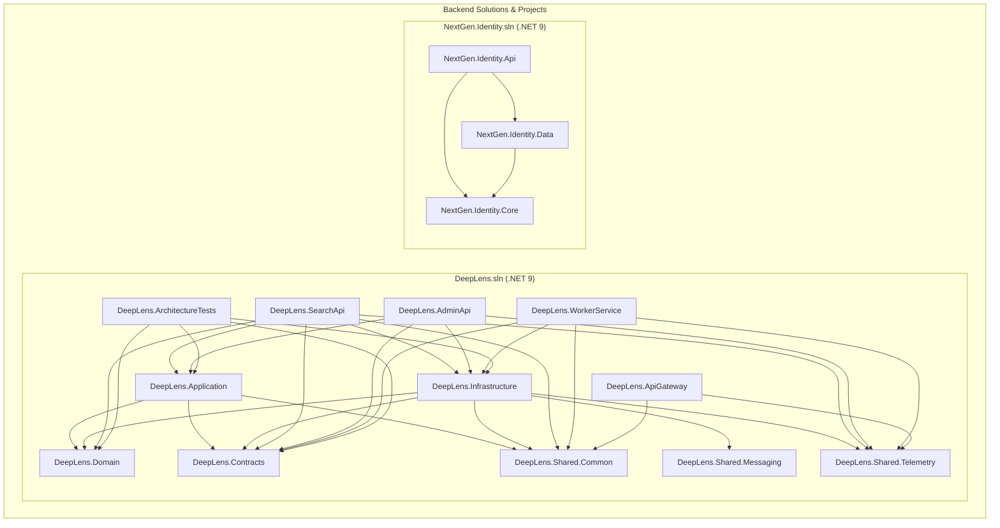
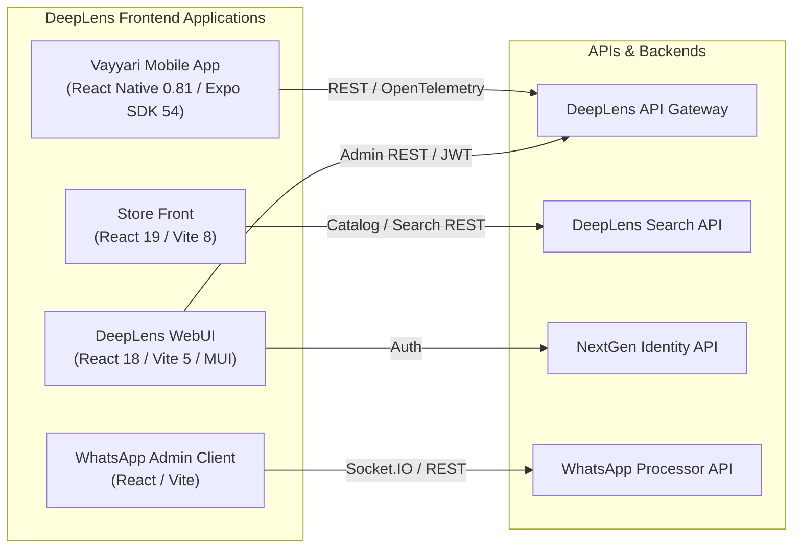
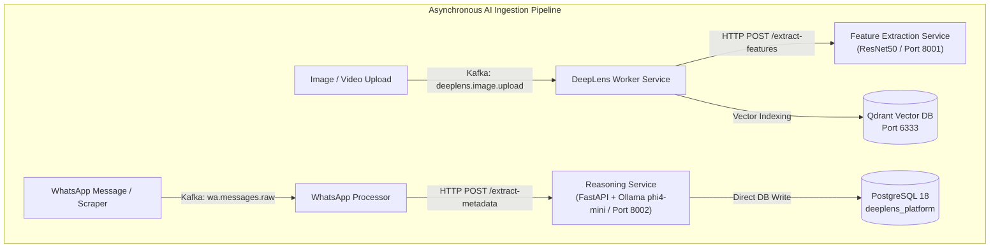
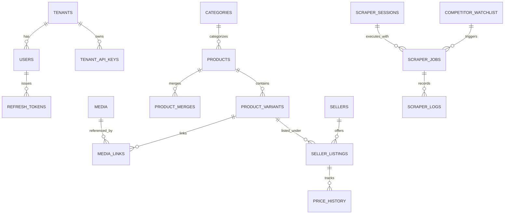
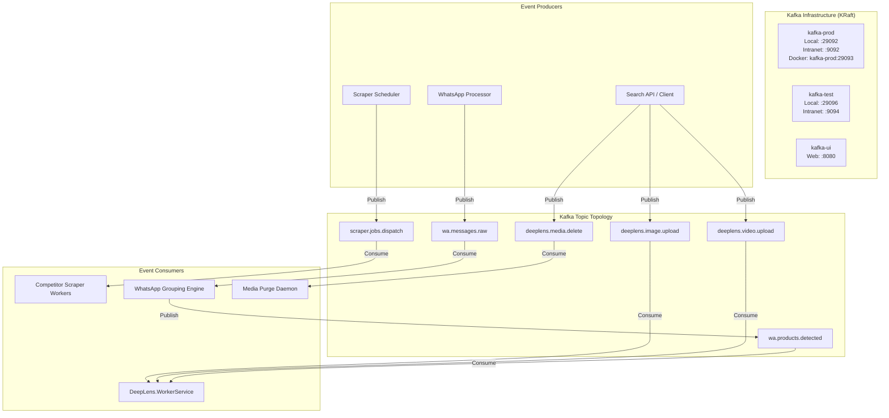
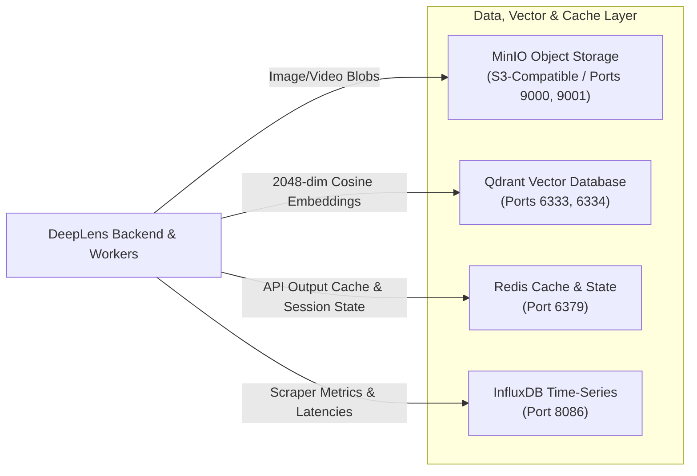
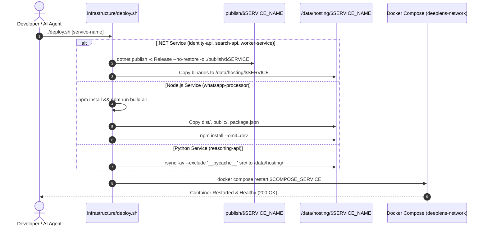

# DeepLens AI Monorepo Architecture Specification

**Document Version:** 1.0.0  
**Target Audience:** AI Coding Agents, Software Architects, Core Engineering Leads  
**Repository Root:** `/home/krikan/productivity/deeplens`  
**Squad Governance Hub:** `/home/krikan/productivity/deeplensSquad`  
**Last Updated:** August 2026

---

## 1. Executive Summary & Monorepo Topology

DeepLens is an enterprise-grade, multi-tenant **visual search engine, intelligent product catalog, and competitor intelligence platform**. The architecture utilizes a **hybrid .NET 9 + Python (FastAPI/PyTorch) + Node.js (TypeScript) monorepo** designed for high throughput, asynchronous event streaming, and strict tenant isolation.

### 1.1 Monorepo Directory Hierarchy

```
/home/krikan/productivity/deeplens
├── .cbmignore                         # DeusData Codebase Memory ignore rules
├── .codebase-memory.json              # Codebase Memory project configuration
├── .gitignore                         # Git exclusion rules for builds, caches, and models
├── .mcp.json                          # Local Model Context Protocol server configuration
├── .serena/                           # Serena Semantic Code Intelligence configuration
│   └── project.yml                    # LSP bindings for C#, TypeScript, and Python
├── Makefile                           # Unified developer and deployment command interface
├── DEEPLENS_GUIDE.md                  # Consolidated historical documentation guide
├── DEVELOPMENT.md                     # Developer onboarding and runtime guidelines
├── PROJECT_GUIDELINES.md              # Engineering rules and coding standards
├── docs/                              # Formal architectural, security, and operational documentation
│   ├── README.md                      # Documentation center entry point
│   ├── architecture/                  # Architectural specs, ADRs, and DTO standards
│   │   ├── ai-monorepo-architecture.md # (This document) AI-facing monorepo master reference
│   │   ├── mcp-code-intelligence.md   # MCP capability layer and tooling guide
│   │   ├── dto_standards.md           # DTO serialization and NetArchTest rules
│   │   ├── system-overview.md         # High-level system design overview
│   │   └── adr/                       # Architecture Decision Records
│   ├── guides/                        # Operational and setup runbooks
│   └── technical/                     # Detailed domain specifications
├── infrastructure/                    # Central infrastructure scripts and environment templates
│   ├── .env.example                   # Baseline environment configuration template
│   ├── deploy.sh                      # Host-level binary publisher and container restarter
│   ├── deploy-observability.sh        # LGTM monitoring stack deployment
│   ├── provision-tenant-backup.ps1    # Automated tenant database backup automation
│   ├── provision-tenant-qdrant.ps1    # Dedicated tenant Qdrant collection provisioner
│   └── start-dotnet-services.ps1      # Local dev environment launcher
├── setupscripts/                      # Containerized orchestration and infrastructure setups
│   ├── .env                           # Centralized credentials and container port bindings
│   ├── core/                          # Data, streaming, and observability Docker Compose stacks
│   │   ├── docker-compose.yaml        # Master core include manifest
│   │   ├── Kafka/                     # KRaft Kafka prod & test brokers + Kafka UI
│   │   ├── minio/                     # S3-compatible MinIO object storage
│   │   ├── postgres/                  # PostgreSQL 18 & pgAdmin 4
│   │   ├── qdrant/                    # Qdrant Vector Database
│   │   ├── redis/                     # Redis caching & session store
│   │   ├── ollama/                    # Local GPU-accelerated LLM runtime
│   │   └── grafana/ loki/ prometheus/ # Observability and metrics stack
│   ├── application/                   # Application layer Docker Compose services
│   │   ├── services/                  # Reasoning API, Feature Extraction, Scraper workers
│   │   ├── identity/                  # NextGen Identity DB dumps & scripts
│   │   ├── deeplens-core/             # DeepLens Platform DB dumps & baseline schemas
│   │   └── whatsapp/                  # Multi-tenant WhatsApp processor instances
│   └── migrations/                    # Sequential SQL schema migrations (003 through 011)
├── src/                               # Application source code
│   ├── DeepLens.Service/              # Master .NET 9 Backend Solution
│   │   ├── DeepLens.sln               # Solution manifest containing all 12 projects
│   │   ├── DeepLens.Domain/           # Core domain models, entities, and aggregate roots
│   │   ├── DeepLens.Contracts/        # Data Transfer Objects (DTOs) with [JsonPropertyName]
│   │   ├── DeepLens.Application/      # CQRS commands, queries, MediatR handlers, validation
│   │   ├── DeepLens.Infrastructure/   # EF Core, Dapper, Npgsql, Kafka, MinIO, Qdrant, Redis
│   │   ├── DeepLens.SearchApi/        # Visual similarity search & catalog API gateway
│   │   ├── DeepLens.AdminApi/         # Platform & tenant administration API
│   │   ├── DeepLens.ApiGateway/       # YARP reverse proxy and edge routing
│   │   ├── DeepLens.WorkerService/    # Kafka background consumer for media processing
│   │   ├── DeepLens.Shared.Common/    # Shared utilities, extensions, and primitives
│   │   ├── DeepLens.Shared.Messaging/ # Kafka producer/consumer wrappers and event schemas
│   │   └── DeepLens.Shared.Telemetry/ # OpenTelemetry logging, tracing, and metric instrumentation
│   ├── NextGen.Identity/              # Identity & Access Management Solution
│   │   ├── NextGen.Identity.sln       # Identity solution manifest
│   │   ├── NextGen.Identity.Api/      # OAuth2 / OIDC token issuance & tenant auth API
│   │   ├── NextGen.Identity.Core/     # Identity domain models and claims definitions
│   │   └── NextGen.Identity.Data/     # Identity EF Core / Dapper database repositories
│   ├── DeepLens.FeatureExtractionService/ # Python FastAPI stateless ResNet50 vectorizer
│   ├── DeepLens.ReasoningService/     # Python FastAPI Phi-4/Phi-3 LLM metadata extractor
│   ├── competitor-scraper-workers/    # Python/Node.js Instagram & YouTube scrapers
│   ├── deeplens.sidecarservices/      # Sidecar ingestion proxies
│   ├── whatsapp-processor/            # Multi-tenant Baileys WhatsApp automation service
│   │   ├── client/                    # Vite + React WhatsApp QR code & session admin portal
│   │   └── src/                       # Express, Baileys, Redis, Kafka, and MinIO pipeline
│   ├── DeepLens.WebUI/                # React 18 + Vite 5 + MUI Admin & Search Web Portal
│   ├── store/                         # React 19 + Vite 8 + Tailwind E-Commerce Storefront
│   └── vayyari/                       # React Native 0.81 + Expo SDK 54 Mobile Application
└── tests/                             # Integration, unit, and architecture test suites
    └── DeepLens.ArchitectureTests/    # NetArchTest architecture validation suite
```

---

## 2. Backend Solutions & Project Dependency Architecture

The backend architecture consists of two primary .NET 9 solutions following **Clean Architecture / CQRS** principles: `DeepLens.sln` and `NextGen.Identity.sln`.



### 2.1 DeepLens.Service Project Responsibilities

| Project | Target Framework | Primary Dependencies | Key Responsibilities |
| :--- | :--- | :--- | :--- |
| [`DeepLens.Domain`](file:///home/krikan/productivity/deeplens/src/DeepLens.Service/DeepLens.Domain) | `net9.0` | None | Pure enterprise business entities (`Product`, `ProductVariant`, `Media`, `Seller`, `SellerListing`, `PriceHistory`, `Category`). Aggregate roots and domain events. Zero external IO dependencies. |
| [`DeepLens.Contracts`](file:///home/krikan/productivity/deeplens/src/DeepLens.Service/DeepLens.Contracts) | `net9.0` | `System.Text.Json` | Public API request/response DTOs and Kafka message schemas. **Strict Rule:** All properties MUST have explicit `[JsonPropertyName("camelCase")]` attributes. |
| [`DeepLens.Application`](file:///home/krikan/productivity/deeplens/src/DeepLens.Service/DeepLens.Application) | `net9.0` | `MediatR (14.1.0)`, `FluentValidation` | CQRS Command and Query handlers, business orchestration, ingestion pipeline pipelines, search dispatch logic. |
| [`DeepLens.Infrastructure`](file:///home/krikan/productivity/deeplens/src/DeepLens.Service/DeepLens.Infrastructure) | `net9.0` | `Npgsql (8.0.2)`, `Dapper (2.1.35)`, `EFCore.Design (8.0.2)`, `Confluent.Kafka (2.12.0)`, `Minio (6.0.2)`, `StackExchange.Redis (2.10.1)`, `SixLabors.ImageSharp (3.1.12)` | Data access implementation. Hybrid model: EF Core for complex entities and migrations; Dapper for high-frequency search metadata reads. MinIO S3 object storage clients, Qdrant REST/gRPC client, Kafka event publishers. |
| [`DeepLens.SearchApi`](file:///home/krikan/productivity/deeplens/src/DeepLens.Service/DeepLens.SearchApi) | `net9.0` | `Microsoft.AspNetCore.OpenApi`, `Swashbuckle`, `Microsoft.AspNetCore.Authentication.JwtBearer` | User-facing visual similarity search, image/video upload intake (returns `202 Accepted` with async tracking token), catalog search, and customer-facing queries. Port: `5000`. |
| [`DeepLens.AdminApi`](file:///home/krikan/productivity/deeplens/src/DeepLens.Service/DeepLens.AdminApi) | `net9.0` | `Swashbuckle`, `JwtBearer` | Tenant administrative portal API: tenant configuration, catalog curation, manual SKU merging, user role assignments, scraper job scheduling. |
| [`DeepLens.ApiGateway`](file:///home/krikan/productivity/deeplens/src/DeepLens.Service/DeepLens.ApiGateway) | `net9.0` | `Yarp.ReverseProxy` | Edge routing, JWT validation, rate limiting, and request distribution across SearchApi, AdminApi, and IdentityApi. Port: `80`/`8080`. |
| [`DeepLens.WorkerService`](file:///home/krikan/productivity/deeplens/src/DeepLens.Service/DeepLens.WorkerService) | `net9.0` | `FFMpegCore (5.4.0)`, `Confluent.Kafka (2.12.0)`, `SixLabors.ImageSharp (3.1.12)` | Background processing worker. Consumes Kafka ingestion topics (`deeplens.image.upload`, `deeplens.video.upload`), extracts frames using FFmpeg, calls FeatureExtractionService (ResNet50), stores vectors in Qdrant, updates PostgreSQL metadata, and purges deleted media asynchronously. |
| [`DeepLens.Shared.Common`](file:///home/krikan/productivity/deeplens/src/DeepLens.Service/DeepLens.Shared.Common) | `net9.0` | `Microsoft.Extensions.Logging` | Cross-cutting helpers, Result pattern primitives, custom exception types, string/hash sanitizers, perceptual hashing (PHash) utilities. |
| [`DeepLens.Shared.Messaging`](file:///home/krikan/productivity/deeplens/src/DeepLens.Service/DeepLens.Shared.Messaging) | `net9.0` | `Confluent.Kafka` | Resilient Kafka producer and consumer base implementations, dead-letter queue (DLQ) routing, partition key strategies, and message envelope schemas. |
| [`DeepLens.Shared.Telemetry`](file:///home/krikan/productivity/deeplens/src/DeepLens.Service/DeepLens.Shared.Telemetry) | `net9.0` | `OpenTelemetry`, `OpenTelemetry.Exporter.OpenTelemetryProtocol` | OpenTelemetry standard bootstrap for metrics, tracing, and structured logging. Propagates W3C `traceparent` across HTTP, Kafka, and background tasks. |
| [`DeepLens.ArchitectureTests`](file:///home/krikan/productivity/deeplens/tests/DeepLens.ArchitectureTests) | `net9.0` | `NetArchTest.Rules`, `xUnit` | Automated architectural governance verifying that domain has no outer dependencies, and that all DTOs in `DeepLens.Contracts` strictly comply with JSON camelCase naming rules. |

### 2.2 NextGen.Identity Project Responsibilities

| Project | Target Framework | Key Responsibilities |
| :--- | :--- | :--- |
| [`NextGen.Identity.Api`](file:///home/krikan/productivity/deeplens/src/NextGen.Identity/NextGen.Identity.Api) | `net9.0` | OAuth 2.0 / OpenID Connect authentication server (Duende IdentityServer), JWT token generation, refresh token rotation, API key validation, password reset flows, tenant login endpoints. Port: `5198`. |
| [`NextGen.Identity.Core`](file:///home/krikan/productivity/deeplens/src/NextGen.Identity/NextGen.Identity.Core) | `net9.0` | Tenant identity models (`Tenant`, `User`, `RefreshToken`, `TenantApiKey`), password hashing algorithms (BCrypt), role and permission definitions. |
| [`NextGen.Identity.Data`](file:///home/krikan/productivity/deeplens/src/NextGen.Identity/NextGen.Identity.Data) | `net9.0` | Identity PostgreSQL DbContext, Dapper query repositories for token validation, database migration definitions for `nextgen_identity`. |

---

## 3. Frontend Applications Architecture

The monorepo contains four distinct frontend applications serving mobile clients, e-commerce customers, administrative operators, and WhatsApp bot administrators:



### 3.1 `src/vayyari` - Mobile Application
- **Framework:** React Native `0.81.5`, Expo SDK `~54.0.35`, Expo Router `~6.0.24`.
- **UI & Layout:** React Native Paper `5.15.0`, React Native Reanimated `~4.1.1`, React Native Gesture Handler `~2.28.0`, MultiSlider, DatePicker.
- **Media & Hardware:** Expo Image `~3.0.11`, Expo Camera, Expo Image Picker `~17.0.11`, Expo Media Library, Expo Video `~3.0.16`.
- **Observability:** Complete client-side OpenTelemetry tracing (`@opentelemetry/sdk-trace-web`, `@opentelemetry/exporter-trace-otlp-http`, fetch instrumentation).
- **Functionality:** Mobile catalog browsing, camera-based visual similarity search, live WhatsApp story feed, saved collections, product sharing, and multi-tenant store switching.

### 3.2 `src/store` - E-Commerce Web Storefront
- **Framework:** React `19.2.8`, Vite `8.2.0`, TypeScript `~6.0.2`.
- **Styling & Icons:** Lucide React `1.31.0`, Tailwind CSS.
- **Testing & Quality:** Playwright `1.50.0` automated visual regression test suite (`npm run test:visual`), Oxlint `1.75.0`.
- **Functionality:** High-performance responsive web storefront for end-users, fast faceted filtering, product variant selectors, price history graphs, and direct seller ordering.

### 3.3 `src/DeepLens.WebUI` - Administration & Curation Portal
- **Framework:** React `18.2.0`, Vite `5.0.8`, TypeScript `5.3.3`.
- **UI Framework:** Material UI (`@mui/material` `5.15.0`, `@mui/icons-material`), Emotion.
- **State & Data Fetching:** React Query `3.39.3`, Axios `1.6.2`, React Router DOM `6.21.0`.
- **Functionality:** Tenant administration, catalog management, manual product deduplication/merging, competitor tracking dashboard, scraper monitoring, user management, and API key generation. Port: `3006`.

### 3.4 `src/whatsapp-processor/client` - WhatsApp Management UI
- **Framework:** React, Vite, Socket.IO Client.
- **Functionality:** Live QR code display for Baileys WhatsApp multi-device authentication, active session monitoring, incoming message live feed, group mapping, and product catalog sync status.

---

## 4. Python AI/ML & Ingestion Services

DeepLens utilizes dedicated Python FastAPI services for machine learning inference and metadata enrichment, maintaining clean separation between stateless compute and persistent state.



### 4.1 `src/DeepLens.FeatureExtractionService` (Port `8001`)
- **Framework:** Python 3.11+, FastAPI, PyTorch, Torchvision, Python-JSON-Logger.
- **Core Model:** ResNet50 deep convolutional network (pre-trained on ImageNet).
- **Output:** 2048-dimensional normalized float vector representing visual semantic features.
- **Design Philosophy:** **Completely Stateless**. Does not connect to databases or Kafka. Exposes `POST /extract-features` accepting multipart image files or raw bytes, returning the vector JSON payload.
- **Execution & Models:** Model weights located at `models/resnet50.onnx` or PyTorch cache.

### 4.2 `src/DeepLens.ReasoningService` (Port `8002`)
- **Framework:** Python 3.11+, FastAPI, Psycopg2, Requests, Pydantic.
- **AI Engine:** Local GPU/CPU-accelerated Ollama instance (`http://192.168.0.170:11434`), default model: `phi4-mini:latest` (or `phi3:latest`).
- **Core Architecture:** **Two-Tier Priority Queue (`_ollama_queue`)**:
  - **Priority 0 (High):** Interactive/manual UI requests (e.g. admin triggering real-time metadata extraction on a specific product).
  - **Priority 1 (Low):** Bulk/automated background requests (e.g. WhatsApp message batch processor, competitor scraper backfills).
  - A single dedicated `_ollama_worker` asyncio loop drains the priority queue sequentially. This prevents GPU VRAM exhaustion and guarantees that interactive user actions are never starved behind large ingestion batches.
- **Capabilities:**
  - Extracts structured product metadata from unstructured Hindi/Telugu/English vernacular seller descriptions: Fabric, Color, Pattern, Occasion, Stitch Type, Saree Length, Blouse Included, Work Type.
  - Price parsing with currency normalization (extracts single price, wholesale tiers, and shipping charges).
  - Direct connection to `deeplens_platform` for logging LLM corrections and accuracy audits (`llm_corrections` table).

### 4.3 `src/competitor-scraper-workers` & Sidecars
- **Technology:** Python / Node.js Playwright automation.
- **Workers:** Instagram Profile & Reel Scraper, YouTube Shorts Tracker.
- **Functionality:** Dispatched via Kafka (`scraper.jobs.dispatch`), rotates authenticated session cookies stored in `scraper_sessions` table, downloads media assets to MinIO, tracks follower/engagement trends in `follower_snapshots` and `engagement_snapshots`.

---

## 5. Node.js Services: WhatsApp Processor & Community Engine

Located at [`src/whatsapp-processor`](file:///home/krikan/productivity/deeplens/src/whatsapp-processor), this service automates WhatsApp catalog ingestion.

- **Core Engine:** `@whiskeysockets/baileys` (v7.0.0 multi-device protocol).
- **Framework:** Node.js, Express `4.21.2`, TypeScript `5.7.2`, Pino Structured Logger, OpenTelemetry Node SDK.
- **Persistence & State:**
  - **Session Auth:** Persistent authentication keys stored at `data/whatsapp/{TENANT_NAME}/{SESSION_ID}`.
  - **Redis Cache:** Port `6379`, DB `1` for message deduplication and group metadata caching.
  - **PostgreSQL:** Direct pooling into `deeplens_platform` (accessing the `wa` schema and core catalog tables).
  - **MinIO:** Direct upload of incoming message images/videos to `whatsapp-data` bucket.
- **Message Grouping System:**
  - Aggregates split messages (e.g., vendor posting 5 photos followed by 1 text message describing price and fabric within a 60-second window) into a unified **Product Ingestion Unit**.
  - Computes Perceptual Hash (PHash) on all images to detect identical products across different vendor groups.
  - Publishes processed products to Kafka topic `wa.products.detected`.

---

## 6. Database Architecture & PostgreSQL Schemas

DeepLens runs on **PostgreSQL 18** (`krikanpg` container on port `5432`). The data layer is partitioned into two core databases: `nextgen_identity` (Platform Identity & Tenant Registry) and `deeplens_platform` (Catalog, Metadata, Scrapers, and WhatsApp).



### 6.1 Database 1: `nextgen_identity`

Manages enterprise multi-tenancy, authentication credentials, and API access keys.

| Table Name | Primary Key | Description & Key Columns |
| :--- | :--- | :--- |
| [`tenants`](file:///home/krikan/productivity/deeplens/setupscripts/application/identity/nextgen_identity.sql#L289) | `id (UUID)` | Multi-tenant organizations. `name`, `slug` (unique), `database_name`, `qdrant_container_name`, `qdrant_http_port`, `minio_bucket_name`, `status` (1=Active), `tier` (1=Free, 2=Pro, 3=Enterprise), `max_storage_bytes`, `settings (JSONB)`. |
| [`users`](file:///home/krikan/productivity/deeplens/setupscripts/application/identity/nextgen_identity.sql#L336) | `id (UUID)` | User accounts. `tenant_id (FK)`, `email`, `password_hash` (BCrypt), `role` (1=User, 2=Admin, 3=SuperAdmin), `is_active`. Unique index on `(tenant_id, email)`. |
| [`refresh_tokens`](file:///home/krikan/productivity/deeplens/setupscripts/application/identity/nextgen_identity.sql#L234) | `id (UUID)` | OAuth 2.0 JWT refresh tokens. `user_id (FK)`, `token`, `expires_at`, `is_revoked`, `revoked_reason`, `ip_address`, `user_agent`. |
| [`tenant_api_keys`](file:///home/krikan/productivity/deeplens/setupscripts/application/identity/nextgen_identity.sql#L262) | `id (UUID)` | Programmatic M2M API keys. `tenant_id (FK)`, `name`, `key_hash`, `key_prefix` (8 chars), `scopes`, `is_active`, `expires_at`. |
| [`__migrations`](file:///home/krikan/productivity/deeplens/setupscripts/application/identity/nextgen_identity.sql#L199) | `id (INT)` | Schema migration audit ledger (`001_InitialSchema`, `002_AddTenantSettings`, `003_CompetitorIntelligence`). |

### 6.2 Database 2: `deeplens_platform` (Public & `wa` Schemas)

Core product catalog, visual search metadata, price history, competitor scraping, and WhatsApp automation.

#### Public Catalog & Media Tables
- **`categories`**: Product taxonomy hierarchy (`id`, `name`, `slug`, `parent_id`, `attributes_schema`).
- **`products`**: Master SKU catalog (`id`, `tenant_id`, `title`, `description`, `category_id`, `is_active`, `tags (text[])`, `aggregated_attributes (jsonb)`, `created_at`).
- **`product_variants`**: Specific SKUs based on variant attributes (`id`, `product_id (FK)`, `sku`, `color`, `fabric`, `size`, `attributes (jsonb)`).
- **`media`**: Master media assets (`id`, `tenant_id`, `storage_path`, `phash (Perceptual Hash)`, `qdrant_vector_id`, `media_type (image/video)`, `quality_score`, `width`, `height`, `file_size`).
- **`media_links`**: Many-to-many relationship linking media assets to product variants (`media_id (FK)`, `product_variant_id (FK)`, `is_primary`, `sort_order`).
- **`media_deletion_log`**: Reliable deletion audit queue for MinIO and Qdrant asynchronous garbage collection.
- **`sellers`**: Vendor master registry (`id`, `tenant_id`, `name`, `channel_type (whatsapp/instagram/web)`, `phone_number`, `rating`).
- **`seller_listings`**: Live competitive vendor offers (`id`, `product_variant_id (FK)`, `seller_id (FK)`, `seller_sku`, `price`, `currency`, `shipping_metadata`, `availability_status`, `url`).
- **`price_history`**: Temporal audit trail of every price shift per listing (`id`, `seller_listing_id (FK)`, `previous_price`, `new_price`, `recorded_at`).
- **`product_merges` & `product_merge_candidates`**: Audit trail and AI candidate queue for SKU deduplication and cross-vendor product consolidation.

#### Competitor Tracking & Scraper Tables
- **`competitor_watchlist`**: Tracked Instagram profiles and YouTube channels (`id`, `platform`, `handle`, `target_url`, `frequency_minutes`, `is_active`).
- **`competitor_videos`**: Ingested competitor posts, reels, and videos (`id`, `watchlist_id (FK)`, `post_id`, `caption`, `like_count`, `comment_count`, `view_count`, `media_url`, `published_at`).
- **`scraper_sessions`**: Authenticated account pool with health tracking (`id`, `platform`, `username`, `session_cookies (encrypted)`, `health_status (healthy/degraded/banned)`, `on_cooldown`, `usage_count`).
- **`scraper_jobs`**: Event-driven Kafka scraper execution log (`id`, `job_id`, `watchlist_id`, `job_type`, `status (pending/processing/completed/failed)`, `items_processed`, `duration_ms`).
- **`engagement_snapshots` & `follower_snapshots`**: Periodic time-series metrics tracking competitor growth rates.

#### Schema `wa` (WhatsApp Automation Tables)
- **`wa.accounts`**: Connected WhatsApp sessions (`session_id`, `phone_number`, `push_name`, `status`, `processor_url`).
- **`wa.groups`**: Monitored WhatsApp reseller groups (`group_jid`, `session_id`, `group_name`, `is_active`, `sync_status`).
- **`wa.messages`**: Ingested WhatsApp message stream (`message_id`, `group_jid`, `sender_jid`, `timestamp`, `raw_text`, `media_type`, `grouping_id`).
- **`wa.group_products`**: Detected products mapped from message clusters.

---

## 7. Message Queues & Event Streaming (Apache Kafka)

DeepLens uses **Apache Kafka in KRaft mode** (no ZooKeeper) for high-performance decoupled event streaming.



### 7.1 Port & Network Configuration

| Broker Service | Container Name | Host Port | Internal Docker Port | Description |
| :--- | :--- | :--- | :--- | :--- |
| **Kafka Production** | `kafka-prod` | `9092` (Intranet), `29092` (Local) | `kafka-prod:29093` | 3 Partitions per topic, 7-day retention (`168h`), 4GB Heap. |
| **Kafka Test** | `kafka-test` | `9094` (Intranet), `29096` (Local) | `kafka-test:29095` | Auto-create topics enabled, 24h retention, 1GB Heap. |
| **Kafka UI** | `kafka-ui` | `8080` | `8080` | Web console connected to both Production and Test clusters. |

---

## 8. Storage, Vector Database & Caching Architecture



### 8.1 MinIO Object Storage
- **Ports:** `9000` (S3 API), `9001` (Web Console).
- **Default Buckets:**
  - `platform-admin`: System assets, default templates, model checkpoints.
  - `vayyari`: High-res product images, thumbnails, and preview GIFs.
  - `whatsapp-data`: Incoming raw media streams from WhatsApp communities.
- **Storage Structure:** `/{tenant_id}/{media_type}/{yyyy}/{mm}/{guid}.{ext}`.

### 8.2 Qdrant Vector Database
- **Ports:** `6333` (REST HTTP API & Web Dashboard), `6334` (gRPC).
- **Vector Specification:**
  - Size: **2048 float32** dimensions (ResNet50 feature vector).
  - Distance Metric: **Cosine Similarity**.
  - Indexing: HNSW (Hierarchical Navigable Small World) with on-disk payload storage.
- **Multi-Tenant Isolation:**
  - Platform/Vayyari Default Collection: `deeplens-qdrant-vayyari`.
  - Dedicated collections or tenant-specific instances provisioned via [`provision-tenant-qdrant.ps1`](file:///home/krikan/productivity/deeplens/infrastructure/provision-tenant-qdrant.ps1).

### 8.3 Redis
- **Port:** `6379`.
- **Database Allocation:**
  - `DB 0`: API query caching, search result memoization, JWT revocation list.
  - `DB 1`: WhatsApp processor session state, message grouping sliding windows, and rate limiters.

---

## 9. Build & Deployment Pipelines

All backend services and worker components MUST be built and deployed using the standardized deployment script located at [`infrastructure/deploy.sh`](file:///home/krikan/productivity/deeplens/infrastructure/deploy.sh).



### 9.1 The `--no-restore` Build Pattern
For .NET services, `infrastructure/deploy.sh` executes:
```bash
dotnet publish "$PROJECT_PATH" -c Release --no-restore -o "./publish/$SERVICE_NAME"
```
- **Why `--no-restore`?** Prevents expensive, redundant NuGet package restores during deployment cycles while ensuring deterministic builds against pre-restored packages.
- **Host Bind-Mount Safety:** Application containers bind-mount `/data/hosting/*`. Deploying binaries to the host directory and triggering a container restart ensures that environment configuration overrides (`appsettings.Production.json`) residing on the server are never overwritten by source control builds.

### 9.2 Supported Deployment Targets

| Service Argument | Project Path | Hosting Path | Docker Container Name |
| :--- | :--- | :--- | :--- |
| `identity-api` | `src/NextGen.Identity/NextGen.Identity.Api/NextGen.Identity.Api.csproj` | `/data/hosting/identity` | `nextgen-identity` |
| `search-api` | `src/DeepLens.Service/DeepLens.SearchApi/DeepLens.SearchApi.csproj` | `/data/hosting/deeplensapi` | `deeplens-api` |
| `worker-service` | `src/DeepLens.Service/DeepLens.WorkerService/DeepLens.WorkerService.csproj` | `/data/hosting/deeplensworkerservice` | `deeplens-worker` |
| `whatsapp-processor` | `src/whatsapp-processor` | `/data/hosting/whatsapp` | `deeplens-whatsapp-...` |
| `reasoning-api` | `src/DeepLens.ReasoningService` | `/data/hosting/reasoning-api` | `deeplens-reasoning-api` |

---

## 10. Docker Network Boundaries & Service Discovery

DeepLens services communicate across a dedicated Docker bridge network named `deeplens-network` or connect via the physical intranet interface at `192.168.0.170`.

```mermaid
graph TD
    subgraph Host_Network ["Intranet / Host Environment (192.168.0.170)"]
        PhysicalPostgres[PostgreSQL :5432]
        PhysicalMinIO[MinIO :9000, :9001]
        PhysicalKafka[Kafka :9092, :9094]
        PhysicalRedis[Redis :6379]
        PhysicalOllama[Ollama :11434]
    end

    subgraph Docker_Bridge ["Docker Bridge Network (deeplens-network)"]
        IdentityContainer["identity-api (:5198)"]
        SearchContainer["search-api (:5000)"]
        WorkerContainer["worker-service"]
        WebUIContainer["web-ui (:3006)"]
        ReasoningContainer["reasoning-api (:8002)"]
        FeatureContainer["feature-extraction (:8001)"]
        WhatsAppContainer["whatsapp-processor (:3005)"]
        QdrantContainer["qdrant (:6333, :6334)"]
    end

    SearchContainer -->|Internal DNS: feature-extraction:8001| FeatureContainer
    SearchContainer -->|Internal DNS: reasoning-api:8002| ReasoningContainer
    SearchContainer -->|Internal DNS: qdrant:6333| QdrantContainer
    WorkerContainer -->|Internal DNS: kafka-prod:29093| PhysicalKafka
    WhatsAppContainer -->|Internal DNS: redis:6379| PhysicalRedis
    IdentityContainer -->|Internal DNS: postgres:5432| PhysicalPostgres
```



### 10.1 Network Boundary Resolution Rules
1. **Container-to-Container on `deeplens-network`:**
   - Use container hostnames: `http://feature-extraction:8001`, `http://reasoning-api:8002`, `http://qdrant:6333`, `kafka-prod:29093`.
2. **Local Machine / IDE to External Infrastructure:**
   - Use intranet IP: `192.168.0.170:5432` (PostgreSQL), `192.168.0.170:9000` (MinIO), `192.168.0.170:9092` (Kafka), `192.168.0.170:6379` (Redis).
3. **Local Machine to Containerized Application APIs:**
   - Use localhost with mapped ports: `http://localhost:5000` (SearchApi), `http://localhost:5198` (IdentityApi), `http://localhost:3006` (WebUI), `http://localhost:3005` (WhatsApp Processor), `http://localhost:8080` (Kafka UI).

---

## 11. Cross-Reference Documentation Links

- [**MCP Code Intelligence Guide**](file:///home/krikan/productivity/deeplens/docs/architecture/mcp-code-intelligence.md) - Full specification of DeusData Codebase Memory, Serena LSP, and Postgres MCP.
- [**Squad MCP Operational Guide**](file:///home/krikan/productivity/deeplensSquad/.squad/docs/mcp-code-intelligence-guide.md) - Squad agent operational playbook and query recipes.
- [**DTO Standards & NetArchTest Rules**](file:///home/krikan/productivity/deeplens/docs/architecture/dto_standards.md) - Mandatory contract serialization specifications.
- [**Deployment Script**](file:///home/krikan/productivity/deeplens/infrastructure/deploy.sh) - Production service deployer.
- [**Central Configuration**](file:///home/krikan/productivity/deeplens/setupscripts/.env) - Port mappings and environment variables.
