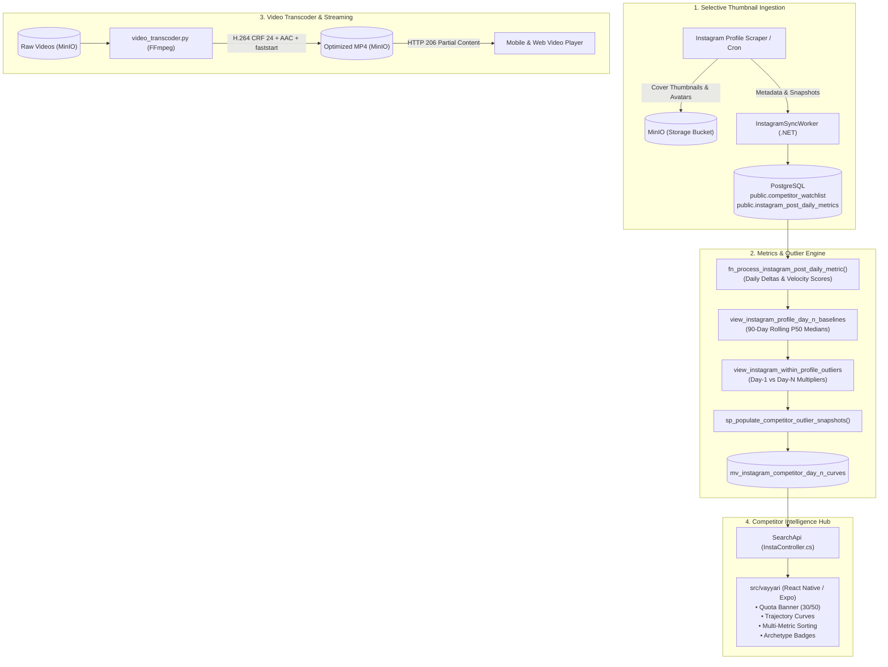

# 📊 Instagram Competitor Hub & Intelligence Architecture

Comprehensive technical architecture guide for the DeepLens Instagram Competitor Hub, selective thumbnail-only ingestion, Day-$N$ trajectory metrics, outlier detection, and automated video transcoding.

---

## 🏗️ 1. Architecture Overview

---

## 📈 2. Mathematical Formulations & Metrics Engine

### 2.1 Daily Deltas & Velocity Scoring
For any Instagram post daily metric snapshot at day offset $N$:
$$\Delta\text{views}_N = \text{views}_N - \text{views}_{N-1}$$
$$\Delta\text{likes}_N = \text{likes}_N - \text{likes}_{N-1}$$
$$\Delta\text{comments}_N = \text{comments}_N - \text{comments}_{N-1}$$
$$\Delta\text{shares}_N = \text{shares}_N - \text{shares}_{N-1}$$

The composite **Velocity Score** weights higher-intent engagements:
$$\text{VelocityScore}_N = 0.10 \Delta\text{views}_N + 1.00 \Delta\text{likes}_N + 3.00 \Delta\text{comments}_N + 5.00 \Delta\text{shares}_N$$

### 2.2 Within-Profile Normalization & 90-Day Rolling Baseline
To prevent distortions when comparing boutique artisan accounts to viral megabrands, posts are normalized against the creator's own 90-day rolling Median ($P_{50}$) for each day offset $N \in [0, 30]$:
$$\text{Baseline}_N = \text{Median}\left(\{\Delta\text{views}_{k,N} \mid \text{post } k \text{ posted within last 90 days}\}\right)$$

### 2.3 Outlier Archetypes & Multipliers
- **Day-1 Multiplier**:
  $$\text{Multiplier}_{\text{Day-1}} = \frac{\Delta\text{views}_1}{\text{Baseline}_1}$$
- **Breakout Archetypes**:
  1. **⚡ Day-1 Takeoff** (`is_day1_breakout = true`): Immediate viral surge on Day 1 where $\text{Multiplier}_{\text{Day-1}} \ge 2.0\times$ (or $\ge 3.0\times$ for major viral breakout).
  2. **📈 Delayed Breakout** (`is_delayed_breakout = true`): Algorithmic recirculation on Day $N \ge 2$ where $\Delta\text{views}_N \ge 2.0\times \text{Baseline}_N$ and $\Delta\text{views}_N \ge 500$.
  3. **✨ Sustained Viral**: Posts sustaining both Day-1 takeoff ($\ge 2.0\times$) and continued Day-$N$ momentum.
- **Commercial Intent Ratio (CIR)**:
  $$\text{CIR} = \frac{\text{comments} + \text{shares}}{\text{likes} + 1}$$

---

## 🎬 3. Video Transcoder & Streaming Pipeline

### 3.1 Compression Engine (`video_transcoder.py`)
To prevent uncompressed video bloat (11,657 video assets consuming 180.88 GB), an automated multi-threaded Python/FFmpeg engine compresses videos with deterministic settings:
- **Video Codec**: `libx264`, preset `medium`, CRF `24`, maxrate `2.5M`, bufsize `5M`.
- **Audio Codec**: `AAC`, bitrate `128k`.
- **Stream Alignment**: `scale=trunc(iw/2)*2:trunc(ih/2)*2` (macroblock alignment).
- **Faststart**: `-movflags +faststart` shifts the `moov` atom to the container header.
- **Efficiency**: Achieves **~87.5% per-file size reduction** (from ~22.9 MB down to ~2.86 MB per video).

### 3.2 MinIO Playback Streaming
- `+faststart` enables immediate mobile video playback over HTTP 206 Partial Content without requiring the client to buffer the entire file.

---

## 📱 4. Mobile & Web Frontend Experience (`src/vayyari`)

- **Quota Banner (`CompetitorBanner.tsx`)**: Displays active tracking slots (`30/50 Active`) and launches profile toggle modals.
- **Trajectory Curves (`CompetitorSparkline.tsx`)**: SVG cubic Bezier sparkline charting post trajectories against the creator's 90-day rolling baseline curve across Views, Likes, and Comments.
- **Outlier Cards (`OutlierInsightCard.tsx`)**: Displays CDN cover, archetype badge, caption hook, and dual deep-linking triggers (`instagram://media?id={id}` with web fallback).
- **Multi-Metric Sorting**: Real-time filtering by Multiplier, Views, Likes, Comments, Velocity, and Date across 7D, 30D, 90D, and All Time windows.

---

## 🔗 Related Documentation
- [System Overview](./system-overview.md)
- [WhatsApp & Media Pipeline](./whatsapp-and-media-pipeline.md)
- [RBAC & Security](./rbac-and-security.md)
