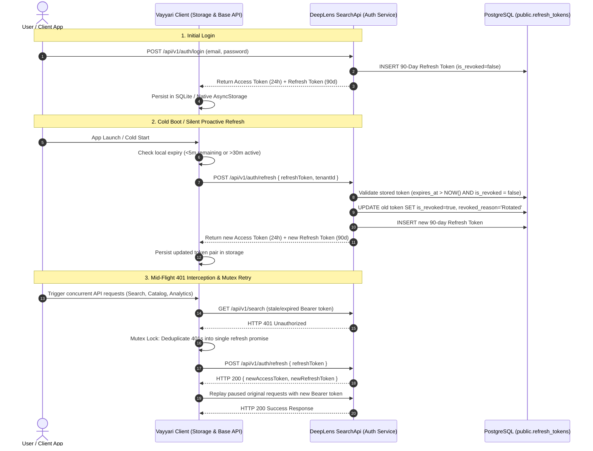

# 🔐 Persistent Sessions & Token Architecture

**Comprehensive Architectural Specification and Security Guide for DeepLens Authentication, Cross-Platform Session Persistence, and Token Lifecycle Management.**

---

## 📌 1. Overview & Architecture Summary

DeepLens adopts a modern, decoupled hybrid identity architecture designed for seamless user experience across cross-platform mobile apps (React Native / Expo on Android & iOS) and web applications (SPA / Web Dashboard).

### Core Lifecycle Parameters
- **Access Tokens**: Short-lived JSON Web Tokens (JWT) signed with HMAC-SHA256, valid for **24 Hours** (86,400 seconds).
- **Refresh Tokens**: Cryptographically random 64-byte Base64 strings stored in PostgreSQL `public.refresh_tokens`, valid for a **90-Day Sliding Window**.
- **Rotation Scheme**: Refresh Token Rotation (RTR). Every refresh operation automatically invalidates the consumed refresh token and issues a new 90-day refresh token.
- **Session Continuity**: Proactive refresh triggers keep active users continuously logged in across app launches and cold boots without repetitive credentials prompts.



---

## ⚙️ 2. Token Lifecycle & Session Persistence Engine

### 2.1 24h JWT Access Tokens
Access tokens are stateless Bearer tokens containing user identity, tenant affiliation, and RBAC permissions:
- **Lifetime**: 24 Hours (`expires_in = 86400`).
- **Signature**: HMAC-SHA256 signed using the server's private JWT signing secret key (`JwtSettings:SecretKey`).
- **Standard Claims**:
  - `sub` / `nameid`: Unique User GUID (`public.users.id`).
  - `tenant_id`: Associated tenant GUID.
  - `email`: Authenticated user email.
  - `jti`: Unique token UUID.
  - `roles`: Role arrays (`Admin`, `TenantOwner`, `User`).
  - `permissions`: Granular permission flags (e.g. `images:read`, `search:query`).

### 2.2 90-Day Sliding Refresh Token Rotation (RTR)
Refresh tokens represent the durable authorization session on the user device:
- **Entropy**: Cryptographically secure 64-byte random byte sequence encoded in Base64 via `System.Security.Cryptography.RandomNumberGenerator`.
- **Lifetime**: `NOW() + INTERVAL '90 days'`.
- **Sliding Renewal**: Each time the client performs a successful refresh, the previous refresh token is marked as `is_revoked = true` (`revoked_reason = 'Rotated'`), and a fresh 90-day token is generated and returned. Active devices renew their 90-day sliding window on every rotation.

### 2.3 Client-Side Storage Mechanisms
DeepLens supports mobile and web runtimes via abstraction layers (`@react-native-async-storage/async-storage`):

| Platform | Underlying Engine | Security & Persistence Characteristics |
| :--- | :--- | :--- |
| **Android (APK / Standalone)** | **SQLite Database** | Sandboxed to application UID in `/data/data/<pkg>/databases/`. Protected by Linux kernel process isolation and Android SELinux sandbox. Survives reboots, app upgrades, and OS battery optimizations. |
| **iOS (IPA / Standalone)** | **Serialized Plist / Sandboxed Filesystem** | Sandboxed in application container `Library/Application Support/`. Protected by iOS Data Protection API (Class C / After First Unlock). |
| **Desktop / Web Browsers** | **`window.localStorage`** | Scoped strictly to origin (scheme + host + port). Persistent across browser sessions until explicit user cache/site data clear. |

### 2.4 Cold-Start Silent Bootstrap & Mutexed 401 Request Queue
The frontend client architecture (`src/vayyari/`) incorporates two distinct resilience mechanisms:

#### 1. Cold-Start Silent Bootstrap (`AuthContext.tsx`)
On application launch:
1. Reads `auth_token`, `auth_refresh_token`, `auth_token_expiry`, and `auth_user` concurrently from persistent storage (with a 3-second safety fallback race).
2. Evaluates expiration timestamps:
   - If the access token is valid and not expiring within 5 minutes (`expiry > now + 5m`), initializes state immediately without network round-trips.
   - If the access token is missing or expiring within 5 minutes (`isExpiringSoon = true`), performs a background silent refresh against `/api/v1/auth/refresh`.
   - If refresh succeeds, atomically writes new tokens and finishes booting. If the refresh fails (e.g., offline mode), gracefully falls back to existing cached session state.

#### 2. Mutexed 401 Interceptor Queue (`api/base.ts`)
To prevent "thundering herd" concurrency issues when an access token expires while multiple parallel requests are dispatched (e.g., loading search gallery, notification count, and user metadata simultaneously):
- A module-scoped promise mutex `let refreshPromise: Promise<string | null> | null = null;` intercepts any `HTTP 401 Unauthorized` response.
- The first failed request initiates `getOrExecuteRefreshToken()`.
- Subsequent concurrent 401 responses hook into the *same* pending refresh promise rather than spamming duplicate refresh requests to the backend.
- Once the refresh completes, all queued requests transparently retry with the new `Bearer ${newToken}` header.
- If refresh fails, `AUTH_UNAUTHORIZED_EVENT` is broadcast to smoothly route the user to the login screen.

---

## 📱 3. Cross-Platform Compatibility & Lifecycle Matrix

| Platform / Environment | Storage Mechanism | Lifecycle & Session Duration | Behavior on Network / OS Events |
| :--- | :--- | :--- | :--- |
| **Android Standalone Build** | App-private SQLite | 90 days sliding inactivity. Retained indefinitely through app kills, backgrounding, reboots, and app updates. | Resilient to Wi-Fi $\leftrightarrow$ 5G roaming. Seamless background token refresh. Cleared only on explicit app uninstall or "Clear App Data". |
| **iOS Standalone Build** | Sandboxed File / Keychain Plist | 90 days sliding inactivity. Retained indefinitely across app restarts, reboots, and app updates. | Unaffected by Safari ITP restrictions because it operates in native application sandbox. Cleared on app uninstall. |
| **Standard Desktop Browsers** (Chrome, Firefox, Edge) | `localStorage` | 90 days sliding inactivity. Retained across browser closes, system reboots, and tab lifecycles. | Origin-isolated. Accessible across tabs on the same origin. |
| **Safari / WebKit on iOS/macOS** | `localStorage` | Subject to **Intelligent Tracking Prevention (ITP)**: 7-day cap if opened via third-party tracker link, standard persistence for direct navigation. | Clean origin storage per domain. |
| **Incognito / Private Browsing** | Ephemeral RAM / Temporary storage | Session duration only. | All storage wiped immediately when the last incognito tab/window closes. |
| **Explicit User Logout** | Storage Purge + Backend Revocation | Immediate termination. | Stored tokens purged from device; Backend marks token record `is_revoked = true`, `revoked_reason = 'User Logout'`. |

---

## 🛡️ 4. Security Design & Threat Model

### 4.1 Anti-Patterns & Why Modern OS/Browser Privacy Prevents Them

#### ❌ Hardware MAC Address Locking
- **Modern OS Privacy Mitigations**: Since Android 10+ and iOS 14+, both mobile operating systems enforce **MAC Address Randomization** per SSID connection by default. The real hardware BSSID/MAC is completely blocked from unprivileged userland apps and sandboxed web browsers.
- **Web Browser Sandbox**: JavaScript within browsers has zero access to network interface MAC addresses by design to prevent cross-site device fingerprinting.

#### ❌ Strict IP Address Locking
- **Carrier CGNAT & Mobile Roaming**: When mobile devices transition between home Wi-Fi and 5G cellular towers, or switch cell towers while driving, the client's public IP address changes dynamically.
- Strict IP binding results in severe false-positive logouts and broken user sessions during normal commute / roaming scenarios.
- **DeepLens Solution**: Store `ip_address` and `user_agent` in `public.refresh_tokens` for audit logs, geographic anomaly detection, and fraud analysis rather than strictly rejecting roaming IP handovers.

### 4.2 Refresh Token Rotation (RTR) & Token Reuse Detection (RFC 6749 §10.4)
DeepLens implements **Refresh Token Rotation (RTR)** to neutralize the threat of stolen refresh tokens:
1. Every refresh token can only be redeemed **once**.
2. Upon redemption, the server marks the token as revoked (`is_revoked = true`, `revoked_reason = 'Rotated'`).
3. **Token Reuse Detection Threat Model**: If an attacker intercepts a previously used refresh token and attempts to redeem it:
   - The backend detects that the token is already marked `is_revoked = true`.
   - *Planned Threat Mitigation*: In accordance with RFC 6749 §10.4, detection of a revoked token reuse triggers automatic invalidation of the entire downstream token family and revokes all active refresh tokens for that `user_id`.

### 4.3 Identity & Session Management Roadmap
- [ ] **Device Fingerprint / Hardware UUID Tracking**: Capture non-sensitive client identifiers (`device_id`, platform, client model) during login.
- [ ] **Friendly Device Naming**: Display friendly session names (e.g. *"Chrome on macOS"*, *"Pixel 8 Pro - Vayyari Mobile"*) in user settings.
- [ ] **Active Sessions Management Dashboard**: Provide a self-service security screen where users can view all active logged-in devices and click **"Revoke Session"** or **"Log out of all other devices"**.
- [ ] **Automated Inactive Token Pruning**: Background scheduled worker to purge revoked and expired tokens older than 180 days from `public.refresh_tokens`.

---

## 🗄️ 5. Database Schema & Data Models

The persistence engine relies on the `public.refresh_tokens` table in PostgreSQL.

### 5.1 SQL Table Definition (`nextgen_identity.sql` / `deeplens_platform.sql`)
```sql
CREATE TABLE public.refresh_tokens (
    id UUID PRIMARY KEY DEFAULT gen_random_uuid(),
    user_id UUID NOT NULL,
    token VARCHAR(256) NOT NULL UNIQUE,
    expires_at TIMESTAMPTZ NOT NULL,
    created_at TIMESTAMPTZ NOT NULL DEFAULT NOW(),
    is_revoked BOOLEAN NOT NULL DEFAULT FALSE,
    revoked_at TIMESTAMPTZ,
    revoked_reason VARCHAR(256),
    ip_address VARCHAR(45),
    user_agent TEXT,
    CONSTRAINT refresh_tokens_user_id_fkey 
        FOREIGN KEY (user_id) REFERENCES public.users(id) ON DELETE CASCADE
);

-- Performance & Lookup Indexes
CREATE INDEX idx_refresh_tokens_token 
    ON public.refresh_tokens (token) 
    WHERE (is_revoked = false);

CREATE INDEX idx_refresh_tokens_expires 
    ON public.refresh_tokens (expires_at) 
    WHERE (is_revoked = false);

CREATE INDEX idx_refresh_tokens_user_id 
    ON public.refresh_tokens (user_id);

COMMENT ON TABLE public.refresh_tokens IS 'JWT refresh tokens for persistent session management and RTR';
```

---

## 📡 6. API Reference & Contract Specifications

### 6.1 `POST /api/v1/auth/login`
Authenticates user credentials, provisions fresh 24h JWT access token and initial 90-day refresh token.

#### Request Headers & Body
```http
POST /api/v1/auth/login HTTP/1.1
Host: api.deeplens.local
Content-Type: application/json

{
  "email": "developer@deeplens.ai",
  "password": "SecurePassword123!",
  "tenantId": "00000000-0000-0000-0000-000000000001"
}
```

#### Response (`HTTP 200 OK`)
```json
{
  "accessToken": "eyJhbGciOiJIUzI1NiIsInR5cCI6IkpXVCJ9...",
  "refreshToken": "4a7b3c2d1e0f9876543210abcdef...",
  "expiresIn": 86400,
  "tokenType": "Bearer",
  "user": {
    "id": "c3d4e5f6-a7b8-9012-3456-7890abcdef12",
    "tenantId": "00000000-0000-0000-0000-000000000001",
    "email": "developer@deeplens.ai",
    "firstName": "Krishna",
    "lastName": "Kanth",
    "emailConfirmed": true,
    "isActive": true,
    "roles": ["Admin", "Developer"],
    "permissions": ["search:query", "images:read", "images:write"]
  },
  "capabilities": {
    "userId": "c3d4e5f6-a7b8-9012-3456-7890abcdef12",
    "tenantId": "00000000-0000-0000-0000-000000000001",
    "isSuperAdmin": false,
    "roles": ["Admin"],
    "permissions": ["search:query", "images:read", "images:write"],
    "version": 1
  }
}
```

---

### 6.2 `POST /api/v1/auth/refresh`
Performs atomic Refresh Token Rotation (RTR). Invalides old refresh token and returns a new 24h JWT access token paired with a new 90-day refresh token.

#### Request Headers & Body
```http
POST /api/v1/auth/refresh HTTP/1.1
Host: api.deeplens.local
Content-Type: application/json

{
  "refreshToken": "4a7b3c2d1e0f9876543210abcdef...",
  "tenantId": "00000000-0000-0000-0000-000000000001"
}
```

#### Response (`HTTP 200 OK`)
```json
{
  "accessToken": "eyJhbGciOiJIUzI1NiIsInR5cCI6IkpXVCJ9...",
  "refreshToken": "9f8e7d6c5b4a3210fedcba0987654321...",
  "expiresIn": 86400,
  "tokenType": "Bearer"
}
```

#### Error Responses
- **`HTTP 400 Bad Request`**: Missing refresh token payload.
  ```json
  { "message": "Refresh token is required." }
  ```
- **`HTTP 401 Unauthorized`**: Token invalid, expired, or already revoked.
  ```json
  { "message": "Invalid or expired refresh token." }
  ```
- **`HTTP 401 Unauthorized`**: Associated user deactivated or deleted.
  ```json
  { "message": "User account is inactive or disabled." }
  ```

---

### 6.3 `POST /api/v1/auth/logout`
Explicitly logs out the user, clearing client storage and invalidating the active refresh token on the server.

#### Request Headers & Body
```http
POST /api/v1/auth/logout HTTP/1.1
Host: api.deeplens.local
Content-Type: application/json

{
  "refreshToken": "9f8e7d6c5b4a3210fedcba0987654321..."
}
```

#### Response (`HTTP 200 OK`)
```json
{
  "message": "Logged out successfully."
}
```
*(Backend updates `public.refresh_tokens` setting `is_revoked = true` and `revoked_reason = 'User Logout'`)*

---

## 🔗 Related Documentation
- [System Overview](./system-overview.md) - DeepLens architectural overview.
- [Security & RBAC](../technical/SECURITY.md) - Authentication & authorization guide.
- [Codebase Overview](../technical/codebase-overview.md) - Architecture of `DeepLens.SearchApi` and `src/vayyari/`.
