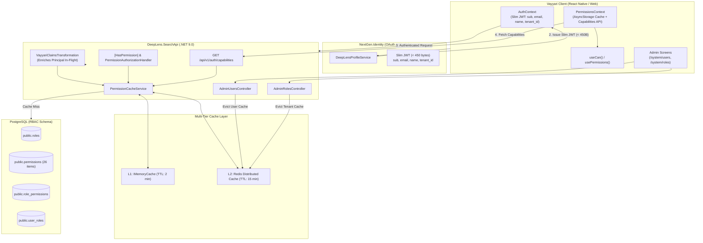

# 🛡️ RBAC, Identity & Security Architecture

Comprehensive architecture reference for native Role-Based Access Control (RBAC), multi-tier permission caching, administrative governance, and persistent sessions in DeepLens.

---

## 🏗️ 1. Architecture & Token Decoupling

DeepLens decouples authentication (pure identity assertion) from fine-grained authorization (tenant domain permissions):

---

## 🔑 2. Multi-Tier Permission Caching Engine

### 2.1 Cache Hierarchy
- **L1 Cache**: In-process `IMemoryCache` with a 2-minute sliding TTL for sub-millisecond repeated endpoint checks.
- **L2 Cache**: Distributed Redis Cache (`IDistributedCache`) with a 15-minute TTL keyed by `vayyari:rbac:user:{tenantId}:{userId}` and `vayyari:rbac:roles:{tenantId}`.
- **Database Fallback**: High-speed Dapper SQL query joining `public.user_roles`, `public.role_permissions`, and `public.permissions`.

### 2.2 Dynamic Cache Eviction
When tenant administrators update role assignments or permissions via `AdminUsersController` or `AdminRolesController`, the backend immediately invokes:
- `EvictUserPermissionsAsync(tenantId, userId)`
- `EvictRolePermissionsAsync(tenantId, roleId)`
This guarantees instantaneous policy propagation without forcing user re-logins.

---

## 👥 3. Native Roles & Permission Catalog

### 3.1 5 Seeded System Roles
1. **`SuperAdmin`**: Unrestricted full tenant access across all domains and platform administration.
2. **`Admin`**: Comprehensive catalog, order, media, and user management capabilities.
3. **`CatalogManager`**: Products, inventory, categories, media, tags, and AI description generation.
4. **`SalesAssociate`**: Order processing, customer inquiries, and WhatsApp messaging.
5. **`Viewer`**: Read-only operational visibility.

### 3.2 Master Permission Catalog (26 Fine-Grained Permissions)
- **Catalog**: `catalog:view`, `catalog:create`, `catalog:edit`, `catalog:delete`, `catalog:merge`, `catalog:archive`.
- **Media**: `media:view`, `media:upload`, `media:delete`, `media:retention_rules`.
- **Orders**: `orders:view`, `orders:create`, `orders:edit`, `orders:cancel`.
- **Customers**: `customers:view`, `customers:edit`.
- **Social / Messaging**: `whatsapp:view`, `whatsapp:broadcast`, `whatsapp:disconnect`, `instagram:view`, `instagram:publish`, `instagram:scrape`.
- **Analytics**: `analytics:view`, `analytics:export`.
- **System Administration**: `system:user_manage`, `system:role_manage`.

---

## 🔄 4. Persistent Sessions & 90-Day Sliding RTR

For full lifecycle details, mutexed 401 retry interceptor queues, and cross-platform storage mappings, see the dedicated specification:
👉 [Persistent Sessions & Auth Specification](./persistent-sessions-and-auth.md)

### Key Principles
- **Access Tokens**: Short-lived 24h JWT (`expires_in = 86400`).
- **Refresh Tokens**: 90-day cryptographically secure 64-byte random tokens stored in `public.refresh_tokens`.
- **Refresh Token Rotation (RTR)**: Every refresh invalidates the old token (`is_revoked = true`, `revoked_reason = 'Rotated'`) and issues a fresh 90-day token.
- **Cold-Start Silent Bootstrap**: On client boot, tokens expiring within 5 minutes are refreshed silently in the background before screen rendering.
- **Mutexed 401 Interceptor**: Deduplicates concurrent 401 responses into a single refresh promise, seamlessly replaying in-flight HTTP requests.

---

## 🔗 Related Documentation
- [Persistent Sessions & Auth Specification](./persistent-sessions-and-auth.md)
- [System Overview](./system-overview.md)
- [Technical Security Reference](../technical/SECURITY.md)
