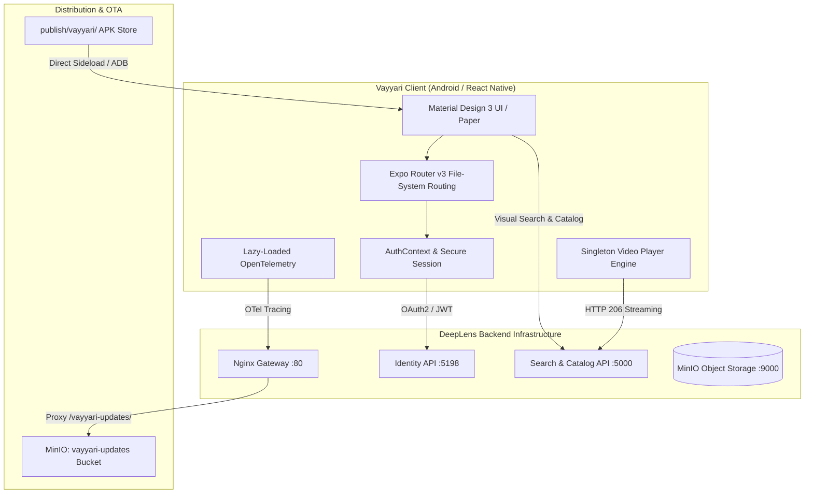
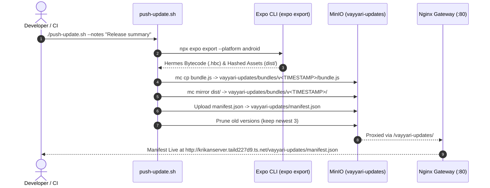

# Vayyari Mobile App Architecture & Release Guide

**Comprehensive architecture reference for the Vayyari React Native / Expo Bare Workflow mobile application, standalone APK builds, and self-hosted OTA update pipelines.**

Last Updated: August 28, 2026  
Related ADO Stories: #336, #340

---

## 📱 Executive Overview

**Vayyari** is the mobile client for the DeepLens ecosystem. Designed for fast mobile catalog exploration, WhatsApp seller message grouping, and visual product discovery, Vayyari operates with a high degree of local autonomy while integrating directly with DeepLens backend microservices.



---

## 🏗️ Architecture & Component Layers

### 1. Framework & Core Runtime
- **Runtime**: React Native 0.76+ with the **Hermes JavaScript Engine**.
- **Workflow**: **Expo Bare Workflow** (Expo SDK 54). All native configuration is retained in the source repository under `src/vayyari/android`.
- **Styling & UI**: `react-native-paper` implementing Google Material Design 3.
- **Theming**: Dynamic `Emerald` (Light) and `Emerald Nocturne` (Dark) theme engines with persistent system / user toggles.

### 2. Navigation & File-System Routing
- **Routing Engine**: `expo-router` v3 using file-system conventions under `src/vayyari/app/`.
- **Route Topology**:
  - `app/_layout.tsx`: Root provider envelope (Paper ThemeProvider, AuthProvider, Stack Navigator, OpenTelemetry init, Splash screen lock).
  - `app/(tabs)/`: Main tabbed experience (Catalog Home, Visual Search, WhatsApp Inbox, AI Assistant, Settings).
  - `app/login.tsx`: Unauthenticated entry point.
  - `app/modal.tsx`: Standardized modal overlay.
  - `app/product/`: Deep-linked product detail and SKU inspector routes.

### 3. Authentication & API Client
- **Session Management**: `src/vayyari/context/AuthContext.tsx` handles token persistence via `AsyncStorage` with an automated 1500ms safety timeout to prevent boot deadlock.
- **Token Handling**: Communicates with `NextGen.Identity.Api` (`http://<HOST>:5198/connect/token`) via OAuth 2.0 Resource Owner Password Credentials and Refresh Token flows.
- **Interceptors**: `src/vayyari/api/client.ts` automatically attaches `Bearer` JWT tokens and listens for `401 Unauthorized` responses to seamlessly trigger session invalidation.

### 4. Media & Playback Engine (Singleton Pattern)
- **Singleton Architecture**: To prevent OOM errors and native decoder leaks on mobile devices, screens must instantiate a single `expo-video` player per view and rebind sources dynamically during carousel swipes.
- **Range Support**: Video streams are delivered from backend `MinioSeekableStream` instances supporting **HTTP 206 Partial Content**.
- **Persistence**: Playback preferences (volume level, muted state) are synchronized directly to local `AsyncStorage`.

---

## 🔨 Standalone Android APK Build Process

Vayyari produces standalone release APKs directly on the Linux VM without requiring external cloud build services (like EAS Build).

### Native Android Project Layout
```
src/vayyari/android/
├── app/
│   ├── build.gradle               # App module build config & dependencies
│   ├── proguard-rules.pro         # Proguard/R8 rules
│   └── src/main/
│       ├── AndroidManifest.xml    # Permissions & cleartext traffic config
│       └── java/com/anonymous/vayyari/MainActivity.kt
├── build.gradle                   # Root Gradle script
├── gradle/wrapper/                # Gradle wrapper binaries
└── gradlew                        # Gradle execution wrapper
```

### Build Commands
```bash
# Using Makefile
make build-vayyari-apk

# Using deployment script
./infrastructure/deploy.sh vayyari-apk

# Direct Gradle execution
cd src/vayyari/android
./gradlew assembleRelease \
  -x lint \
  -x lintVitalAnalyzeRelease \
  -Pandroid.enablePngCrunchInReleaseBuilds=false
```

### Critical Build Flags & Workarounds
1. **`-Pandroid.enablePngCrunchInReleaseBuilds=false`**: AAPT2 includes a PNG crunching step during release builds. Several asset images (e.g., courier logos in the catalog) contain JPEG binary data despite having a `.png` filename extension. Disabling PNG crunching allows AAPT2 to bundle the raw assets without throwing a corrupt header build exception.
2. **`-x lint -x lintVitalAnalyzeRelease`**: Bypasses full Android Lint analysis during local release builds to optimize CI/build times.
3. **`usesCleartextTraffic="true"`**: Configured in `AndroidManifest.xml` to allow seamless local network and Tailscale HTTP communication to DeepLens APIs.

---

## 🗄️ APK Distribution & Retention Policy

### Distribution Directory (`publish/vayyari/`)
Standalone release APKs are deployed to `publish/vayyari/` on the local VM.

```
publish/vayyari/
├── README.md                      # Distribution guide & release notes
├── vayyari-latest.apk             # Pointer to latest successful release
└── vayyari-v1.0.0-YYYYMMDD.apk    # Dated release builds
```

### Retention Rules:
- **Active Release**: `vayyari-latest.apk` is refreshed upon every successful build.
- **Historical Builds**: Retains the **3 most recent historical versioned APKs**.
- **Pruning**: Automated in `./infrastructure/deploy.sh vayyari-apk` to ensure server storage is preserved.

---

## 🌐 Self-Hosted OTA Updates Architecture (MinIO + Nginx)

DeepLens features an automated OTA bundling and publishing pipeline using local MinIO object storage and the Nginx Gateway.



### MinIO Storage Topology (`vayyari-updates` Bucket)
- **Bucket Policy**: `download` (Public read for assets and manifests).
- **Directory Layout**:
```
vayyari-updates/
├── manifest.json
└── bundles/
    ├── v202608280130/
    │   ├── bundle.js              # Primary Hermes bytecode bundle
    │   └── assets/                # Exported asset dictionary
    ├── v202608271800/
    └── v202608270900/
```

### Nginx Gateway Configuration (`/vayyari-updates/`)
The gateway reverse proxies requests into MinIO:
```nginx
location /vayyari-updates/ {
    proxy_pass http://minio:9000/vayyari-updates/;
    proxy_set_header Host minio:9000;
    proxy_set_header X-Real-IP $remote_addr;
    proxy_set_header X-Forwarded-For $proxy_add_x_forwarded_for;
}
```

---

## ⚖️ Architectural Decision Record: Expo Updates Protocol Deferral

### Context
Modern versions of Expo Updates (`expo-updates` v29+ / SDK 50+) enforce **Expo Updates Protocol v1**, which requires:
1. Multipart/mixed HTTP responses containing structured protocol metadata headers (`expo-protocol-version: 1`, `expo-sfv-version: 0`).
2. Code signing certificates or server-generated signatures in the manifest header.

### Decision
- Static file hosting in MinIO cannot natively construct signed multipart HTTP responses required by the protocol.
- Consequently, runtime dynamic OTA polling is deferred (`"updates": { "enabled": false }` in `app.json`, and `useOTAUpdate()` operates as a stub).
- App delivery is managed via standalone APK distribution (`publish/vayyari/vayyari-latest.apk`).
- `src/vayyari/push-update.sh` remains active as the canonical bundle exporter and MinIO artifact archiver, keeping versioned JS bundles ready for rollback analysis and future protocol proxy servers.
