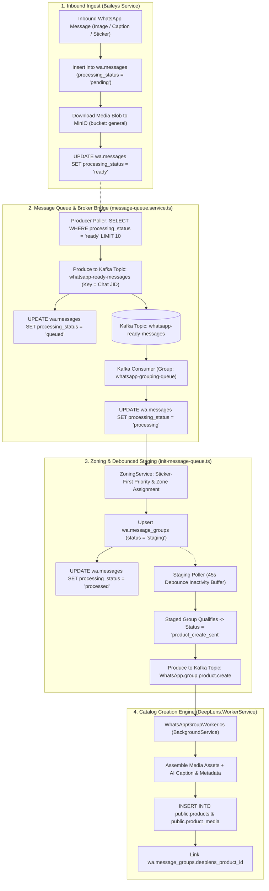

# 📱 WhatsApp & Media Pipeline Architecture

Comprehensive technical architecture guide for the DeepLens WhatsApp ingestion pipeline, IST timestamp localization, media storage lifecycle, and storage retention pruning.

---

## 🏗️ 1. End-to-End Pipeline Architecture

The DeepLens WhatsApp ingestion and grouping pipeline operates across four decoupled layers:



---

## 🕒 2. Canonical Sender Timestamp & IST Localization

### 2.1 Problem & Motivation
Inbound messages processed through asynchronous queues often carry a database insertion timestamp (`products.created_at`) that differs significantly from when the vendor actually dispatched the message on WhatsApp. Displaying DB ingestion timestamps gives a misleading representation of catalog freshness and vendor activity.

### 2.2 Canonical SQL Projection
To project the authentic vendor message dispatch timestamp, `ProductService.GetCatalogAsync` and `ProductService.GetProductByIdAsync` employ a dynamic `COALESCE` query:

```sql
COALESCE(
    (SELECT last_message_at 
     FROM wa.message_groups 
     WHERE deeplens_product_id = p.id 
     LIMIT 1),
    (SELECT to_timestamp(m.timestamp) AT TIME ZONE 'UTC' 
     FROM wa.messages m 
     JOIN vendor_listings vl2 ON vl2.source_group_id = m.group_id 
     WHERE vl2.product_id = p.id 
     LIMIT 1),
    p.created_at
) AS "CreatedAt"
```

### 2.3 Client-Side IST Localization (`date-format.ts`)
The mobile frontend (`src/vayyari/utils/date-format.ts`) normalizes raw timestamp inputs (ISO 8601, epoch seconds, epoch milliseconds, or composite `sourceGroupId` strings like `120363041234567890@g.us_1724265000`) and formats them to Indian Standard Time (`IST`, `Asia/Kolkata`, `UTC+05:30`):

- **Same Calendar Day (IST)**: `"10:45 AM"`
- **Current Calendar Year (IST)**: `"21 Aug, 10:45 AM"`
- **Prior Calendar Years (IST)**: `"21 Aug 2025, 10:45 AM"`

---

## 🗑️ 3. Media Retention, Pruning & Storage Lifecycle

### 3.1 MinIO Bucket Architecture & URL Relocation
- **Canonical Storage Location**: All active WhatsApp media objects reside in the shared MinIO bucket `general`:
  ```
  minio://general/whatsapp/{message_id}/{filename}
  ```
- **Legacy Relocation**: Staging bucket `whatsapp-data` was deduplicated and purged of duplicate raw blobs, with 73,549 message records backfilled to the canonical `minio://general/` path.

### 3.2 Automated 100-Day TTL Archival Worker
`WhatsAppAutoArchiveWorker` in `DeepLens.WorkerService` runs on an hourly schedule to prune stale WhatsApp media:
1. **Scope**: Queries `wa.messages` where `media_url IS NOT NULL`, `received_at < NOW() - INTERVAL '100 days'`, and `is_archived = FALSE`.
2. **Re-keying**: Moves objects within MinIO from `general/whatsapp/...` to `general/archive/{year}/{month}/{message_id}/{filename}`.
3. **Audit**: Sets `is_archived = TRUE` and `archived_at = NOW()` on the message record.
4. **Trigger Endpoint**: Exposed via `POST /api/v1/whatsapp/archive-expired-media` for on-demand administrative invocation.

### 3.3 Vibrant Image Compression & 2-Thumbnail Retention
During catalog archival (e.g., bulk archival of unstarred aged products):
1. **Selection**: Sorts linked images by file size (`file_size_bytes DESC`) as an information density/vibrancy proxy.
2. **Thumbnail Preservation**: Flags up to the top 2 largest images with `is_compressed_thumbnail = TRUE` for ongoing catalog previews.
3. **Hard Deletion**: Permanently purges all linked raw video assets (`media_type = 2`) and excess ($>2$) image blobs from MinIO and PostgreSQL.

### 3.4 Queue-Based Deletion & Tombstones
- Product deletion commands are published to Kafka topic `deeplens.catalog.product.archive.command`.
- Background maintenance workers process deletions asynchronously, recording tombstone identifiers in `wa.message_groups.deeplens_product_id` to prevent orphaned recreation from replayed Kafka events.

---

## 📋 4. Key Kafka Topics & Ingestion Interfaces

| Topic Name | Producer | Consumer | Payload / Purpose |
| :--- | :--- | :--- | :--- |
| `whatsapp-ready-messages` | `whatsapp-processor` (Node.js) | `whatsapp-processor` (Grouping Queue) | Partitioned by Chat JID; streams raw WhatsApp messages ready for grouping. |
| `WhatsApp.group.product.create` | `whatsapp-processor` (Staging Poller) | `DeepLens.WorkerService` (`WhatsAppGroupWorker`) | Qualified 45s debounced message group payload for product insertion. |
| `deeplens.catalog.product.archive.command` | `DeepLens.SearchApi` (`ProductService`) | `DeepLens.WorkerService` (`CatalogMaintenanceWorker`) | Batched product archival and media pruning commands. |

---

## 🔗 Related Documentation
- [System Overview](./system-overview.md)
- [Catalog & Media Features](../guides/catalog-and-media-features.md)
- [Kafka Topics Reference](../technical/KAFKA_TOPICS.md)
