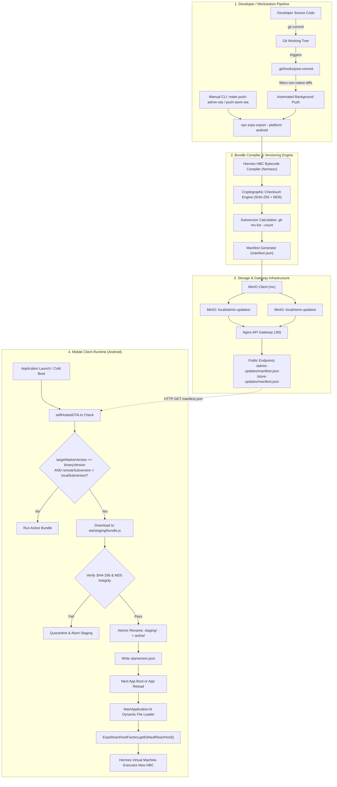
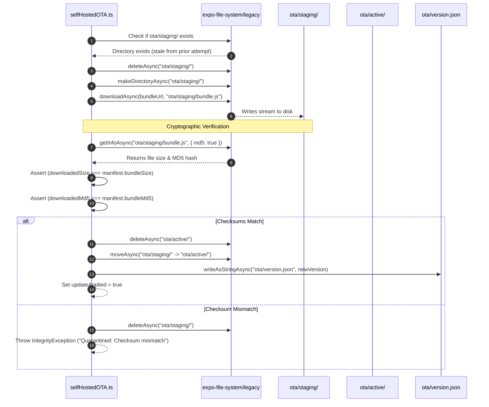

# 📡 White Paper: Enterprise Self-Hosted Over-The-Air (OTA) Updates Architecture & Lifecycle

**Technical White Paper on the Design, Security, Mathematical Versioning, and Native Runtime Mechanics of the DeepLens Zero-Vendor-Lock-In Mobile OTA Infrastructure.**

**Version:** 1.0.0  
**Status:** Approved & Production-Active  
**Scope:** Vayyari Admin (`com.vayyari.admin`) & Vayyari Store (`com.vayyari.store`)  
**Target Runtimes:** Android (React Native 0.86.3, Expo SDK 57 Bare Workflow, Hermes Engine)  

---

## 📌 Executive Summary & Abstract

Traditional mobile Over-The-Air (OTA) update frameworks—such as Expo Application Services (EAS) Update, Microsoft CodePush, or Shorebird—introduce heavy external cloud dependencies, non-trivial recurring operational costs, latency overhead, and external network telemetry into an enterprise stack. Furthermore, newer proprietary protocols (such as Expo Updates Protocol v1 introduced in Expo SDK 50+) enforce strict multipart/mixed HTTP response formats with complex cryptographic signing headers that cannot be hosted natively on high-throughput, static S3/MinIO storage appliances without bespoke, stateful proxy daemons.

The **DeepLens Self-Hosted OTA Architecture** solves these constraints by decoupling JavaScript bundle updates from cloud vendors entirely. It implements a zero-vendor-lock-in, 100% self-hosted update pipeline powered by:
1. **Local Object Storage**: MinIO enterprise buckets (`admin-updates` and `store-updates`).
2. **Reverse Proxy Edge Routing**: High-concurrency Nginx API gateway caching and serving manifests and bundles over local LAN, public domains, and private Tailscale VPN mesh networks.
3. **Monotonic Subversioning Arithmetic**: A deterministic, git-derived `<baseVersion>.<commitCount>[-dirty]` release numbering model.
4. **Native Bundle Hooking in React Native 0.86**: A dynamic bundle-loading interceptor inside Android `MainApplication.kt` that resolves custom file paths into `ExpoReactHostFactory` while falling back safely to compiled APK assets.
5. **Two-Stage Atomic Staging & Integrity Verification**: Client-side SHA-256 and MD5 cryptographic checks executed before an atomic filesystem swap, preventing partially-downloaded or corrupted bundles from ever executing.
6. **Native Guardrails**: An integer-based `targetNativeVersion` contract that prevents OTA bundles from executing on older native APKs when native C++/Kotlin dependencies diverge.

---

## 🏛️ 1. High-Level System Topology



---

## 🔄 2. The 6-Phase Lifecycle Deep Dive

### Phase 1: Ingestion & Change Detection

Automated OTA delivery begins when changes are committed to the codebase.

1. **Git Post-Commit Hook (`.git/hooks/post-commit`)**:
   - Executes automatically after every local `git commit`.
   - Utilizes `git diff-tree -r --no-commit-id --name-only HEAD` to inspect all modified files.
2. **Path Boundary Filtering**:
   - For **Vayyari Admin**: Evaluates if changes fall under `src/vayyari/` while strictly excluding native Android sources (`! src/vayyari/android/**`).
   - For **Vayyari Store**: Evaluates if changes fall under `src/store/` while strictly excluding native Android sources (`! src/store/android/**`).
   - If native code changed, OTA publishing is bypassed because native C++/Kotlin changes require a recompiled APK.
3. **Non-Blocking Background Detachment**:
   - The hook spawns the exporter asynchronously in the background (`( ... ) &`), releasing the terminal and returning control to the developer immediately.
4. **Bypass Flag**:
   - Developers can suppress automated OTA generation during experimental commits by setting `SKIP_OTA=1`:
     ```bash
     SKIP_OTA=1 git commit -m "wip: local experiment"
     ```

---

### Phase 2: Bytecode Compilation & Subversioning Arithmetic

Once triggered, [`push-update.sh`](file:///home/krikan/productivity/deeplens/src/vayyari/push-update.sh) or [`push-store-update.sh`](file:///home/krikan/productivity/deeplens/scripts/store/push-store-update.sh) executes compilation and version tagging.

#### 1. Bytecode Compilation via Hermes
Instead of shipping raw, unminified JavaScript that incurs parsing overhead on mobile devices, the build pipeline compiles directly to optimized Hermes Bytecode (HBC):
```bash
npx expo export --platform android --output-dir dist
```
The output produces:
- `dist/_expo/static/js/android/*.hbc`: Pre-compiled bytecode with symbol trees optimized for instant memory-mapping via `mmap()`.
- `dist/assets/`: Content-hashed asset bundles (images, fonts, vector icons).

#### 2. Monotonic Subversioning Mathematical Formula
DeepLens enforces monotonic, deterministic subversioning to ensure clients can strictly order releases without relying on timestamp races:

$$\text{Version} = \text{BaseVersion} \mathbin{\Vert} \text{"."} \mathbin{\Vert} \text{CommitCount} \mathbin{\Vert} [\text{"-dirty"}]$$

- **$\text{BaseVersion}$**: Parsed from the application's `app.json` (e.g. `1.0.0`).
- **$\text{CommitCount}$**: Evaluated via `git rev-list --count HEAD -- <app_directory>`. This counts only commits touching the specific application directory, guaranteeing a strictly increasing integer sequence ($N+1$).
- **$\text{DirtyFlag}$**: Evaluated via `git status --porcelain <app_directory>`. If uncommitted modifications exist during manual publishing, `-dirty` is appended to prevent false production equivalence.
- **Example Subversions**: `1.0.0.181`, `1.0.0.182`, `1.0.0.11`.

#### 3. Cryptographic Checksum Derivation
The primary bundle is hashed to prevent transit corruption:
```bash
BUNDLE_SHA256="$(sha256sum "$BUNDLE_FILE" | cut -d' ' -f1)"
BUNDLE_MD5="$(md5sum "$BUNDLE_FILE" | cut -d' ' -f1)"
BUNDLE_SIZE="$(wc -c < "$BUNDLE_FILE")"
```

#### 4. The Manifest Schema (`manifest.json`)
The manifest acts as the source of truth for mobile clients:
```json
{
  "version": "1.0.0.181-dirty",
  "baseVersion": "1.0.0",
  "subversion": 181,
  "commitSha": "9d6d963",
  "targetNativeVersion": 1,
  "bundlePath": "bundles/1.0.0.181-dirty/bundle.js",
  "bundleUrl": "http://krikanserver.taild227d9.ts.net/admin-updates/bundles/1.0.0.181-dirty/bundle.js",
  "bundleSha256": "c9b7de26f5738c965d41b6877a82aa75f6dfe1d773f35cb95f8414337095ba71",
  "bundleMd5": "db670c0de37af59fc9cd9f066c195374",
  "bundleSize": 10176804,
  "assetsPath": "bundles/1.0.0.181-dirty/assets/",
  "assetsUrl": "http://krikanserver.taild227d9.ts.net/admin-updates/bundles/1.0.0.181-dirty/assets/",
  "publishedAt": "2026-09-18T19:19:58Z",
  "releaseNotes": "Updated MinIO target bucket to admin-updates"
}
```

---

### Phase 3: Storage, Edge Proxying & Retention

```
MinIO (S3-Compatible)                    Nginx Edge Gateway (:80)
┌───────────────────────────────┐        ┌───────────────────────────────────────┐
│ local/admin-updates/          │        │ location /admin-updates/ {            │
│ ├── manifest.json             │◄───────┤     proxy_pass http://minio:9000/...  │
│ └── bundles/                  │        │     proxy_set_header Host minio:9000; │
│     ├── 1.0.0.180/            │        │ }                                     │
│     └── 1.0.0.181-dirty/      │        └───────────────────────────────────────┘
│ local/store-updates/          │        ┌───────────────────────────────────────┐
│ ├── manifest.json             │◄───────┤ location /store-updates/ {            │
│ └── bundles/                  │        │     proxy_pass http://minio:9000/...  │
│     └── 1.0.0.11-dirty/       │        │ }                                     │
└───────────────────────────────┘        └───────────────────────────────────────┘
```

1. **Bucket Topology**:
   - `admin-updates`: Isolated for Vayyari Admin application.
   - `store-updates`: Isolated for Vayyari Customer Store application.
   - Both configured with `mc anonymous set download local/<bucket>` for fast unauthenticated HTTP GET streaming.
2. **Nginx Edge Gateway Configuration**:
   - Routes requests directly from port 80 to internal MinIO port 9000.
   - Injects `proxy_set_header Host minio:9000` to satisfy MinIO virtual-host routing.
   - Enables seamless access across LAN (`192.168.0.170`), localhost, and Tailscale domain (`krikanserver.taild227d9.ts.net`).
3. **Automated Pruning Algorithm**:
   - Each publishing run lists version directories matching `^[0-9]+\.[0-9]+` and sorts ascending (`sort -V`).
   - If directory count exceeds `KEEP_VERSIONS=5`, the script computes $\text{DeleteCount} = \text{Total} - 5$ and executes recursive deletion on the oldest versions. This prevents infinite disk accumulation while preserving rollback depth.

---

### Phase 4: Discovery & Preflight Safety Verification

Upon cold boot or background resume, the client updater ([`selfHostedOTA.ts`](file:///home/krikan/productivity/deeplens/src/vayyari/services/selfHostedOTA.ts)) executes the discovery sequence:

```typescript
// 1. Dynamic Host Resolution
const host = getApiBaseHost(); // Evaluates dev host, LAN IP, or Tailscale domain
const manifestUrl = `http://${host}/admin-updates/manifest.json?t=${Date.now()}`;

// 2. Fetch with Cache-Busting
const response = await fetch(manifestUrl, { headers: { 'Cache-Control': 'no-cache' } });
const manifest: OTAManifest = await response.json();
```

#### Preflight Safety Checks
1. **Platform Filter**: Web clients (`Platform.OS === 'web'`) immediately exit; OTA updates are native-only.
2. **Native Version Guardrail**:
   $$\text{Status} = \begin{cases} \text{Proceed}, & \text{if } \text{manifest.targetNativeVersion} \le \text{CURRENT\_NATIVE\_VERSION} \\ \text{Abort (APK upgrade required)}, & \text{if } \text{manifest.targetNativeVersion} > \text{CURRENT\_NATIVE\_VERSION} \end{cases}$$
   *Rationale:* If a future release introduces a new native C++ TurboModule (e.g., OpenCV, new Camera module), applying a JS bundle referencing those native symbols into an older APK would cause immediate `UnsatisfiedLinkError` or `NativeModule not found` crashes. The guardrail guarantees the client rejects the bundle until the user installs a newer APK.
3. **Subversion Delta Evaluation**:
   The client compares the manifest subversion against [`ota/version.json`](file:///home/krikan/productivity/deeplens/src/vayyari/services/selfHostedOTA.ts):
   $$\Delta = \text{remote.subversion} - \text{local.subversion}$$
   If $\Delta > 0$, the update is scheduled for download. If $\Delta \le 0$, the client remains on the active bundle.

---

### Phase 5: Atomic Staging & Cryptographic Validation

Mobile filesystems are vulnerable to abrupt process termination (OS low-memory kills, battery depletion, user swiping the app away). To prevent bundle corruption, DeepLens uses a **two-tier atomic staging directory pattern**.

```
Device Local Storage (context.filesDir)
└── ota/
    ├── version.json             <-- Active Version Ledger
    ├── active/                  <-- Live Bundle (read by Native Host)
    │   └── bundle.js
    └── staging/                 <-- Isolated Quarantine Directory
        └── bundle.js            <-- Download & Verification in progress
```

#### The Atomic Staging Sequence



Because `moveAsync()` operates as an atomic `rename()` system call on the ext4/f2fs Linux filesystem, the active directory is never in a half-written or corrupted state.

---

### Phase 6: Native Runtime Loading (`MainApplication.kt`)

In modern React Native 0.86 with the New Architecture, bundle loading is managed by `ExpoReactHostFactory`. DeepLens hooks into native startup inside [`MainApplication.kt`](file:///home/krikan/productivity/deeplens/src/vayyari/android/app/src/main/java/com/vayyari/admin/MainApplication.kt):

```kotlin
override val reactHost: ReactHost
  get() = ReactNativeHostWrapper.createReactHost(
    applicationContext,
    object : DefaultReactHostDelegate {
      override fun getPackageList(): List<ReactPackage> = PackageList(this@MainApplication).packages
      override fun getJSEngineResolutionAlgorithm(): JSEngineResolutionAlgorithm =
        JSEngineResolutionAlgorithm.HERMES
      override fun getJSBundleFile(): String? {
        // Intercept: Check for active OTA bundle in private app storage
        val otaFile = File(applicationContext.filesDir, "ota/active/bundle.js")
        return if (otaFile.exists() && otaFile.length() > 0) {
          Log.i("DeepLensOTA", "Loading self-hosted OTA bundle: ${otaFile.absolutePath} (${otaFile.length()} bytes)")
          otaFile.absolutePath
        } else {
          Log.i("DeepLensOTA", "No active OTA bundle found; falling back to APK assets")
          null // Falls back automatically to assets://index.android.bundle
        }
      }
    }
  )
```

#### Execution Semantics:
1. **Cold Boot Priority**: When the app process starts, `getJSBundleFile()` checks `context.filesDir/ota/active/bundle.js`.
2. **If OTA Bundle Exists**: Returns the absolute Linux filesystem path (`/data/user/0/com.vayyari.admin/files/ota/active/bundle.js`). React Native's `JSBundleLoader.createFileLoader(path)` memory-maps the Hermes bytecode directly into memory.
3. **If OTA Bundle Does Not Exist**: Returns `null`. The engine falls back to `JSBundleLoader.createAssetLoader(applicationContext, "assets://index.android.bundle")` embedded inside the APK.

---

## 🔒 3. Security Architecture & Threat Mitigation

| Threat Vector | Mitigation Mechanism |
| :--- | :--- |
| **Man-In-The-Middle (MITM) Tampering** | Manifest defines expected SHA-256 (`bundleSha256`) and MD5 (`bundleMd5`). Client downloads into quarantine staging and verifies hashes before activation. Any modified byte fails validation and triggers immediate deletion. |
| **Network Interruption / Truncation** | File size is verified against `bundleSize`. Partial downloads fail size validation and are wiped from staging. |
| **Native Crash from Module Drift** | `targetNativeVersion` contract enforces that JS bundles cannot load on older APK binaries missing required native C++/Kotlin libraries. |
| **Cross-Tenant / Cross-App Leakage** | Separate isolated MinIO buckets (`admin-updates` vs `store-updates`) and independent package identities (`com.vayyari.admin` vs `com.vayyari.store`). |
| **Transport Boundary Control** | Cleartext traffic is strictly constrained via `network_security_config.xml` to trusted LAN subnets (`192.168.0.0/24`), `localhost`, and encrypted Tailscale wireguard mesh domains (`*.ts.net`). |

---

## ⚡ 4. Comparative Architecture Analysis

| Architectural Dimension | DeepLens Self-Hosted OTA | Expo EAS Update | Microsoft CodePush | Expo Updates Protocol v1 |
| :--- | :--- | :--- | :--- | :--- |
| **Cloud Vendor Dependency** | **Zero (100% Self-Hosted)** | AWS / Expo Cloud | Azure Cloud | Dedicated Node.js server |
| **Storage Backend** | S3 / MinIO Object Storage | Proprietary EAS backend | Azure Blob | Custom dynamic backend |
| **Response Format** | Standard Static JSON & HBC | Multipart HTTP protocol | JSON & Zip archive | Multipart/mixed with signature headers |
| **Air-Gapped / LAN Capable** | **Yes (Full LAN & Mesh support)** | No (Requires internet) | No (Requires internet) | Partial (Requires custom server) |
| **Recurring Cloud Costs** | **$0.00** | Metered MAU pricing | Deprecated / Sunset | Self-hosted compute costs |
| **Versioning Scheme** | Monotonic `<base>.<commits>` | Random UUID runtime | Semantic release string | Runtime version / Git hash |
| **Native Pre-Validation** | Integer `targetNativeVersion` | String `runtimeVersion` | Binary semver range | String `runtimeVersion` |
| **Hermes Bytecode Output** | Native `.hbc` direct stream | Platform-dependent | Platform-dependent | Platform-dependent |

---

## 🛠️ 5. Operational Runbook & Diagnostic Catalog

### 1. Manual Publishing Commands

```bash
# Publish Vayyari Admin OTA Bundle
make push-admin-ota
# Or: ./src/vayyari/push-update.sh --notes "Hotfix: resolve checkout bug"

# Publish Vayyari Store OTA Bundle
make push-store-ota
# Or: ./scripts/store/push-store-update.sh --notes "Feature: new category rail"

# Publish Both Apps Concurrently
make push-all-ota
```

### 2. Live Verification Commands

```bash
# Verify Admin Manifest via Gateway
curl -s http://localhost/admin-updates/manifest.json | jq .

# Verify Store Manifest via Gateway
curl -s http://localhost/store-updates/manifest.json | jq .

# Verify HTTP 200 and Content-Length on Bundle Downloads
curl -I -s http://localhost/admin-updates/bundles/1.0.0.181-dirty/bundle.js | head -n 5
curl -I -s http://localhost/store-updates/bundles/1.0.0.11-dirty/bundle.js | head -n 5

# Inspect Stored Bundles in MinIO
mc ls local/admin-updates/bundles/
mc ls local/store-updates/bundles/
```

### 3. Emergency Rollback Procedures

#### Scenario A: Roll Back to a Prior Working OTA Subversion
1. Check available historical versions in MinIO:
   ```bash
   mc ls local/admin-updates/bundles/
   ```
2. Re-point `manifest.json` to the previous bundle:
   ```bash
   # Download active manifest, edit "bundlePath" and "version" to target prior subversion, and re-upload
   mc cp local/admin-updates/manifest.json /tmp/manifest.json
   # Edit /tmp/manifest.json
   mc cp /tmp/manifest.json local/admin-updates/manifest.json
   ```
3. Mobile clients will read the updated manifest and download the target prior version.

#### Scenario B: Emergency Hard Reset (Purge OTA and Revert to Embedded APK Asset)
If a critical bundle must be revoked instantly across all devices:
1. Increment the `targetNativeVersion` in `manifest.json` (e.g. from `1` to `999`):
   ```json
   {
     "targetNativeVersion": 999
   }
   ```
2. All clients will fail the native version guardrail check and gracefully ignore the OTA bundle, continuing to run the safe, embedded APK asset.
3. On individual test devices, clear the OTA cache directly via ADB:
   ```bash
   adb shell rm -rf /data/user/0/com.vayyari.admin/files/ota/active/*
   adb shell am force-stop com.vayyari.admin
   adb shell am start -n com.vayyari.admin/.MainActivity
   ```

---

## 📚 Related Documentation & References

- [DeepLens Mobile Architecture Reference](file:///home/krikan/productivity/deeplens/docs/deeplens/architecture/vayyari-mobile-architecture.md)
- [Mobile Build & Deployment Guide](file:///home/krikan/productivity/deeplens/docs/deeplens/guides/mobile-build-and-deploy.md)
- [Vayyari Admin Source Directory (`src/vayyari`)](file:///home/krikan/productivity/deeplens/src/vayyari/)
- [Vayyari Store Source Directory (`src/store`)](file:///home/krikan/productivity/deeplens/src/store/)
- [Gateway Nginx Configuration](file:///home/krikan/productivity/deeplens/setupscripts/core/gateway/nginx.conf)
