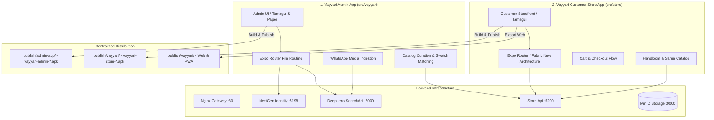

# Vayyari Mobile App Architecture & Release Guide

**Comprehensive architecture reference for the DeepLens mobile applications: Vayyari Admin App and Vayyari Store App, standalone APK builds, and release distribution pipelines.**

Last Updated: September 18, 2026  
Related ADO Stories: #336, #340, #537, #542, #546, #552, #558, #563

---

## 📱 Executive Overview: Two Distinct Mobile Applications

The DeepLens mobile ecosystem consists of two specialized React Native / Expo bare-workflow applications:



| Dimension | Vayyari Admin App | Vayyari Customer Store App |
| :--- | :--- | :--- |
| **Source Path** | `src/vayyari` | `src/store` |
| **Target Audience** | Merchants, catalog curators, store admins | End customers browsing & purchasing sarees |
| **Android Package ID** | `com.anonymous.vayyari` | `com.vayyari.store` |
| **Framework Version** | Expo SDK 57, React Native 0.86.3, React 19.2.3 | Expo SDK 57, React Native 0.86.3, React 19.2.3 |
| **Engine & Architecture** | Hermes Engine, New Architecture | Hermes Engine, New Architecture (Fabric) |
| **UI Component System** | Tamagui 2.7+ & React Native Paper | Tamagui 2.7+, BottomSheet v5, Reanimated 4 |
| **Publishing Location** | `publish/admin-app/` | `publish/vayyari/` |
| **Supported APK Variants** | Release (`vayyari-admin-latest.apk`) | Release & Debug (`vayyari-store-latest.apk`, `vayyari-store-debug-latest.apk`) |

---

## 🏗️ Technical Architecture & Component Layers

### 1. Framework & Core Runtime
- **Runtime**: React Native 0.86.3 with the native **Hermes JavaScript Engine**.
- **Workflow**: **Expo Bare Workflow** (Expo SDK 57) with full control over native `android/` directories.
- **Hermes Setup**: Configured with explicit `hermesCommand` and `postinstall` symlinks to `node_modules/react-native/sdks/hermesc/linux64-bin/hermesc`.
- **Memory Optimization**: Gradle build processes configured with `-Xmx6144m -XX:MaxMetaspaceSize=1024m` to prevent D8 dexer memory starvation.

### 2. Navigation & File-System Routing
- **Routing Engine**: `expo-router` v4+ using file-system conventions.
- **Module Safety**: Native modules like `expo-media-library` are guarded with lazy runtime pre-checks (`requireOptionalNativeModule`) to prevent startup crashes when running on platforms without the native module.

### 3. Backend API Connectivity
- **Vayyari Admin App**: Connects to `NextGen.Identity` (port 5198), `DeepLens.SearchApi` (port 5000), and `Store.Api` (port 5200).
- **Vayyari Store App**: Connects to `Store.Api` (port 5200) for catalog discovery, product curation details, swatches, and cart operations.
- **Cleartext & LAN Configuration**: Both apps configure `android:usesCleartextTraffic="true"` and network security configs allowing access to `192.168.0.170`, localhost, and Tailscale domain `krikanserver.taild227d9.ts.net`.

---

## 🔨 Android APK Build Pipelines

### 1. Store App Pipeline (`scripts/store/build-store-apk.sh`)
- Standalone multi-variant build script supporting:
  - `--release`: Compiles optimized release binary (`vayyari-store-latest.apk`, 34MB).
  - `--debug`: Compiles debuggable binary (`vayyari-store-debug-latest.apk`, 64MB).
  - `--both`: Compiles both variants sequentially.
  - `--arch <arm64|universal|x86_64>`: Configurable ABI target.
  - `--keep <N>`: Retains latest N historical builds (default: 3).
  - `--clean`: Pre-cleans Gradle cache.
  - `--install`: Auto-installs to connected device via ADB.
- Integrated into `infrastructure/deploy.sh` (`store-apk`, `store-apk-debug`, `store-apk-both`) and `Makefile`.

### 2. Admin App Pipeline (`infrastructure/deploy.sh`)
- Automated Gradle release packaging for `src/vayyari`:
  ```bash
  ./gradlew assembleRelease -x lint -x lintVitalAnalyzeRelease -Pandroid.enablePngCrunchInReleaseBuilds=false
  ```
- Output published to `publish/admin-app/` with SHA256 checksums and 3-version historical pruning.

---

## 🗄️ Distribution Directories & Checksum Verification

```
publish/
├── admin-app/
│   ├── README.md
│   ├── vayyari-admin-latest.apk
│   ├── vayyari-admin-v1.0.0-*.apk
│   └── ota/
└── vayyari/
    ├── README.md
    ├── vayyari-store-latest.apk
    ├── vayyari-store-latest.apk.sha256
    ├── vayyari-store-v1.0.0-*.apk
    ├── vayyari-store-debug-latest.apk
    ├── vayyari-store-debug-latest.apk.sha256
    ├── vayyari-store-debug-v1.0.0-*.apk
    └── (Web & PWA bundles)
```

Each APK artifact is accompanied by an audit-ready SHA256 checksum file and installation instructions.
