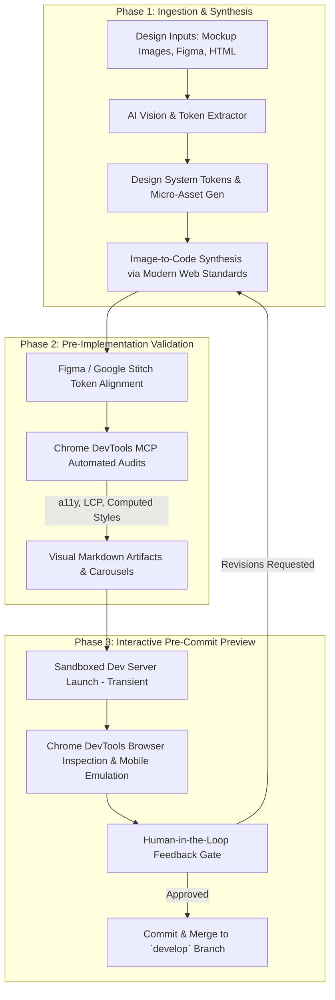

# AI-Driven UI Design Reference Ingestion & Interactive Preview Workflow

This guide documents the technical specification and standard operating procedure for AI-driven UI reference ingestion, multi-tool validation, and pre-commit interactive previews for the DeepLens project.

---

## 1. Core Architecture & Workflow Overview

---

## 2. Ingesting Static HTML & Reference Images

### 2.1 Ingesting Static HTML & Legacy CSS
- Parse legacy HTML/CSS using AST/layout analyzers.
- Extract typography hierarchy, color scales, layout grids, and spacing tokens into dynamic CSS variables.
- Replace legacy layout hacks (`float`, absolute positioning) with modern CSS (`display: grid`, `flex`, CSS Container Queries, `:has()`, `:user-valid`).

### 2.2 Reference Image Ingestion via Multimodal AI Vision
- Analyze mockups/screenshots to extract component boundaries, font weights, gradient stops, and color palettes.
- Leverage native AI image generation/editing (`generate_image`) for rapid visual design exploration (e.g. dark mode variations, theme alternatives, or wireframe mockups).

### 2.3 Image-to-Code Synthesis
- Synthesize responsive HTML5 semantic markup (`<header>`, `<main>`, `<article>`, `<dialog>`, `<popover>`) with Vanilla CSS design tokens.
- Apply modern web guidance standards out-of-the-box (fluid typography with `clamp()`, flexible grids, and accessible ARIA attributes).

---

## 3. Pre-Implementation Design Validation

### 3.1 Figma & Google Stitch Alignment
- **Figma Integration**: Ingest Figma node hierarchies, auto-layout rules, and design tokens via API/exports.
- **Google Stitch / Material 3 Alignment**: Map component states and design tokens to standard Material 3 / Stitch specifications (`elevation-2`, `md-sys-color-primary`).

### 3.2 Automated Validation via Chrome DevTools MCP
Run mandatory pre-implementation quality checks:
- **Accessibility (`a11y-debugging`)**: Verify WCAG 2.1 AA/AAA compliance, focus rings, contrast ratios, and screen reader compatibility.
- **Computed Styles (`chrome-devtools`)**: Inspect computed CSS rules, flex box behavior, and container bounds.
- **Performance (`debug-optimize-lcp`)**: Guarantee zero layout shift (CLS < 0.1) and fast hero element load times.

### 3.3 Visual Artifact Previews
- Generate markdown artifacts with side-by-side visual image diffs and multi-device carousels (Mobile 375px, Tablet 768px, Desktop 1440px).

---

## 4. Interactive Pre-Commit Design Previews

### 4.1 Transient Pre-Commit Preview Engine
- Launch a sandboxed local preview server (e.g., Vite/HTTP server on `localhost:5173`) from an isolated scratch directory without making dirty commits to `develop`.
- Use Chrome DevTools MCP (`navigate_page`, `evaluate_script`, `take_screenshot`) to inspect live DOM states, test hover transitions, and trigger dynamic UI controls (modals, popovers, drawers).

### 4.2 Human-in-the-Loop Feedback & ADO Workflow
- Present preview artifacts to stakeholders using interactive UI prompts (`ask_question`).
- Upon approval:
  1. Commit code to feature branch `squad/{ado-id}-{slug}` targeting `develop`.
  2. Update Azure DevOps Work Item state to `Closed` / `Resolved`.
  3. Create a Review Task assigned to `sai krishna kanth` (`krishna-kanth@outlook.com`).
