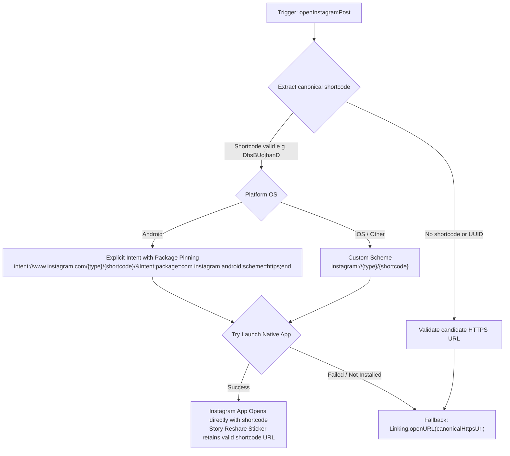

# Instagram Deep-Linking, Story Resharing & Universal Links Guide

This guide documents the definitive patterns, requirements, edge cases, and anti-patterns for Instagram link handling across the DeepLens & Vayyari ecosystem.

---

## 1. Overview & Problem Statement

Instagram links and deep-linking in Vayyari have historically been prone to regressions due to subtle platform behaviors across Android, iOS, web browsers, and Instagram's internal Story Composer:

1. **The Numeric ID vs. Shortcode Trap (Story Reshares)**:
   - Instagram posts have two identifiers:
     - **Alphanumeric Shortcode**: e.g., `DbsBUojhanD` (public, resolves on web as `https://www.instagram.com/reel/DbsBUojhanD/` or `https://www.instagram.com/p/DbsBUojhanD/`).
     - **Numeric Media ID**: e.g., `3957543988533504451` (internal 64-bit integer used by Instagram Graph API/databases).
   - If an app opens Instagram using the numeric scheme `instagram://media?id=3957543988533504451`, Instagram's internal Story Reshare composer generates a story link sticker pointing to:
     `https://www.instagram.com/p/3957543988533504451`
   - **Instagram's web servers return a 404 error** for numeric URLs. Anyone tapping the story sticker on mobile or web receives "Sorry, this page isn't available."

2. **The Android 12+ App Links vs. Browser Trap**:
   - Starting in Android 12 (API 31+), `Linking.openURL("https://www.instagram.com/...")` defaults to opening in Chrome / external browser unless the user manually enabled domain verification for Instagram.
   - Simply calling `Linking.openURL(httpsUrl)` causes the user to be kicked to the web browser instead of opening the Instagram native app.

3. **Database Shortcode Pollution**:
   - Storing database UUIDs or internal system IDs into shortcode columns breaks client-side post URL construction.

---

## 2. Definitive Architecture & Rules



### Golden Rules (Mandatory)

1. **NEVER launch `instagram://media?id={numericId}` for user post navigation**.
   - `media?id=` must NEVER be used to navigate to posts for sharing. It poisons the Story Composer link sticker payload with numeric IDs.
2. **ALWAYS prioritize Explicit Android Package Intents on Android**:
   - `intent://www.instagram.com/${postType}/${shortcode}/#Intent;package=com.instagram.android;scheme=https;end`
   - This bypasses Chrome/browser routing AND passes the canonical HTTPS shortcode URL directly to `com.instagram.android`.
3. **NEVER treat Database UUIDs as shortcodes**:
   - Valid Instagram shortcodes are alphanumeric strings (5–25 characters, `[A-Za-z0-9_-]`).
   - Check and reject UUIDs: `!/^[0-9a-f]{8}-[0-9a-f]{4}/i.test(code)`.
4. **Backend Filtering for Story Queues**:
   - All backend SQL queries that populate story queues must enforce canonical Instagram URL regex matching:
     `cv.url ~* 'instagram\.com/(p|reel|reels|tv)/[A-Za-z0-9_-]+'`

---

## 3. Scenarios & Implementation Reference

### Scenario A: Opening Post/Reel from Story Queue or Catalog (`openInstagramPost`)

**File**: [`src/vayyari/utils/instagram-helpers.ts`](file:///home/krikan/productivity/deeplens/src/vayyari/utils/instagram-helpers.ts)

```typescript
export const openInstagramPost = async (item: any): Promise<void> => {
    if (!item) return;

    let webUrl: string | null = null;
    let shortcode = '';
    let postType = 'p';

    if (typeof item === 'string') {
        const trimmed = item.trim();
        if (trimmed.startsWith('http://') || trimmed.startsWith('https://')) {
            const match = trimmed.match(/(?:https?:\/\/(?:www\.)?instagram\.com\/(p|reel|reels|tv)\/([A-Za-z0-9_-]+))/i);
            if (match) {
                postType = match[1].toLowerCase() === 'reels' ? 'reel' : match[1].toLowerCase();
                shortcode = match[2];
                webUrl = trimmed;
            }
        } else if (/^[A-Za-z0-9_-]{5,25}$/.test(trimmed) && !/^[0-9a-f]{8}-[0-9a-f]{4}/i.test(trimmed)) {
            shortcode = trimmed;
            webUrl = `https://www.instagram.com/p/${shortcode}/`;
        }
    } else {
        webUrl = getInstagramPostUrl(item);
        const rawCode = item.shortcode || item.code;
        if (rawCode && typeof rawCode === 'string' && !/^[0-9a-f]{8}-[0-9a-f]{4}/i.test(rawCode)) {
            shortcode = rawCode.trim();
        }
        if (webUrl) {
            const match = webUrl.match(/(?:https?:\/\/(?:www\.)?instagram\.com\/(p|reel|reels|tv)\/([A-Za-z0-9_-]+))/i);
            if (match) {
                postType = match[1].toLowerCase() === 'reels' ? 'reel' : match[1].toLowerCase();
                if (!shortcode) shortcode = match[2];
            }
        } else if (shortcode) {
            webUrl = `https://www.instagram.com/p/${shortcode}/`;
        }
    }

    if (!webUrl && !shortcode) {
        Alert.alert('Unavailable', 'No valid Instagram post link is available for this item.');
        return;
    }

    if (!webUrl && shortcode) {
        webUrl = `https://www.instagram.com/${postType}/${shortcode}/`;
    }

    const candidateUris: string[] = [];

    // 1. Android explicit Intent targeting com.instagram.android
    if (Platform.OS === 'android' && shortcode) {
        candidateUris.push(`intent://www.instagram.com/${postType}/${shortcode}/#Intent;package=com.instagram.android;scheme=https;end`);
        if (postType !== 'p') {
            candidateUris.push(`intent://www.instagram.com/p/${shortcode}/#Intent;package=com.instagram.android;scheme=https;end`);
        }
    }

    // 2. iOS custom scheme
    if (shortcode) {
        candidateUris.push(`instagram://${postType}/${shortcode}`);
        if (postType !== 'p') {
            candidateUris.push(`instagram://p/${shortcode}`);
        }
    }

    // Attempt native app URI
    for (const uri of candidateUris) {
        try {
            const canOpen = await Linking.canOpenURL(uri).catch(() => false);
            if (canOpen) {
                await Linking.openURL(uri);
                return;
            }
        } catch { }
    }

    if (candidateUris.length > 0) {
        try {
            await Linking.openURL(candidateUris[0]);
            return;
        } catch { }
    }

    // 3. Fallback to canonical web URL
    try {
        if (webUrl) await Linking.openURL(webUrl);
    } catch (err) {
        Alert.alert('Error', 'Could not open Instagram link.');
    }
};
```

---

### Scenario B: Opening User Profile or Direct Message (`openPlatformHandle`)

**File**: [`src/vayyari/utils/platformLink.ts`](file:///home/krikan/productivity/deeplens/src/vayyari/utils/platformLink.ts)

- **Instagram Handle Normalization**: Strip `@`, URLs, query parameters.
- **Web**: Opens `https://ig.me/m/{username}` in a new tab.
- **Mobile**:
  1. Try `https://ig.me/m/{username}` (Direct Message).
  2. Fallback to `instagram://user?username={username}`.
  3. Fallback to `https://instagram.com/{username}`.

---

### Scenario C: Story Queue Backend Query

**File**: [`src/DeepLens.Service/DeepLens.SearchApi/Controllers/InstaController.cs`](file:///home/krikan/productivity/deeplens/src/DeepLens.Service/DeepLens.SearchApi/Controllers/InstaController.cs)

- Ensure `competitor_videos` (or `posts`) has a valid canonical Instagram URL:
  ```sql
  WHERE sph.target_watchlist_id = @TargetWatchlistId
    AND sph.posted_at IS NULL
    AND cv.url IS NOT NULL
    AND cv.url != ''
    AND cv.url ~* 'instagram\.com/(p|reel|reels|tv)/[A-Za-z0-9_-]+'
  ```

---

## 4. Verification Checklist Before Merging Any Changes

| Check | Requirement | Verified Method |
|---|---|---|
| **Story Reshare URL** | Reshare sticker contains `/reel/{shortcode}/` or `/p/{shortcode}/` | Tap share to story in Instagram, inspect sticker URL |
| **No Browser Redirect** | Tapping Instagram action launches app directly without opening Chrome | Tap Instagram badge on Android & iOS device |
| **Typecheck** | 0 TypeScript compile errors in Vayyari | `npx tsc --noEmit` in `src/vayyari` |
| **Invalid Link Handling** | Missing/corrupt links display clean toast/alert, no crash | Feed corrupt item to `openInstagramPost` |
| **Expo Reload** | Packager reloads cleanly | `tmux send-keys -t expo r C-m` |
