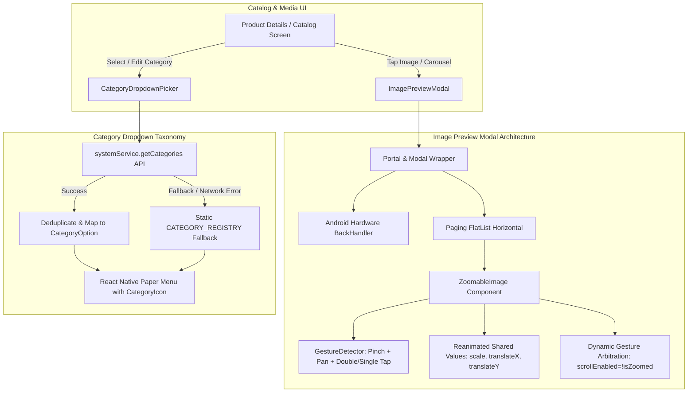

# 🖼️ Catalog & Media Features Guide

This guide documents the mobile catalog viewing, high-resolution media preview architecture, and category taxonomy selector components in the **Vayyari** client application.

---

## 🏗️ Architecture & Interaction Overview



---

## 1. Catalog Image Preview Modal (`ImagePreviewModal.tsx`)

The `ImagePreviewModal` component provides a full-screen, immersive media viewer with paging carousel support, high-resolution image zoom, and social sharing.

### 1.1 Modal Hierarchy & Portal Containment
- **Portal & Modal**: Rendered inside a React Native Paper `<Portal>` and `<Modal>` to escape view hierarchy clipping and overlay full screen across system bars.
- **Top Actions**: Fixed header bar providing a real-time page index (`currentIndex + 1 / total`), a native `Share.share` button, and an explicit close button.
- **Multi-Image Carousel**: Implemented with a horizontal `FlatList` configured with `pagingEnabled`, `initialScrollIndex`, and `getItemLayout` for $O(1)$ fast jumps to selected thumbnails.

### 1.2 Android System Back-Handler Integration
To guarantee intuitive Android navigation ergonomics, `ImagePreviewModal` intercepts the hardware/gesture back event:
```typescript
useEffect(() => {
    if (!visible) return;
    const onBackPress = () => {
        onDismiss();
        return true; // Prevents default navigation pop
    };
    const subscription = BackHandler.addEventListener('hardwareBackPress', onBackPress);
    return () => subscription.remove();
}, [visible, onDismiss]);
```
- When the modal is open, pressing the physical Android back button or triggering the edge back gesture dismisses the modal overlay rather than navigating away from the underlying screen.

---

## 2. Gesture-Driven Pan & Pinch-to-Zoom (`ZoomableImage.tsx`)

High-performance, 60fps image zooming and panning is implemented using `react-native-gesture-handler` (v2) and `react-native-reanimated` (v3).

### 2.1 Gestures Supported
1. **Pinch-to-Zoom (`Gesture.Pinch()`)**:
   - Dynamically scales the image between `1.0x` and `5.0x`.
   - On pinch release, if scale is $< 1.1x$, it smoothly springs back to `1.0x` via `withTiming()`.
2. **Pan (`Gesture.Pan()`)**:
   - Active only when `scale > 1.05x`.
   - Computes container bounds:
     ```typescript
     const maxTranslateX = ((scale.value - 1) * containerWidth) / 2;
     const maxTranslateY = ((scale.value - 1) * containerHeight) / 2;
     ```
     Constrains panning to avoid displaying empty borders around the image.
3. **Double Tap (`Gesture.Tap().numberOfTaps(2)`)**:
   - Toggles between normal state (`1.0x`) and quick zoom (`2.5x`) focused around the tap coordinates.
4. **Single Tap (`Gesture.Tap().numberOfTaps(1)`)**:
   - Composed exclusively with double tap (`Gesture.Exclusive(doubleTapGesture, singleTapGesture)`) to toggle UI overlay bars or trigger modal dismissal without false triggers.

### 2.2 Carousel Swipe Conflict Management
When an image is zoomed in, horizontal pan gestures within the image must not trigger the parent `FlatList` horizontal paging.
- `ZoomableImage` communicates zoom state to its parent via `onZoomChange(isZoomed: boolean)`.
- `ImagePreviewModal` dynamically disables `FlatList` horizontal scrolling when zoomed:
  ```tsx
  <FlatList
      scrollEnabled={!isZoomed}
      ...
  />
  ```
- All gestures are combined using `Gesture.Simultaneous(pinchGesture, panGesture, tapGestures)` within a `GestureHandlerRootView`.

---

## 3. Category Dropdown Selector (`CategoryDropdownPicker.tsx`)

The `CategoryDropdownPicker` provides a standardized category taxonomy selector across product creation, details editing, and quick catalog management.

### 3.1 Data Resolution & Fallback Registry
1. **Dynamic Backend Fetching**:
   On mount, the component calls `systemService.getCategories()` (`GET /api/v1/system/categories`).
2. **Deduplication**:
   Deduplicates incoming categories case-insensitively by name.
3. **Graceful Fallback**:
   If the backend API is unreachable or returns an empty list, it seamlessly falls back to the static `CATEGORY_REGISTRY` defined in `src/vayyari/components/CategoryIcons.tsx`:
   ```typescript
   try {
     const list = await systemService.getCategories();
     ...
   } catch (error) {
     console.warn('Failed to fetch categories from API, falling back to registry', error);
     setCategories(
       CATEGORY_REGISTRY.map((c) => ({
         id: c.id.toLowerCase(),
         label: c.label,
         iconName: c.id.toLowerCase(),
       }))
     );
   }
   ```

### 3.2 UI Rendering & Visual Hierarchy
- Built upon React Native Paper's `<Menu>` and `<TouchableOpacity>` trigger anchor.
- Features dynamic icon rendering via `<CategoryIcon>` for both selected states and dropdown list items.
- Supports disabled states, custom placeholder text, and active category highlighting with primary color accents.

### 3.3 Screen Usages
- **Product Details Screen** (`src/vayyari/app/product/[id]/index.tsx`): Category modification and classification.
- **Catalog Quick Edit Modals & Uploaders**: Fast taxonomy tagging during product batch uploads.
