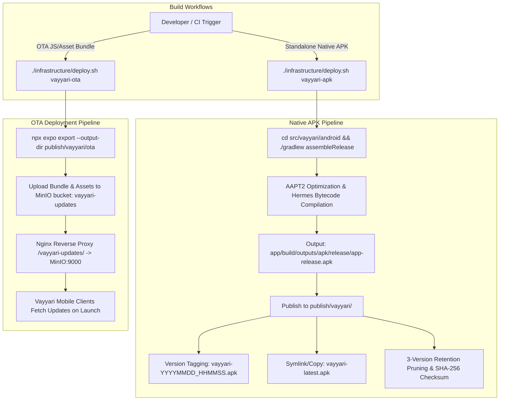

# 📱 Vayyari Mobile Build & Deployment Guide

This guide documents the build, packaging, self-hosted Over-The-Air (OTA) deployment, and networking architecture for the **Vayyari** React Native / Expo mobile application in DeepLens.

---

## 🏗️ Architecture & Deployment Flow



---

## 1. Standalone Release APK Build Workflow

The standalone Android APK provides the complete native container (including TurboModules, Fabric rendering, native libraries, and initial Hermes-compiled JS bundle).

### 1.1 Automated CLI Command
From the project root:
```bash
./infrastructure/deploy.sh vayyari-apk
```
*(Or via `setupscripts/application/services/build-and-deploy.sh`)*

### 1.2 Gradle Build Mechanics & Environment Requirements
Under the hood, the build script navigates to `src/vayyari/android` and executes:
```bash
./gradlew assembleRelease
```

Key configuration parameters specified in `src/vayyari/android/gradle.properties`:
- **JVM Memory Settings**:
  ```properties
  org.gradle.jvmargs=-Xmx2048m -XX:MaxMetaspaceSize=512m
  org.gradle.parallel=true
  ```
  Allocates 2GB max heap and 512MB Metaspace to prevent Out-Of-Memory (OOM) errors during heavy React Native code generation and AAPT resource crunching.
- **AAPT2 Requirements**:
  ```properties
  android.enablePngCrunchInReleaseBuilds=true
  android.useAndroidX=true
  ```
  Ensures asset PNG crunching and modern AndroidX namespace mapping during compilation.
- **Architecture & Engine**:
  ```properties
  reactNativeArchitectures=armeabi-v7a,arm64-v8a,x86,x86_64
  newArchEnabled=true
  hermesEnabled=true
  ```
  Enables the React Native New Architecture (Fabric / TurboModules) and Hermes JavaScript engine for optimal mobile startup performance.

---

## 2. Artifact Output, Retention & Checksums

### 2.1 Artifact Staging
After compilation, the release APK located at:
`src/vayyari/android/app/build/outputs/apk/release/app-release.apk`
is copied into the central distribution directory:
```
publish/vayyari/
├── vayyari-20260828_101500.apk
├── vayyari-20260828_143020.apk
├── vayyari-20260829_003015.apk
└── vayyari-latest.apk -> (latest build copy)
```

### 2.2 3-Version Retention Policy
To prevent unconstrained disk space usage while retaining recent deployment rollbacks, `deploy.sh` enforces a strict 3-version retention rule using timestamp-based sorting:
```bash
# Retain only the 3 newest timestamped APKs
ls -1t "$HOSTING_PATH"/vayyari-[0-9]*_[0-9]*.apk 2>/dev/null | tail -n +4 | xargs -r rm -f
```

### 2.3 Integrity & Checksum Verification
Every build logs its file size and SHA-256 checksum for auditability:
```bash
APK_SIZE=$(du -h "$LATEST_APK" | cut -f1)
APK_SHA=$(sha256sum "$LATEST_APK" | cut -d' ' -f1)
echo "✅ APK generated successfully: $LATEST_APK ($APK_SIZE, SHA256: $APK_SHA)"
```

---

## 3. Self-Hosted OTA (Over-The-Air) Bundle Deployment

Self-hosted OTA updates allow fast JS and asset hotfixes without requiring users to reinstall native APK binaries.

### 3.1 OTA Export Command
```bash
./infrastructure/deploy.sh vayyari-ota
```
This executes:
```bash
cd src/vayyari
npx expo export --output-dir "../../publish/vayyari/ota"
```

### 3.2 MinIO Storage & Distribution Architecture
- **Bucket**: `vayyari-updates` in self-hosted MinIO (`192.168.0.170:9000`).
- **Nginx Reverse Proxy**:
  Nginx routes incoming `/vayyari-updates/` requests directly to MinIO:
  ```nginx
  location /vayyari-updates/ {
      proxy_pass http://minio:9000/vayyari-updates/;
      proxy_set_header Host minio:9000;
      proxy_set_header X-Real-IP $remote_addr;
      proxy_set_header X-Forwarded-For $proxy_add_x_forwarded_for;
  }
  ```
- **Manifest & Assets**:
  The export outputs `metadata.json`, `index.bundle`, and hashed asset files.
- **Client Auto-Updating**:
  On app initialization, `expo-updates` checks the manifest endpoint. If a newer bundle hash is detected matching the native runtime version, it downloads the assets in the background and applies them on the next launch or reload.

---

## 4. Android Network Security & Cleartext Traffic

Because DeepLens local and staging environments operate over private LAN (`192.168.0.170`), localhost loopbacks, or Tailscale VPN mesh addresses (`krikanserver.taild227d9.ts.net`), Android requires explicit cleartext and local domain trust configuration.

### 4.1 Manifest Cleartext Flag
In `src/vayyari/android/app/src/main/AndroidManifest.xml` and `src/vayyari/app.json`:
```xml
<application
    ...
    android:usesCleartextTraffic="true"
    android:networkSecurityConfig="@xml/network_security_config">
```

### 4.2 Network Security Configuration
In `src/vayyari/android/app/src/main/res/xml/network_security_config.xml`:
```xml
<?xml version="1.0" encoding="utf-8"?>
<network-security-config>
    <base-config cleartextTrafficPermitted="true">
        <trust-anchors>
            <certificates src="system" />
            <certificates src="user" />
        </trust-anchors>
    </base-config>
    <domain-config cleartextTrafficPermitted="true">
        <domain includeSubdomains="true">192.168.0.170</domain>
        <domain includeSubdomains="true">192.168.0</domain>
        <domain includeSubdomains="true">10.0.0.0</domain>
        <domain includeSubdomains="true">127.0.0.1</domain>
        <domain includeSubdomains="true">localhost</domain>
        <domain includeSubdomains="true">krikanserver.taild227d9.ts.net</domain>
    </domain-config>
</network-security-config>
```

This configuration ensures:
1. **Developer Workstations & Local IPs**: Permitted to stream Metro bundle and make HTTP API calls to backend services on `192.168.0.170` and `localhost`.
2. **Tailscale Mesh Connectivity**: Seamless secure cleartext routing to the host server domain `krikanserver.taild227d9.ts.net`.
3. **Custom / Self-Signed Root Certificates**: User-installed certificate authorities (trust-anchors) are accepted for debugging tools like Charles Proxy or Flipper.
