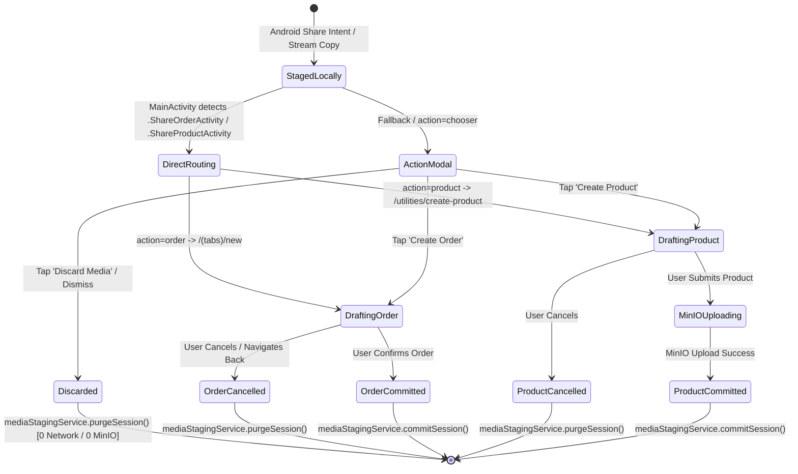

# 📤 Multi-Action Share Intent & Local Media Staging Guide

This guide documents the native Android Share Intent integration, `<activity-alias>` share targets, stream-to-local-cache staging architecture, deep link parameter emission, Expo Router `share-target` routing, deferred MinIO upload policy, and product/order creation workflows in the **Vayyari** client application.

---

## 🏗️ Architecture & Interaction Flow

```mermaid
flowchart TD
    subgraph External App
        A[External App / Gallery / WhatsApp / Instagram] -->|Share Media| B[Android System Share Sheet]
    end

    subgraph Native Android Layer (MainActivity.kt & Manifest Aliases)
        B -->|Select 'Vayyari: Create Order'| C1[Activity Alias: .ShareOrderActivity]
        B -->|Select 'Vayyari: Add Product'| C2[Activity Alias: .ShareProductActivity]
        C1 --> D[MainActivity.handleShareIntent]
        C2 --> D
        D -->|Inspect EXTRA_STREAM| E{Single or Multi?}
        E -->|Single Uri / ArrayList of Uris| F[Stream copy to cacheDir]
        F --> G["staged_share/{sessionId}/media_{i}.{ext}"]
        G -->|Inspect intent.component.shortClassName| H{Detect Action}
        H -->|ShareOrderActivity| I["vayyari://share-target?action=order&sessionId={id}&uris={uris}"]
        H -->|ShareProductActivity| J["vayyari://share-target?action=product&sessionId={id}&uris={uris}"]
        H -->|Other / Fallback| K["vayyari://share-target?action=chooser&sessionId={id}&uris={uris}"]
        I --> L[Set Intent Action ACTION_VIEW]
        J --> L
        K --> L
    end

    subgraph Expo Router & Deep Link Routing (app/share-target.tsx)
        L --> M[app/share-target.tsx]
        M --> N[Parse Query Params: action, sessionId, uris]
        N --> O[Populate ShareIntentContext: setSharedMedia]
        O --> P{action param}
        P -->|action=order| Q[router.replace '/(tabs)/new']
        P -->|action=product| R[router.replace '/utilities/create-product']
        P -->|action=chooser| S[router.replace '/(tabs)' / Open Chooser Modal]
    end

    subgraph Form Commit & Upload Policy
        Q --> T[NewOrderScreen]
        R --> U[ProductCreationForm]
        T -->|Submit Order| V[commitCurrentSession -> Purge Local Staging]
        U -->|Submit Product| W[Upload Staged Assets to MinIO -> commitCurrentSession]
    end
```

---

## 1. Native Android `<activity-alias>` Share Target Configuration

The Android application manifest registers dedicated `<activity-alias>` targets pointing to `MainActivity`. This surfaces distinct entry points in the Android system share sheet with tailored labels, allowing merchants to choose directly whether to create an order or add a catalog product from external apps (e.g., WhatsApp, Instagram, Gallery).

### `AndroidManifest.xml`
```xml
<activity
    android:name=".MainActivity"
    android:configChanges="keyboard|keyboardHidden|orientation|screenSize|screenLayout|uiMode"
    android:launchMode="singleTask"
    android:windowSoftInputMode="adjustResize"
    android:theme="@style/Theme.App.SplashScreen"
    android:exported="true"
    android:screenOrientation="portrait">
    
    <intent-filter>
        <action android:name="android.intent.action.MAIN"/>
        <category android:name="android.intent.category.LAUNCHER"/>
    </intent-filter>

    <!-- Deep Linking Scheme -->
    <intent-filter>
        <action android:name="android.intent.action.VIEW"/>
        <category android:name="android.intent.category.DEFAULT"/>
        <category android:name="android.intent.category.BROWSABLE"/>
        <data android:scheme="vayyari"/>
        <data android:scheme="exp+vayyari"/>
    </intent-filter>
</activity>

<!-- Share Target 1: Create Order -->
<activity-alias
    android:name=".ShareOrderActivity"
    android:targetActivity=".MainActivity"
    android:label="Vayyari: Create Order"
    android:icon="@mipmap/ic_launcher"
    android:exported="true">
    <intent-filter>
        <action android:name="android.intent.action.SEND"/>
        <data android:mimeType="image/*"/>
        <data android:mimeType="video/*"/>
        <category android:name="android.intent.category.DEFAULT"/>
    </intent-filter>
    <intent-filter>
        <action android:name="android.intent.action.SEND_MULTIPLE"/>
        <data android:mimeType="image/*"/>
        <data android:mimeType="video/*"/>
        <category android:name="android.intent.category.DEFAULT"/>
    </intent-filter>
</activity-alias>

<!-- Share Target 2: Add Product -->
<activity-alias
    android:name=".ShareProductActivity"
    android:targetActivity=".MainActivity"
    android:label="Vayyari: Add Product"
    android:icon="@mipmap/ic_launcher"
    android:exported="true">
    <intent-filter>
        <action android:name="android.intent.action.SEND"/>
        <data android:mimeType="image/*"/>
        <data android:mimeType="video/*"/>
        <category android:name="android.intent.category.DEFAULT"/>
    </intent-filter>
    <intent-filter>
        <action android:name="android.intent.action.SEND_MULTIPLE"/>
        <data android:mimeType="image/*"/>
        <data android:mimeType="video/*"/>
        <category android:name="android.intent.category.DEFAULT"/>
    </intent-filter>
</activity-alias>
```

---

## 2. Stream-to-Local-Cache Staging & Component Detection (`MainActivity.kt`)

### Problem: Android `content://` URI Expiration
When an external application shares media, it grants temporary read permissions via `content://` URIs. In Android 11+ (API 30+) and Android 13+ (API 33+), these security grants expire rapidly once the sending activity terminates or the user navigates across screens, causing `SecurityException: Permission Denial` when the app tries to access or upload the file later.

### Solution: Immediate Native Stream Staging & Component Classification
`MainActivity.kt` intercepts the incoming share intent during both cold start (`onCreate`) and warm resume (`onNewIntent`):
1. Copies raw input streams into an isolated application cache directory (`staged_share/{sessionId}/`).
2. Inspects `intent.component?.shortClassName` to identify whether `.ShareOrderActivity` or `.ShareProductActivity` was chosen.
3. Constructs an internal deep link with `action=order`, `action=product`, or `action=chooser`.

```kotlin
private fun handleShareIntent(intent: Intent?) {
    if (intent == null) return
    val action = intent.action
    val type = intent.type

    val isMedia = type != null && (type.startsWith("image/") || type.startsWith("video/") || type == "*/*")
    if ((Intent.ACTION_SEND == action || Intent.ACTION_SEND_MULTIPLE == action) && isMedia) {
        val rawUris = mutableListOf<Uri>()

        // 1. Extract Parcelable URI(s) with Android 13+ TIRAMISU type safety
        if (Intent.ACTION_SEND == action) {
            val uri = if (Build.VERSION.SDK_INT >= Build.VERSION_CODES.TIRAMISU) {
                intent.getParcelableExtra(Intent.EXTRA_STREAM, Uri::class.java)
            } else {
                @Suppress("DEPRECATION")
                intent.getParcelableExtra(Intent.EXTRA_STREAM) as? Uri
            }
            uri?.let { rawUris.add(it) }
        } else if (Intent.ACTION_SEND_MULTIPLE == action) {
            val uriList = if (Build.VERSION.SDK_INT >= Build.VERSION_CODES.TIRAMISU) {
                intent.getParcelableArrayListExtra(Intent.EXTRA_STREAM, Uri::class.java)
            } else {
                @Suppress("DEPRECATION")
                intent.getParcelableArrayListExtra<Uri>(Intent.EXTRA_STREAM)
            }
            uriList?.forEach { uri -> rawUris.add(uri) }
        }

        // 2. Stage streams to isolated session directory in cacheDir
        if (rawUris.isNotEmpty()) {
            val sessionId = java.util.UUID.randomUUID().toString()
            val stageDir = java.io.File(cacheDir, "staged_share/$sessionId").apply { mkdirs() }
            val localUris = mutableListOf<String>()

            rawUris.forEachIndexed { index, uri ->
                try {
                    val mimeType = contentResolver.getType(uri) ?: type ?: "image/jpeg"
                    val extension = when {
                        mimeType.contains("png") -> "png"
                        mimeType.contains("webp") -> "webp"
                        mimeType.contains("gif") -> "gif"
                        mimeType.contains("mp4") -> "mp4"
                        mimeType.contains("quicktime") || mimeType.contains("mov") -> "mov"
                        mimeType.contains("video") -> "mp4"
                        else -> "jpg"
                    }
                    val targetFile = java.io.File(stageDir, "media_${index}.${extension}")
                    contentResolver.openInputStream(uri)?.use { inputStream ->
                        targetFile.outputStream().use { outputStream ->
                            inputStream.copyTo(outputStream)
                        }
                    }
                    localUris.add(Uri.fromFile(targetFile).toString())
                } catch (e: Exception) {
                    android.util.Log.e("MainActivity", "Failed to stage shared media stream: $uri", e)
                    localUris.add(uri.toString())
                }
            }

            // 3. Detect target action from component short class name & construct deep link
            if (localUris.isNotEmpty()) {
                val componentClass = intent.component?.shortClassName ?: ""
                val targetAction = when {
                    componentClass.endsWith("ShareOrderActivity") -> "order"
                    componentClass.endsWith("ShareProductActivity") -> "product"
                    else -> "chooser"
                }
                val encodedUris = localUris.joinToString(",") { Uri.encode(it) }
                val deepLink = "vayyari://share-target?action=$targetAction&sessionId=$sessionId&uris=$encodedUris"
                intent.action = Intent.ACTION_VIEW
                intent.data = Uri.parse(deepLink)
            }
        }
    }
}
```

### Staging Folder Structure
```
{cacheDir}/staged_share/
└── a3f94b21-419b-432d-9477-d1d8ef3f94ba/
    ├── media_0.jpg
    ├── media_1.jpg
    └── media_2.mp4
```

---

## 3. Expo Router Direct Routing & Context Population (`app/share-target.tsx`)

The Expo Router route `app/share-target.tsx` acts as the single landing hub for incoming `vayyari://share-target` deep links.

### Deep Link Resolution Flow
1. Extracts `action` (`order` | `product` | `chooser`), `sessionId`, and `uris` from query parameters.
2. Converts raw comma-separated URIs into typed `SharedMediaItem` models (`image` vs `video`).
3. Invokes `setSharedMedia(items, sessionId)` on `ShareIntentContext` to hold the staged media in global React state.
4. Performs immediate redirection using `router.replace`:
   - `action === 'order'` ➡️ navigates directly to `/(tabs)/new` (New Order creation screen).
   - `action === 'product'` ➡️ navigates directly to `/utilities/create-product` (Product Creation form).
   - `action === 'chooser'` / fallback ➡️ navigates to `/(tabs)` where `ShareActionChooserModal` is presented.

### `app/share-target.tsx` Implementation
```typescript
import React, { useEffect } from 'react';
import { StyleSheet, View } from 'react-native';
import { ActivityIndicator, Text, useTheme } from 'react-native-paper';
import { useRouter, useLocalSearchParams } from 'expo-router';
import { useShareIntentContext, SharedMediaItem } from '@/context/ShareIntentContext';

export default function ShareTargetScreen() {
  const router = useRouter();
  const theme = useTheme();
  const params = useLocalSearchParams<{
    action?: string;
    sessionId?: string;
    uris?: string;
    media?: string;
  }>();
  const { setSharedMedia } = useShareIntentContext();

  useEffect(() => {
    const action = params.action || 'chooser';
    const sessionId = params.sessionId;
    const urisParam = params.uris || params.media;

    if (urisParam && typeof urisParam === 'string') {
      const uris = urisParam.split(',').filter(Boolean);
      const items: SharedMediaItem[] = uris.map(uri => {
        const lower = uri.toLowerCase();
        const isVideo =
          lower.endsWith('.mp4') ||
          lower.endsWith('.mov') ||
          lower.endsWith('.mkv') ||
          lower.endsWith('.webm');
        return {
          uri,
          type: isVideo ? 'video' : 'image',
          sessionId,
        };
      });

      // Stage media in context
      setSharedMedia(items, sessionId);

      // Direct route based on target action
      if (action === 'order') {
        router.replace('/(tabs)/new');
      } else if (action === 'product') {
        router.replace('/utilities/create-product');
      } else {
        // Fallback to tabs where chooser modal will be handled or displayed
        router.replace('/(tabs)');
      }
    } else {
      // If no URIs received, route back to main tabs
      router.replace('/(tabs)');
    }
  }, [params, router, setSharedMedia]);

  return (
    <View style={[styles.container, { backgroundColor: theme.colors.background }]}>
      <ActivityIndicator size="large" color={theme.colors.primary} />
      <Text variant="bodyMedium" style={[styles.text, { color: theme.colors.onSurfaceVariant }]}>
        Processing shared media...
      </Text>
    </View>
  );
}
```

---

## 4. Fallback: Instagram-Style Share Action Chooser Modal

When an intent does not match a direct action alias (e.g., standard share deep link with `action=chooser`), `useShareIntent` displays `ShareActionChooserModal`:

```
+-------------------------------------------------------------+
|  [📤] Shared Media Received                                [✕] |
|       3 items staged locally                                |
+-------------------------------------------------------------+
|  +-----------+  +-----------+  +-----------+                |
|  |  #1       |  |  #2       |  |  #3       |                |
|  | [Image 1] |  | [Image 2] |  | [Video 3] |   (Carousel)   |
|  +-----------+  +-----------+  +-----------+                |
+-------------------------------------------------------------+
|       Choose what you would like to create with this media: |
|                                                             |
|  [ 🛒  Create Order                   (Contained) ]         |
|  [ 🏷️  Create Product / Add to Catalog (Outlined)  ]         |
|  [ 🗑️  Discard Media                  (Text/Error)]         |
+-------------------------------------------------------------+
```

### Modal Actions & Navigation
1. **Create Order (`onCreateOrder`)**:
   - Stores the staged items and `sessionId` in `ShareIntentContext`.
   - Dismisses modal and navigates to `/(tabs)/new`.
   - Pre-fills the order draft with attached media thumbnails.
2. **Create Product / Add to Catalog (`onCreateProduct`)**:
   - Stores the staged items and `sessionId` in `ShareIntentContext`.
   - Dismisses modal and navigates to `/utilities/create-product`.
   - Pre-populates the product image gallery.
3. **Discard Media (`onDiscard`)**:
   - Triggers `mediaStagingService.purgeSession(sessionId)` immediately.
   - Clears memory state and dismisses modal.

---

## 5. Local Media Staging Lifecycle & Deferred MinIO Upload Policy

The media lifecycle guarantees zero storage waste and zero network overhead for aborted drafts.



### Key Principles (`media-staging.service.ts`)
- **Strictly Local During Drafting**: Media resides only in `{cacheDir}/staged_share/{sessionId}/`. No presigned URLs or MinIO upload requests are made while the user edits form fields.
- **Zero-Cost Discard**: Discarding or canceling a draft immediately deletes `{cacheDir}/staged_share/{sessionId}/` using `FileSystem.deleteAsync`, releasing device disk space without touching the network.
- **Upload Upon Commit**: MinIO uploads are deferred until the merchant explicitly clicks **Create Product**.
- **Automated Cleanup**: On app launch, `mediaStagingService.cleanupOldStaging()` scans the staging root and deletes any orphaned staging sessions older than 24 hours (86,400 seconds).

---

## 6. Form Integrations

### 6.1 `NewOrderScreen` (`src/vayyari/app/(tabs)/new.tsx`)
- Displays staged images/videos in `SharedMediaPreview` at the top of the order creation screen.
- On order save (`handleCreateOrder`), records local URIs/references and invokes `commitCurrentSession()`:
  ```typescript
  // Clean up staged local session since order creation committed
  await commitCurrentSession();
  ```

### 6.2 `ProductCreationForm` (`src/vayyari/components/utility/product/ProductCreationForm.tsx`)
- Reads `sharedMedia` from `useShareIntentContext()` and automatically maps items into `ImageUploadList`:
  ```typescript
  if (sharedMedia && sharedMedia.length > 0) {
    const mappedAssets = sharedMedia.map((m, idx) => ({
      uri: m.uri,
      width: 800,
      height: 800,
      fileName: m.fileName || `staged_media_${idx}.jpg`,
      mimeType: m.type === 'video' ? 'video/mp4' : 'image/jpeg',
    }));
    setImages(prev => {
      const existingUris = new Set(prev.map(p => p.uri));
      const newToAdd = mappedAssets.filter(a => !existingUris.has(a.uri));
      return [...prev, ...newToAdd];
    });
  }
  ```
- **Lifecycle Wrappers**:
  - `handleSuccessWrapper`: Calls `await commitCurrentSession()` after successful product persistence and MinIO upload.
  - `handleCancelWrapper`: Calls `await discardCurrentSession()` to wipe staged files from the local device cache if the user cancels.

---

## 7. Verification & Troubleshooting

| Symptom | Probable Cause | Resolution |
| :--- | :--- | :--- |
| `SecurityException: Permission Denial` on Android | Sharing app revoked `content://` URI permission | Verify `MainActivity.kt` copies `EXTRA_STREAM` to local `staged_share/` before deep linking |
| Share sheet shows only one generic entry | Manifest `<activity-alias>` tags missing | Ensure `.ShareOrderActivity` and `.ShareProductActivity` are registered in `AndroidManifest.xml` with proper intent filters |
| Direct routing fails / modal always opens | `intent.component` short class name mismatch | Check `MainActivity.kt` `shortClassName` comparison against `ShareOrderActivity` and `ShareProductActivity` |
| Deep link not handled by app | Scheme missing or `singleTask` not set | Verify `MainActivity` has `android:launchMode="singleTask"` and intent filter handles scheme `vayyari://` |
| Orphaned cache buildup | App crashed before commit or discard | `cleanupOldStaging()` automatically sweeps staging folders older than 24h on next startup |
