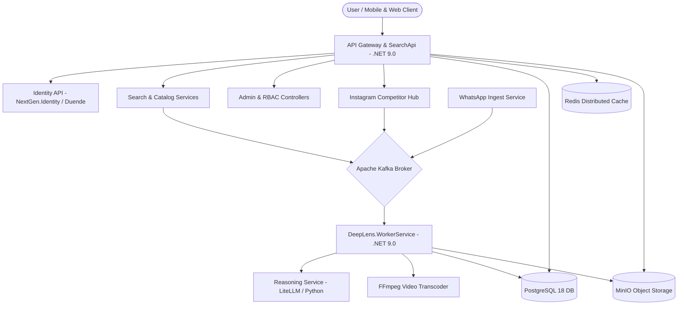

# DeepLens System Architecture & Overview

**Master architecture map and system topology for DeepLens visual search and e-commerce platform.**

---

## 🏗️ 1. High-Level Architecture Topology

---

## 🧭 2. Subsystem Directory & Architecture Map

| Subsystem | Architecture Reference | Operations & Guides | Key Highlights |
| :--- | :--- | :--- | :--- |
| **Mobile Application** | [Mobile Build & Deploy](guides/mobile-build-and-deploy.md) | [Catalog & Media Features](guides/catalog-and-media-features.md) | Standalone APK, self-hosted OTA updates, pinch-to-zoom gesture arbitration, dynamic category taxonomy. |
| **WhatsApp Ingestion** | [WhatsApp & Media Pipeline](architecture/whatsapp-and-media-pipeline.md) | [Kafka Topics Reference](technical/KAFKA_TOPICS.md) | Inbound WhatsApp grouping, 45s debouncing, IST localization, 100-day TTL archival, 2-vibrant-image retention. |
| **Competitor Intelligence** | [Competitor Hub & Intelligence](architecture/competitor-hub-and-intelligence.md) | [Video Processing Guide](technical/VIDEO_PROCESSING.md) | Day-$N$ trajectory metrics, within-profile 90-day baselines, breakout archetypes, automated FFmpeg H.264 video compression. |
| **Security & Identity** | [RBAC & Security](architecture/rbac-and-security.md) | [Persistent Sessions & Auth](architecture/persistent-sessions-and-auth.md) | Native decoupled RBAC, L1/L2 permission cache, 24h slim JWTs, 90-day sliding RTR, mutexed 401 retry interceptor. |
| **Data & Infrastructure** | [Multi-Tenancy Guide](architecture/multi-tenancy.md) | [Port Audit & Topology](infrastructure/port-audit.md) | Tenant schema partitioning, PostgreSQL 18, Redis distributed caching, MinIO media buckets. |

---

## 🛠️ 3. Technology Stack

- **Backend Web Services**: .NET 9.0 (ASP.NET Core Web API, Dapper, EF Core).
- **Mobile Client**: React Native / Expo (Hermes JS engine, React Native Reanimated v3, React Native Gesture Handler v2).
- **Message Broker**: Apache Kafka (Event-driven asynchronous cataloging, media pruning, and WhatsApp grouping).
- **Storage & Databases**: PostgreSQL 18, Redis 7, MinIO S3-compatible Object Storage.
- **Media & AI Processing**: Python 3.12, FFmpeg 7, LiteLLM Gateway, OpenTelemetry.

---

## 🔗 Related Resources
- [Master Documentation Hub](README.md)
- [Codebase Technical Overview](technical/codebase-overview.md)
- [Database Schema Standards](technical/database-standards.md)
