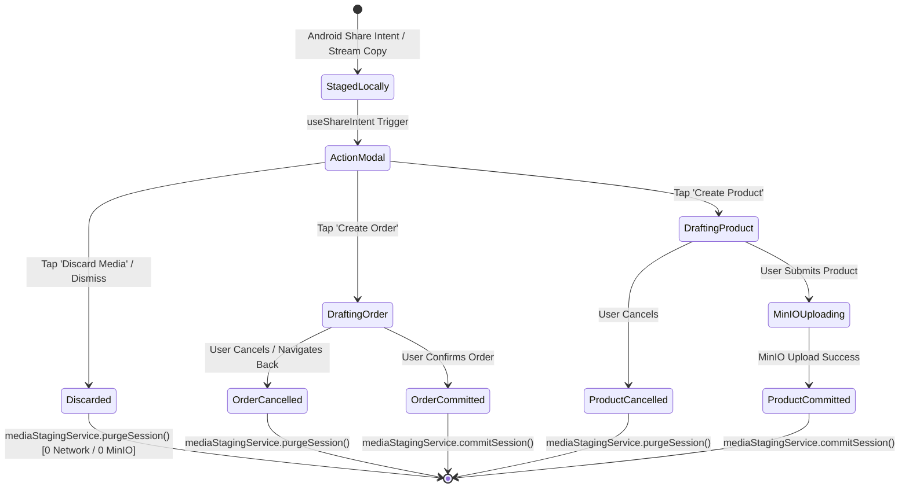

# 📤 Multi-Action Share Intent & Local Media Staging Guide

This guide documents the native Android Share Intent integration, stream-to-local-cache staging architecture, Instagram-style action modal, deferred MinIO upload policy, and product/order creation workflows in the **Vayyari** client application.

---

## 🏗️ Architecture & Interaction Flow

```mermaid
flowchart TD
    subgraph External App
        A[External App / Gallery / WhatsApp / Instagram] -->|ACTION_SEND / ACTION_SEND_MULTIPLE| B[Android System Share Sheet]
    end

    subgraph Native Android Layer (MainActivity.kt)
        B -->|Select Vayyari| C[MainActivity.handleShareIntent]
        C -->|Inspect EXTRA_STREAM| D{Single or Multi?}
        D -->|Single Uri| E[Open InputStream]
        D -->|ArrayList of Uris| E
        E -->|Stream copy to cacheDir| F["staged_share/{sessionId}/media_{i}.{ext}"]
        F -->|Construct Deep Link| G["vayyari://share-target?sessionId={id}&uris={localUris}"]
        G -->|Set Intent Action ACTION_VIEW| H[Expo Router / Linking]
    end

    subgraph React Native Runtime (Vayyari)
        H --> I[useShareIntent Hook]
        I -->|Parse Deep Link Query Params| J[ShareActionChooserModal]
        J -->|Action: Create Order| K[Navigate to /(tabs)/new]
        J -->|Action: Create Product| L[Navigate to /utilities/create-product]
        J -->|Action: Discard Media| M[mediaStagingService.purgeSession]
        M -->|Purge Local Folder| N[Zero Network / Zero MinIO Calls]
    end

    subgraph Form Commit & Upload Policy
        K --> O[NewOrderScreen]
        L --> P[ProductCreationForm]
        O -->|Submit Order| Q[commitCurrentSession -> Purge Local Staging]
        P -->|Submit Product| R[Upload Staged Assets to MinIO -> commitCurrentSession]
    end
```

---

## 1. Native Android Intent Filter Configuration

The Android application manifest registers intent filters to accept single (`ACTION_SEND`) and multi-item (`ACTION_SEND_MULTIPLE`) share actions for image and video MIME types.

### `AndroidManifest.xml`
```xml
<activity
    android:name=".MainActivity"
    android:configChanges="keyboard|keyboardHidden|orientation|screenSize|screenLayout|uiMode"
    android:launchMode="singleTask"
    android:windowSoftInputMode="adjustResize"
    android:theme="@style/Theme.App.SplashScreen"
    android:exported="true"
    android:screenOrientation="portrait">
    
    <intent-filter>
        <action android:name="android.intent.action.MAIN"/>
        <category android:name="android.intent.category.LAUNCHER"/>
    </intent-filter>

    <!-- Deep Linking Scheme -->
    <intent-filter>
        <action android:name="android.intent.action.VIEW"/>
        <category android:name="android.intent.category.DEFAULT"/>
        <category android:name="android.intent.category.BROWSABLE"/>
        <data android:scheme="vayyari"/>
        <data android:scheme="exp+vayyari"/>
    </intent-filter>

    <!-- Single Media Share Intent -->
    <intent-filter data-generated="true">
        <action android:name="android.intent.action.SEND"/>
        <data android:mimeType="image/*"/>
        <data android:mimeType="video/*"/>
        <category android:name="android.intent.category.DEFAULT"/>
    </intent-filter>

    <!-- Multi-Media Share Intent -->
    <intent-filter data-generated="true">
        <action android:name="android.intent.action.SEND_MULTIPLE"/>
        <data android:mimeType="image/*"/>
        <data android:mimeType="video/*"/>
        <category android:name="android.intent.category.DEFAULT"/>
    </intent-filter>
</activity>
```

---

## 2. Stream-to-Local-Cache Staging Mechanism (`MainActivity.kt`)

### Problem: Android `content://` URI Expiration
When an external application shares media, it grants temporary read permissions via `content://` URIs. In Android 11+ (API 30+) and Android 13+ (API 33+), these security grants expire rapidly once the sending activity terminates or the user navigates across screens, causing `SecurityException: Permission Denial` when the app tries to access or upload the file later.

### Solution: Immediate Native Stream Staging
`MainActivity.kt` intercepts the incoming share intent during both cold start (`onCreate`) and warm resume (`onNewIntent`), immediately copying raw input streams into an isolated application cache folder:

```kotlin
private fun handleShareIntent(intent: Intent?) {
    if (intent == null) return
    val action = intent.action
    val type = intent.type

    val isMedia = type != null && (type.startsWith("image/") || type.startsWith("video/") || type == "*/*")
    if ((Intent.ACTION_SEND == action || Intent.ACTION_SEND_MULTIPLE == action) && isMedia) {
        val rawUris = mutableListOf<Uri>()

        // 1. Extract Parcelable URI(s) with Android 13+ TIRAMISU type safety
        if (Intent.ACTION_SEND == action) {
            val uri = if (Build.VERSION.SDK_INT >= Build.VERSION_CODES.TIRAMISU) {
                intent.getParcelableExtra(Intent.EXTRA_STREAM, Uri::class.java)
            } else {
                @Suppress("DEPRECATION")
                intent.getParcelableExtra(Intent.EXTRA_STREAM) as? Uri
            }
            uri?.let { rawUris.add(it) }
        } else if (Intent.ACTION_SEND_MULTIPLE == action) {
            val uriList = if (Build.VERSION.SDK_INT >= Build.VERSION_CODES.TIRAMISU) {
                intent.getParcelableArrayListExtra(Intent.EXTRA_STREAM, Uri::class.java)
            } else {
                @Suppress("DEPRECATION")
                intent.getParcelableArrayListExtra<Uri>(Intent.EXTRA_STREAM)
            }
            uriList?.forEach { uri -> rawUris.add(uri) }
        }

        // 2. Stage streams to isolated session directory in cacheDir
        if (rawUris.isNotEmpty()) {
            val sessionId = java.util.UUID.randomUUID().toString()
            val stageDir = java.io.File(cacheDir, "staged_share/$sessionId").apply { mkdirs() }
            val localUris = mutableListOf<String>()

            rawUris.forEachIndexed { index, uri ->
                try {
                    val mimeType = contentResolver.getType(uri) ?: type ?: "image/jpeg"
                    val extension = when {
                        mimeType.contains("png") -> "png"
                        mimeType.contains("webp") -> "webp"
                        mimeType.contains("gif") -> "gif"
                        mimeType.contains("mp4") -> "mp4"
                        mimeType.contains("quicktime") || mimeType.contains("mov") -> "mov"
                        mimeType.contains("video") -> "mp4"
                        else -> "jpg"
                    }
                    val targetFile = java.io.File(stageDir, "media_${index}.${extension}")
                    contentResolver.openInputStream(uri)?.use { inputStream ->
                        targetFile.outputStream().use { outputStream ->
                            inputStream.copyTo(outputStream)
                        }
                    }
                    localUris.add(Uri.fromFile(targetFile).toString())
                } catch (e: Exception) {
                    android.util.Log.e("MainActivity", "Failed to stage shared media stream: $uri", e)
                    localUris.add(uri.toString())
                }
            }

            // 3. Re-target intent into an internal deep link
            if (localUris.isNotEmpty()) {
                val encodedUris = localUris.joinToString(",") { Uri.encode(it) }
                val deepLink = "vayyari://share-target?sessionId=$sessionId&uris=$encodedUris"
                intent.action = Intent.ACTION_VIEW
                intent.data = Uri.parse(deepLink)
            }
        }
    }
}
```

### Staging Folder Structure
```
{cacheDir}/staged_share/
└── a3f94b21-419b-432d-9477-d1d8ef3f94ba/
    ├── media_0.jpg
    ├── media_1.jpg
    └── media_2.mp4
```

---

## 3. Instagram-Style Share Action Chooser Modal

When media is received, `useShareIntent` displays `ShareActionChooserModal`, giving the merchant an immediate choice of destination:

```
+-------------------------------------------------------------+
|  [📤] Shared Media Received                                [✕] |
|       3 items staged locally                                |
+-------------------------------------------------------------+
|  +-----------+  +-----------+  +-----------+                |
|  |  #1       |  |  #2       |  |  #3       |                |
|  | [Image 1] |  | [Image 2] |  | [Video 3] |   (Carousel)   |
|  +-----------+  +-----------+  +-----------+                |
+-------------------------------------------------------------+
|       Choose what you would like to create with this media: |
|                                                             |
|  [ 🛒  Create Order                   (Contained) ]         |
|  [ 🏷️  Create Product / Add to Catalog (Outlined)  ]         |
|  [ 🗑️  Discard Media                  (Text/Error)]         |
+-------------------------------------------------------------+
```

### Modal Options & Navigation
1. **Create Order (`onCreateOrder`)**:
   - Stores the staged items and `sessionId` in `ShareIntentContext`.
   - Dismisses modal and navigates to `/(tabs)/new`.
   - Pre-fills the order draft with attached media thumbnails.
2. **Create Product / Add to Catalog (`onCreateProduct`)**:
   - Stores the staged items and `sessionId` in `ShareIntentContext`.
   - Dismisses modal and navigates to `/utilities/create-product`.
   - Pre-populates the product image gallery.
3. **Discard Media (`onDiscard`)**:
   - Triggers `mediaStagingService.purgeSession(sessionId)` immediately.
   - Clears memory state and dismisses modal.

---

## 4. Local Media Staging Lifecycle & Deferred MinIO Upload Policy

The media lifecycle guarantees zero storage waste and zero network overhead for aborted drafts.



### Key Principles (`media-staging.service.ts`)
- **Strictly Local During Drafting**: Media resides only in `{cacheDir}/staged_share/{sessionId}/`. No presigned URLs or MinIO upload requests are made while the user edits form fields.
- **Zero-Cost Discard**: Discarding or canceling a draft immediately deletes `{cacheDir}/staged_share/{sessionId}/` using `FileSystem.deleteAsync`, releasing device disk space without touching the network.
- **Upload Upon Commit**: MinIO uploads are deferred until the merchant explicitly clicks **Create Product**.
- **Automated Cleanup**: On app launch, `mediaStagingService.cleanupOldStaging()` scans the staging root and deletes any orphaned staging sessions older than 24 hours (86,400 seconds).

---

## 5. Form Integrations

### 5.1 `NewOrderScreen` (`src/vayyari/app/(tabs)/new.tsx`)
- Displays staged images/videos in `SharedMediaPreview` at the top of the order creation screen.
- On order save (`handleCreateOrder`), records local URIs/references and invokes `commitCurrentSession()`:
  ```typescript
  // Clean up staged local session since order creation committed
  await commitCurrentSession();
  ```

### 5.2 `ProductCreationForm` (`src/vayyari/components/utility/product/ProductCreationForm.tsx`)
- Reads `sharedMedia` from `useShareIntentContext()` and automatically maps items into `ImageUploadList`:
  ```typescript
  if (sharedMedia && sharedMedia.length > 0) {
    const mappedAssets = sharedMedia.map((m, idx) => ({
      uri: m.uri,
      width: 800,
      height: 800,
      fileName: m.fileName || `staged_media_${idx}.jpg`,
      mimeType: m.type === 'video' ? 'video/mp4' : 'image/jpeg',
    }));
    setImages(prev => {
      const existingUris = new Set(prev.map(p => p.uri));
      const newToAdd = mappedAssets.filter(a => !existingUris.has(a.uri));
      return [...prev, ...newToAdd];
    });
  }
  ```
- **Lifecycle Wrappers**:
  - `handleSuccessWrapper`: Calls `await commitCurrentSession()` after successful product persistence and MinIO upload.
  - `handleCancelWrapper`: Calls `await discardCurrentSession()` to wipe staged files from the local device cache if the user cancels.

---

## 6. Verification & Troubleshooting

| Symptom | Probable Cause | Resolution |
| :--- | :--- | :--- |
| `SecurityException: Permission Denial` on Android | Sharing app revoked `content://` URI permission | Verify `MainActivity.kt` copies `EXTRA_STREAM` to local `staged_share/` before deep linking |
| Modal does not appear upon share | `launchMode` is not `singleTask` or deep link scheme mismatch | Ensure `MainActivity` has `android:launchMode="singleTask"` and intent filter handles scheme `vayyari://` |
| Orphaned cache buildup | App crashed before commit or discard | `cleanupOldStaging()` automatically sweeps staging folders older than 24h on next startup |
