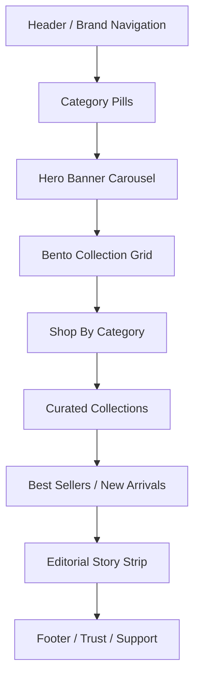
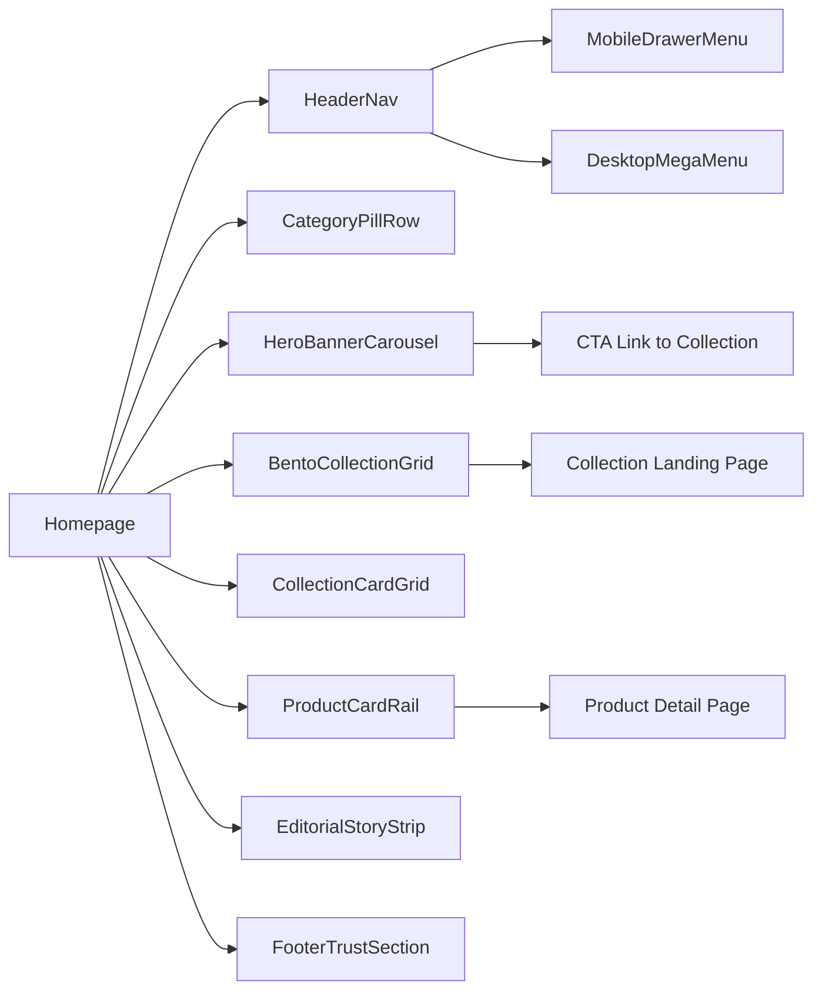

# 10: VISUAL REFERENCE — HOMEPAGE

## Purpose

This document is a presentation-ready visual map of the VAYYARI homepage. It captures the intended information hierarchy, page blocks, component relationships, and responsive treatment for stakeholders, UX designers, and implementation teams.

---

## 1. Homepage Objective

The homepage should help a customer immediately understand:

- what VAYYARI sells
- which categories are most relevant
- what the brand stands for
- where to go next based on style, occasion, or product need

It should feel familiar to ecommerce shoppers, inspired by Myntra-like navigation patterns, but more premium and curated for a women-first handloom brand.

---

## 2. Homepage Section Breakdown



---

## 3. Mobile Layout Wireframe

```text
┌─────────────────────────────┐
│ VAYYARI   Search      Bag  │
├─────────────────────────────┤
│ Sarees | Dresses | Lehengas│
├─────────────────────────────┤
│ Hero banner carousel        │
│ [big lifestyle image]       │
│ CTA: Shop festive edit      │
├─────────────────────────────┤
│ Bento grid                  │
│ [tile 1] [tile 2]           │
│ [tile 3] [tile 4]           │
├─────────────────────────────┤
│ Collection cards            │
│ [Sarees][Dresses][Kids]    │
├─────────────────────────────┤
│ Best sellers rail           │
│ [Product][Product][Product] │
├─────────────────────────────┤
│ Editorial story strip       │
│ [image + caption]           │
├─────────────────────────────┤
│ Footer: support / policy    │
└─────────────────────────────┘
```

---

## 4. Desktop Layout Wireframe

```text
┌──────────────────────────────────────────────────────────────────────┐
│ VAYYARI | Sarees | Dresses | Lehengas | Kids | Intimates | Search │
│                                                                Bag │
├──────────────────────────────────────────────────────────────────────┤
│ Category nav / utility section                                     │
├──────────────────────────────────────────────────────────────────────┤
│ Hero banner – full width                                            │
│ [festival / edit / new-arrival promotional image]                  │
├──────────────────────────────────────────────────────────────────────┤
│ Bento collection grid                                              │
│ [Large editorial tile] [tile] [tile] [tile]                        │
├──────────────────────────────────────────────────────────────────────┤
│ Shop by category cards                                             │
│ [card] [card] [card] [card] [card] [card]                         │
├──────────────────────────────────────────────────────────────────────┤
│ Curated collection / best-seller rail                              │
│ [product card] [product card] [product card] [product card]       │
├──────────────────────────────────────────────────────────────────────┤
│ Editorial story / brand narrative                                  │
│ [image + text + CTA]                                               │
├──────────────────────────────────────────────────────────────────────┤
│ Footer: categories, support, delivery, social, app CTA            │
└──────────────────────────────────────────────────────────────────────┘
```

---

## 5. Component Inventory

### 5.1 HeaderNav

Purpose: brand recognition + primary movement into categories

Components:

- Brand mark
- Category links
- Search
- Account link
- Cart icon + item count
- Mobile menu icon

States:

- default
- active category
- sticky on scroll
- mobile drawer open

Responsive behavior:

- mobile: compact, icon-first, collapsible search
- desktop: full width category row

---

### 5.2 CategoryPillRow

Purpose: fast access to top discovery categories

Suggested categories:

- Sarees
- Dresses
- Lehengas
- Kids Dresses
- Bras
- Leggings
- Briefs
- Shapewear

Usage:

- horizontally scrollable on mobile
- fixed row on desktop

---

### 5.3 HeroBannerCarousel

Purpose: create immediate brand mood and campaign sense

Content:

- festive styles
- handloom story
- new arrivals
- occasion-specific edits

Controls:

- autoplay with pause on hover/touch
- indicator dots
- CTA button

---

### 5.4 BentoCollectionGrid

Purpose: help the shopper discover key collections in one glance

Typical tiles:

- Handloom Sarees
- Festive Occasionwear
- Everyday Cotton
- Kids Occasionwear
- Intimates Essentials
- Pastel Edit

Layout logic:

- 1 large tile + 3 medium/small tiles on desktop
- stacked cards on mobile

---

### 5.5 CollectionCardGrid

Purpose: simple collection index with image and label

Example cards:

- Silk Sarees
- Contemporary Dresses
- Lehengas
- Handloom Everyday
- Girls Dresses
- Bride & Celebration

---

### 5.6 ProductCardRail

Purpose: transitional commerce moment between inspiration and conversion

Card contents:

- image
- product name
- price + offer
- color label
- CTA: Add to bag

---

### 5.7 EditorialStoryStrip

Purpose: reinforce craftsmanship and brand trust

Could contain:

- weaving story
- fabric information
- styling guidance
- community/social proof

---

### 5.8 FooterTrustSection

Purpose: reassure customers and support conversion

Typical content:

- policy links
- contact
- shipping and returns
- social proof
- app download CTA

---

## 6. Component Relationship Map



---

## 7. Key UX Principles

- reduce noise and visual overload
- prioritize women-first categories
- keep broad product families visible early
- maintain an elegant tone, not a discount-heavy placement strategy
- use large visual cards before dense text lists

---

## 8. Stakeholder View

This homepage should communicate three things in under five seconds:

1. This is a premium fashion destination
2. The assortment is broad but curated
3. The customer can move quickly from discovery to product purchase

---

## 9. Acceptance Criteria

- homepage contains a clear brand header and category navigation
- hero banner appears above the fold on mobile and desktop
- key categories are visible without scrolling on mobile in the first viewport
- bento grid communicates curated collection priorities
- product rails remain easy to scan and quick to browse
- footer is present and visually informative without becoming cluttered
