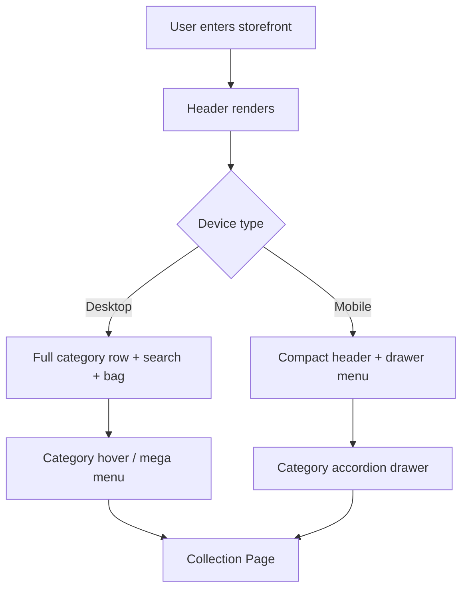

# 11: VISUAL REFERENCE — NAVIGATION AND HEADER SYSTEM

## Purpose

This document defines the visual and interaction logic for the storefront navigation system. It covers the primary header, desktop navigation, and mobile drawer experience as a reusable system that supports all page types.

---

## 1. Navigation System Objective

The navigation must be familiar to a fashion shopping audience while still feeling premium and minimal. It should help users:

- find high-priority categories swiftly
- move to collections without friction
- retain trust and clarity in product discovery

---

## 2. Navigation Experience Map



---

## 3. Desktop Header Wireframe

```text
┌───────────────────────────────────────────────────────────────────┐
│ VAYYARI | Sarees | Dresses | Lehengas | Kids | Intimates |      │
│                                          Search   Account  Bag │
├───────────────────────────────────────────────────────────────────┤
│ Mega menu area (hover)                                          │
│ Women > Sarees > Handloom | Silk | Festive | Everyday            │
│ Kids > Girls Dresses > Occasionwear | Partywear                 │
│ Intimates > Bras | Briefs | Shapers | Leggings                  │
└───────────────────────────────────────────────────────────────────┘
```

---

## 4. Mobile Header Wireframe

```text
┌──────────────────────────────┐
│ ☰ VAYYARI      Search   🛍️  │
├──────────────────────────────┤
│ Recent / quick category row  │
│ Sarees | Dresses | Kids     │
└──────────────────────────────┘
```

---

## 5. Mobile Drawer Menu Structure

```text
┌──────────────────────────────┐
│ Women                       │
│   Sarees                    │
│   Dresses                   │
│   Lehengas                  │
│   Handloom Everyday         │
│   Festive Edit              │
│ Kids                       │
│   Girls Dresses             │
│   Occasionwear              │
│ Intimates                  │
│   Bras                      │
│   Briefs                    │
│   Leggings                  │
│   Shapewear                 │
│ Support                    │
│ About VAYYARI              │
└──────────────────────────────┘
```

---

## 6. Component Breakdown

### 6.1 BrandHeader

Purpose: stable brand anchor and trust foundation

Visual treatments:

- strong left-aligned brand text
- minimal styling
- consistent across pages

---

### 6.2 SearchBar

Purpose: support fast discovery with high recall

Rules:

- visible on desktop and mobile
- supports typeahead suggestions
- matches product keywords and categories
- can search by product family, fabric, style, color, or occasion

---

### 6.3 HeaderActionGroup

Components:

- wishlist (future)
- account
- cart with item count

Behavior:

- real-time count updates after add-to-cart
- bag icon should visually indicate item quantity

---

### 6.4 DesktopMegaMenu

Purpose: a rich category browser without cluttering the page

Trigger:

- hover or focus on category item

Content structure:

- parent category
- subcategories
- curated collections

Example:

- Women
  - Sarees
  - Dresses
  - Lehengas
  - Handloom Everyday
  - Festive Edit

---

### 6.5 MobileDrawerMenu

Purpose: compact category browsing on small screens

Interaction:

- slide-in drawer from left
- accordion sections for categories
- tap closes drawer and navigates to collection page

---

## 7. Navigation States

```mermaid
stateDiagram-v2
    [*] --> Default
    Default --> HoveredCategory
    HoveredCategory --> MegaMenuOpen
    MegaMenuOpen --> CategorySelected
    CategorySelected --> CollectionPage

    Default --> DrawerOpen
    DrawerOpen --> CategorySelected
    CategorySelected --> [*]
```

---

## 8. UX Rules

- Keep desktop categories concise and stable
- Do not overload the header with too many values
- Use clear naming that reflects fashion and lifestyle categories
- Place search above fold on all major screens
- Ensure the cart count never disappears when items exist

---

## 9. Acceptance Criteria

- header remains visible and legible on mobile and desktop
- category links are easy to scan and understand
- cart count updates appropriately after add-to-cart actions
- mobile drawer interactions are touch-friendly
- desktop mega menu opens smoothly and looks intentional, not crowded
- header behavior remains consistent across homepage, collection page, and product detail page
