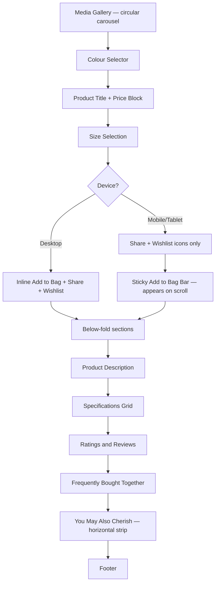

# 13: VISUAL REFERENCE — PRODUCT DETAIL PAGE

## Purpose

Defines the visual and interaction system for the Product Detail Page (PDP) in VAYYARI, including all layout tiers, ethnic swatch rendering, photo grouping, variant selection, carousel behavior, and below-the-fold content. Acts as reference for UX and implementation.

> **Last Updated:** 2026-08-31 — Aligned with ethnic swatch system, circular carousel, and coloured photo grouping.

---

## 1. PDP Objective

The product detail page must help the user answer three questions quickly:

1. What is this product? (Name, price, category)
2. Is it the right style, fit, and color? (Gallery + ethnic swatch variants)
3. Can I buy it confidently? (CTA, size selection, cart)

---

## 2. Product Detail Flow



---

## 3. Mobile Layout (< 768px)

```
┌─────────────────────────────────────┐
│ HEADER (sticky)                     │
│ ☰  VAYYARI       🔍  ♥  🛍         │
├─────────────────────────────────────┤
│                                     │
│   ProductGallery                    │  height: 390px
│   ← ░░░░░░░░░░░░░░░░░░░░░░░░ →     │  LinearGradient canvas
│                                     │
│  [1/3]        ┌──────────────┐      │  top-left: photo counter
│               │ Front Drape  │      │  center: photo label badge
│               └──────────────┘      │
│             ‹             ›         │  left/right chevrons
│             ━ • •   (dots)          │  bottom-center: dot indicators
├─────────────────────────────────────┤
│ COLOUR: Navy & Rani Pink            │  active swatch label
│ Template badge: [Contrast Border]   │
│                                     │
│ [■■■][███][░░░][████]               │  CustomSwatchDot row (circular)
│ Navy/Pink Violet/Em Mustard/Gr Band │  labels below each dot
├─────────────────────────────────────┤
│ Handloom edit  [chip]               │
│ Ivory Flow Saree                    │
│ ₹3,299  ~~₹4,999~~  34% Off        │
│ ★ 4.5  (234)                       │
├─────────────────────────────────────┤
│ SIZE                                │
│ [S] [M] [L] [XL]                   │
├─────────────────────────────────────┤
│         [🔗 share]  [❤ wishlist]   │
│   (icon buttons only, no Add to Bag)│
├─────────────────────────────────────┤
│ Product description                 │
├─────────────────────────────────────┤
│ Specifications  (alternating rows)  │
├─────────────────────────────────────┤
│ Ratings & Reviews                   │
│ ★★★★½  4.5 overall                 │
│ [Photo strip] →                     │
│ [Review card] [Review card]        │
├─────────────────────────────────────┤
│ Frequently Bought Together          │
├─────────────────────────────────────┤
│ You May Also Cherish               │
│ [HCard] [HCard] →                  │
└─────────────────────────────────────┘

══════════════════════════════════════  ← fixed
│ ₹3,299  Ivory Flow Saree ···  [Add] │  Sticky Add to Bag bar (z=50)
══════════════════════════════════════
```

**Sticky bar trigger:** Appears when `scrollY > productPanelBottom.current` (measured via `onLayout`)

---

## 4. Tablet Layout (768–1023px)

Same as mobile with these differences:

| Property | Mobile | Tablet |
|----------|--------|--------|
| Gallery height | 390px | 460px |
| Swatch dot size | 36px | 40px |
| Grid columns | 1 col | 1 col (wider cards) |
| Card size | Full width | Wider full width |

Color selector still appears **below the carousel** (same stacked layout as mobile).

---

## 5. Desktop Layout (≥ 1024px)

```
┌─────────────────────────────────────────────────────────────────┐
│ HEADER (sticky full width)                                      │
│ VAYYARI [Search]                              Wishlist  Cart   │
├─────────────────────────────────────────────────────────────────┤
│                                                                 │
│  ┌──────────────┐  ┌──────────────────────┐  ┌─────────────┐  │
│  │ [thumb 1]    │  │                      │  │             │  │
│  │ [thumb 2]    │  │  Hero Canvas         │  │ Product     │  │
│  │ [thumb 3] ◄  │  │  LinearGradient      │  │ Title       │  │
│  │ [thumb 4]    │  │  min-height: 580px   │  │ ₹3,299      │  │
│  │ (84px wide)  │  │                      │  │ ~~₹4,999~~  │  │
│  │              │  │  ‹   1/4 · Front  ›  │  │ 34% Off     │  │
│  └──────────────┘  └──────────────────────┘  │             │  │
│   thumbnail strip      gallery canvas         │ COLOUR:     │  │
│   (active=accent                              │ [■■][██]    │  │
│    border)                                    │ [░░][████]  │  │
│                                               │             │  │
│                                               │ SIZE        │  │
│                                               │ [S][M][L]   │  │
│                                               │             │  │
│                                               │ [Add to Bag]│  │
│                                               │ [🔗] [❤]   │  │
│                                               └─────────────┘  │
│  (purchase panel is sticky while gallery scrolls)              │
├─────────────────────────────────────────────────────────────────┤
│ Product Description (full width)                               │
├─────────────────────────────────────────────────────────────────┤
│ Specifications Grid                                            │
├─────────────────────────────────────────────────────────────────┤
│ Ratings & Reviews                                              │
├─────────────────────────────────────────────────────────────────┤
│ Frequently Bought Together                                     │
├─────────────────────────────────────────────────────────────────┤
│ You May Also Cherish (horizontal strip)                        │
└─────────────────────────────────────────────────────────────────┘
```

---

## 6. Ethnic Swatch Variants (Confirmed Demo Data)

Each color variant represents a distinct ethnic fabric colorway. Each variant groups specific photos of that exact colorway.

### 6.1 Swatch Template Overview

| Template | Visual | Use Case |
|----------|--------|----------|
| `solid` | ■ Flat fill | Plain monochrome body |
| `contrast-border` | ▪▪▬ (80% top / 20% bottom strip) | Saree with contrasting border or zari |
| `dual-tone` | Diagonal gradient (45°) | Dhup-Chhaon iridescent silk |
| `half-and-half` | Left│Right 50/50 split | Pleats vs. pallu |
| `multicolor` | 4-quadrant grid | Bandhani, digital print, patchwork |

### 6.2 Demo Product Variants

```
Navy & Rani Pink (contrast-border)
  Slot A (body, 80%): Navy #1565C0
  Slot B (border, 20%): Rani Pink #E91E63
  Photos: Front Drape · Border Detail · Pallu · Blouse Piece

Violet & Emerald Dhup-Chhaon (dual-tone)
  Slot A (warp): Violet #6A1B9A
  Slot B (weft): Emerald #2E7D32
  Photos: Folded detail · Drape silhouette · Weave close-up

Mustard & Bottle Green (half-and-half)
  Slot A (pleats, left): Mustard #FBC02D
  Slot B (body/pallu, right): Bottle Green #1B5E20
  Photos: Full width spread · Pallu border

Festive Bandhani Multi (multicolor)
  Slot A: Red #B71C1C
  Slot B: Yellow #F9A825
  Slot C: Midnight Green #1B5E20
  Slot D: Royal Blue #0D47A1
  Photos: Full drape · Detail patch

Pure Ivory Gold (solid)
  Slot A: Ivory Gold #D4AF37
  Photos: Studio shot · Texture detail
```

---

## 7. Gallery Behavior (Photo Grouping)

### 7.1 Color Variant → Photo Group Mapping

When the customer selects a swatch, the gallery resets and loads only that variant's photos:

```
selectColor("navy_pink")
  → gallery.images = navyPinkVariant.images  (3–4 photos)
  → activeImageIndex = 0
  → thumbnails (desktop) update to show these photos
  → dot indicators update count
```

### 7.2 Circular Navigation

```
totalImages = activeSwatch.images.length

Next: activeIndex = (activeIndex + 1) % totalImages
Prev: activeIndex = (activeIndex - 1 + totalImages) % totalImages
```

Both chevron buttons and swipe gestures navigate within the **active variant's photo group only**.

### 7.3 Swipe Detection (Mobile / Tablet)

```
PanResponder captures gesture:
  if |dx| > 30px AND |dx| > |dy|:
    dx < 0 → navigate forward
    dx > 0 → navigate backward
```

Web fallback: `onTouchStart` + `onTouchEnd` events capture same logic.

---

## 8. Colour Selector Positioning Rule

| Breakpoint | Colour selector position |
|------------|-------------------------|
| Mobile (< 768px) | Immediately below the gallery carousel |
| Tablet (768–1023px) | Immediately below the gallery carousel |
| Desktop (≥ 1024px) | Inside the sticky purchase panel (right column) |

---

## 9. Responsive Behaviour Summary

| Property | Mobile | Tablet | Desktop |
|----------|--------|--------|---------|
| Gallery type | Full-width carousel | Full-width carousel | Thumbnail strip + hero canvas |
| Gallery height | 390px | 460px | min 580px |
| Colour selector | Below gallery | Below gallery | In right panel |
| Add to Bag | Sticky bar only | Sticky bar only | Inline in right panel |
| Share/Wishlist | Inline below size | Inline below size | Inline in right panel |
| Layout | Single column | Single column | Two column |
| isMobile | true | true | false |
| isNarrow | true (< 640px) | false | false |

---

## 10. Acceptance Criteria

- [x] Circular swipe gallery on mobile with PanResponder (no native ScrollView — to avoid scroll conflicts)
- [x] Circular swipe gallery on tablet (same behavior, taller)
- [x] Colour selector appears directly below carousel on mobile + tablet
- [x] Colour selector in right purchase panel on desktop
- [x] Selecting a swatch → gallery resets to photo 1 of that variant's group
- [x] Slide counter badge shows `{current}/{total}` of active variant
- [x] Photo label badge shows current photo description
- [x] Desktop side thumbnails update to show active variant's photos
- [x] Active thumbnail highlighted with accent-colored border
- [x] CustomSwatchDot renders correct geometry for all 5 ethnic templates
- [x] Swatch selection ring (accent border) visible on selected dot
- [x] Template label badge shown under/beside active swatch label
- [x] Size chips show S / M / L / XL; One Size shown as disabled for non-size products
- [x] Heart button: hollow (default) → filled red (wishlisted)
- [x] Sticky Add to Bag bar triggers on scroll past product panel bottom
- [x] Cart drawer shows selected color name + template + size
- [ ] (Future) Zoom on image long-press
- [ ] (Future) Full-screen gallery modal

---

**Status:** 🟢 Current  
**Last Updated:** 2026-08-31
