# 14: VISUAL REFERENCE — COMPONENT BIBLE

## Purpose

This is the reusable component definition reference for all major VAYYARI storefront components. It documents the design system, ethnic swatch templates, component hierarchy, and consistency standards across the entire commerce experience.

> **Last Updated:** 2026-08-31 — Includes CustomSwatchDot ethnic templates, updated Badge behavior, and FilterSidebar rule.

---

## 1. Design System Principles

- **Dark-first premium aesthetic:** Deep charcoal background (`#0e0e0e`) with warm gold accents (`#d4af37`)
- **Generous whitespace:** Never cluttered; spacious section separation
- **Strong contrast for mature demographic:** Minimum 4.5:1 text contrast ratio; no thin gray-on-gray
- **Familiar ecommerce interactions:** Cart, wishlist, gallery, color selection — standard patterns
- **Cultural authenticity:** Ethnic fabric terminology, regional variant names, zari/pallu vocabulary
- **Premium restraint:** Hover effects are soft (glow, not zoom); animations are subtle

---

## 2. Atomic Design Hierarchy

```
Atoms → Molecules → Organisms → Templates → Pages
  ↕           ↕          ↕           ↕          ↕
Basic UI   Composed   Feature     Page       Full
elements   units      blocks     shells     views
```

**Storybook structure:**
```
Design System / Overview
Atoms /
  Badge, CarouselDot, Chip, HeartButton, IconButton,
  PriceTag, RatingBadge, ShareButton, SizeChip, SwatchDot, CustomSwatchDot
Molecules /
  Breadcrumbs, CategoryPill, ColourCard, FilterSortBottomBar,
  HorizontalProductCard, ProductCard, PromoBanner, ReviewCard,
  SearchBar, SortBottomSheet, SpecificationRow, StickyAddToBagBar
Organisms /
  BrandMark, CartDrawer, CategoryRow, ColourSelector,
  FilterDrawer, FilterSidebar, FrequentlyBoughtTogether,
  Header, HorizontalProductStrip, MoreLinksCard, ProductGallery,
  ProductGrid, QuickPreviewModal, RatingsPanel, SizeSelector, SpecificationsPanel, TopNav
Templates /
  StorefrontTemplate, CatalogTemplate, ProductDetailTemplate
Pages /
  HomePage, CatalogPage, ProductDetailPage
Themes /
  Campaign Explorer
```

---

## 3. Core Component Matrix

```mermaid
flowchart TB
    A[Global System]
    A --> B[Navigation]
    A --> C[Homepage Blocks]
    A --> D[Catalog Blocks]
    A --> E[Product Detail Blocks]
    A --> F[Cart / Checkout Blocks]
    A --> G[Admin / Curation Blocks]

    B --> B1[Header]
    B --> B2[TopNav]

    C --> C1[HeroBannerCarousel]
    C --> C2[CategoryRow]
    C --> C3[ProductGrid - Best Sellers]

    D --> D1[FilterSidebar - Desktop]
    D --> D2[FilterDrawer - Mobile]
    D --> D3[FilterSortBottomBar]
    D --> D4[SortBottomSheet]
    D --> D5[ProductGrid]

    E --> E1[ProductGallery]
    E --> E2[ColourSelector]
    E --> E3[SizeSelector]
    E --> E4[PriceTag]
    E --> E5[StickyAddToBagBar]
    E --> E6[SpecificationsPanel]
    E --> E7[RatingsPanel]
    E --> E8[FrequentlyBoughtTogether]
    E --> E9[HorizontalProductStrip]

    F --> F1[CartDrawer]
    F --> F2[CartItemRow]

    G --> G1[ReviewerColorCuration Wireframe]
```



---

## 4. Ethnic Swatch System — CustomSwatchDot

The CustomSwatchDot atom renders ethnic garment colorway representations for the 5 curated swatch templates. It is used in ColourSelector, ProductCard, and the Reviewer Curation Portal.

### 4.1 Template Visual Diagrams

**Solid**
```
┌─────────────┐
│             │
│  ███████    │   Single flat fill (primaryColor)
│  ███████    │
│             │
└─────────────┘
```

**Contrast Border (80/20)**
```
┌─────────────┐
│ ░░░░░░░░░░ │   80% body color (primaryColor)
│ ░░░░░░░░░░ │
│ ░░░░░░░░░░ │
├─────────────┤   ← hairline divider
│ ▓▓▓▓▓▓▓▓▓ │   20% border/zari color (secondaryColor)
└─────────────┘
```

**Dual-Tone / Dhup-Chhaon (diagonal gradient)**
```
┌─────────────┐
│░░░░░░░░░░░▓│   
│░░░░░░░░░▓▓▓│   45° LinearGradient with dynamic stops:
│░░░░░░░▓▓▓▓▓│   2 Tones: [0, 1]
│░░░░░▓▓▓▓▓▓▓│   3 Tones: [0, 0.5, 1]
│░░░▓▓▓▓▓▓▓▓▓│   4 Tones: [0, 0.33, 0.66, 1]
└─────────────┘
```

**Multi-Shade (Geometries by Color Count)**
```
Count = 2 (50/50 Split):      Count = 3 (3-Way Pie):         Count = 4 (+ Cross):
┌──────┬──────┐               ┌──────┬──────┐               ┌──────┬──────┐
│      │      │               │  \   |   /  │  120° wedges  │  A   │  B   │  Cartesian
│  ░░  │  ▓▓  │  Vertical     │   \  |  /   │  meeting at   ├──────┼──────┤  "+" center
│  ░░  │  ▓▓  │  divider      │ ░░ \ | / ▓▓ │  center       │  C   │  D   │  cross
│      │      │               │_____\|/_____│               │      │      │
└──────┴──────┘               └─────────────┘               └──────┴──────┘
```

**Multicolor (Static 4×4 Micro-Mosaic Grid)**
```
┌───┬───┬───┬───┐
│ 1 │ 2 │ 3 │ 4 │   Static 4×4 grid of 16 distinct
├───┼───┼───┼───┤   colors representing authentic
│ 5 │ 6 │ 7 │ 8 │   bandhani tie-dye dots, kalamkari
├───┼───┼───┼───┤   motifs, and festive digital
│ 9 │ 10│ 11│ 12│   patchwork.
├───┼───┼───┼───┤
│ 13│ 14│ 15│ 16│
└───┴───┴───┴───┘
```

### 4.2 Props

```ts
type SwatchTemplateType =
  | 'solid'
  | 'contrast-border'
  | 'multi-tone'
  | 'multi-shade'
  | 'multicolor'
  | 'dual-tone'
  | 'half-and-half';

type CustomSwatchDotProps = {
  template: SwatchTemplateType;
  primaryColor: string;       // Slot A — always required
  secondaryColor?: string;    // Slot B — required for all except solid
  tertiaryColor?: string;     // Slot C — 3-shade, 3-tone, or multicolor
  quaternaryColor?: string;   // Slot D — 4-shade, 4-tone, or multicolor
  colors?: string[];          // Array of 2 to 9 colors for multi-tone, multi-shade, or multicolor grid
  colorCount?: 2 | 3 | 4;     // Number of colors for multi-shade (2-4 stripes) or multi-tone (2-4 stops)
  size?: number;              // Default: 36px
  shape?: 'circle' | 'square'; // Default: 'circle'
  selected?: boolean;         // Shows accent selection ring
};
```

### 4.3 Standard 32-Anchor Oklch Palette

Used for K-Means ΔE CIE2000 automated classification and reviewer slot mapping:

```
Neutrals:         Pure White, Cream Beige, Sand Tan, Taupe Brown, Charcoal, Jet Black
Reds & Pinks:     Ruby Red, Wine Maroon, Rose Pink, Blush Pink, Coral Salmon, Magenta
Oranges & Yellows: Rust Burnt, Tangerine, Mustard, Pastel Lemon
Greens:           Olive Khaki, Mint Seafoam, Emerald, Lime Moss
Blues & Teals:    Powder Blue, Turquoise, Teal Peacock, Royal Blue, Navy Blue
Purples:          Lavender, Violet Plum
Metallics:        Antique Gold (Zari), Rose Gold, Silver (Platinum)
Special:          Multicolor
```

Total: 31 named anchors + Multicolor = 32 anchors.

---

## 5. Component Rules

### 5.1 Badge

- Hover: soft luminosity glow (color-matched `boxShadow` / `shadowColor`) — **NOT** scale zoom
- Fixed pill height per size: `sm: 22px`, `md: 26px`, `lg: 32px`
- Never taller than `32px`; inner content uses fixed padding

### 5.2 ProductCard Name Height

- **Rule: Always fixed 2-line height = `42px` (`lineHeight: 20px`, `numberOfLines: 2`)**
- Short names leave whitespace below — this is intentional
- Long names use `ellipsizeMode="tail"` — no layout expansion
- This ensures all cards in the same row have a uniform baseline

### 5.3 HorizontalProductCard Name Height

- Same fixed 2-line rule: `height: 34px`, `lineHeight: 16px`, `numberOfLines: 2`

### 5.4 FilterSidebar Hamburger Placement

- **When expanded:** `[☰]` icon lives inside the "FILTERS" section header tab — no text label next to it
- **When collapsed:** Only an icon-only square button `[☰]` is shown with an active filter count badge
- This prevents the label from competing with the icon as a tap target

### 5.5 Search Bar Sizing

- Always bounded: `height={44}`, `maxHeight={44}`, `flexShrink={1}`
- Never use unbounded `flex={1}` inside a vertical parent container (causes 800px+ stretch bug in React Native Web)

### 5.6 Horizontal ScrollView Children

- Set `style={{ flexGrow: 0 }}` and `contentContainerStyle={{ alignItems: 'flex-start' }}` on the scroll container
- Set `alignSelf="flex-start"` and `flexShrink={0}` on children (cards, pills)
- Prevents unwanted vertical stretching in RN Web

### 5.7 Sticky Mobile Bars

- `position: absolute`, `bottom: 0`, `left: 0`, `right: 0`, `zIndex: 50`
- Parent `ScrollView` must include `paddingBottom: 110` so content is not hidden behind bar

### 5.8 Uniform Catalog Product Grid & Card Picture Carousel

- **Uniform Sizing:** Grid container uses strict CSS Grid (`gridTemplateColumns: repeat(4, minmax(0, 1fr))` on desktop, 3 on tablet, 2 on mobile) with 16px gap. Cards set `flexGrow: 0, flexShrink: 0, width: '100%'`. Cards in Row 1 and Row 2 maintain 100% identical dimensions regardless of product count.
- **Card Picture Carousel:** Interactive chevron arrows (prev/next) and pagination micro-dots cycle through drape photos on the card without navigating away (`e.stopPropagation()`).
- **Quick Preview & Simple Click Navigation:**
  - **Tablet & Mobile:** Quick Preview triggers exclusively on long press (`onLongPress`, 400ms hold).
  - **Desktop:** Hover reveals an eye symbol without text (`38px` circular glass button with gold border). Clicking it opens Quick Preview.
  - **Simple Click:** Clicking or tapping anywhere on the card always navigates directly to the PDP page.
- **Clean Overlay Design:**
  - Slide index is purely the count (`1/4`) with no background box or extra label.
  - Like button is a plain heart icon (`variant="plain"`) without any background box that toggles between white outline and filled crimson.

---

## 6. Visual Consistency Rules

- All icons use `react-icons` library (Lucide: `LuXxx` prefix; Feather: `FiXxx` prefix)
- Share icon: `FiShare2` (Feather)
- All other icons: Lucide
- Color swatches on catalog filter: `CustomSwatchDot` (not plain `SwatchDot`) when color involves multiple tones
- Cart item thumbnail must match selected color variant image
- Price display: always `₹{offerPrice}  ~~₹{originalPrice}~~  {discount}% Off`
- Rating display: always `★ {rating}  ({count})` — never `{count} ratings`

---

## 7. ColourSelector Formats

| Format | Usage | Visual |
|--------|-------|--------|
| `cards` | PDP purchase panel (desktop + compact) | 68px wide cards with full swatch geometry thumbnail |
| `dots` | Inline compact use (product cards, small panels) | 32–36px circular dots |

Both formats use `CustomSwatchDot` for rendering the ethnic template geometry.

---

## 8. Gallery Carousel Specs

| Property | Mobile | Tablet | Desktop |
|----------|--------|--------|---------|
| Gallery type | Circular swipe carousel | Same as mobile | Thumbnail strip + hero canvas |
| Swipe control | PanResponder + touch events | Same | Chevron buttons + thumbnail tap |
| Canvas height | 390px | 460px | min 580px |
| Thumbnail width | n/a | n/a | 84px |
| Dot indicators | Yes (bottom-center) | Yes | No (thumbnails replace them) |
| Slide counter | `1/N` badge (top-left) | Same | `1/N · Label` text on canvas |
| Photo group | Changes with active swatch | Same | Same |
| Circular nav | Yes | Yes | Yes |

---

## 9. Acceptance Criteria

- All CTAs are visually consistent in shape, size, and color
- Product name containers always use fixed 2-line height
- Ethnic swatch templates render correct geometric patterns at all sizes (28px–48px)
- Color selection state is reflected in gallery, add-to-cart, and cart line items
- Filter sidebar toggle has hamburger in FILTERS header (expanded) or icon-only button (collapsed)
- No layout jank on scroll or swatch selection
- All Storybook stories render correctly without TypeScript errors
- Icons are consistent across all components (react-icons library only)

---

**Status:** 🟢 Current  
**Last Updated:** 2026-08-31
