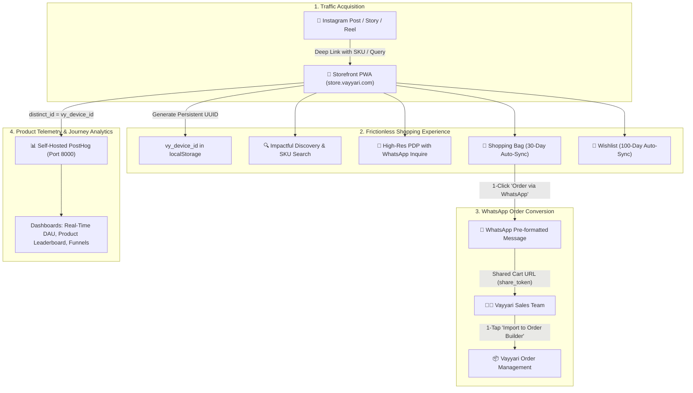

# DeepLens Store Beta Platform: Operations Manual & Production Runbook

**Version:** 1.0.0-beta  
**Last Updated:** 2026-09-10  
**Owner:** DeepLens Engineering Squad (Lead: Krishna)

---

## 1. Executive Summary & Architecture Overview

The **DeepLens Store Beta Platform** is a high-conversion, frictionless e-commerce storefront (PWA & Web) designed to capture traffic originating from social media (Instagram Stories, Reels, Bio links, WhatsApp broadcasts) without requiring customer registration or signups.



---

## 2. Quick Start: One-Command Deployment

Deploy and verify the complete Store platform (Database Migrations, Store.Api .NET 9 Backend, and PostHog Analytics) using the unified orchestrator:

```bash
# 1. Run Complete Platform Deployment
./scripts/store/deploy-store.sh

# 2. Verify Health of All Services
./scripts/store/health-check.sh
```

### Service Map & Default Ports

| Component | Technology | Default URL / Port | Purpose |
| :--- | :--- | :--- | :--- |
| **Store.Api** | .NET 9 Minimal API | `http://localhost:5050` | Cart, Wishlist, Product & Share APIs |
| **Store.Api Swagger** | OpenAPI 3.0 | `http://localhost:5050/swagger` | Interactive API Documentation |
| **PostHog Analytics** | PostHog Open Source | `http://localhost:8000` | Journey Tracking & Visual Dashboards |
| **Storefront PWA** | Next.js 15 / Expo Web | `http://localhost:3000` | Customer Web App |
| **Store Storybook** | Storybook React Native Web | `http://localhost:6006` | Component Bible & Journey Books |

---

## 3. Database Schema & Migration Execution

The database schema manages anonymous device carts, line items, and wishlists with automated TTL indexing:

### Migration File
`setupscripts/migrations/020_store_beta_carts_and_wishlists.sql`

### Tables Created

1. **`store_carts`**:
   - `id`: UUID primary key.
   - `device_id`: Client UUID (`VARCHAR(128)`).
   - `share_token`: Public URL-safe token (e.g. `crt_9x8k2m`).
   - `total_amount`, `total_mrp`, `total_discount`, `item_count`.
   - `expires_at`: Indexed timestamp (`NOW() + 30 days`).
2. **`store_cart_items`**:
   - `cart_id`: Foreign key cascade deleting with `store_carts`.
   - `product_id`, `product_code`, `title`, `price`, `quantity`, `selected_color`, `selected_size`, `primary_image_uri`.
3. **`store_wishlists`**:
   - `device_id`, `product_id`, `product_code`, `title`, `price`, `primary_image_uri`.
   - `expires_at`: Indexed timestamp (`NOW() + 100 days`).

### Execute Migrations Manually
```bash
./scripts/store/migrate-db.sh
```

---

## 4. API Reference (`Store.Api`)

### Cart Endpoints

#### 1. Hydrate Device Cart
* **HTTP Method**: `GET`
* **Route**: `/api/v1/cart`
* **Headers**: `X-Device-Id: {uuid}`
* **Response (200 OK)**:
  ```json
  {
    "deviceId": "dev_9x8k2m",
    "shareToken": "crt_9x8k2m",
    "shareUrl": "https://store.vayyari.com/cart/share/crt_9x8k2m",
    "items": [...],
    "totalAmount": 19498.00,
    "totalMRP": 27998.00,
    "totalDiscount": 8500.00,
    "itemCount": 2,
    "expiresAt": "2026-10-10T05:00:00Z"
  }
  ```

#### 2. Sync Device Cart
* **HTTP Method**: `PUT`
* **Route**: `/api/v1/cart/sync`
* **Body**:
  ```json
  {
    "deviceId": "dev_9x8k2m",
    "items": [
      {
        "id": "c1",
        "productId": "p-1",
        "productCode": "SAR-KAN-901",
        "title": "Kanjivaram Pure Silk Saree",
        "price": 10999.00,
        "quantity": 1,
        "selectedColor": "Emerald Green",
        "selectedSize": "Free Size",
        "primaryImageUri": "https://images.unsplash.com/photo-1610030469983-98e550d6193c?w=600&q=80"
      }
    ]
  }
  ```

#### 3. View Public Shared Cart (Sales Team Link)
* **HTTP Method**: `GET`
* **Route**: `/api/v1/cart/share/{shareToken}`
* **Response (200 OK)**: Returns full line-item details with `isSharedView: true`.

#### 4. Trigger TTL Pruning
* **HTTP Method**: `POST`
* **Route**: `/api/v1/cart/prune`
* **Description**: Removes inactive carts (>30d) and wishlists (>100d). Executed automatically every 12 hours by `CartPruningBackgroundService`.

---

## 5. Telemetry & PostHog Analytics Setup

### Launching PostHog
```bash
./scripts/store/start-posthog.sh
```

### Anonymous Journey Correlation
* Client stores persistent `vy_device_id` in `localStorage`.
* PostHog client initializes with `distinct_id = vy_device_id`.
* Allows stitching complete touchpoints across weeks without user login.

### 4 Core PostHog Dashboards (Pre-Configured)
1. **Real-Time Active Users & Today's Visitors (DAU)**: Live concurrent users, total unique devices today, and traffic sources (Instagram Stories, Bio, WhatsApp).
2. **Product Engagement Leaderboard**: Top-viewed SKUs, highest dwell-time products, and image swipe depth.
3. **Discovery-to-WhatsApp Conversion Funnel**: `Landing / Search ➔ PDP View ➔ Add to Bag ➔ WhatsApp Share CTA`.
4. **Wishlist & Cart Velocity**: Daily Wishlist vs Cart additions and high-intent customer ratios.

---

## 6. WhatsApp Order Processing Workflow

```
[ Customer Journey ]
1. Customer finds saree on Instagram (SKU: SAR-KAN-901).
2. Clicks link, explores PDP, adds to Bag.
3. On Bag Page, clicks "📲 SEND CART TO WHATSAPP".
4. WhatsApp opens with pre-formatted message:
   "Hi Vayyari! ✨ I'd like to place an order for:
    1. Kanjivaram Pure Silk Saree (SAR-KAN-901) - ₹10,999
    Total: ₹10,999 (1 item)
    Cart Link: https://store.vayyari.com/cart/share/crt_9x8k2m"

[ Sales Team Concierge ]
5. Sales agent receives WhatsApp message.
6. Clicks the Cart Link -> Opens Shared Cart Sales View.
7. Verifies exact item, image, colorway, and price.
8. Clicks "Import to Order Builder ➔" to generate order in Vayyari Admin!
```

---

## 7. Disaster Recovery & Troubleshooting Runbook

### Issue 1: Carts Not Restoring Across Page Reloads
* **Check**: Ensure `localStorage.getItem('vy_device_id')` is returning a valid string and `X-Device-Id` header is passed in API calls.
* **Fix**: Run `./scripts/store/health-check.sh` to ensure `Store.Api` is responding on port 5050.

### Issue 2: PostHog UI Not Accessible on Port 8000
* **Check**: Run `docker compose -f infrastructure/observability/docker-compose.posthog.yml ps`.
* **Fix**: Ensure `observability-net` network exists (`docker network create observability-net`).

### Issue 3: Manual Database Reset / Clean Re-deploy
```bash
# Drop and re-apply migration
psql -h localhost -U deeplens -d deeplens -c "DROP TABLE IF EXISTS store_cart_items, store_carts, store_wishlists CASCADE;"
./scripts/store/migrate-db.sh
```
