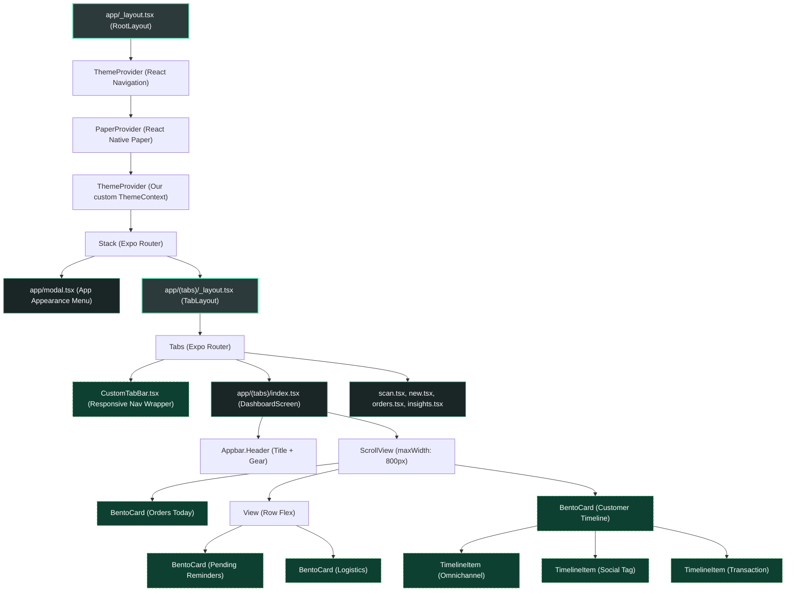

# Vayyari Business Suite: Component Hierarchy

This document maps the architectural component hierarchy of the Vayyari Business Suite, starting from the application root layout all the way down to the atomic UI elements.

## Visual Hierarchy

## Architectural Layers Explained

### 1. The Global Injection Ring (`app/_layout.tsx`)
At the very top, the application wraps three massive global providers:
1.  **React Navigation** (Handling URL routing configurations).
2.  **React Native Paper Provider** (Injecting the raw Vayyari Emerald Color map to all standard components to bypass hard-coded CSS).
3.  **ThemeContext Provider** (Our new persistent Async Storage hook tracking 'System | Light | Dark').

### 2. The Form-Factor Gateway (`app/(tabs)/_layout.tsx`)
This handles the switchboard logic. Instead of executing the native Expo router tools blindly, it points its logic to the `CustomTabBar.tsx` renderer. Here, standard navigation routes (scan, orders, index) dictate their requested Icons cleanly.

### 3. The Atomic Semantic Canvas (`app/(tabs)/index.tsx`)
When hitting the Dashboard, the application heavily utilizes the `ui/` subdirectory. Instead of manually drawing grids and colored boxes, the Dashboard strictly calls:
*   `<BentoCard>` structural elements passing custom semantic `surfaceLevel` backgrounds.
*   `<TimelineItem>` blocks containing flexible event tracking parameters.
