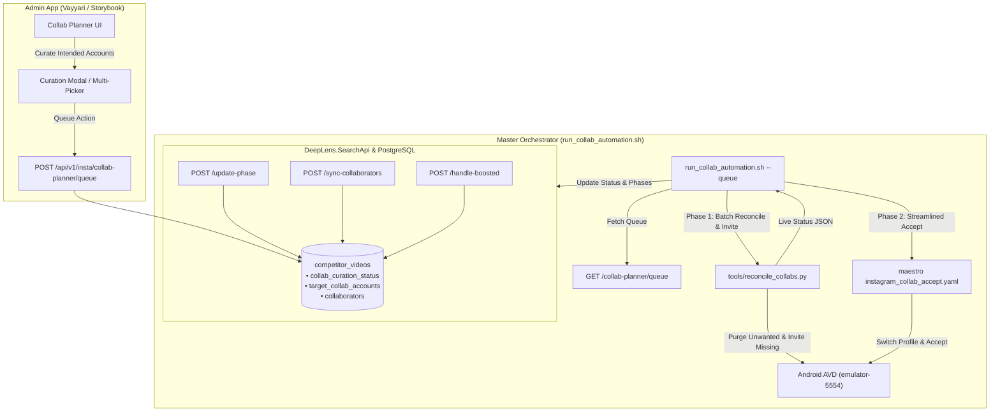

# Instagram Collaboration Automation Reference & Operational Guide

> **DeepLens Automation Pipeline**  
> **Master Orchestrator:** [`tools/run_collab_automation.sh`](file:///home/krikan/productivity/deeplens/tools/run_collab_automation.sh)  
> **Mobile Introspection Engine:** [`tools/reconcile_collabs.py`](file:///home/krikan/productivity/deeplens/tools/reconcile_collabs.py)  
> **Maestro Flow Definitions:** [`maestro/instagram_collab_invite.yaml`](file:///home/krikan/productivity/deeplens/maestro/instagram_collab_invite.yaml), [`maestro/instagram_collab_accept.yaml`](file:///home/krikan/productivity/deeplens/maestro/instagram_collab_accept.yaml)  
> **Applicable Architectural Records:** ADR-020, ADR-023, ADR-026, ADR-027, ADR-028, ADR-029

---

## 1. Executive Summary & Architecture

The **Collab Automation Suite** automates cross-channel collaboration on Instagram for owned business accounts on Android Virtual Devices (AVD). It provides end-to-end orchestration between the **DeepLens Collab Planner (Admin App)**, **SearchApi backend**, **PostgreSQL storage**, and the **Instagram Mobile UI (Maestro & ADB)**.



---

## 2. Channel Topology & Collaboration Limits

### Network Channels
The collaboration network consists of 10 owned business profiles (`profile_category = 'My Business'`):
1. **Primary Creator Channel:** `@vayyari_fashions`
2. **Sub-Channels:**
   - `@theblouseedition`
   - `@editionsbyvayyari`
   - `@everydayvayyari`
   - `@vayyari_prive`
   - `@vayyari_littles`
   - `@vayyaristudio`
   - `@eclipsevayyari`
   - `@vayyariplusyou`
   - `@dressbyvayyari`

### Capacity Rules (Self + 5)
* **Hard Rule:** Instagram allows **self (post creator) + up to 5 collaborators**, totaling **6 co-authors** on a post or reel.
* The Admin App curation picker (`TargetCollabAccountPicker`) automatically excludes the post owner and enforces a maximum selection limit of 5 collaborator accounts.
* `reconcile_collabs.py` dynamically handles up to 5 invited collaborator accounts in a single atomic post edit session.

---

## 3. Collaboration Lifecycle & State Machine

Every post and its targeted collaborator channels transition through granular states tracked in `competitor_videos`:

### A. Post Curation Status (`collab_curation_status`)
* `pending`: Scraped post with zero curation changes.
* `queued`: Post queued by curator with intended collaborator handles.
* `in_progress`: Actively being processed by the AVD runner (invites submitted).
* `collab_curated`: Post has been curated; also used when boosted ad locks editing.
* `completed`: All target collaborator accounts are fully established (`accepted` or `already_collaborating`).

### B. Per-Channel Phase (`target_collab_accounts[].phase`)
* `suggested`: Channel curated in Admin App; awaiting automation execution.
* `invited`: Automation submitted collaborator invitation from the Creator account.
* `accepted`: Collaborator account switched to on AVD and accepted invitation.
* `already_collaborating`: Account was already co-authoring the post (tagged previously or added outside manually by human).
* `cant_invite`: Post is boosted or ad-locked on Instagram, preventing collaborator edits.
* `failed`: Execution failed (e.g. timeout during account switch or accept banner).

---

## 4. Automation Suite Scripts & Files

| Path | Purpose |
| :--- | :--- |
| [`tools/run_collab_automation.sh`](file:///home/krikan/productivity/deeplens/tools/run_collab_automation.sh) | **Master Orchestrator**: CLI runner supporting Queue Mode (`--queue`), CLI Mode, batch/pairwise strategies, settling delays, retry loops, and backend API phase updates. |
| [`tools/reconcile_collabs.py`](file:///home/krikan/productivity/deeplens/tools/reconcile_collabs.py) | **Introspection & Reconciliation**: Connects via ADB, parses on-screen collaborator rows, actively purges unwanted tags, skips already active co-authors, invites missing exact-match handles, and handles boosted ad alerts. |
| [`maestro/instagram_collab_invite.yaml`](file:///home/krikan/productivity/deeplens/maestro/instagram_collab_invite.yaml) | **Maestro Flow (Creator Invite)**: Automated batch tagging flow adding up to 5 collaborator handles in sequence. |
| [`maestro/instagram_collab_accept.yaml`](file:///home/krikan/productivity/deeplens/maestro/instagram_collab_accept.yaml) | **Maestro Flow (Collaborator Accept)**: Switches profile, opens post deep link, checks for co-author status (`Stop sharing`), taps "Review" / "Accept", and enforces terminal assertion. |
| [`tools/generate_invite_yaml.py`](file:///home/krikan/productivity/deeplens/tools/generate_invite_yaml.py) | **Generator**: Generates `instagram_collab_invite.yaml` with exact-match text selectors and Rhino JS parameter evaluation. |

---

## 5. Comprehensive Use Cases & Operational Playbook

### Use Case 1: End-to-End Queue Processing (Production Standard)
**Scenario:** Curators have reviewed posts in the Admin App Collab Planner and added target accounts to the Automation Queue.
```bash
./tools/run_collab_automation.sh --queue
```
**What Happens:**
1. Calls `GET /api/v1/insta/collab-planner/queue` to fetch all queued posts.
2. For each queued post:
   - **Phase 1**: Switches to Creator account (`@vayyari_fashions`), opens post in edit mode, purges unwanted tags, retains active collabs, and batch invites missing targets.
   - **Phase 2**: Sequentially switches to each invited collaborator account, deep links to the post, and accepts the collaboration invite.
   - **Phase 3**: Synchronizes final collaborator lists to SearchApi, marking the post `completed`.

---

### Use Case 2: Queue Dry-Run (Simulation / Health Check)
**Scenario:** Inspect what posts are queued and what actions the runner would perform without touching the AVD or modifying Instagram posts.
```bash
./tools/run_collab_automation.sh --queue --dry-run
```
* **Exit Code:** 0
* **Device Interaction:** Zero touches or keyevents sent to ADB.

---

### Use Case 3: Manual Single Post Execution (CLI Mode)
**Scenario:** Process an ad-hoc post or reel without going through the web UI.
```bash
./tools/run_collab_automation.sh \
  --creator vayyari_fashions \
  --shortcode DdjfPUlhf9L \
  --collabs "editionsbyvayyari,everydayvayyari,vayyari_prive" \
  --post-id "bcd1241f-6546-4c38-a87d-401ac9b96c2c"
```

---

### Use Case 4: Phase 1 Only (Batch Invite Only)
**Scenario:** Submit collaborator invites from the Creator account, but defer acceptance (e.g. if collaborator approvals will be handled manually or later).
```bash
./tools/run_collab_automation.sh --queue --skip-accept
```
* Or for an individual post:
```bash
./tools/run_collab_automation.sh \
  --creator vayyari_fashions \
  --shortcode DdjRZ8jD8hJ \
  --collabs "vayyari_littles" \
  --skip-accept
```

---

### Use Case 5: Phase 2 Only (Acceptance Only)
**Scenario:** Invites have already been sent on the Creator account; automation only needs to switch to collaborator profiles and accept.
```bash
./tools/run_collab_automation.sh \
  --creator vayyari_fashions \
  --shortcode DdjRZ8jD8hJ \
  --collabs "vayyari_littles" \
  --skip-invite
```

---

### Use Case 6: Automatic Purging of Unwanted Collaborators
**Scenario:** An accidental or unintended account (e.g. `@the_undefined_hourglass` or an external tag) slipped into the post. The curated list in the queue is the source of truth.
* **Mechanism:** `tools/reconcile_collabs.py` inspects the "Tag people and collaborators" screen.
* For each row:
  - If `row_user_primary_name` is **NOT** in the curated target list:
    - Automatically locates and taps its `remove_tag_button` (`content-desc="@2131978882"`).
    - Removes the account immediately without confirmation dialog.
    - Saves the post.
* **Result:** Unwanted account is purged; post is left with only approved brand partners.

---

### Use Case 7: Outside / Manual Collaboration Graceful Handling
**Scenario:** A curator or social media manager already collaborated `@editionsbyvayyari` manually on their phone before running the automation.
* **Mechanism:** 
  1. `tools/reconcile_collabs.py` parses active collaborator rows on screen.
  2. Detects `@editionsbyvayyari` is already attached (`already_active`).
  3. Skips re-inviting `@editionsbyvayyari` (preventing errors or redundant searches).
  4. Informs `run_collab_automation.sh`, which updates SearchApi phase to `already_collaborating`.
  5. Skips Phase 2 for this account (no redundant profile switch needed).

---

### Use Case 8: Boosted / Promoted Ad Post Handling
**Scenario:** A post or reel has an active Instagram promotion / boosted ad. Tapping "Edit" triggers the native dialog: *"Unable to edit post: Posts that have a related ad cannot be edited."*
* **Mechanism:**
  1. `reconcile_collabs.py` catches the `"Unable to edit post"` alert text.
  2. Taps "OK" / "Dismiss" button or Back key to clear the dialog.
  3. Taps the post-view tag icon (`indicator_icon_view`) to open the "In this video" sheet and captures all pre-existing collaborators.
  4. Ingests existing co-authors to database with phase `already_collaborating`.
  5. Marks all proposed target channels that cannot be invited with phase `cant_invite` (reason: `boosted_ad_cannot_edit`).
  6. Transitions post status to `collab_curated`.
  7. Runner skips Phase 2 and returns code 0 cleanly.

---

### Use Case 9: Standalone Post Inspection & Reconcile Tool
**Scenario:** Test or inspect on-screen tags for a post directly from Python without running the full Maestro acceptance flow.
```bash
python3 tools/reconcile_collabs.py \
  --creator vayyari_fashions \
  --shortcode DdjfPUlhf9L \
  --targets "eclipsevayyari,editionsbyvayyari,everydayvayyari" \
  --device emulator-5554
```
**JSON Output Emitted:**
```json
{
  "removed": ["the_undefined_hourglass"],
  "already_active": ["eclipsevayyari"],
  "newly_invited": ["editionsbyvayyari", "everydayvayyari"],
  "boosted": false,
  "cant_invite": []
}
```

---

### Use Case 10: Pairwise Strategy Fallback
**Scenario:** By default, `--strategy batch` sends all invites in 1 atomic post edit. If testing backwards-compatible sequential invite/accept loops (Creator ➔ Collab 1 ➔ Creator ➔ Collab 2):
```bash
./tools/run_collab_automation.sh --queue --strategy pairwise
```

---

### Use Case 11: Multi-Device & Custom Delay Tuning
**Scenario:** Running on a secondary physical phone or tuning timing delays for a slow emulator:
```bash
./tools/run_collab_automation.sh \
  --queue \
  --device "192.168.1.105:5555" \
  --settle-delay 6 \
  --retry-delay 4 \
  --max-retries 2 \
  --api-url "http://192.168.1.50:5000"
```

---

## 6. Command Line Reference (`run_collab_automation.sh`)

| Option | Default | Description |
| :--- | :--- | :--- |
| `--queue`, `--from-queue` | `false` | Read and process posts from the Collab Automation Queue. |
| `--mode <mode>` | `full` | `full` (batch invite + accept), `invite_only`, `accept_only`, `queue`. |
| `--strategy <type>` | `batch` | `batch` (simultaneous 1-edit multi-invite) or `pairwise` (ping-pong). |
| `--creator <handle>` | `vayyari_fashions` | Post creator account username. |
| `--shortcode <code>` | `""` | Instagram shortcode or full post URL. |
| `--collabs <csv>` | `""` | Comma-separated list of target collaborator handles (up to 5). |
| `--post-id <uuid>` | `""` | Database post UUID for metadata updates. |
| `--device <id>` | `emulator-5554` | ADB target device ID or emulator port. |
| `--api-url <url>` | `http://localhost:5000` | DeepLens SearchApi base URL. |
| `--settle-delay <sec>` | `4` | Wait time in seconds between account switches and post transitions. |
| `--retry-delay <sec>` | `3` | Wait time before retrying a failed flow. |
| `--max-retries <n>` | `1` | Number of retries per Maestro attempt. |
| `--dry-run` | `false` | Simulate execution with zero device touches and zero delays. |
| `-h`, `--help` | — | Display help menu. |

---

## 7. Troubleshooting & FAQs

### Q1: Why did Maestro invite `@the_undefined_hourglass` previously?
> **Resolved in ADR-028**: Maestro CLI `-e` parameters are not global variables in Rhino JS, causing `typeof COLLAB_1` to evaluate to string `"undefined"`. Instagram searched `"undefined"` and selected the first result. This was fixed by using strict parameter guards and **exact text matching** on username selectors.

### Q2: Can we use Meta Graph API (`business_discovery`) instead of UI automation?
> **No**: Meta's Graph API restricts co-author visibility and strictly forbids creating or editing post collaborators via public API. Scraper metadata, ADB UIAutomator inspection, and Maestro native automation are the required architectural paths.

### Q3: How do we clear or unqueue posts if the queue is stuck?
> Call `POST http://localhost:5000/api/v1/insta/collab-planner/clear-queue` or open the **Queue Drawer** in the Collab Planner and unqueue items directly.
